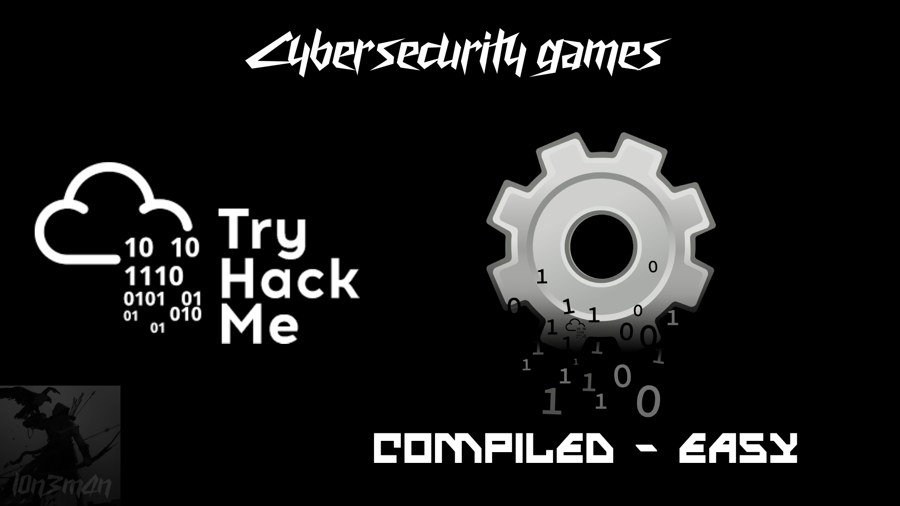

- **Description**: Strings can only help you so far 
- **Level**: easy
- **Category**: app script/flag
- **Knowlege base**: reverse engineering    
- **Learnings**: buffer overflow

## Checking binary 
```bash
$ file compiled 
compiled: ELF 64-bit LSB pie executable, x86-64, version 1 (SYSV), dynamically linked, interpreter /lib64/ld-linux-x86-64.so.2, BuildID[sha1]=06dcfaf13fb76a4b556852c5fbf9725ac21054fd, for GNU/Linux 3.2.0, not stripped
```
## Checking metadata and permission
```bash
$ exiftool compiled            
ExifTool Version Number         : 12.76
File Name                       : compiled
Directory                       : .
File Size                       : 16 kB
File Modification Date/Time     : 2024:10:06 22:13:50-04:00
File Access Date/Time           : 2024:10:06 23:08:40-04:00
File Inode Change Date/Time     : 2024:10:06 23:08:34-04:00
File Permissions                : -rwxrwxr-x
File Type                       : ELF shared library
File Type Extension             : so
MIME Type                       : application/octet-stream
CPU Architecture                : 64 bit
CPU Byte Order                  : Little endian
Object File Type                : Shared object file
CPU Type                        : AMD x86-64
```

## Ghidra 

## Tracing the dynamic library calls
```c
ltrace ./compiled 
fwrite("Password: ", 1, 10, 0x7fc63477b5c0)                                                 = 10
__isoc99_scanf(0x555c2386800f, 0x7fffd2180bd0, 0, 1024Password: test 
)                                     = 0
strcmp("", "__dso_handle")                                                                  = -95
strcmp("", "_init")                                                                         = -95
printf("Try again!")                                                                        = 10
Try again!+++ exited (status 0) +++

```
## Disassemble code
> gcc -o app app.c
```c 
#include <stdio.h>
#include <string.h>

int main(void) {
    int iVar1;
    char local_28[32];
    
    fwrite("Password: ", 1, 10, stdout); // Prompt for password
    __isoc99_scanf("DoYouEven%sCTF", local_28); // Read user input

    iVar1 = strcmp(local_28, "__dso_handle"); // Compare with first string
    if ((-1 < iVar1) && (iVar1 < 1)) { // Check if equal to "__dso_handle"
        printf("Try again!"); // If true, prompt to try again
        return 0;
    }

    iVar1 = strcmp(local_28, "_init"); // Compare with second string
    if (iVar1 == 0) { // If equal to "_init"
        printf("Correct!"); // Print success message
    } else {
        printf("Try again!"); // If not, prompt to try again
    }

    return 0;
}
```
# Breakdown binary 
### Variable Declarations
```c
int iVar1;
char local_28[32];
```
- **iVar1**: An integer variable used to store the result of string comparisons.
- **local_28**: A character array (string) of size 32, used to store user input.
### Promting a password 
```c
fwrite("Password: ", 1, 10, stdout);
```
- The fwrite function is used to print `"Password: "` to the standard output terminal.
### Reading user input
```c
__isoc99_scanf("DoYouEven%sCTF", local_28); 
```
- This line attempts to read a string from user input into `local_28`.
- The format string `"DoYouEven%sCTF"` is unusual and may not behave as expected:
    - Normally, it should just be `"%s"` to read a string. The presence of `"DoYouEven"` and `"CTF"` may suggest a formatting error or a coding joke.
### What's Happening with the Input:
- **Expected Input Format**: When using `scanf("DoYouEven%sCTF", local_28)`, the program expects the user to enter something like `DoYouEven[YourInput]CTF`.
    - The `DoYouEven` part must be exactly as written, and the `CTF` part must be at the end of the input.
- **Storing in local_28**: Only the part of the input that corresponds to `%s` will be stored in `local_28`.
    - The `"CTF"` in the format string acts as a **literal ending** that must be present in the input but is not stored in `local_28`.
    - Thus full input should be **DoYouEven_initCTF**, but only **_init** is stored and compared in the second comparison.
    - So overall the `CTF` string is a fuck useless and take me hour to hours to understand this shit TBH.    

### Comparing input to first string 
```c
iVar1 = strcmp(local_28, "__dso_handle"); 
if ((-1 < iVar1) && (iVar1 < 1)) { 
    printf("Try again!"); 
    return 0;
}
```
- `strcmp` compares `local_28` with `"__dso_handle"`.
- The condition checks if the result of strcmp indicates equality (ex: it returns `0`).
- If the input matches, it prints "Try again!" and exits the program.
### Comparing input to second string
```c
iVar1 = strcmp(local_28, "_init"); // Compare with second string
if (iVar1 == 0) { // If equal to "_init"
    printf("Correct!"); // Print success message
} else {
    printf("Try again!"); // If not, prompt to try again
}
```
- The program compares the input again, this time with `"_init"`.
- If the comparison returns 0 (indicating equality), it prints `"Correct!"`.
- If the input does not match, it again prints `"Try again!"`.

# Summary 
## The code contains a couple of issues, particularly with how it reads user input and checks for a password.
- **Input Format String**: The format string used in `__isoc99_scanf`(`"DoYouEven%sCTF"`, `local_28`); is incorrect. The string `"DoYouEven%sCTF"` will not work as intended for reading input. Instead, it should be a simple format string like `"%31s"` (to prevent buffer overflow) to read a string into `local_28`. The 31 ensures that you leave space for the null terminator.

- **Potential Buffer Overflow**: The `local_28` array has a size of `32` bytes , and ***if more than 31 characters*** are entered (not including the null terminator), ___it can lead to a buffer overflow___. Using the correct format specifier in `scanf` can help prevent this.

- **Comparison Logic**: The comparison with strcmp for the string `__dso_handle` is a bit verbose. Instead of checking if the result is between -1 and 1, you can simply check if it equals `0` for equality. The existing check can be simplified.

## Fix bug 
> preventing buffer overflows use `fgets` instead of `scanf` to limit input size.
```c
fgets(local_28, sizeof(local_28), stdin);
```
## Simulate input 
```c
echo "_init" | ./compiled
```
## correct answer
```c
$ ./app
Password: DoYouEven_init
Correct!  
```

## Revised version to avoid buffer overflow
```c
#include <stdio.h>
#include <string.h>

int main(void) {
    int iVar1;
    char local_28[32];

    fwrite("Password: ", 1, 10, stdout); // Prompt for password
    // Fix: Use fgets to safely read input
    if (fgets(local_28, sizeof(local_28), stdin) == NULL) {
        perror("Error reading input");
        return 1;
    }
    
    // Remove newline character from input
    local_28[strcspn(local_28, "\n")] = 0;

    iVar1 = strcmp(local_28, "__dso_handle"); 
    if (iVar1 == 0) { 
        printf("Try again!\n"); 
        return 0;
    }

    iVar1 = strcmp(local_28, "_init"); 
    if (iVar1 == 0) { 
        printf("Correct!\n");
    } else {
        printf("Try again!\n"); 
    }

    return 0;
}
```
## Simulate an Buffer size to trigger vulnerability
> Generate a buffer filled with 'A's that is more than 32 bytes
```py
buffer_size = 40
buffer = 'A' * buffer_size  
print("Generated buffer:")
print(repr(buffer))
print(f"Buffer size: {len(buffer)} bytes")
```
### output 
```py
Generated buffer:
'AAAAAAAAAAAAAAAAAAAAAAAAAAAAAAAAAAAAAAAAAAAAAAAAAA'
Buffer size: 40 bytes
```
