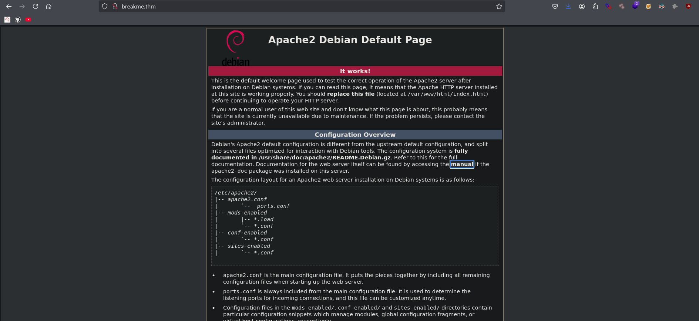
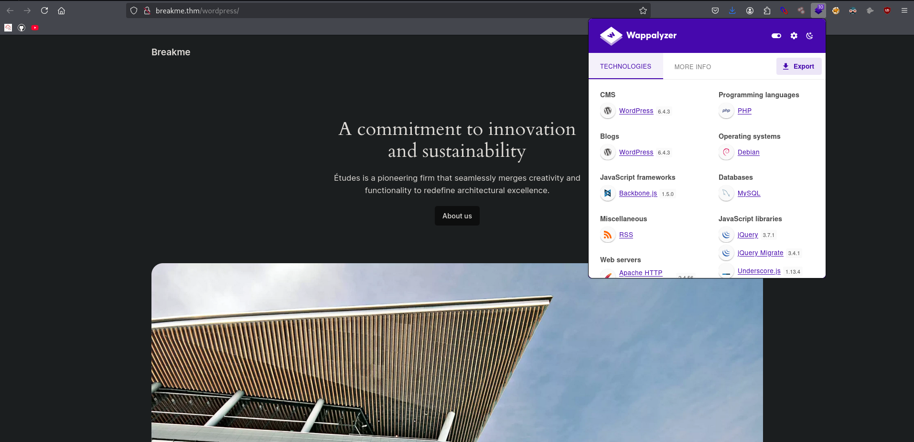
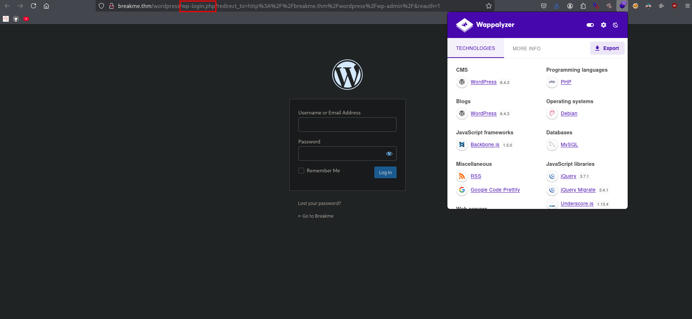

# Web Hacking Phases
 
Break this secure system and get the flags, if you can.

## Reconnaissance


### Service mapping 
```bash
> nmap breakme.thm
Starting Nmap 7.95 ( https://nmap.org ) at 2025-08-16 12:53 EDT
Nmap scan report for breakme.thm (10.201.100.79)
Host is up (0.35s latency).
Not shown: 998 closed tcp ports (reset)
PORT   STATE SERVICE
22/tcp open  ssh
80/tcp open  http
> nmap breakme.thm
Starting Nmap 7.95 ( https://nmap.org ) at 2025-08-16 12:53 EDT
Nmap scan report for breakme.thm (10.201.100.79)
Host is up (0.35s latency).
Not shown: 998 closed tcp ports (reset)
PORT   STATE SERVICE
22/tcp open  ssh
80/tcp open  http

Nmap done: 1 IP address (1 host up) scanned in 9.67 seconds
Nmap done: 1 IP address (1 host up) scanned in 9.67 seconds
```
### Full tcpscan 
```bash
> export ip=10.201.100.79
```
```bash
~/breakme > nmap -sC -sV -p$(nmap -p- --min-rate=2000 -T4 $ip | grep '^[0-9]' | cut -d '/' -f 1 | tr '\n' ',' | sed 's/, $//') $ip -oN fullscan.txt              took 3s

Starting Nmap 7.95 ( https://nmap.org ) at 2025-08-16 13:03 EDT
Nmap scan report for breakme.thm (10.201.100.79)
Host is up (0.34s latency).

PORT   STATE SERVICE VERSION
22/tcp open  ssh     OpenSSH 8.4p1 Debian 5+deb11u1 (protocol 2.0)
| ssh-hostkey: 
|   3072 8e:4f:77:7f:f6:aa:6a:dc:17:c9:bf:5a:2b:eb:8c:41 (RSA)
|   256 a3:9c:66:73:fc:b9:23:c0:0f:da:1d:c9:84:d6:b1:4a (ECDSA)
|_  256 6d:c2:0e:89:25:55:10:a9:9e:41:6e:0d:81:9a:17:cb (ED25519)
80/tcp open  http    Apache httpd 2.4.56 ((Debian))
|_http-title: Apache2 Debian Default Page: It works
|_http-server-header: Apache/2.4.56 (Debian)
Service Info: OS: Linux; CPE: cpe:/o:linux:linux_kernel

Service detection performed. Please report any incorrect results at https://nmap.org/submit/ .
Nmap done: 1 IP address (1 host up) scanned in 19.73 seconds
```
### Adding to localhost 
```bash
~/breakme > echo "10.201.100.79 breakme.thm" | sudo tee -a /etc/hosts
```
TTL=61 value likely linux distros
```sh
> ping breakme.thm -c 2
PING breakme.thm (10.201.100.79) 56(84) bytes of data.
64 bytes from breakme.thm (10.201.100.79): icmp_seq=1 ttl=61 time=347 ms
64 bytes from breakme.thm (10.201.100.79): icmp_seq=2 ttl=61 time=348 ms

--- breakme.thm ping statistics ---
2 packets transmitted, 2 received, 0% packet loss, time 1002ms
rtt min/avg/max/mdev = 347.077/347.670/348.264/0.593 ms
```
### Front-End Recon
### Web Application Enumeration
### Fingerprinting Web Servers
```bash
> curl -I 10.201.100.79
HTTP/1.1 200 OK
Date: Sat, 16 Aug 2025 16:42:03 GMT
Server: Apache/2.4.56 (Debian)
Last-Modified: Tue, 17 Aug 2021 21:20:21 GMT
ETag: "29cd-5c9c7e2a02b15"
Accept-Ranges: bytes
Content-Length: 10701
Vary: Accept-Encoding
Content-Type: text/html
```
### Inspecting HTTP Response Headers and Sitemaps

## Mapping and Discovery
```bash

```



### Debugging Page Content
### Technology Stack Identification
### Directory and File Listings

## Vulnerability Analysis
### WPSCAN
```bash
> wpscan --url http://breakme.thm/wordpress
_______________________________________________________________
         __          _______   _____
         \ \        / /  __ \ / ____|
          \ \  /\  / /| |__) | (___   ___  __ _ _ __ ®
           \ \/  \/ / |  ___/ \___ \ / __|/ _` | '_ \
            \  /\  /  | |     ____) | (__| (_| | | | |
             \/  \/   |_|    |_____/ \___|\__,_|_| |_|

         WordPress Security Scanner by the WPScan Team
                         Version 3.8.28
       Sponsored by Automattic - https://automattic.com/
       @_WPScan_, @ethicalhack3r, @erwan_lr, @firefart
_______________________________________________________________

[+] URL: http://breakme.thm/wordpress/ [10.201.100.79]
[+] Started: Sat Aug 16 13:17:14 2025

Interesting Finding(s):

[+] Headers
 | Interesting Entry: Server: Apache/2.4.56 (Debian)
 | Found By: Headers (Passive Detection)
 | Confidence: 100%

[+] XML-RPC seems to be enabled: http://breakme.thm/wordpress/xmlrpc.php
 | Found By: Direct Access (Aggressive Detection)
 | Confidence: 100%
 | References:
 |  - http://codex.wordpress.org/XML-RPC_Pingback_API
 |  - https://www.rapid7.com/db/modules/auxiliary/scanner/http/wordpress_ghost_scanner/
 |  - https://www.rapid7.com/db/modules/auxiliary/dos/http/wordpress_xmlrpc_dos/
 |  - https://www.rapid7.com/db/modules/auxiliary/scanner/http/wordpress_xmlrpc_login/
 |  - https://www.rapid7.com/db/modules/auxiliary/scanner/http/wordpress_pingback_access/

[+] WordPress readme found: http://breakme.thm/wordpress/readme.html
 | Found By: Direct Access (Aggressive Detection)
 | Confidence: 100%

[+] The external WP-Cron seems to be enabled: http://breakme.thm/wordpress/wp-cron.php
 | Found By: Direct Access (Aggressive Detection)
 | Confidence: 60%
 | References:
 |  - https://www.iplocation.net/defend-wordpress-from-ddos
 |  - https://github.com/wpscanteam/wpscan/issues/1299

[+] WordPress version 6.4.3 identified (Insecure, released on 2024-01-30).
 | Found By: Rss Generator (Passive Detection)
 |  - http://breakme.thm/wordpress/index.php/feed/, <generator>https://wordpress.org/?v=6.4.3</generator>
 |  - http://breakme.thm/wordpress/index.php/comments/feed/, <generator>https://wordpress.org/?v=6.4.3</generator>

[+] WordPress theme in use: twentytwentyfour
 | Location: http://breakme.thm/wordpress/wp-content/themes/twentytwentyfour/
 | Last Updated: 2024-11-13T00:00:00.000Z
 | Readme: http://breakme.thm/wordpress/wp-content/themes/twentytwentyfour/readme.txt
 | [!] The version is out of date, the latest version is 1.3
 | Style URL: http://breakme.thm/wordpress/wp-content/themes/twentytwentyfour/style.css
 | Style Name: Twenty Twenty-Four
 | Style URI: https://wordpress.org/themes/twentytwentyfour/
 | Description: Twenty Twenty-Four is designed to be flexible, versatile and applicable to any website. Its collecti...
 | Author: the WordPress team
 | Author URI: https://wordpress.org
 |
 | Found By: Urls In Homepage (Passive Detection)
 |
 | Version: 1.0 (80% confidence)
 | Found By: Style (Passive Detection)
 |  - http://breakme.thm/wordpress/wp-content/themes/twentytwentyfour/style.css, Match: 'Version: 1.0'

[+] Enumerating All Plugins (via Passive Methods)
[+] Checking Plugin Versions (via Passive and Aggressive Methods)

[i] Plugin(s) Identified:

[+] wp-data-access
 | Location: http://breakme.thm/wordpress/wp-content/plugins/wp-data-access/
 | Last Updated: 2025-07-25T00:01:00.000Z
 | [!] The version is out of date, the latest version is 5.5.45
 |
 | Found By: Urls In Homepage (Passive Detection)
 |
 | Version: 5.3.5 (80% confidence)
 | Found By: Readme - Stable Tag (Aggressive Detection)
 |  - http://breakme.thm/wordpress/wp-content/plugins/wp-data-access/readme.txt

[+] Enumerating Config Backups (via Passive and Aggressive Methods)
 Checking Config Backups - Time: 00:00:11 <================================> (137 / 137) 100.00% Time: 00:00:11

[i] No Config Backups Found.

[!] No WPScan API Token given, as a result vulnerability data has not been output.
[!] You can get a free API token with 25 daily requests by registering at https://wpscan.com/register

[+] Finished: Sat Aug 16 13:17:47 2025
[+] Requests Done: 171
[+] Cached Requests: 5
[+] Data Sent: 45.727 KB
[+] Data Received: 303.059 KB
[+] Memory used: 266.129 MB
[+] Elapsed time: 00:00:32
```
### README file
```bash
> feroxbuster -u http://breakme.thm -w /usr/share/seclists/Discovery/Web-Content/raft-medium-directories.txt --scan-dir-listings
                                                                                                                          
 ___  ___  __   __     __      __         __   ___
|__  |__  |__) |__) | /  `    /  \ \_/ | |  \ |__
|    |___ |  \ |  \ | \__,    \__/ / \ | |__/ |___
by Ben "epi" Risher 🤓                 ver: 2.11.0
───────────────────────────┬──────────────────────
 🎯  Target Url            │ http://breakme.thm
 🚀  Threads               │ 50
 📖  Wordlist              │ /usr/share/seclists/Discovery/Web-Content/raft-medium-directories.txt
 👌  Status Codes          │ All Status Codes!
 💥  Timeout (secs)        │ 7
 🦡  User-Agent            │ feroxbuster/2.11.0
 💉  Config File           │ /etc/feroxbuster/ferox-config.toml
 🔎  Extract Links         │ true
 📂  Scan Dir Listings     │ true
 🏁  HTTP methods          │ [GET]
 🔃  Recursion Depth       │ 4
───────────────────────────┴──────────────────────
 🏁  Press [ENTER] to use the Scan Management Menu™
──────────────────────────────────────────────────
403      GET        9l       28w      276c Auto-filtering found 404-like response and created new filter; toggle off with --dont-filter
404      GET        9l       31w      273c Auto-filtering found 404-like response and created new filter; toggle off with --dont-filter
200      GET       24l      126w    10355c http://breakme.thm/icons/openlogo-75.png
200      GET      368l      933w    10701c http://breakme.thm/
301      GET        9l       28w      314c http://breakme.thm/wordpress => http://breakme.thm/wordpress/
301      GET        9l       28w      311c http://breakme.thm/manual => http://breakme.thm/manual/
301      GET        9l       28w      318c http://breakme.thm/manual/images => http://breakme.thm/manual/images/
200      GET        3l       12w     1204c http://breakme.thm/manual/images/mod_filter_old.png
200      GET        6l       29w     2168c http://breakme.thm/manual/images/ssl_intro_fig2.png
200      GET        1l        5w       87c http://breakme.thm/manual/images/right.gif
200      GET       10l       34w     2420c http://breakme.thm/manual/images/mod_rewrite_fig2.png
200      GET        6l       58w     2303c http://breakme.thm/manual/images/home.gif
200      GET       17l       63w     4627c http://breakme.thm/manual/images/mod_rewrite_fig2.gif
200      GET        1l        6w       86c http://breakme.thm/manual/images/left.gif
200      GET        8l       24w     1868c http://breakme.thm/manual/images/mod_filter_new.png
301      GET        9l       28w      314c http://breakme.thm/manual/en => http://breakme.thm/manual/en/
200      GET       11l       49w     4550c http://breakme.thm/manual/images/filter_arch.tr.png
200      GET       70l      299w    21207c http://breakme.thm/manual/images/caching_fig1.tr.png
200      GET      105l      493w    29291c http://breakme.thm/manual/images/caching_fig1.gif
200      GET       14l       54w     2412c http://breakme.thm/manual/images/index.gif
200      GET       25l       72w     4606c http://breakme.thm/manual/images/ssl_intro_fig3.png
200      GET      173l     1008w    81048c http://breakme.thm/manual/images/syntax_rewritecond.png
200      GET        1l        6w       84c http://breakme.thm/manual/images/up.gif
200      GET        1l        7w     2908c http://breakme.thm/manual/images/favicon.ico
200      GET       10l       66w     4328c http://breakme.thm/manual/images/filter_arch.png
200      GET       15l       63w     7395c http://breakme.thm/manual/images/ssl_intro_fig3.gif
200      GET        3l       26w     3083c http://breakme.thm/manual/images/mod_rewrite_fig1.png
200      GET        9l       44w     5193c http://breakme.thm/manual/images/ssl_intro_fig2.gif
200      GET       29l      147w     1082c http://breakme.thm/manual/style/manualpage.dtd
200      GET       24l      127w      907c http://breakme.thm/manual/style/lang.dtd
200      GET       92l      345w     2844c http://breakme.thm/manual/style/modulesynopsis.dtd
200      GET       42l      190w     1425c http://breakme.thm/manual/style/sitemap.dtd
200      GET       12l       48w     3533c http://breakme.thm/manual/style/common.dtd.gz
200      GET       24l      130w      925c http://breakme.thm/manual/style/version.ent
200      GET       27l       66w      481c http://breakme.thm/manual/style/build.properties
200      GET       36l      165w     1247c http://breakme.thm/manual/style/faq.dtd
200      GET       50l      355w    31098c http://breakme.thm/manual/images/custom_errordocs.png
200      GET      158l     1179w    92140c http://breakme.thm/manual/images/build_a_mod_3.png
200      GET      232l     1134w    97231c http://breakme.thm/manual/images/syntax_rewriterule.png
200      GET       12l       56w     4382c http://breakme.thm/manual/images/mod_filter_new.gif
200      GET        1l        5w       84c http://breakme.thm/manual/images/down.gif
200      GET       23l      143w     7050c http://breakme.thm/manual/images/apache_header.gif
200      GET        8l       29w     2343c http://breakme.thm/manual/images/mod_filter_new.tr.png
200      GET       68l      318w    10209c http://breakme.thm/manual/images/sub.gif
200      GET        2l        4w       79c http://breakme.thm/manual/images/pixel.gif
200      GET       25l       87w     6358c http://breakme.thm/manual/images/mod_rewrite_fig1.gif
200      GET       55l      246w    21064c http://breakme.thm/manual/images/reverse-proxy-arch.png
200      GET       18l      118w     6536c http://breakme.thm/manual/images/feather.gif
301      GET        9l       28w      321c http://breakme.thm/manual/style/css => http://breakme.thm/manual/style/css/
301      GET        9l       28w      317c http://breakme.thm/manual/style => http://breakme.thm/manual/style/
200      GET     1227l     7821w   677704c http://breakme.thm/manual/images/bal-man-w.png
200      GET       77l      325w    24698c http://breakme.thm/manual/images/caching_fig1.png
200      GET      144l      873w    71685c http://breakme.thm/manual/images/rewrite_rule_flow.png
200      GET      146l      919w    71900c http://breakme.thm/manual/images/build_a_mod_4.png
200      GET       63l      412w    38324c http://breakme.thm/manual/images/feather.png
301      GET        9l       28w      314c http://breakme.thm/manual/ru => http://breakme.thm/manual/ru/
200      GET      931l     5534w   463351c http://breakme.thm/manual/images/bal-man.png
200      GET      299l     1691w   134287c http://breakme.thm/manual/images/build_a_mod_2.png
200      GET      408l     2298w   192916c http://breakme.thm/manual/images/rewrite_process_uri.png
301      GET        9l       28w      314c http://breakme.thm/manual/ja => http://breakme.thm/manual/ja/
301      GET        9l       28w      314c http://breakme.thm/manual/tr => http://breakme.thm/manual/tr/
301      GET        9l       28w      314c http://breakme.thm/manual/ko => http://breakme.thm/manual/ko/
301      GET        9l       28w      314c http://breakme.thm/manual/de => http://breakme.thm/manual/de/
301      GET        9l       28w      314c http://breakme.thm/manual/fr => http://breakme.thm/manual/fr/
200      GET       16l       74w     5983c http://breakme.thm/manual/images/ssl_intro_fig1.png
200      GET       26l      111w    10616c http://breakme.thm/manual/images/ssl_intro_fig1.gif
200      GET        3l       37w     2249c http://breakme.thm/manual/images/mod_filter_old.gif
200      GET        0l        0w    37163c http://breakme.thm/manual/images/rewrite_backreferences.png
200      GET        0l        0w   321860c http://breakme.thm/manual/images/bal-man-b.png
200      GET        0l        0w    96596c http://breakme.thm/manual/images/SupportApache-small.png
301      GET        9l       28w      318c http://breakme.thm/manual/de/ssl => http://breakme.thm/manual/de/ssl/
301      GET        9l       28w      314c http://breakme.thm/manual/es => http://breakme.thm/manual/es/
301      GET        9l       28w      319c http://breakme.thm/manual/fr/misc => http://breakme.thm/manual/fr/misc/
301      GET        9l       28w      319c http://breakme.thm/manual/de/misc => http://breakme.thm/manual/de/misc/
301      GET        9l       28w      319c http://breakme.thm/manual/en/misc => http://breakme.thm/manual/en/misc/
301      GET        9l       28w      325c http://breakme.thm/manual/style/scripts => http://breakme.thm/manual/style/scripts/
301      GET        9l       28w      318c http://breakme.thm/manual/de/mod => http://breakme.thm/manual/de/mod/
301      GET        9l       28w      319c http://breakme.thm/manual/es/misc => http://breakme.thm/manual/es/misc/
301      GET        9l       28w      318c http://breakme.thm/manual/ru/ssl => http://breakme.thm/manual/ru/ssl/
301      GET        9l       28w      318c http://breakme.thm/manual/en/ssl => http://breakme.thm/manual/en/ssl/
301      GET        9l       28w      314c http://breakme.thm/manual/da => http://breakme.thm/manual/da/
301      GET        9l       28w      318c http://breakme.thm/manual/de/faq => http://breakme.thm/manual/de/faq/
301      GET        9l       28w      319c http://breakme.thm/manual/ja/misc => http://breakme.thm/manual/ja/misc/
301      GET        9l       28w      326c http://breakme.thm/wordpress/wp-includes => http://breakme.thm/wordpress/wp-includes/
301      GET        9l       28w      325c http://breakme.thm/wordpress/wp-content => http://breakme.thm/wordpress/wp-content/
301      GET        9l       28w      323c http://breakme.thm/wordpress/wp-admin => http://breakme.thm/wordpress/wp-admin/
301      GET        9l       28w      318c http://breakme.thm/manual/ru/faq => http://breakme.thm/manual/ru/faq/
301      GET        9l       28w      318c http://breakme.thm/manual/ru/mod => http://breakme.thm/manual/ru/mod/
301      GET        9l       28w      318c http://breakme.thm/manual/en/mod => http://breakme.thm/manual/en/mod/
301      GET        9l       28w      319c http://breakme.thm/manual/ko/misc => http://breakme.thm/manual/ko/misc/
301      GET        9l       28w      318c http://breakme.thm/manual/en/faq => http://breakme.thm/manual/en/faq/
301      GET        9l       28w      319c http://breakme.thm/manual/da/misc => http://breakme.thm/manual/da/misc/
301      GET        9l       28w      333c http://breakme.thm/wordpress/wp-content/plugins => http://breakme.thm/wordpress/wp-content/plugins/
301      GET        9l       28w      332c http://breakme.thm/wordpress/wp-content/themes => http://breakme.thm/wordpress/wp-content/themes/
301      GET        9l       28w      330c http://breakme.thm/wordpress/wp-admin/images => http://breakme.thm/wordpress/wp-admin/images/
301      GET        9l       28w      332c http://breakme.thm/wordpress/wp-admin/includes => http://breakme.thm/wordpress/wp-admin/includes/
301      GET        9l       28w      326c http://breakme.thm/wordpress/wp-admin/js => http://breakme.thm/wordpress/wp-admin/js/
301      GET        9l       28w      327c http://breakme.thm/wordpress/wp-admin/css => http://breakme.thm/wordpress/wp-admin/css/
301      GET        9l       28w      328c http://breakme.thm/wordpress/wp-admin/user => http://breakme.thm/wordpress/wp-admin/user/
301      GET        9l       28w      323c http://breakme.thm/manual/style/latex => http://breakme.thm/manual/style/latex/
301      GET        9l       28w      329c http://breakme.thm/wordpress/wp-includes/js => http://breakme.thm/wordpress/wp-includes/js/
301      GET        9l       28w      333c http://breakme.thm/wordpress/wp-includes/images => http://breakme.thm/wordpress/wp-includes/images/
301      GET        9l       28w      330c http://breakme.thm/wordpress/wp-includes/css => http://breakme.thm/wordpress/wp-includes/css/
301      GET        9l       28w      333c http://breakme.thm/wordpress/wp-includes/assets => http://breakme.thm/wordpress/wp-includes/assets/
301      GET        9l       28w      333c http://breakme.thm/wordpress/wp-content/uploads => http://breakme.thm/wordpress/wp-content/uploads/
301      GET        9l       28w      318c http://breakme.thm/manual/es/faq => http://breakme.thm/manual/es/faq/
301      GET        9l       28w      318c http://breakme.thm/manual/tr/faq => http://breakme.thm/manual/tr/faq/
301      GET        9l       28w      322c http://breakme.thm/manual/tr/rewrite => http://breakme.thm/manual/tr/rewrite/

```

### Security Testing


### Bruteforcing password (hydra http-post) 
> user admin
```bash
# grab failure string, exact error message that shows only when the login fails.
curl -s -X POST http://breakme.thm/wordpress/wp-login.php \
  -d "log=admin&pwd=wrongpassword&wp-submit=Log+In" | grep -i error

```
```bash
> hydra -l admin -P /usr/share/wordlists/rockyou.txt breakme.thm http-post-form \
"/wordpress/wp-login.php:log=^USER^&pwd=^PASS^&wp-submit=Log+In:login_error" -V -f >/dev/null
```

### Enumerating APIs
### Vulnerability Identification

## Exploitation
### Post Exploitation Enumeration 
### Lateral Movement 
### Gaining Root 

## Post-Exploitation
### Flags
### Covering Tracks 

## Reporting
### Summary
# Web Hacking Phases
 

## Reconnaissance
### Front-End Recon
### Web Application Enumeration
### Fingerprinting Web Servers
### Inspecting HTTP Response Headers and Sitemaps

## Mapping and Discovery
### Adding Localhost
### Debugging Page Content
### Technology Stack Identification
### Directory and File Listings

## Vulnerability Analysis
### Security Testing
### Enumerating APIs
### Vulnerability Identification

## Exploitation
### Post Exploitation Enumeration 
### Lateral Movement 
### Gaining Root 

## Post-Exploitation
### Flags
### Covering Tracks 

## Reporting
### Summary
