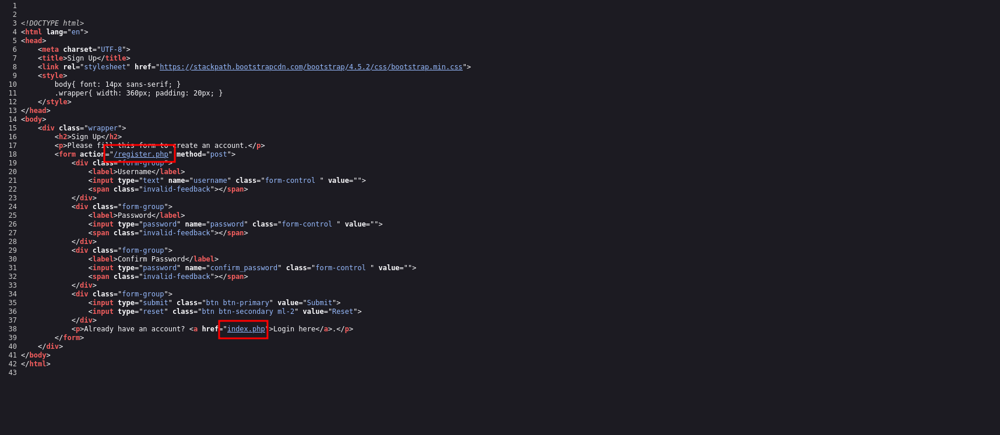
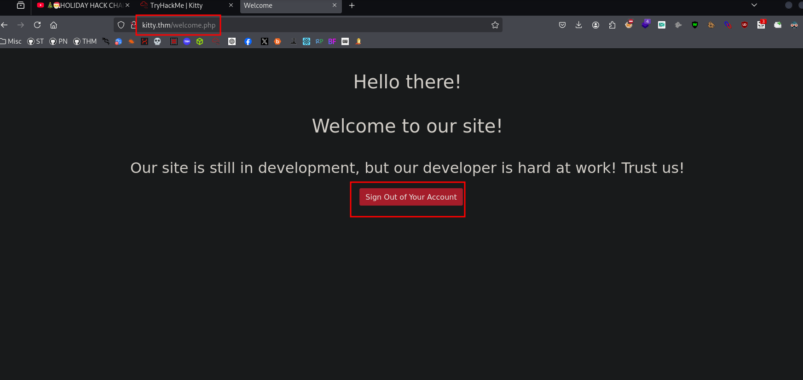
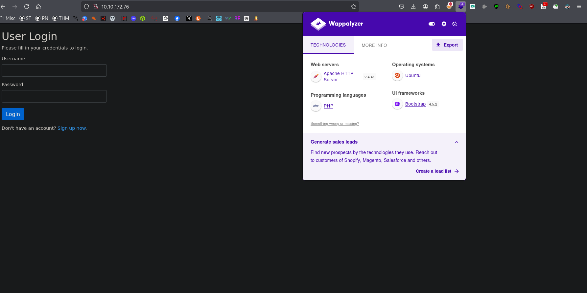
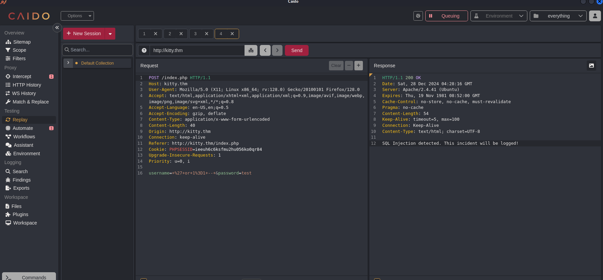

# Web Hacking Phases
 

## Reconnaissance

### Front-End Recon
### Web Application Enumeration
```bash
$ curl -I 10.10.172.76 
HTTP/1.1 200 OK
Date: Sat, 28 Dec 2024 04:00:31 GMT
Server: Apache/2.4.41 (Ubuntu)
Set-Cookie: PHPSESSID=hmq3cqbmvci3am5jqnm26be2pk; path=/
Expires: Thu, 19 Nov 1981 08:52:00 GMT
Cache-Control: no-store, no-cache, must-revalidate
Pragma: no-cache
Content-Type: text/html; charset=UTF-8                                                
```
### Fingerprinting Web Servers
```bash
$ nmap -sC -sV -p$(nmap --min-rate=10000 -T4 -p- 10.10.172.76  | grep '^[0-9]' | cut -d '/' -f 1 | tr '\n' ',' | sed 's/,$//') 10.10.172.76  -oN tcp.txt 
Starting Nmap 7.94SVN ( https://nmap.org ) at 2024-12-27 23:03 EST
Nmap scan report for 10.10.172.76
Host is up (0.23s latency).

PORT   STATE SERVICE VERSION
22/tcp open  ssh     OpenSSH 8.2p1 Ubuntu 4ubuntu0.5 (Ubuntu Linux; protocol 2.0)
| ssh-hostkey: 
|   3072 b0:c5:69:e6:dd:6b:81:0c:da:32:be:41:e3:5b:97:87 (RSA)
|   256 6c:65:ad:87:08:7a:3e:4c:7d:ea:3a:30:76:4d:04:16 (ECDSA)
|_  256 2d:57:1d:56:f6:56:52:29:ea:aa:da:33:b2:77:2c:9c (ED25519)
80/tcp open  http    Apache httpd 2.4.41 ((Ubuntu))
|_http-title: Login
| http-cookie-flags: 
|   /: 
|     PHPSESSID: 
|_      httponly flag not set
|_http-server-header: Apache/2.4.41 (Ubuntu)
Service Info: OS: Linux; CPE: cpe:/o:linux:linux_kernel

Service detection performed. Please report any incorrect results at https://nmap.org/submit/ .
Nmap done: 1 IP address (1 host up) scanned in 15.14 seconds

```
### Inspecting HTTP Response Headers and Sitemaps

## Mapping and Discovery
### Adding Localhost
### Debugging Page Content

### Technology Stack Identification

### Directory and File Listings
```bash
$ feroxbuster -u http://10.10.172.76 -w /usr/share/seclists/Discovery/Web-Content/big.txt --scan-dir-listings
                                                                                                                                                                                                
 ___  ___  __   __     __      __         __   ___
|__  |__  |__) |__) | /  `    /  \ \_/ | |  \ |__
|    |___ |  \ |  \ | \__,    \__/ / \ | |__/ |___
by Ben "epi" Risher 🤓                 ver: 2.11.0
───────────────────────────┬──────────────────────
 🎯  Target Url            │ http://10.10.172.76
 🚀  Threads               │ 50
 📖  Wordlist              │ /usr/share/seclists/Discovery/Web-Content/big.txt
 👌  Status Codes          │ All Status Codes!
 💥  Timeout (secs)        │ 7
 🦡  User-Agent            │ feroxbuster/2.11.0
 💉  Config File           │ /etc/feroxbuster/ferox-config.toml
 🔎  Extract Links         │ true
 📂  Scan Dir Listings     │ true
 🏁  HTTP methods          │ [GET]
 🔃  Recursion Depth       │ 4
───────────────────────────┴──────────────────────
 🏁  Press [ENTER] to use the Scan Management Menu™
──────────────────────────────────────────────────
403      GET        9l       28w      277c Auto-filtering found 404-like response and created new filter; toggle off with --dont-filter
404      GET        9l       31w      274c Auto-filtering found 404-like response and created new filter; toggle off with --dont-filter
200      GET       36l       76w     1081c http://10.10.172.76/index.php
200      GET       42l      104w     1567c http://10.10.172.76/register.php
200      GET       36l       76w     1081c http://10.10.172.76/

```
## Vulnerability Analysis
### Security Testing

```bash
$ curl -X POST http://kitty.thm/index.php \
  -H "User-Agent: Mozilla/5.0 (X11; Linux x86_64; rv:128.0) Gecko/20100101 Firefox/128.0" \
  -H "Accept: text/html,application/xhtml+xml,application/xml;q=0.9,image/avif,image/webp,image/png,image/svg+xml,*/*;q=0.8" \
  -H "Accept-Language: en-US,en;q=0.5" \
  -H "Accept-Encoding: gzip, deflate" \
  -H "Referer: http://kitty.thm/index.php" \
  -H "Connection: close" \
  -H "Cookie: PHPSESSID=ieeuh6c6ksfmu2hu056ko0qr84" \
  -H "Upgrade-Insecure-Requests: 1" \
  -H "Priority: u=0, i" \
  -d "username=' OR '1'='1&password=anything"

SQL Injection detected. This incident will be logged!      
```
### Using UNION SELECT:
Use UNION SELECT statements to try and extract data from the database.
```bash
$ curl -X POST http://kitty.thm/index.php \
  -H "User-Agent: Mozilla/5.0 (X11; Linux x86_64; rv:128.0) Gecko/20100101 Firefox/128.0" \
  -H "Accept: text/html,application/xhtml+xml,application/xml;q=0.9,image/avif,image/webp,image/png,image/svg+xml,*/*;q=0.8" \
  -H "Accept-Language: en-US,en;q=0.5" \
  -H "Accept-Encoding: gzip, deflate" \
  -H "Referer: http://kitty.thm/index.php" \
  -H "Connection: close" \
  -H "Cookie: PHPSESSID=ieeuh6c6ksfmu2hu056ko0qr84" \
  -H "Upgrade-Insecure-Requests: 1" \
  -H "Priority: u=0, i" \
  --data-urlencode "username=' UNION SELECT null, version() -- " \
  --data-urlencode "password=anything" \
  --output -
�TM��0=�_1�©1���,HHHTb��э����mٓ�ъ�����e��x<3~o���2����������Pk�L
�"I�␦"R��,>��E�                                                0��Cˆ��� 
               ��\����19����,Ro06�Ġ	�-XC���H�z���|�E
�W��k�i�����%�b<��NQ1I�|�'�:K+xs�����Aoo��),ߧ�<�'�kE�
޾���R��+X�� �
             "��1���J�22Ƃ�{�3,ˇs��y��rmPF��6���u��
-ii"�3$��2�.���@0�*������
��he��B*(ƽ
X�HFm�?tm��`�^pYN�<�50�oń"�tQ����o��z�c[����s�  �#�K�۴�N�������g��Х�Q{i���ܗwξ"h�Aڤ��u�>���m
                                   �%{                                                      
```
# Undone

### Enumerating APIs
### Vulnerability Identification

## Exploitation
### Post Exploitation Enumeration 
### Lateral Movement 
### Gaining Root 

## Post-Exploitation
### Flags
### Covering Tracks 

## Reporting
### Summary
