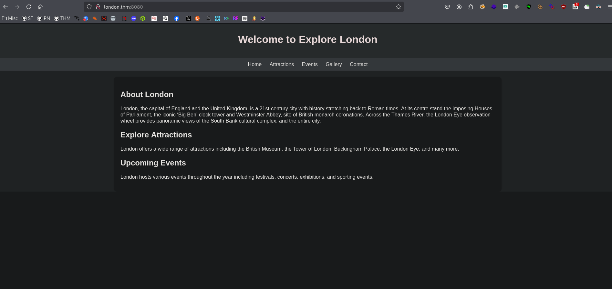
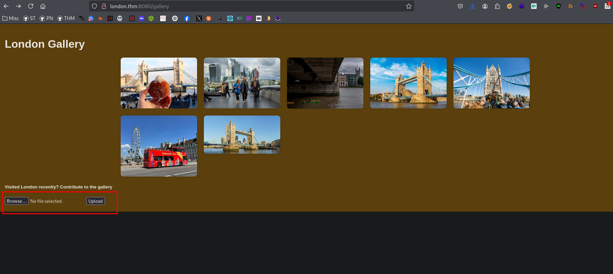
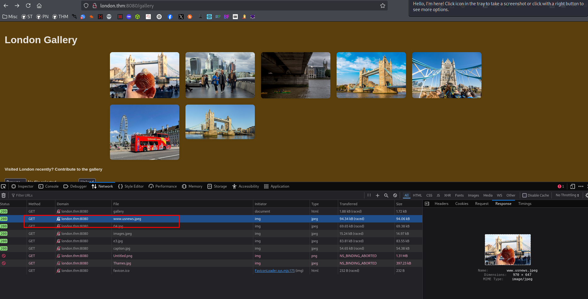
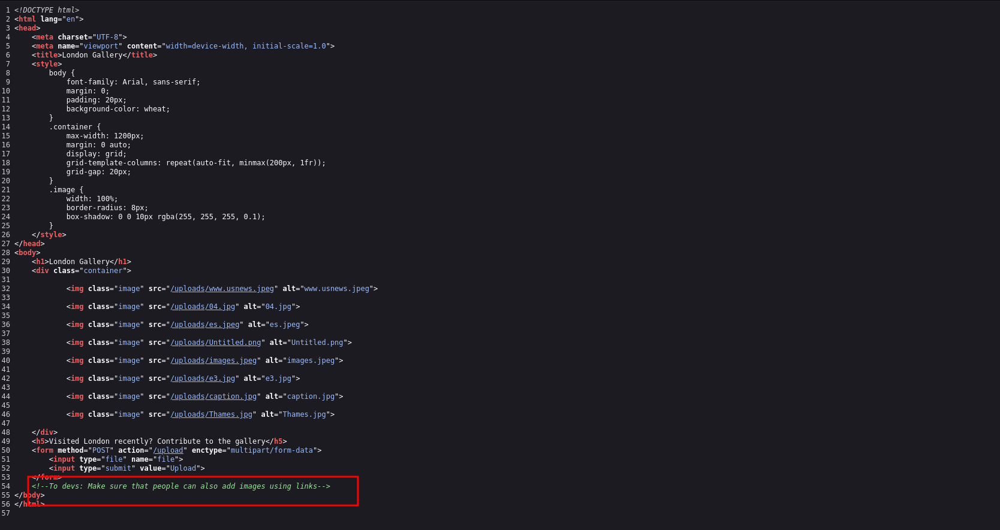
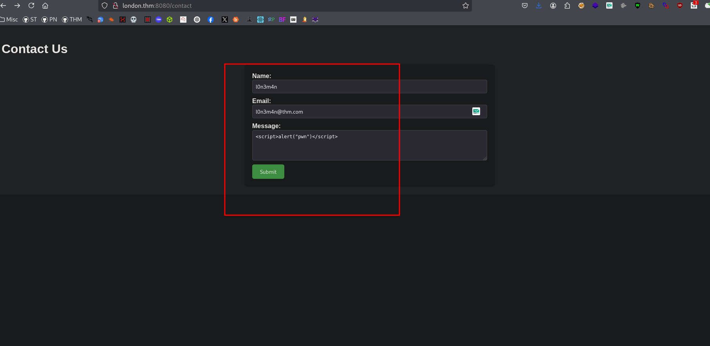
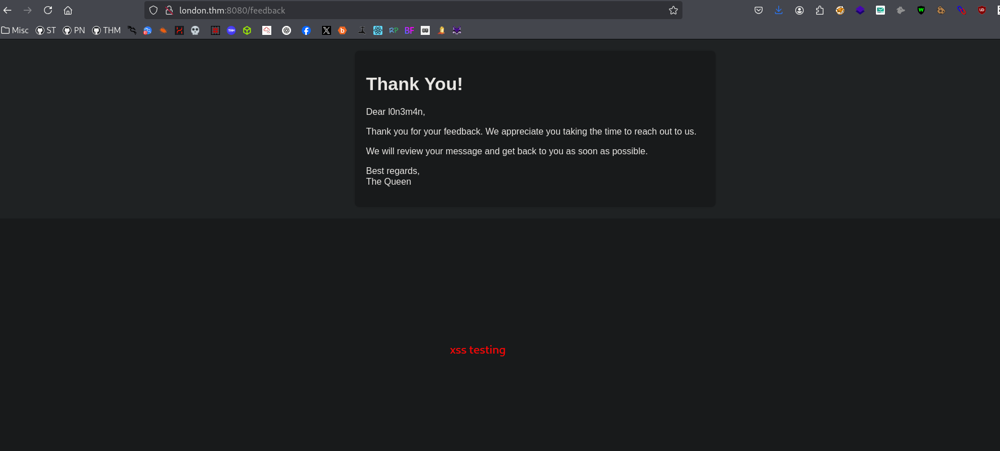
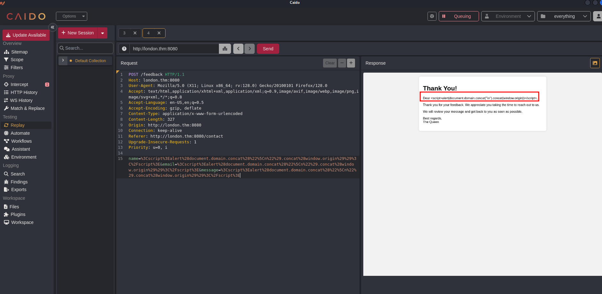
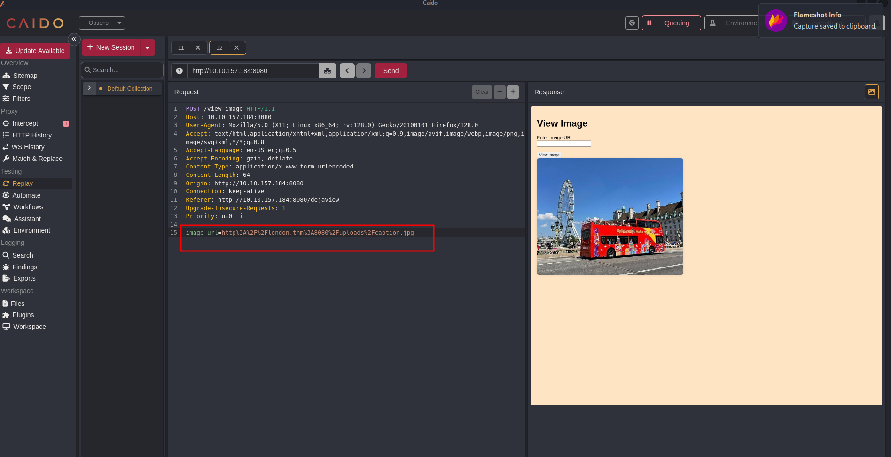

# Web Hacking Phases
 

## Reconnaissance
```bash
Host is up (0.27s latency).

PORT     STATE SERVICE    VERSION
22/tcp   open  ssh        OpenSSH 7.6p1 Ubuntu 4ubuntu0.7 (Ubuntu Linux; protocol 2.0)
| ssh-hostkey: 
|   2048 58:c1:e4:79:ca:70:bc:3b:8d:b8:22:17:2f:62:1a:34 (RSA)
|   256 2a:b4:1f:2c:72:35:7a:c3:7a:5c:7d:47:d6:d0:73:c8 (ECDSA)
|_  256 1c:7e:d2:c9:dd:c2:e4:ac:11:7e:45:6a:2f:44:af:0f (ED25519)
8080/tcp open  http-proxy gunicorn
|_http-server-header: gunicorn
|_http-title: Explore London
| fingerprint-strings: 
|   GetRequest: 
|     HTTP/1.0 200 OK
|     Server: gunicorn
|     Date: Thu, 12 Jun 2025 03:00:11 GMT
|     Connection: close
|     Content-Type: text/html; charset=utf-8
|     Content-Length: 2682
|     <!DOCTYPE html>
|     <html lang="en">
|     <head>
|     <meta charset="UTF-8">
|     <meta name="viewport" content="width=device-width, initial-scale=1.0">
|     <title>Explore London</title>
|     <style>
|     body {
|     font-family: Arial, sans-serif;
|     margin: 0;
|     padding: 0;
|     background-color: #f2f2f2;
|     header {
|     background-color: #333;
|     color: #fff;
|     padding: 10px 20px;
|     text-align: center;
|     background-color: #444;
|     color: #fff;
|     padding: 10px 20px;
|     text-align: center;
|     color: #fff;
|     text-decoration: none;
|     margin: 0 10p
|   HTTPOptions: 
|     HTTP/1.0 200 OK
|     Server: gunicorn
|     Date: Thu, 12 Jun 2025 03:00:12 GMT
|     Connection: close
|     Content-Type: text/html; charset=utf-8
|     Allow: HEAD, GET, OPTIONS
|_    Content-Length: 0
```
### Front-End Recon

```bash
~/london > export ip=10.10.157.184
```
```bash
~/london > feroxbuster -u http://$ip:8080/ -w /usr/share/seclists/Discovery/Web-Content/big.txt --scan-dir-listings
```



### Web Application Enumeration


This shows that our input (probably submitted via a feedback form or URL parameter) was reflected directly into the HTML output — but was HTML-escaped.

```bash
404     GET     Auto-filtering found 404-like response and created new filter; toggle off with --dont-filter
200     GET     http://10.10.157.184:8080/contact
200     GET     http://10.10.157.184:8080/gallery
200     GET     http://10.10.157.184:8080/
405     GET     http://10.10.157.184:8080/feedback
405     GET     http://10.10.157.184:8080/upload
200     GET     http://10.10.157.184:8080/uploads/images.jpeg
200     GET     http://10.10.157.184:8080/uploads/caption.jpg
200     GET     http://10.10.157.184:8080/uploads/04.jpg
200     GET     http://10.10.157.184:8080/uploads/www.usnews.jpeg
200     GET     http://10.10.157.184:8080/uploads/e3.jpg
200     GET     http://10.10.157.184:8080/uploads/Thames.jpg
200     GET     http://10.10.157.184:8080/uploads/Untitled.png
```
## Scanning possible directories 
```bashy
> feroxbuster -u http://10.10.157.184:8080/ -w /usr/share/seclists/Discovery/Web-Content/directory-list-2.3-small.txt --scan-dir-listings
                                                                                                                                                                          
200     GET     http://10.10.157.184:8080/gallery
200     GET     http://10.10.157.184:8080/contact
200     GET     http://10.10.157.184:8080/
405     GET     http://10.10.157.184:8080/feedback
405     GET     http://10.10.157.184:8080/upload
200     GET     http://10.10.157.184:8080/uploads/images.jpeg
200     GET     http://10.10.157.184:8080/uploads/caption.jpg
200     GET     http://10.10.157.184:8080/uploads/e3.jpg
200     GET     http://10.10.157.184:8080/uploads/04.jpg
200     GET     http://10.10.157.184:8080/uploads/www.usnews.jpeg
200     GET     http://10.10.157.184:8080/uploads/Thames.jpg
200     GET     http://10.10.157.184:8080/uploads/Untitled.png
405     GET     http://10.10.157.184:8080/view_image
200     GET     http://10.10.157.184:8080/dejaview
```
### Fingerprinting Web Servers
```bash
> curl -I http://london.thm:8080
HTTP/1.1 200 OK
Server: gunicorn
Date: Thu, 12 Jun 2025 03:44:56 GMT
Connection: keep-alive
Content-Type: text/html; charset=utf-8
Content-Length: 2682
```
### Inspecting HTTP Response Headers and Sitemaps

## Mapping and Discovery
### Adding Localhost
### Debugging Page Content
### Technology Stack Identification
### Directory and File Listings

## Vulnerability Analysis
```bash
> curl http://10.10.157.184:8080/dejaview
<!DOCTYPE html>
<html lang="en">
<head>
    <meta charset="UTF-8">
    <meta name="viewport" content="width=device-width, initial-scale=1.0">
    <title>View Image</title>
    <style>
        body {
            font-family: Arial, sans-serif;
            margin: 0;
            padding: 20px;
            background-color: bisque;
        }
        img {
            max-width: 100%;
            height: auto;
            border-radius: 8px;
            box-shadow: 0 0 10px rgba(0, 0, 0, 0.1);
        }
    </style>
</head>
<body>
    <h1>View Image</h1>
    <form action="/view_image" method="post">
        <label for="image_url">Enter Image URL:</label><br>
        <input type="text" id="image_url" name="image_url" required><br><br>
        <input type="submit" value="View Image">
    </form>
    

</body>
</html>
```

### Security Testing
```bash
> ffuf -u http://10.10.96.144:8080/view_image -X POST -H "Content-Type: application/x-www-form-urlencoded" -d "FUZZ=http://london.thm:8080/uploads/caption.jpg" -w /usr/share/seclists/Discovery/Web-Content/raft-small-words.txt -fw 226

        /'___\  /'___\           /'___\       
       /\ \__/ /\ \__/  __  __  /\ \__/       
       \ \ ,__\\ \ ,__\/\ \/\ \ \ \ ,__\      
        \ \ \_/ \ \ \_/\ \ \_\ \ \ \ \_/      
         \ \_\   \ \_\  \ \____/  \ \_\       
          \/_/    \/_/   \/___/    \/_/       

       v2.1.0-dev
________________________________________________

 :: Method           : POST
 :: URL              : http://10.10.96.144:8080/view_image
 :: Wordlist         : FUZZ: /usr/share/seclists/Discovery/Web-Content/raft-small-words.txt
 :: Header           : Content-Type: application/x-www-form-urlencoded
 :: Data             : FUZZ=http://london.thm:8080/uploads/caption.jpg
 :: Follow redirects : false
 :: Calibration      : false
 :: Timeout          : 10
 :: Threads          : 40
 :: Matcher          : Response status: 200-299,301,302,307,401,403,405,500
 :: Filter           : Response words: 226
________________________________________________

www                     [Status: 500, Size: 290, Words: 37, Lines: 5, Duration: 385ms]
we                      [Status: 200, Size: 823, Words: 1, Lines: 1, Duration: 284ms]
winter                  [Status: 200, Size: 823, Words: 1, Lines: 1, Duration: 281ms]
```
### Enumerating APIs
### Vulnerability Identification

## Exploitation
### Post Exploitation Enumeration 
### Lateral Movement 
### Gaining Root 

## Post-Exploitation
### Flags
### Covering Tracks 

## Reporting
### Summary
